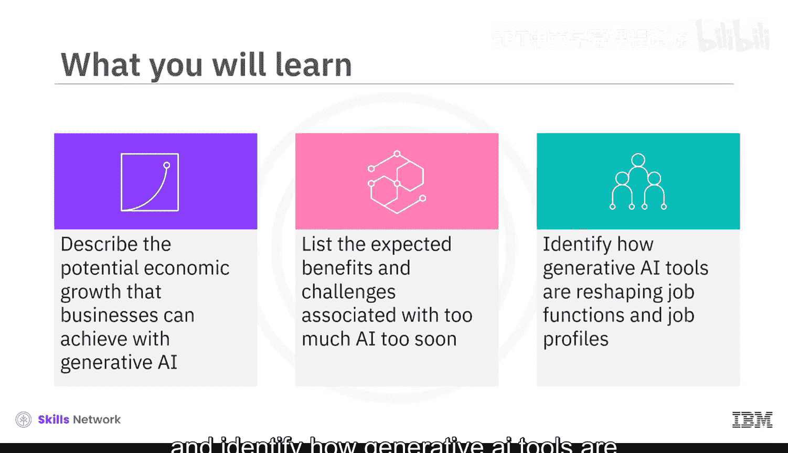
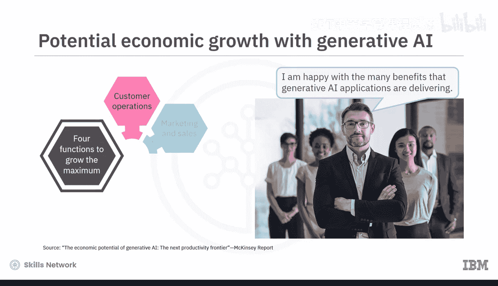
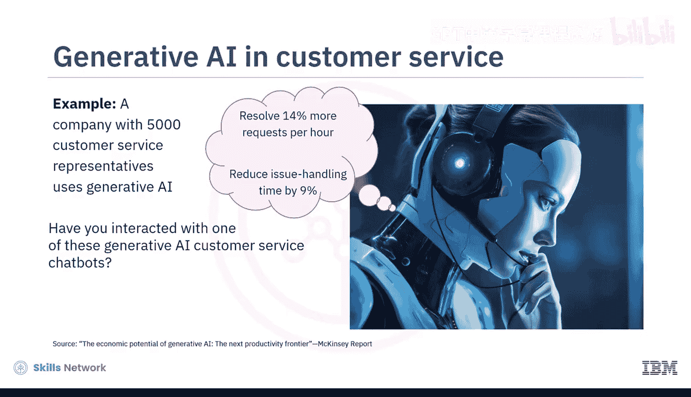
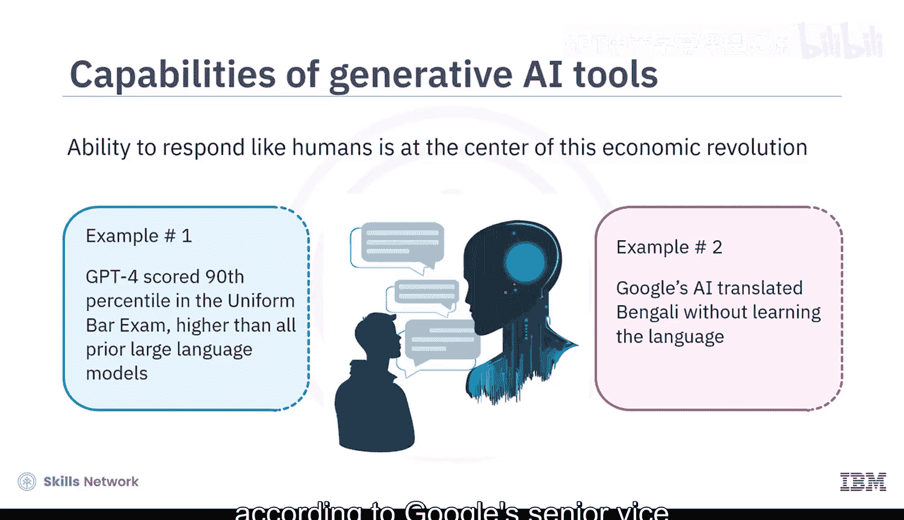
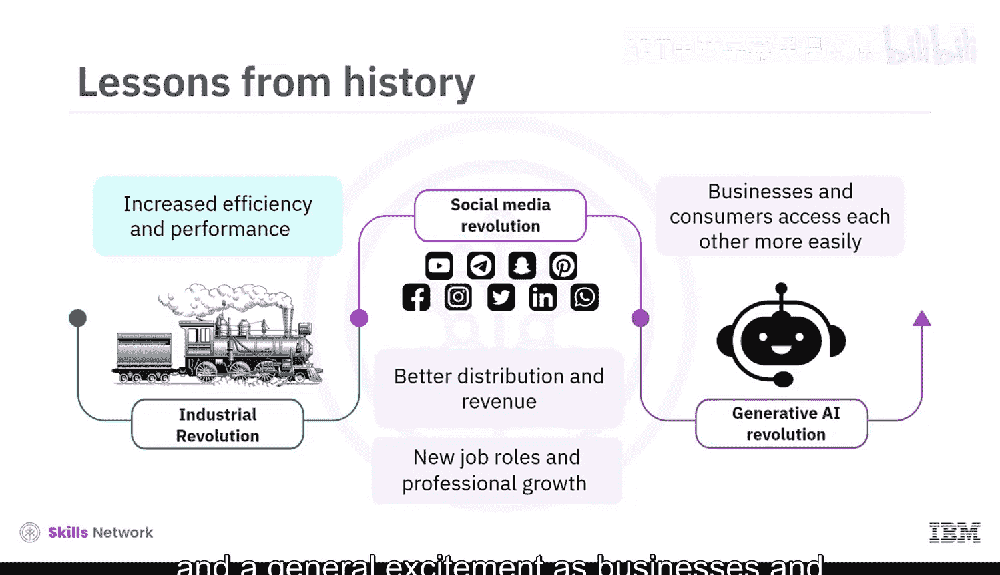
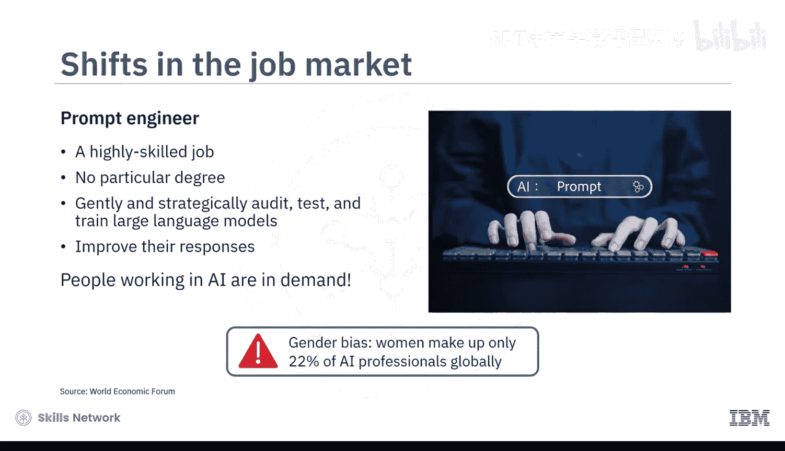
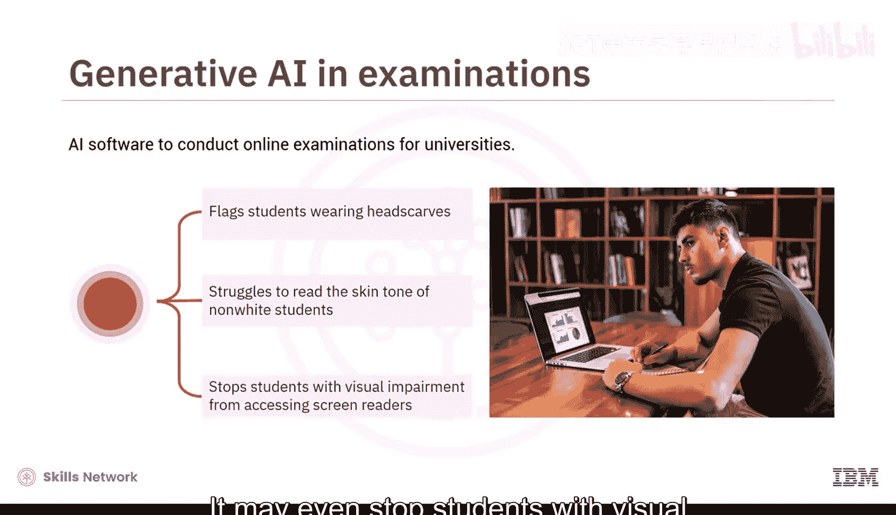
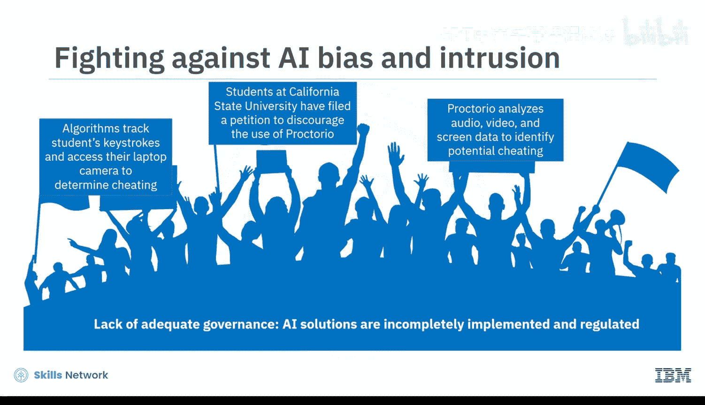
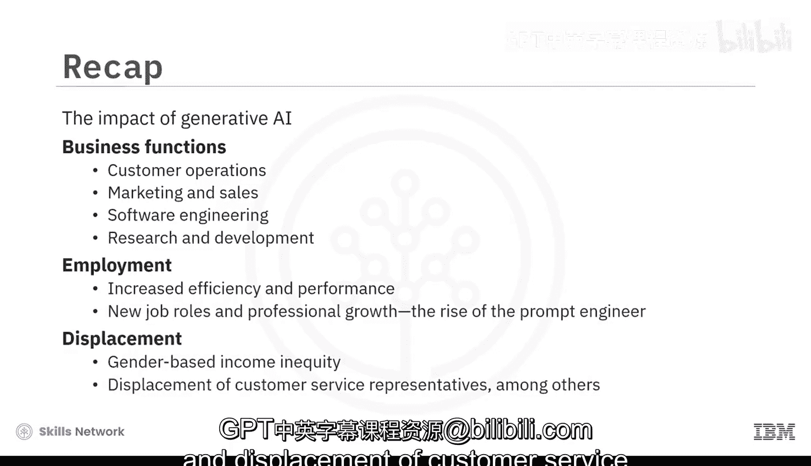

生成式AI基础：5.1：生成式AI的经济影响 💰

在本节课中，我们将探讨生成式AI对全球经济、企业和就业市场带来的深远影响。我们将分析其带来的增长潜力、具体效益、潜在挑战，以及它如何重塑工作岗位。

---

企业正欣喜于生成式AI应用带来的诸多益处。根据麦肯锡的一份报告，在生成式AI的辅助下，有四个职能部门有望实现最大程度的增长：**客户运营、市场营销与销售、软件工程以及研究与开发**。

一个具体的例子是，一家拥有5000名客服代表的公司使用生成式AI处理客户投诉，他们每小时能够多解决**14%**的请求，并将问题处理时间减少了**9%**。你可能已经与这类生成式AI客服聊天机器人互动过，有时很难分辨对话方是机器还是人类。但事实是，如今的聊天机器人能够提供快速的解决方案。

生成式AI工具能够像人类一样回应的能力，是这场经济革命的核心。以下是两个例证：在一个标志性时刻，**GPT-4**在参加统一律师资格考试时取得了第90百分位的成绩，超过了之前所有大型语言模型的得分。谷歌的AI翻译了孟加拉语，而它从未学习过这门语言，这是根据谷歌技术与社会高级副总裁的说法。

毫无疑问，生成式AI的经济影响正在全球范围内显现。高盛的研究预测，在10年内，生成式AI可能使全球GDP增长**7%**（近**7万亿美元**），并使生产率提高**1.5**个百分点。

那么，这样的经济增长对所有人都有益吗？历史表明，每当世界发现一项强大的技术时，无论是驱动工业革命的蒸汽机、驱动社交媒体革命的互联网，还是驱动生成式AI革命的基础模型，我们都会看到效率与绩效的提升、新工作岗位的出现与职业发展、更好的分销与收入，以及企业和消费者能更便捷地接触彼此所带来的普遍兴奋感。

### 就业市场的转变

上一节我们看到了生成式AI带来的宏观经济增长，本节中我们来看看它对就业市场的具体影响。就业市场正在经历戏剧性的转变；“提示工程师”的兴起就是这样一个令人惊讶的例子。这是一个高技能岗位，要求从业者（无需特定学位）策略性地审核、测试和训练大型语言模型，以改进其响应。总体而言，从事AI工作的人才需求旺盛。

然而，这里存在现有的性别偏见。根据世界经济论坛的数据，在全球AI专业人员中，女性仅占**22%**。

对于非AI劳动力，高盛预计约有**3亿**个全职工作岗位将部分被生成式AI自动化。根据一家人力资源分析公司的数据，这些工作通常由女性担任，包括但不限于办公室秘书或行政人员、人力资源经理、教师、作家和客户服务代表。

历史上，失去的工作岗位总会被新的工作岗位所取代。你知道吗？如今**60%**的工人所从事的职业在1940年时并不存在。因此，那些被取代的人有可能进行创新并创造新的机会。但今天的求职者需要意识到，你在职场中的未来角色也可能由AI决定，因为算法开始筛选简历。

如今，大多数公司使用AI驱动的招聘软件来审查简历和申请。当你投递简历时，请确保包含算法正在寻找的关键词。那些为获得学位而参加考试的人也必须应对AI筛选器。不幸的是，一些筛选器正变得颇具争议，因为算法通常是在有限、有偏见且未经核实的数据上训练的。

例如，已知用于大学在线考试的AI软件会标记戴头巾的学生，或在筛选考生时难以识别非白人学生的肤色。它甚至可能阻止有视力障碍的学生使用屏幕阅读器。

### 过快采用AI的挑战

除了就业影响，过快、过急地部署AI还会带来治理和伦理上的挑战。此外，这些算法被训练来攻击学生的击键动作和/或访问他们的笔记本电脑摄像头以判断是否作弊。例如，加州州立大学的学生已提交请愿书，反对使用Proctorio（一种通过分析音视频记录和屏幕监控来识别潜在作弊行为的软件）。这部分是由于缺乏足够的治理，因为AI解决方案正在仓促实施，因此实施和监管都不够完善。

怀着对经济增长的强烈渴望，许多行业正在利用生成式AI来扩大其影响范围和收入。全球劳动力正在巧妙地通过认证，以使自己在AI优先的经济中保持相关性。

过快、过多地使用AI可能带来的后果，是否包括沿着性别线扩大收入差距？这是一个值得思考的问题。

---

### 总结

本节课中，我们一起探讨了生成式AI对全球经济的影响。**客户运营、市场营销与销售、软件工程以及研究与开发**将感受到最直接的影响。经济将从**效率与绩效提升、新工作岗位（如提示工程师的兴起）和职业发展**中受益。同时，我们也可能看到**基于性别的收入不平等**以及**客户服务代表等岗位的被替代**。在拥抱技术红利的同时，关注其带来的社会挑战并寻求负责任的治理至关重要。

