# 061：生成式AI的社会影响 🌍

在本节课中，我们将探讨生成式人工智能（AI）对社会产生的广泛影响。我们将了解其带来的积极效益，识别伴随其广泛应用而出现的新挑战，并探索如何平衡其收益与风险。

## 概述

生成式AI的社会影响，指的是它对社会及其福祉产生或可能产生的作用，这超越了生产力、经济增长和投资回报率等传统指标。社会影响考量的是诸如倡导、包容性、医疗保健和环境等指标，所有这些都共同构建一个结构良好、公平的社会。

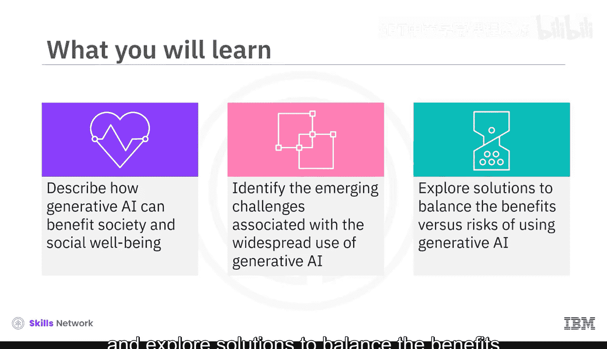

## 倡导与协作 🤝

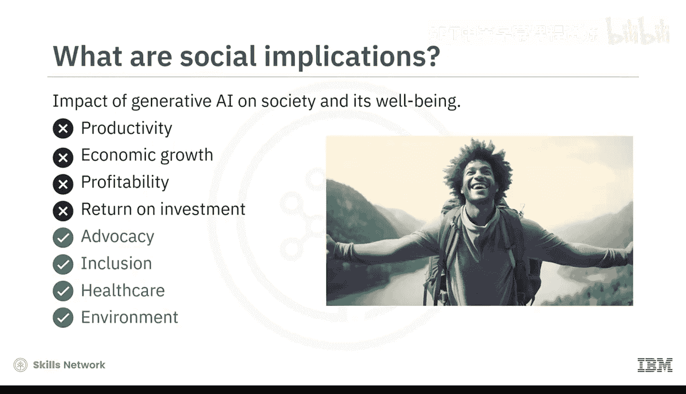

上一节我们介绍了社会影响的概念，本节中我们来看看生成式AI如何助力社会倡导。

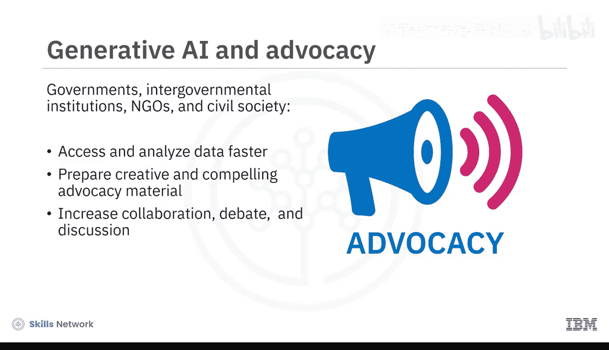

生成式AI工具可以帮助政府、政府间机构、非政府组织和公民社会更快地访问和分析数据、预测情景以制定预防措施，并准备富有创意和说服力的倡导材料。通过使用生成式AI，我们将看到国际协作的增加，从而推动更多的辩论与讨论。

## 数字包容性与公平性 ⚖️

然而，并非所有人都能平等地访问和使用生成式AI。根据联合国数据，截至2021年，估计全球仍有37%的人口（约29亿人）无法接入互联网。这个概念被称为**数字排斥**，其中96%的数字排斥人口生活在发展中国家。

这意味着，在采用生成式AI方面滞后的群体，将在经济上进一步被边缘化。倡导者和立法者需要尽快将他们纳入进来，以防止生成式AI进一步拉大绩效和资质上的差距。

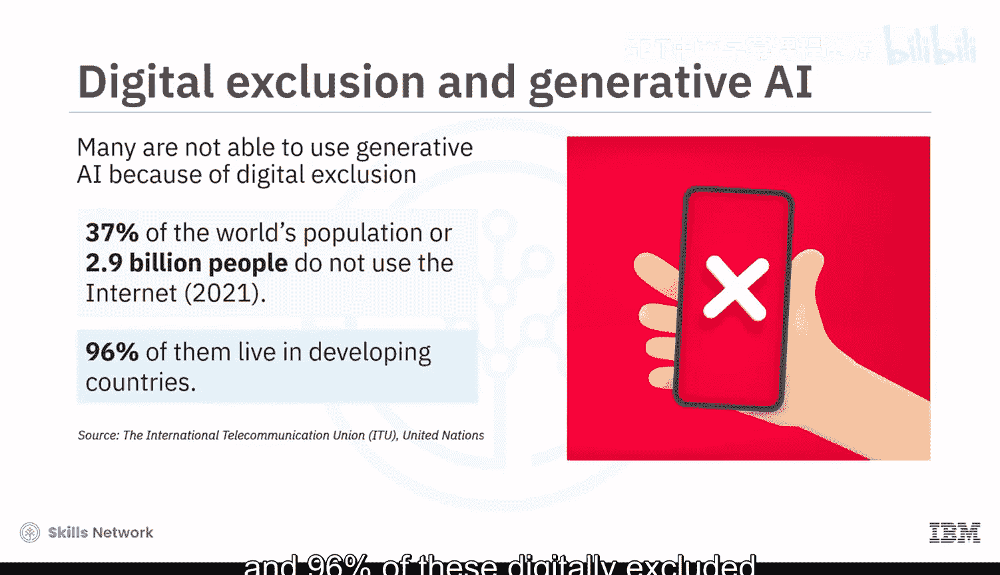

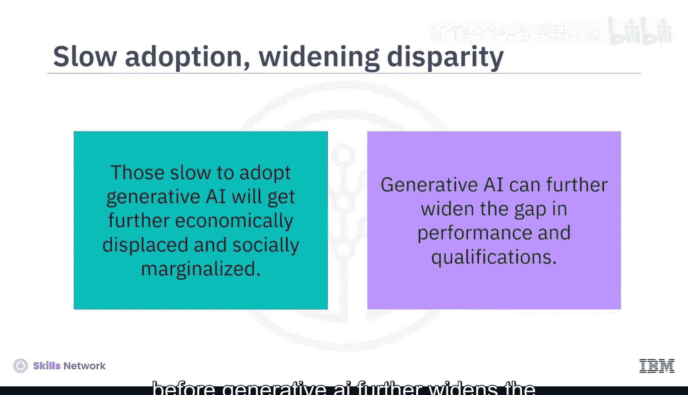

## 促进社会包容性 🌈

几个世纪以来，社会一直在为促进社会包容性而努力，旨在创造一个所有人都感到被代表、且不会因其性别、种族、残疾或性取向而受歧视的世界。由于生成式AI工具是多模态的，它们允许人们以定制化和偏好的格式进行学习和交流。

以下是生成式AI促进包容性的一些能力示例：
*   **轻松翻译成多种语言**
*   **快速的文本到语音转换**
*   **用于增强匿名性的AI语音**
*   **AI肖像的创建**

越来越多的人正沿着这些思路思考。例如，麻省理工学院向27位入围者提供了资助，以探索生成式AI对民主、教育、可持续性、通信等领域的影响。

## 医疗保健领域的机遇与挑战 🏥

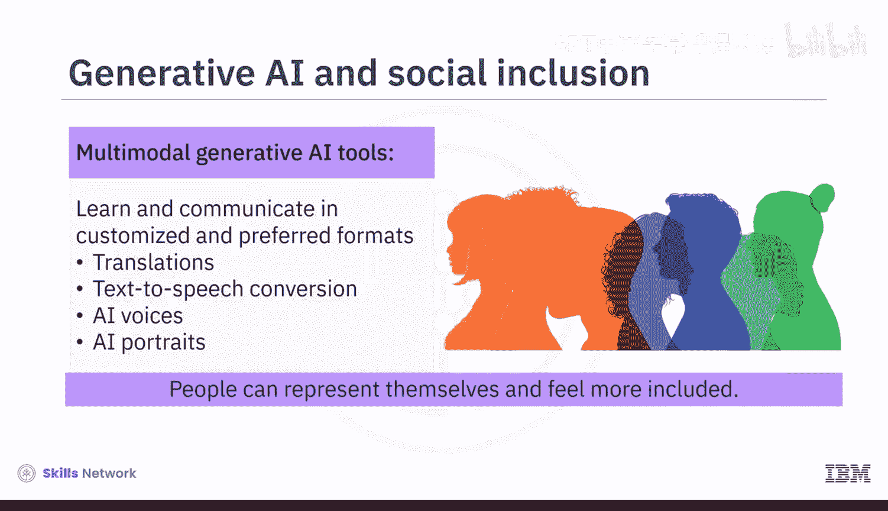

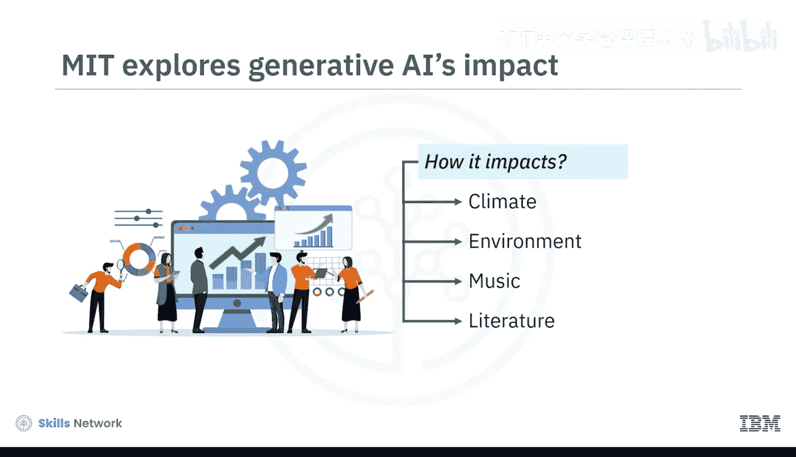

生成式AI对医疗保健领域产生了非常积极的影响。我们看到它加速了医学研究和药物发现，通过改进临床决策支持实现了早期检测和诊断，增强了应对医护人员短缺的能力，并提供了个性化的健康信息和服务。

然而，一个担忧也随之出现：训练生成式AI系统的数据存在固有的种族和性别偏见，这会影响临床决策。例如，2019年，美国公民自由联盟指出，AI算法误读了患者数据，导致错误地假设非裔美国患者与具有相同症状的白人患者相比需要更少的护理。为了纠正这个错误，算法被重构为专注于患者的症状，而非患者治疗的历史记录。

这里出现的问题是：**我们如何持续增加训练数据的多样性和准确性？**

另一个与医疗保健相关的担忧是过度消费在线内容可能带来的情感孤立。2023年5月，美国卫生与公众服务部正式指出，缺乏社会联系可能会增加对病毒和呼吸道疾病的易感性。根据美国卫生局局长的说法，孤独已成为一种流行病，是一个紧迫的公共卫生问题。

由此产生了两个有趣的问题：随着生成式AI使人们更加依赖数字世界和自给自足，它会导致孤独感增加吗？还是像ChatGPT这样的生成式AI工具能帮助人们应对孤独？

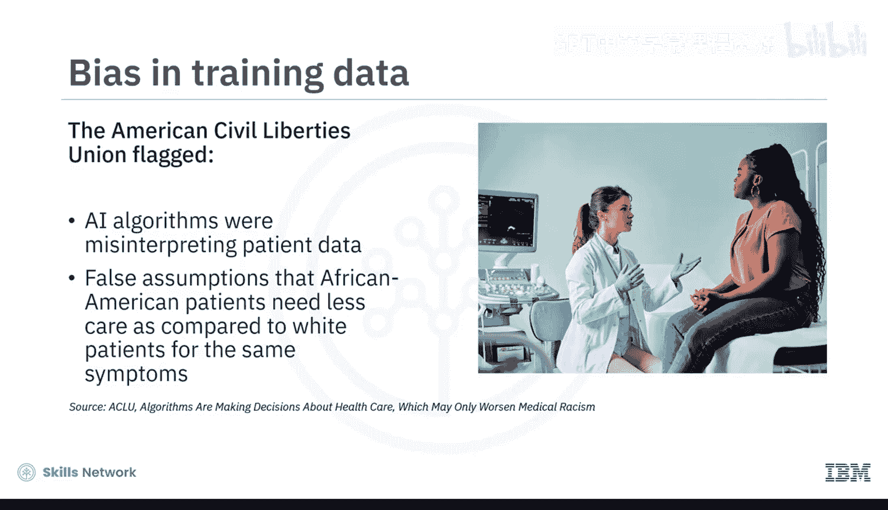

## 环境影响与可持续性 🌱

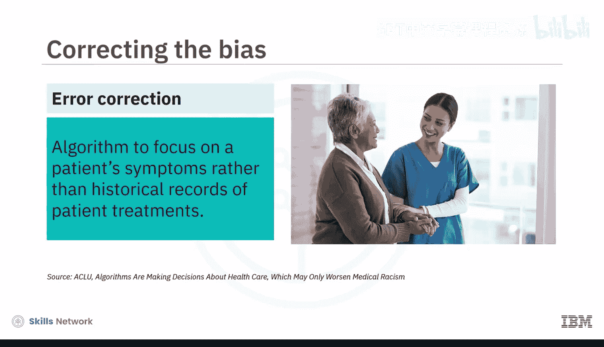

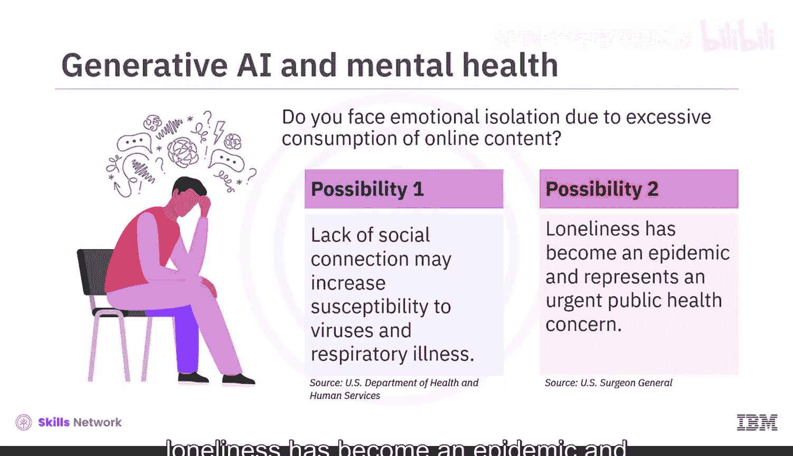

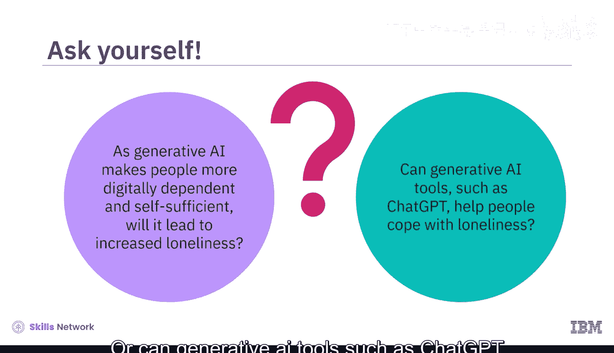

生成式AI对环境有何影响？像GPT-4、ChatGPT、DALL-E 2、Midjourney、Stable Diffusion、LaMDA和BERT这样的基础模型需要大量的硬件和云空间，并使用稀有矿物。由于它们处理海量数据，硬件需要频繁更换，从而更频繁地产生电子垃圾。鉴于其巨大的碳足迹，生成式AI目前并非环境的朋友。

根据《哈佛商业评论》，组织可以采取措施使这些系统更环保，例如：
*   **对现有模型进行微调以适应下游任务**，而不是从头开始构建模型。
*   **评估云提供商或数据中心的能源来源**。
*   **仅在需要时使用生成式AI**。

## 总结

在本节课中，我们一起探讨了生成式AI对社会的影响，特别是它对倡导、包容性、医疗保健和环境的贡献。

**效益**包括增强的倡导与包容性、更好的医疗系统与服务，以及可能帮助应对孤独的聊天机器人。

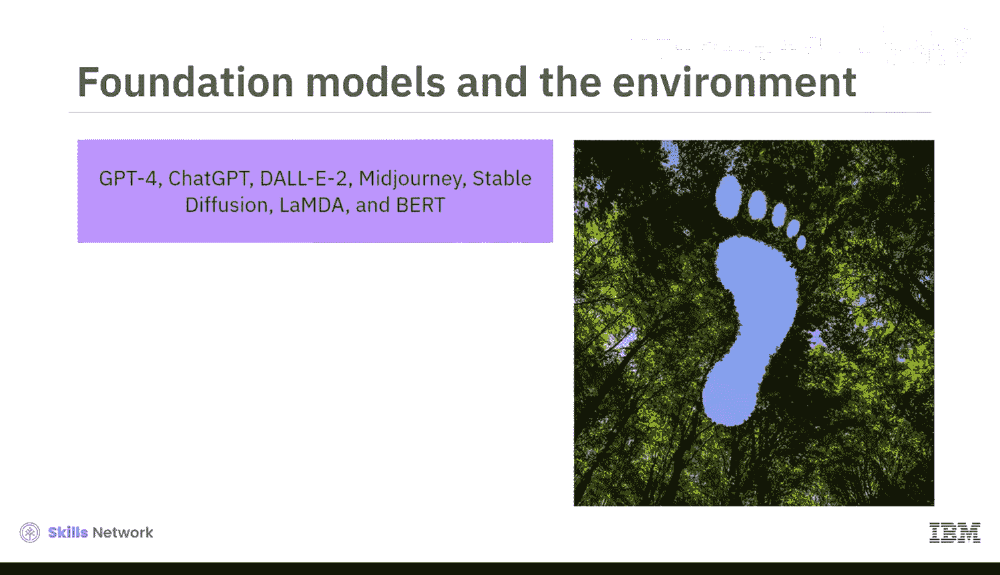

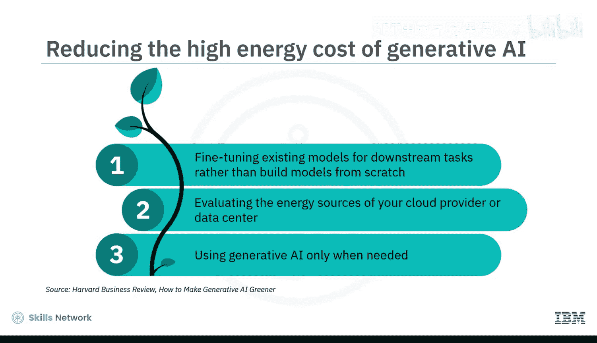

**挑战**则包括数字排斥、有偏见的算法、数字依赖引发的孤独感以及可观的碳足迹。

我们必须采取措施，负责任地使用生成式AI工具，以最大化其效益并减轻相关风险。