生成式AI基础：5.3：生成式AI重塑劳动力格局 👨‍💼🤖

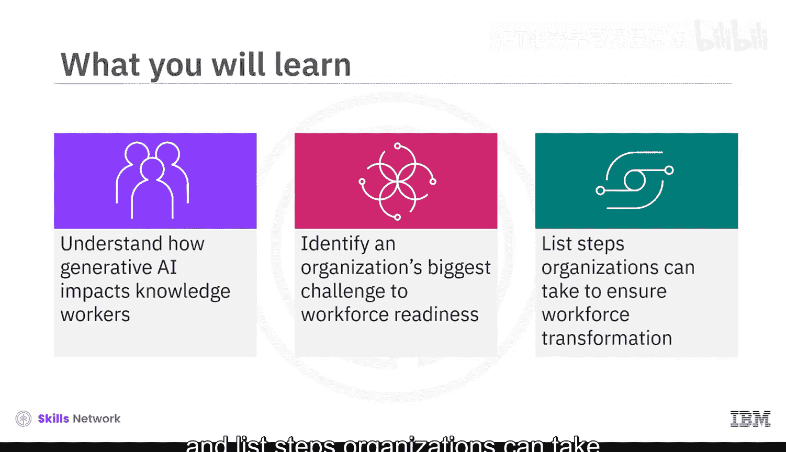

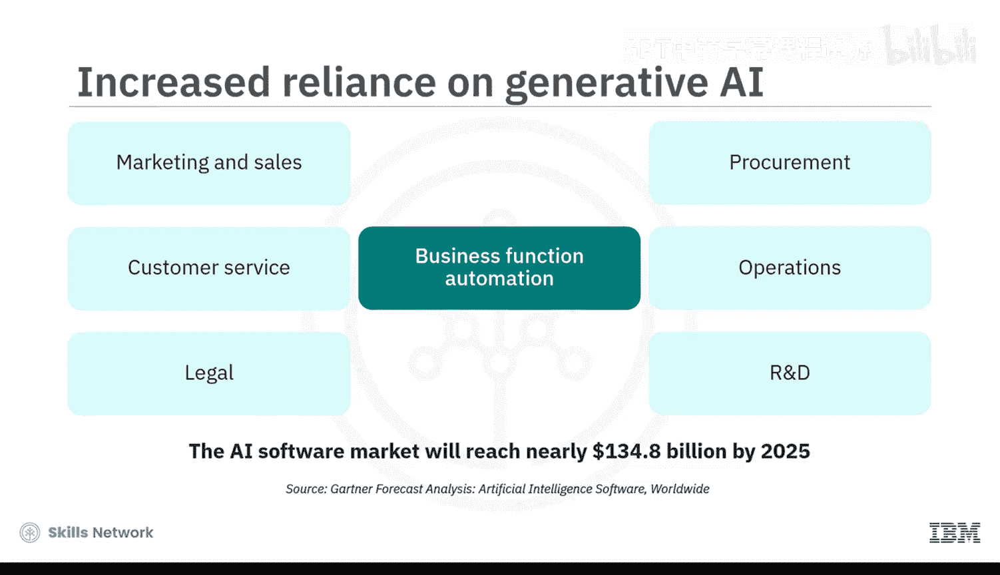

在本节课中，我们将探讨生成式AI如何影响全球劳动力格局，识别组织在适应这项技术时面临的核心挑战，并列出组织为确保劳动力成功转型可以采取的步骤。

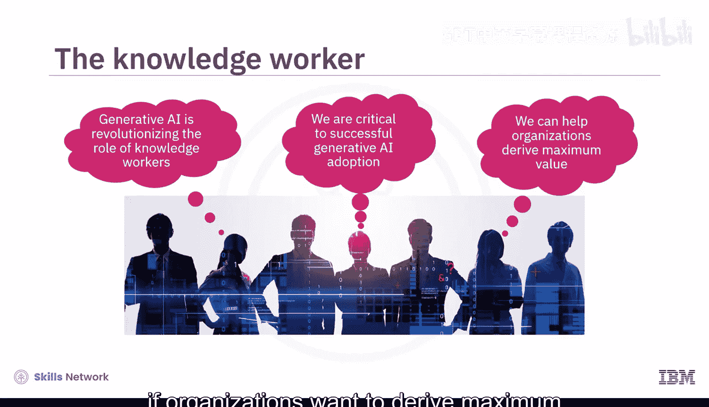

在全球层面，生成式AI正在帮助自动化许多业务职能，例如市场营销与销售、客户服务、法律、采购、运营以及研究与开发。高德纳预测，到2025年，AI软件市场将达到近1348亿美元。这意味着越来越多的组织将日益依赖大型语言模型来处理基础性和重复性的任务。

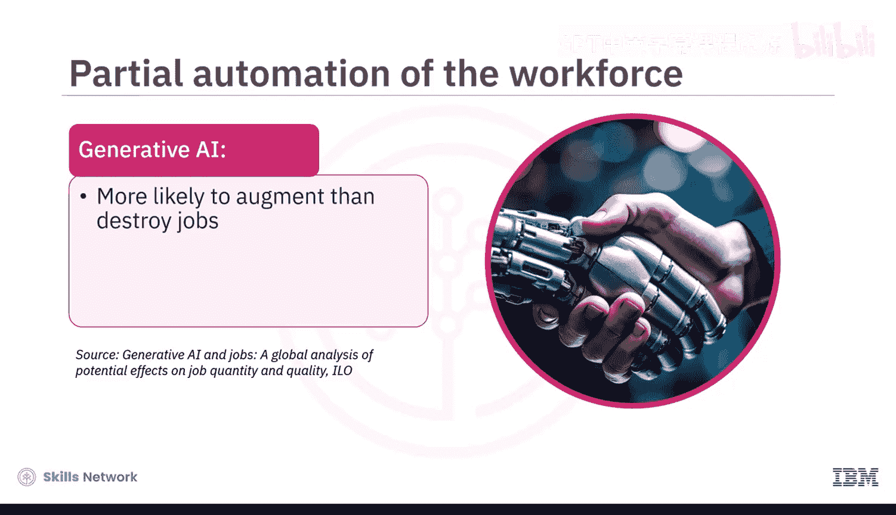

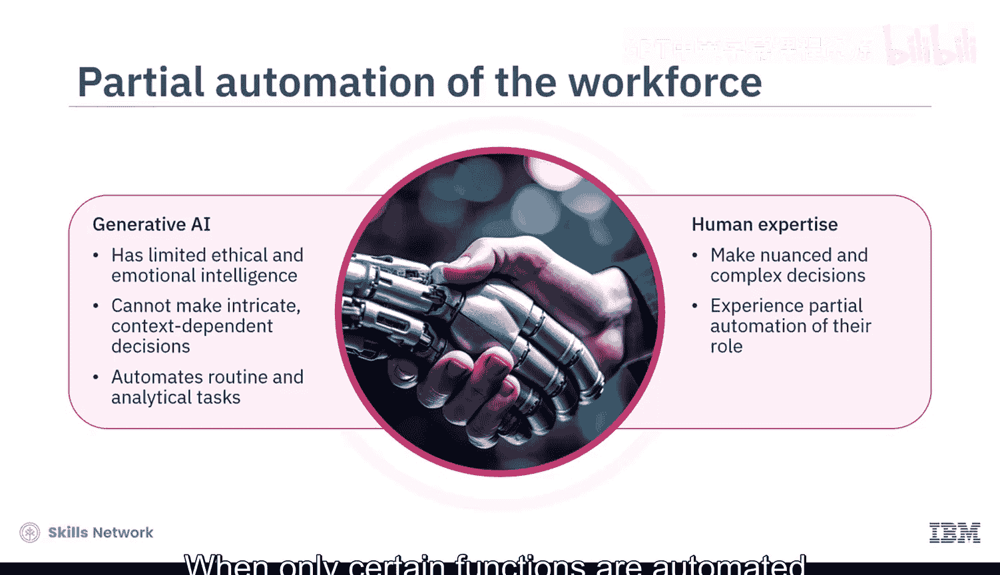

然而，他们是否拥有合适的人员来运用这项技术呢？生成式AI革命的核心是知识工作者。正如AI变革了工厂工人的角色一样，生成式AI正在变革知识工作者的角色。因此，劳动力方面的考量对于生成式AI的成功采用至关重要。如果组织希望从其AI投资中获得最大价值，就必须重视这一点。

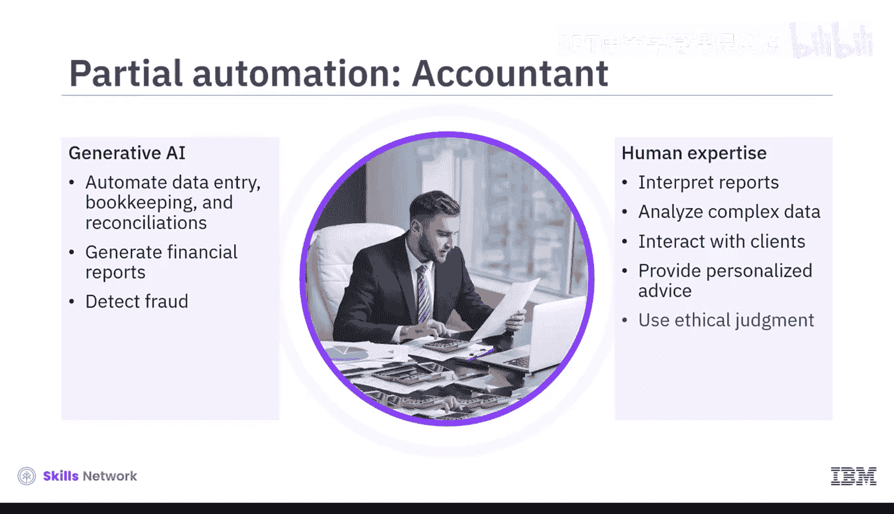

根据国际劳工组织的观点，生成式AI更可能**增强**而非**摧毁**工作岗位，它将自动化某些任务，而非整个职位。这是因为生成式AI在伦理和情感智能方面有限，因此无法像人类一样做出复杂的、依赖情境的决策。当生成式AI自动化常规和分析性任务时，仍然需要人类的专业知识来做出细致入微的复杂决策。这种仅自动化特定功能的情况被称为**部分自动化**。

上一节我们了解了部分自动化的概念，本节中我们通过几个例子来具体探索其影响。

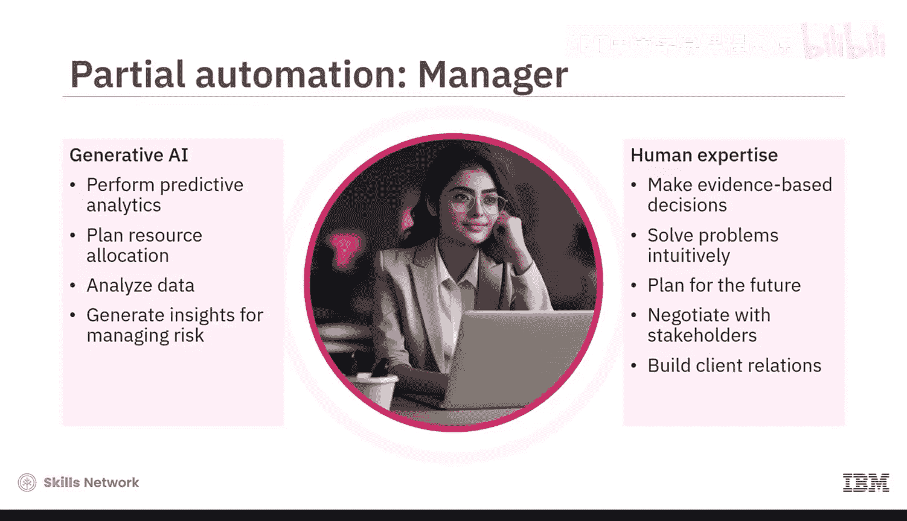

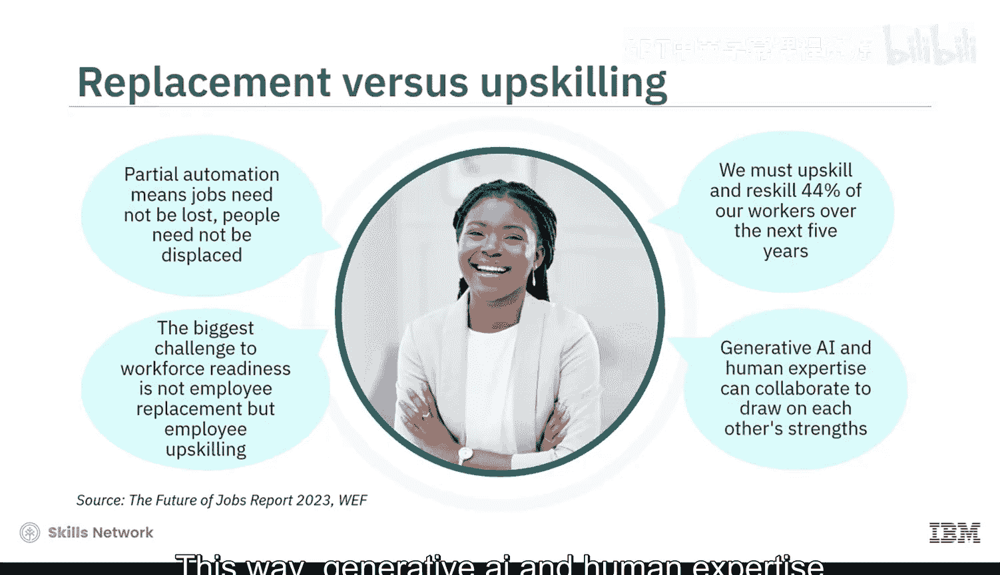

以下是两个部分自动化的实例：
*   **米什**：他是一家跨国公司的会计师。生成式AI将帮助他自动化数据处理、簿记和对账等流程。他可以查询算法来生成财务报告，并使用AI驱动的异常检测软件来发现系统中的欺诈行为。然而，仍然需要他的输入来解释报告、分析复杂的财务数据、与客户互动并提供个性化建议。例如，AI系统标记为欺诈的每一个行为是否都构成违规？他需要运用自己的伦理判断来决定。
*   **布娜**：她是一家小型公关公司的经理。公司采用的生成式AI工具执行预测分析以规划资源分配，同时也分析数据以生成风险管理见解。在这种支持下，她能够做出基于证据的决策、凭直觉解决复杂问题、规划未来、与利益相关者谈判并建立客户关系。

由于生成式AI不会自动化整个职位，因此工作不必消失，人员也不必被取代。因此，组织需要认识到一个简单的事实：在生成式AI背景下，劳动力准备就绪的最大挑战并非**员工替代**，而是**员工技能提升**。世界经济论坛指出，44%的工人需要在未来五年内提升技能或再培训。通过这种方式，生成式AI与人类专业知识可以协作，发挥彼此的优势。

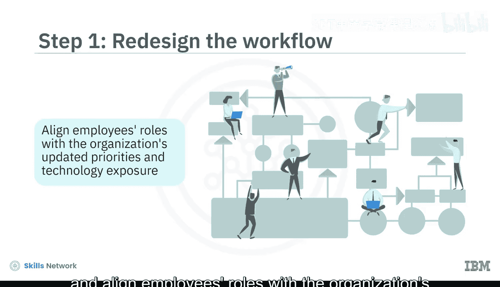

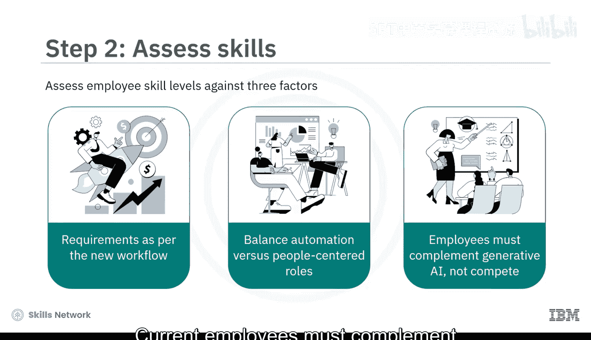

虽然短期内招聘新人才来执行AI特定任务是必要的，但组织可以启动劳动力转型计划，提升现有员工的技能，以实现长期匹配。这将确保业务中断最小化，同时领导者能准备好一支适应生成式AI的劳动力队伍。接下来，我们探讨实现这一目标可能涉及的步骤。

以下是组织可以遵循的四个关键步骤：
1.  **重新设计工作流程**：组织必须重新设计业务流程，并使员工的角色与组织更新后的优先事项和技术应用相匹配。
2.  **评估技能**：管理者必须根据三个因素评估员工的技能水平：新工作流程下的资源需求、自动化不可避免但以人为本的角色仍然重要、现有员工必须**补充**生成式AI的输出，而非与之**竞争**。
3.  **招聘AI角色人才**：管理者应从外部招聘人才，仅用于填补关键的人才缺口。其他所有人都应考虑进行内部培训和技能提升。
4.  **优先安排培训**：组织必须识别内部受影响最大的角色，并优先安排对其进行指导和技能提升。

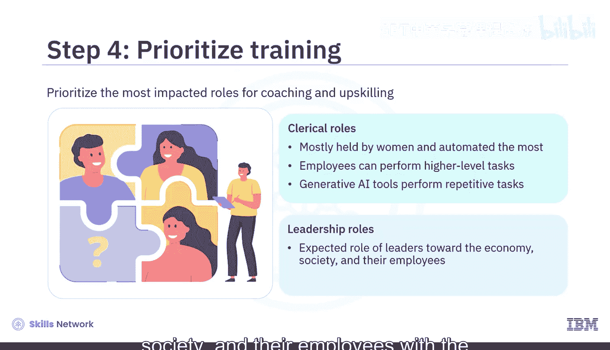

为了更具体地理解这些步骤，我们来看一些应用场景。

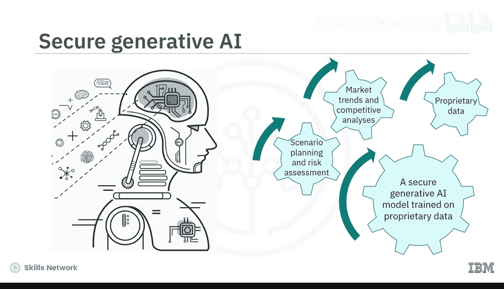

以下是技能提升与培训的实例：
*   **易受影响的角色**：例如，主要由女性担任的文职角色将因生成式AI而实现最大程度的自动化。必须培训这些易受影响的员工去执行更高级别的任务，而让生成式AI工具处理重复性和基础性任务。
*   **组织领导力**：另一个例子是组织领导力。随着生成式AI的广泛使用，领导者对经济、社会和员工的预期角色是什么？例如，一家财务咨询公司正在使用基于其专有数据训练的生成式AI模型。该模型生成市场趋势和竞争分析，帮助进行情景规划和风险评估，并促进部门间的协作。**库马尔**是这家公司的首席技术官。为确保公司的基础模型被合乎道德地使用，他接受了关于AI伦理原则的指导，例如问责制、透明度、隐私和安全性。通过对这些方面的培训，库马尔确保了由公司专有模型指导的决策能对公司和社会产生积极影响。

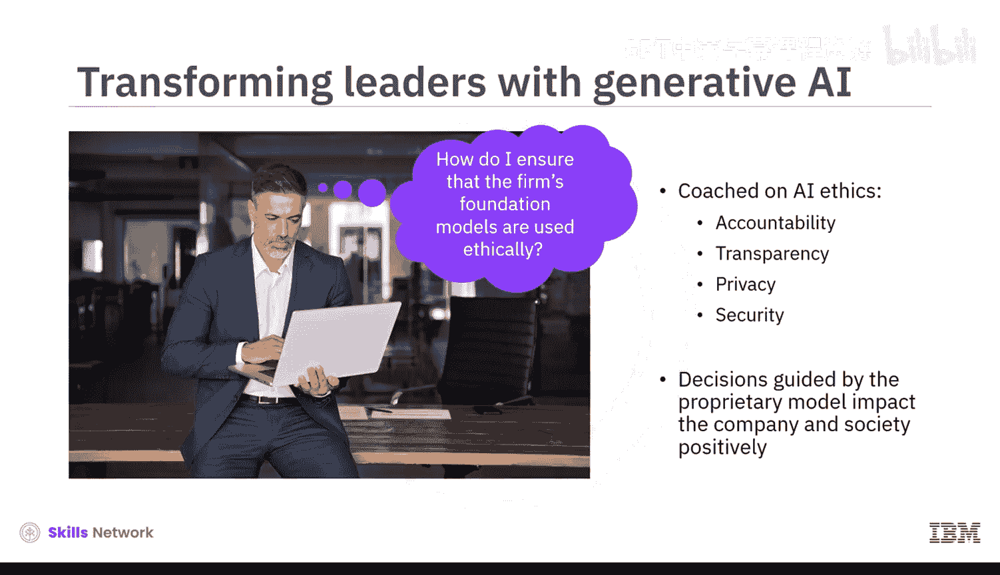

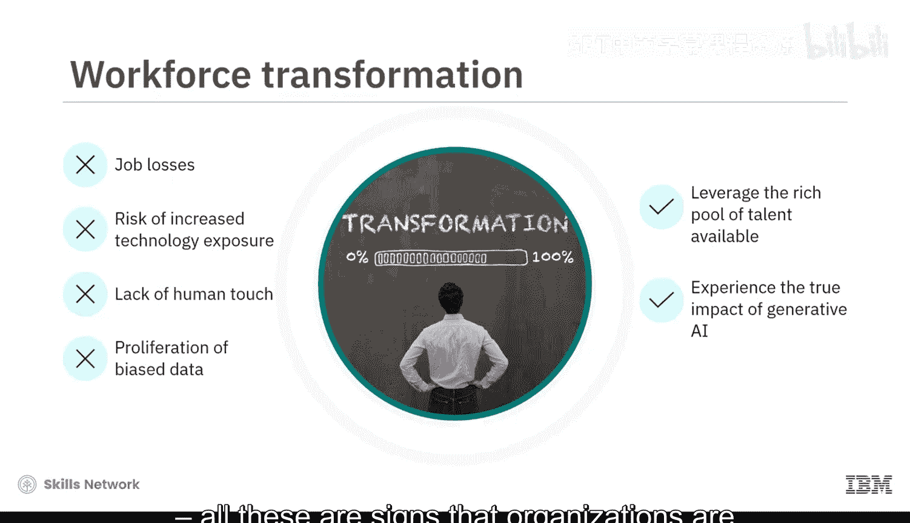

通过技能提升，组织可以利用其已有的丰富人才库。这是生成式AI对劳动力的真正影响。工作流失、技术暴露风险增加、缺乏人情味、偏见数据扩散，所有这些迹象都表明组织没有投资于劳动力转型。

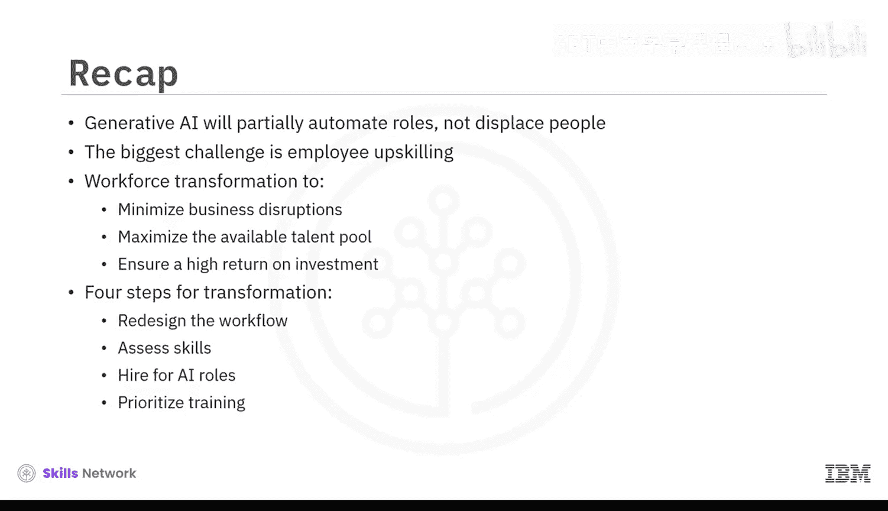

本节课中我们一起学习了生成式AI对全球劳动力的影响。生成式AI将部分自动化工作岗位，而不会取代人员。为生成式AI准备劳动力的最大挑战是员工技能提升。组织必须进行劳动力转型，以最小化业务中断、最大化可用人才库，并确保在AI技术投资上获得高回报。他们可以遵循四个步骤来确保这一转型：重新设计工作流程、评估技能、招聘AI角色人才以及优先安排培训。