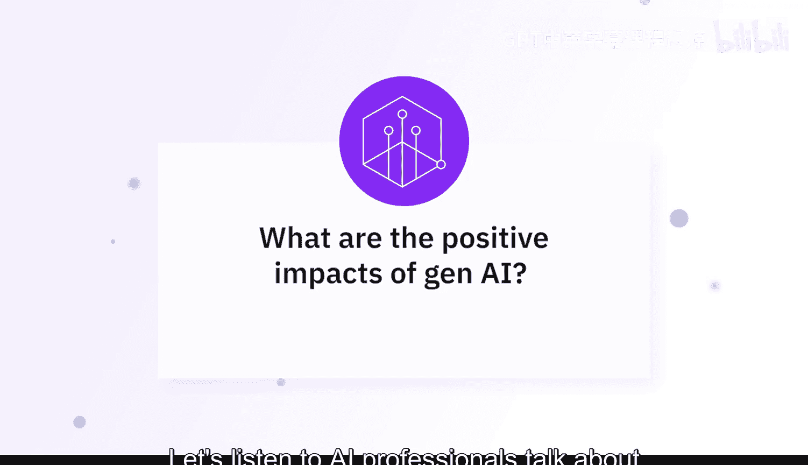
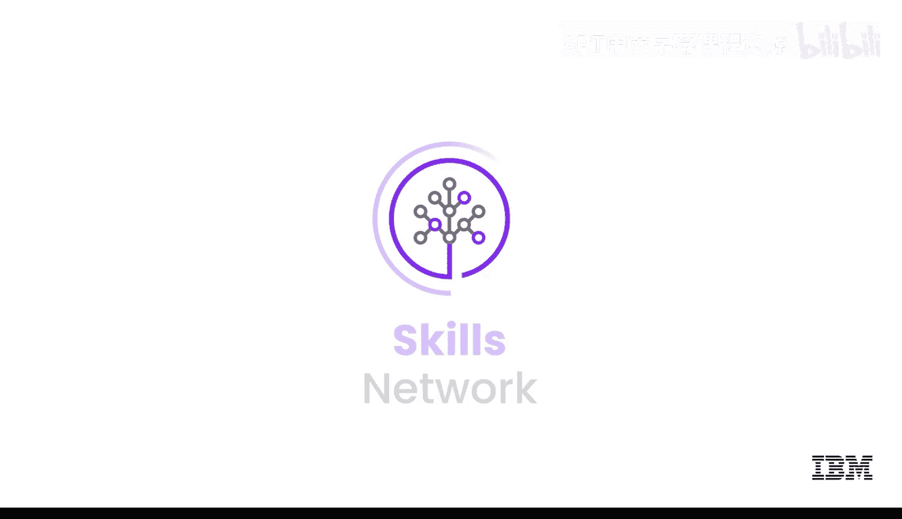

# 063：生成式AI对社会的影响

在本节课中，我们将聆听AI专业人士的见解，探讨生成式AI对社会产生的积极影响。

## 概述

生成式AI对社会的一个显著积极影响，在于其**民主化创意过程**和**提升生产力**的能力。通过实现自动化内容创作，生成式AI使个人和企业能够以最少的资源生产高质量的文本、图像、音乐和视频。

## 赋能内容创作与生产力

上一节我们提到了生成式AI的总体影响，本节中我们来看看它在具体场景中的应用。

通过自动化内容创作，生成式AI极大地降低了创意工作的门槛。例如，现在你可以仅提供一个脚本，后端就能生成视频供你编辑。许多人在此之前不具备这种能力。

以下是生成式AI在内容创作中的几个应用实例：

*   **图像与图标设计**：为网页应用构建美观的图像或吸引用户点击的图标时，AI可以提供帮助，无需单独雇佣设计师。
*   **艺术与音乐生成**：艺术家可以利用AI工具生成独特的艺术品，音乐家可以用它来激发灵感。
*   **辅助写作**：作家可以用它来克服写作瓶颈，整理思路，甚至与AI进行协作创作。

## 降低技术门槛与促进学习

除了创意领域，生成式AI还在技术学习和语言应用方面发挥着重要作用。

对于不擅长编码的人，生成式AI可以生成一个基础代码端口，这个基础可以被进一步优化和细化，以创建更好、更具体的应用程序。

同样，对于非英语母语者或不擅长特定语言表达的人，生成式AI可以帮助撰写文本、辅助学习。它就像一个可以随时提问并获得答案的伙伴。即使使用最简单的英语词汇和直白的语言，模型也足以理解你的需求并生成回应。

## 激发创造力与实现个性化

生成式AI的一个积极影响是**创意赋能**。它实际上有助于激发创造力，使每个个体都能创建和操控图像、音频、音乐、视频等数字内容。这将激发创造力，并开启用户此前未曾探索过的新视野或新想法。

它同时也降低了入门门槛。任何经验水平、任何年龄、无需特定背景的人都可以使用这项技术并发挥创意。

此外，它还能帮助我们解决一些特定用例，例如实现**个性化与定制化的内容创作**，根据个人偏好、兴趣和上下文来定制输出内容。

## 革新教育与普及知识

回顾过去，若想获得最好的教育，通常意味着需要支付高昂的费用聘请私人教师，或进入顶尖大学。

如今，借助生成式AI，你几乎可以拥有一位私人教师。这位“AI教师”不仅能教授普通私人教师所授的内容，还能教授更多其他知识。这将成为绝对的变革者，因为高质量、个性化的教育将以前所未有的方式提供给地球上的每一个人。

## 总结

本节课中，我们一起学习了生成式AI对社会多方面的积极影响。它通过**民主化创意工具**、**降低技术与创作门槛**、**激发个人创造力**以及**革新教育模式**，正在成为提升社会生产力和促进知识普及的强大推动力。从辅助专业人士到赋能普通个人，生成式AI展现出改变各行各业的巨大潜力。