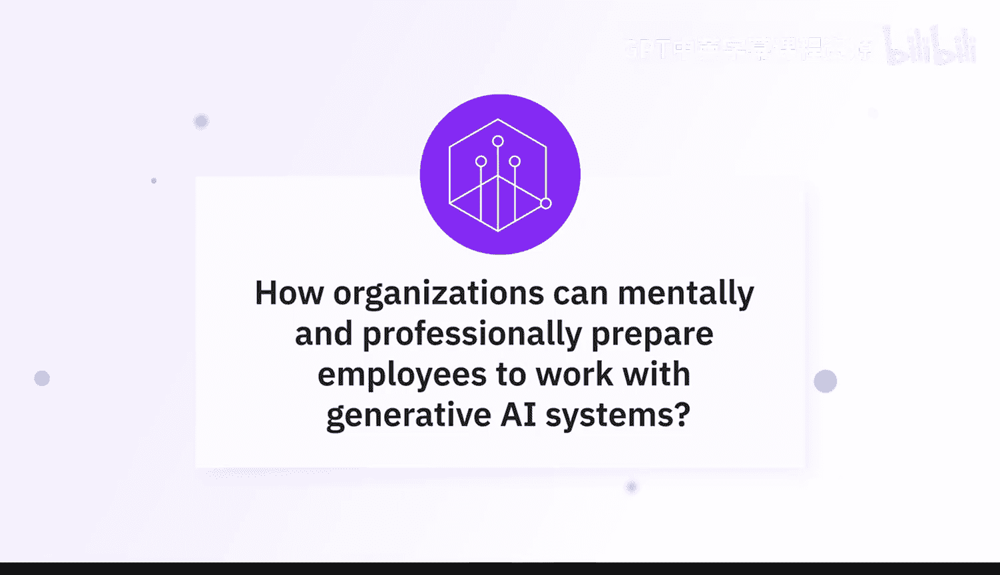
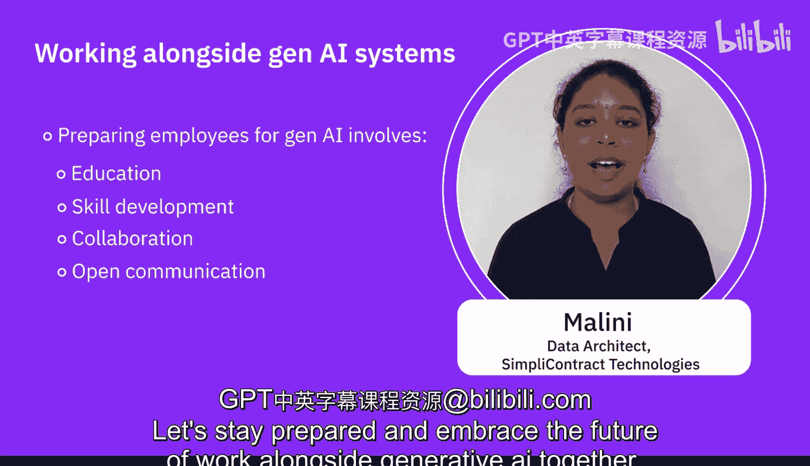
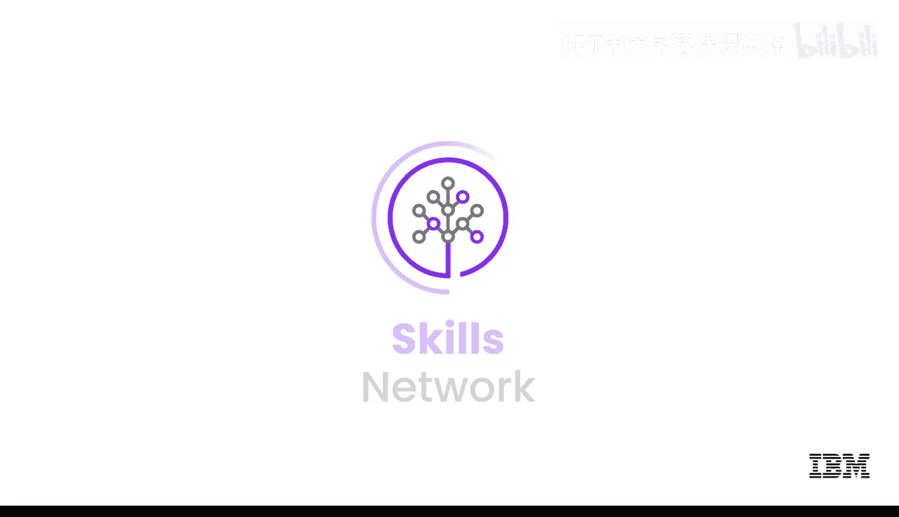

# 064：将生成式AI融入组织文化 🏢

在本节课中，我们将学习专家们关于组织如何帮助员工在心理和专业上做好准备，以便与生成式AI系统协同工作的核心观点。

---

## 概述

任何计划引入生成式AI的组织都必须考虑一个关键方面，那就是不要急于采用这项技术。这是一项巨大的进步，是对你以往工作方式的重大改变。如果只是简单地抛开一切去使用这项技术，那将可能成为一场灾难。因此，每个企业都应考虑的最重要建议是，你需要以稳健和系统化的方式，将这些技术融入日常组织活动中。

上一节我们讨论了技术本身，本节中我们来看看如何从“人”的角度做好准备。

## 系统化融入方法

首要任务是提高员工对生成式AI的认识并进行教育，鼓励持续学习以适应不断发展的技术环境。以下是组织可以采取的系统化步骤：

以下是确保员工在专业和心理上准备好与生成式AI协同工作的关键方法：

1.  **提供培训与教育**：领导层应通过投资于员工的培训和发展，来展示他们对生成式AI准备工作的承诺。应为员工提供AI工具和技术的实践经验，以熟悉并建立使用和与之协作的信心。这种教育和培训应该是持续性的。
2.  **实施技能发展计划**：为员工配备与生成式AI有效协作所需的技术技能。
3.  **培养协作文化**：通过跨职能团队促进协作文化，让来自不同团队的人员可以进行跨职能项目并相互分享知识。
4.  **建立沟通渠道**：为员工建立表达关切和分享与生成式AI协作见解的沟通渠道。

## 鼓励创造性应用与人文价值

其次，需要更多地鼓励创造性地使用这些技术，而不是盲目应用。需要有检查机制来验证生成的内容是否被盲目使用。需要更多地鼓励创造性地使用这些技术，并激励人们利用它们更好地完成工作，而不是简单地用自动化工具取代现有标准。

因此，我想向有意引入生成式AI的组织建议的最重要一点是，你需要非常系统化地灌输这种技术。重要的是要解决伦理和社会影响，并强调人机协作。应强调员工在结合AI能力时，运用判断力、创造力和同理心的重要性，这能使他们自动化某些流程并帮助完成工作。

## 关注员工福祉与变革管理

同时，应支持心理健康。组织应提供咨询服务、员工援助计划和心理健康资源，以促进员工的福祉和适应力。

利用生成式AI可以实现业务流程改进，而最了解流程的业务人员可能是进行改进的最佳人选。此外，要理解变革管理。变革过程总会伴随恐惧和担忧，然后人们会开始接受，并逐渐变得更好。因此，要考虑组织内部的变革管理流程，并延续大多数组织已有的协作文化，作为一个团队共同努力，找出如何使工作流程更高效的方法。

然后，为组织中的员工提供支持和资源。如果他们感受到你在为他们投资，他们会对变革感到兴奋。

---

## 总结

本节课中我们一起学习了为生成式AI时代准备员工的关键策略。总而言之，让员工为生成式AI做好准备涉及**教育、技能发展、协作和开放沟通**。让我们做好准备，共同拥抱与生成式AI协同工作的未来。