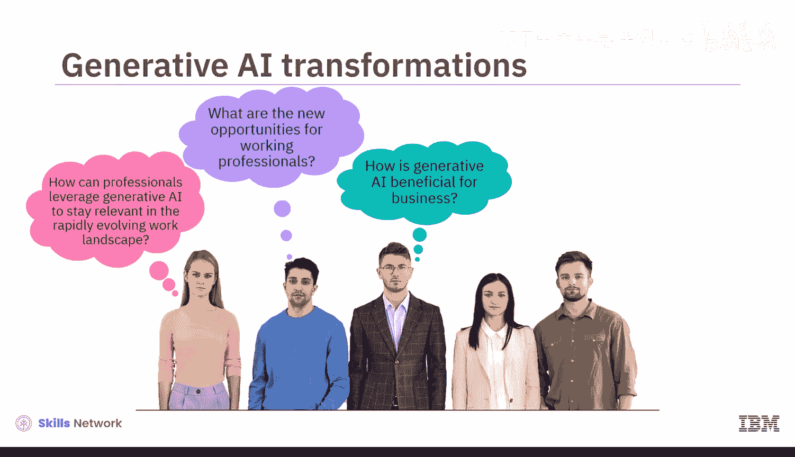
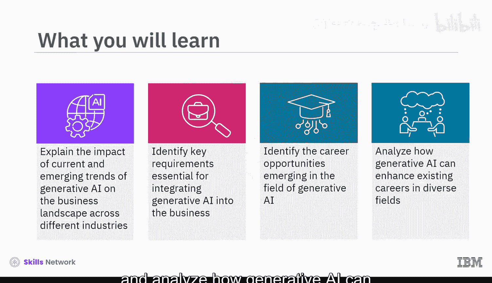
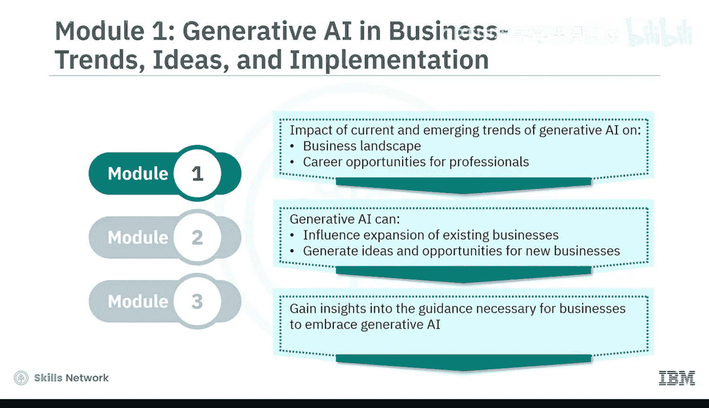
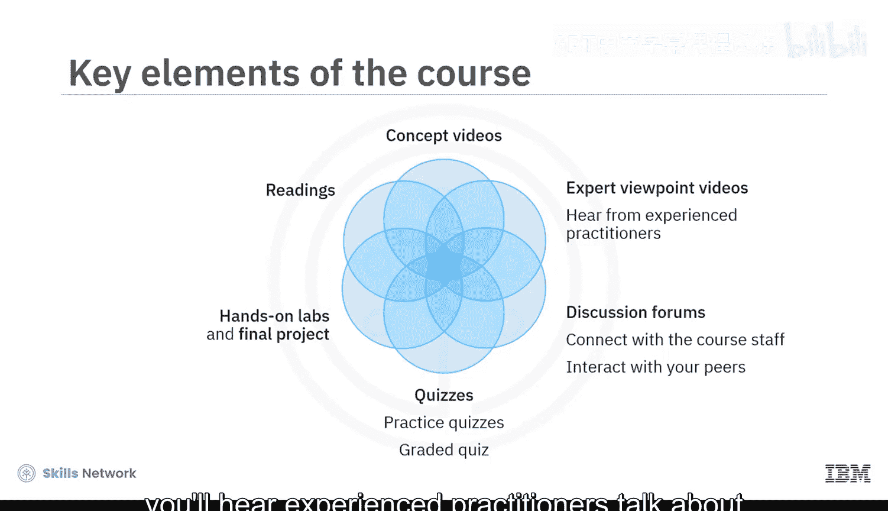
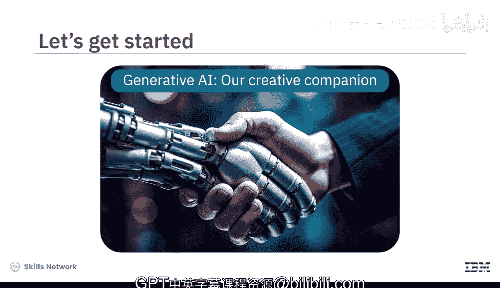

生成式AI基础：01：课程介绍 🚀

在本课程中，我们将探讨生成式AI如何推动商业进步与职业发展。您将了解其对各行业的影响、企业如何整合这项技术，以及它为专业人士带来的新机遇。

生成式AI的出现促使许多人思考自身职业的未来。同时，领导者们也渴望将生成式AI整合到其运营中，以确保企业在这个由创新主导的时代取得成功。工作、职位和市场动态的变革，启发我们提出了一些深刻的问题。

以下是本课程将解答的核心问题：
*   专业人士如何利用生成式AI在不断快速演变的工作环境中保持竞争力？
*   职场人士面临哪些新的机遇？
*   生成式AI对商业有何益处？
*   哪些行业能从生成式AI中受益？
*   公司如何有效且安全地整合这项技术？

本课程面向所有初学者，无论您是专业人士、爱好者、从业者还是学生。只要您对快速发展的生成式AI领域抱有真正的兴趣，这门课程就适合您。当然，它面向所有人，无论您的背景或经验如何。

完成本课程后，您将能够：
*   解释生成式AI当前及新兴趋势对不同行业商业格局的影响。
*   识别将生成式AI整合到业务中所必需的关键要求。
*   识别生成式AI领域涌现的职业机会。
*   分析生成式AI如何提升不同领域现有职业的发展。

本课程结构紧凑，包含三个模块，预计每个模块需要花费1到2小时完成。

上一节我们概述了课程目标，接下来我们具体看看各模块的内容安排。

以下是三个模块的详细学习路径：
*   **模块1**：您将学习生成式AI的当前及新兴趋势如何影响商业格局以及各领域专业人士的职业机会。您将探索生成式AI如何影响现有业务的扩展，并为新业务生成创意和机会。您还将深入了解企业为迎接生成式AI所需做的必要准备。
*   **模块2**：您将探索生成式AI工作空间中潜在的职业机会，例如**AI工程师**、**自然语言处理工程师**、**提示词工程师**、**数据科学家**、**计算机视觉工程师**、**AI研究科学家**和**AI伦理学家**。您还将学习生成式AI如何为内容创作者、IT专业人士以及高管或经理提升职业前景。
*   **模块3**：此模块需要您参与一个最终项目，并完成一个计分测验以检验您对课程概念的理解。您还可以访问课程术语表，并获得关于后续学习步骤的指导。

本课程融合了概念讲解视频和辅助阅读材料。观看所有视频以充分掌握学习材料的潜力。您将通过动手实验来理解生成式AI模型的局限性，并在模块3参与最终项目。每节课末尾的练习测验将帮助您巩固所学知识。课程结束时，您还需完成一个计分测验。课程还提供讨论区，供您与课程工作人员联系并与同伴交流互动。

最有趣的是，通过专家观点视频，您将听到经验丰富的从业者谈论生成式AI如何促进职业发展。生成式AI就像一个富有创造力的伙伴，它能**放大我们的想象力**，并在不同领域**开启新的可能性**。

本节课中，我们一起学习了本课程的核心目标、结构安排以及您将获得的具体能力。现在，让我们正式开始这段探索生成式AI如何塑造商业与职业未来的旅程。