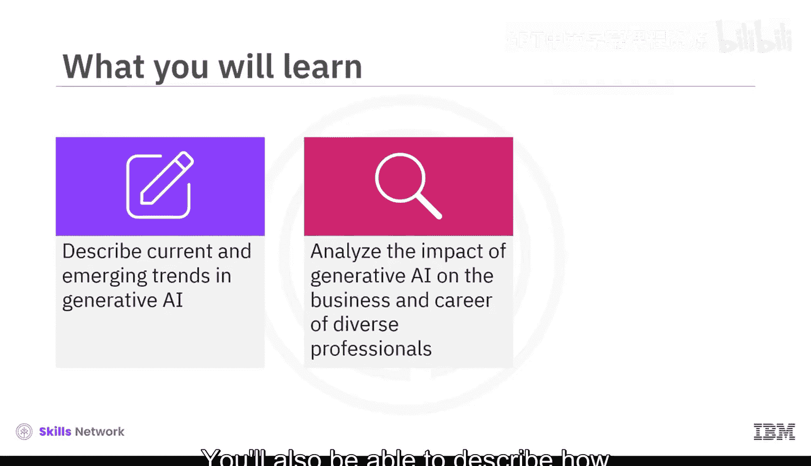
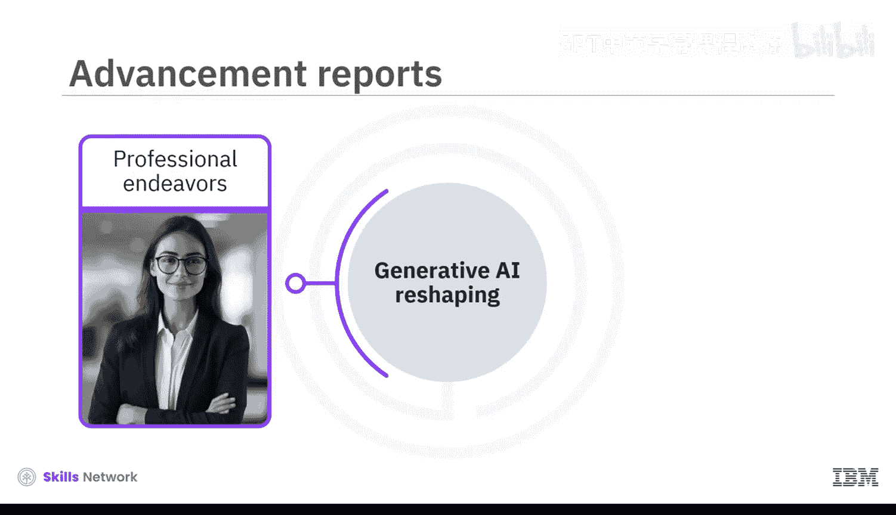
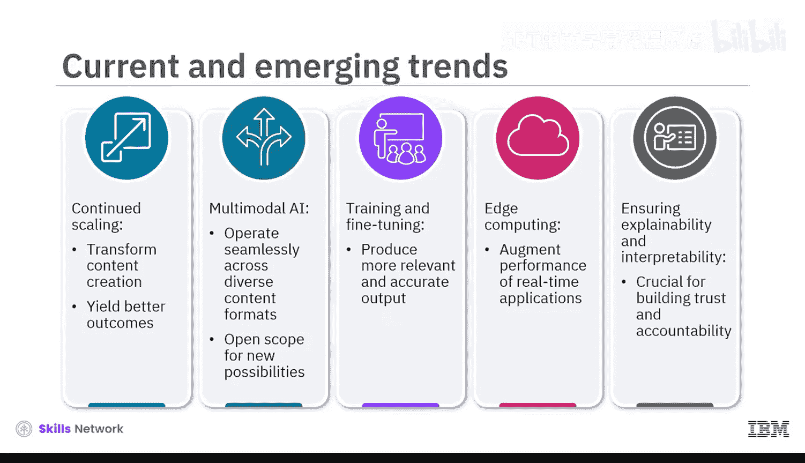
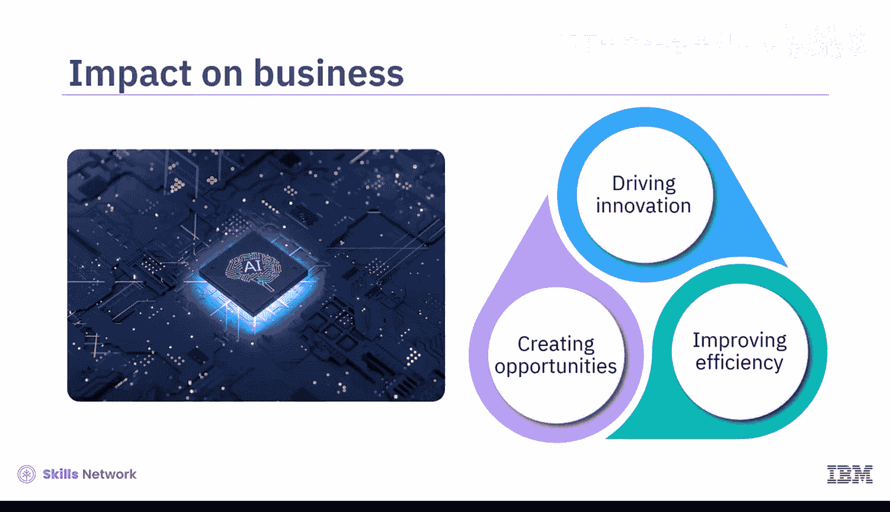
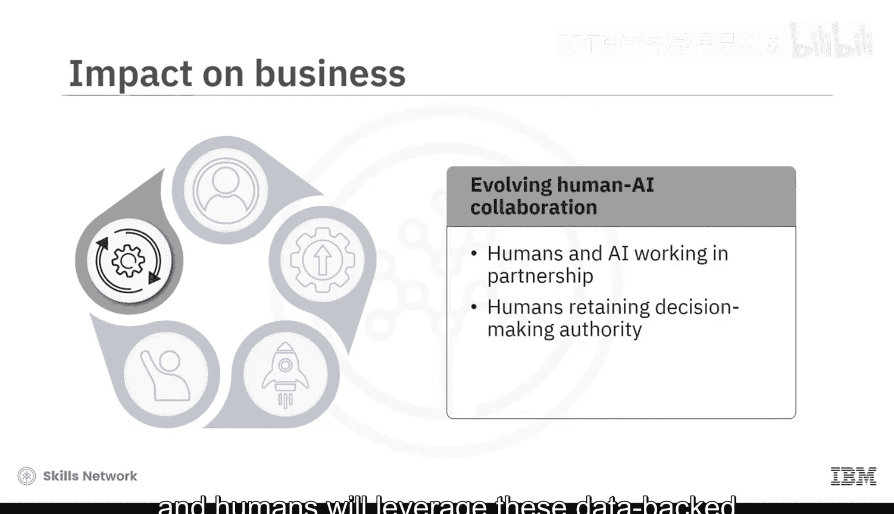
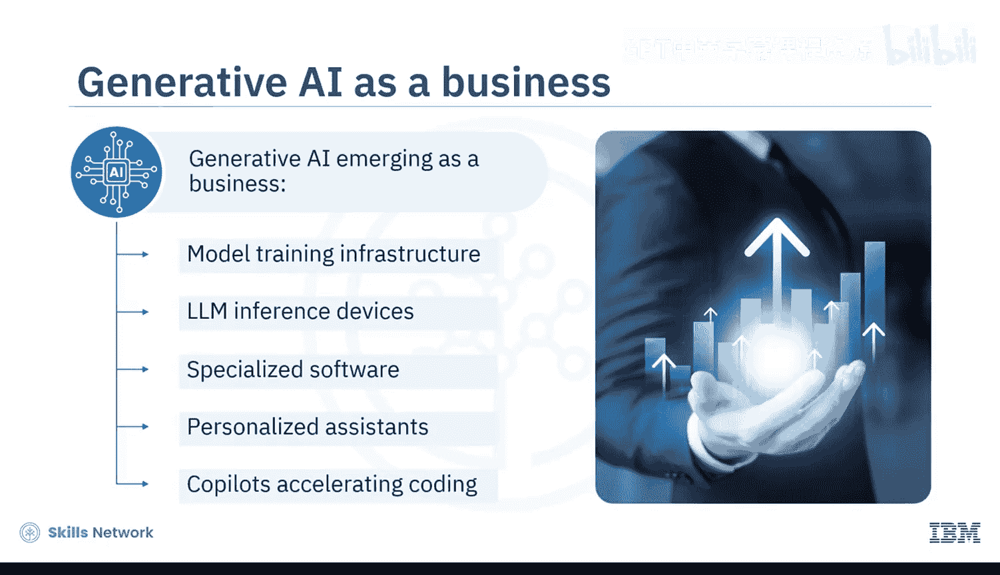
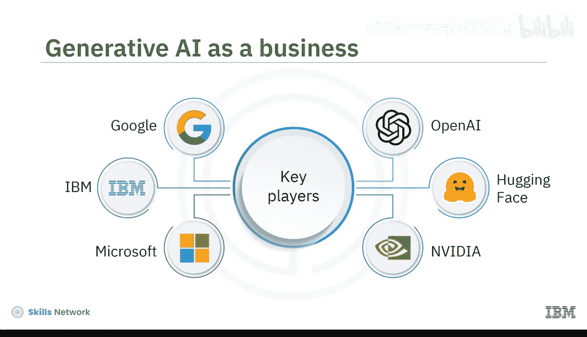
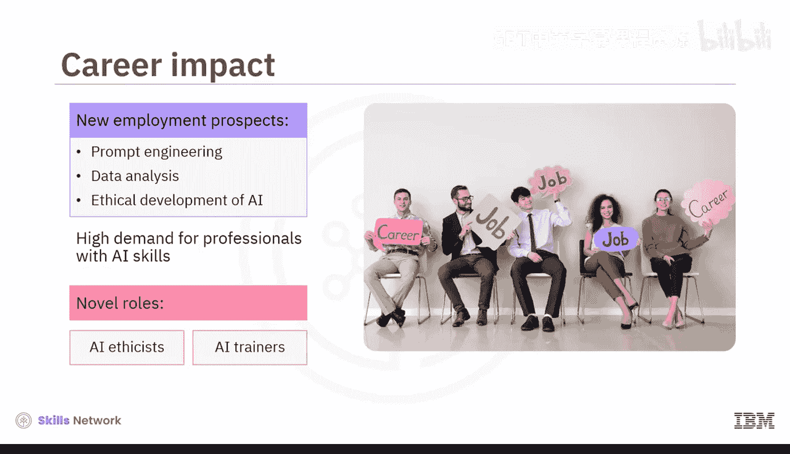
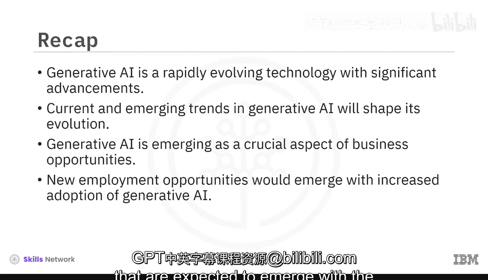

# 066：生成式AI趋势与影响 🚀

在本节课中，我们将学习生成式AI的当前与新兴趋势，并分析其对不同专业人士的职业以及整体商业格局所产生的深远影响。

生成式AI正在经历快速发展，其潜力正在改变我们生活的各个方面，包括个人职业发展和商业环境。近年来，这项技术已广泛融入几乎每个行业。麦肯锡2023年全球报告指出，33%的头部公司已采用生成式AI，另有25%的公司正在整合过程中。随着生成式AI模型的能力和可访问性不断增强，其应用预计将迎来更快速的增长。

上一节我们了解了生成式AI的广泛应用背景，本节中我们来看看其具体的发展趋势。

以下是当前及新兴的生成式AI模型趋势：

*   **模型普及与接口简化**：诸如GPT和DALL-E等模型改变了企业生成内容和与技术互动的方式。其直观的界面和API促进了快速原型设计，释放了探索生成式AI全部潜力的广泛可能性。
*   **模型规模与能力增强**：OpenAI、Google、Microsoft、IBM等主要参与者正在开发更大、更强大的模型，在多个领域取得了令人瞩目的成果。
*   **多模态能力发展**：像Google Gemini这样具备多模态能力的模型，能够无缝理解和处理多种内容格式，包括文本、代码、图像、音频和视频。这种能力为生成式AI在虚拟和增强现实领域的潜在应用开辟了新的可能性。
*   **定制化与微调**：许多基于云的平台和开源框架（如IBM Watson X、Hugging Face和PyTorch）使组织能够使用其专有数据来训练和微调模型，从而产生更相关、更准确且更符合组织特定目标的输出。
*   **边缘计算与效率提升**：一个新兴趋势是在边缘设备上部署紧凑且高效的生成式AI模型版本，减少对集中式云资源的依赖，并增强实时应用的性能。
*   **可解释性与透明度**：随着新的生成式AI模型不断被开发，其复杂性也在增加。因此，提高这些模型的可解释性和可理解性变得非常重要，因为理解模型如何做出决策对于建立信任和问责制至关重要。

了解了这些趋势后，我们来看看生成式AI带来的具体影响。

由当前和新兴趋势驱动的生成式AI影响力正在不断扩大，波及商业和个人职业。它正在促进创新、提高效率，并在各个专业领域开辟新的机遇。

以下是生成式AI对商业和不同专业人士职业的一些影响：

*   **对商业的影响**：
    *   **提升劳动生产率**：通过简化工作流程和自动化重复性任务。
    *   **加速研发**：通过生成式设计。
    *   **定制用户体验**：以提升参与度和忠诚度。
    *   **开创创新商业模式**。
*   **个性化体验**：像AutoGPT和自定义GPT这样的个性化模型能够适应个人偏好和上下文，生成符合特定需求和兴趣的内容。OpenAI允许创建自定义版本的ChatGPT，结合多种技能。生成式模型在各种应用中提供高度个性化的用户体验，从推荐系统到虚拟助理功能。
*   **个性化学习**：个性化学习平台利用生成式AI根据个人学习风格定制教育内容。
*   **创意与设计**：AI驱动的生成设计工具有助于创造创新产品、艺术作品，甚至整个虚拟世界。
*   **加速科学发现**：生成式AI通过生成新假设、分析海量数据集并根据分析建议实验设置来加速科学突破，这有助于更高效地进行实验。
*   **自动化行政任务**：生成式AI助手可以自动化重复性任务、管理日程和处理行政工作，从而释放人类时间用于更具战略性的活动。
*   **数据洞察与报告**：GPT模型正被用于自动化复杂数据集的分析，为企业生成富有洞察力的报告和建议。
*   **技术民主化**：使用生成式AI的平台变得更加用户友好和易于访问，允许非技术人员利用该技术解决问题。开源计划也促进了AI技术的普及，推动了跨社区的协作与创新。
*   **人机协作**：未来，人类和AI可能会紧密合作，利用彼此的优势实现最佳结果。AI将提供洞察和建议，而人类将利用这些基于数据的洞察和建议做出以结果为导向的决策。

生成式AI不仅重塑了各领域的商业，其本身也正在成为一个重要的商业领域。

生成式AI业务涵盖模型训练基础设施、大语言模型推理设备、专业软件、个性化助手以及加速编码的副驾驶工具。彭博智库预测，到2032年，生成式AI市场规模将达到1.3万亿美元，预计未来十年的年复合增长率为42%。

推动生成式AI发展的关键参与者包括Google、IBM、Microsoft、OpenAI、Hugging Face和Nvidia等行业巨头。随着生成式AI的采用率提高，新的就业机会将在提示工程、数据分析和AI伦理开发等领域涌现。市场对具备AI技能的专业人士需求巨大，因为公司正在积极寻找人才来实施和增强新的生成式AI解决方案。AI驱动决策的兴起也催生了新的角色，如AI伦理学家和AI训练师，从而影响了就业市场的动态。

本节课中，我们一起学习了生成式AI是一项快速发展的技术，其能力取得了显著进步。我们探讨了塑造其未来发展的当前及新兴趋势。我们了解了企业如何从生成式AI模型中受益，以及生成式AI本身如何成为一个关键的商业机遇。最后，我们发现了随着这项技术采用率提高而有望涌现的新就业机会。