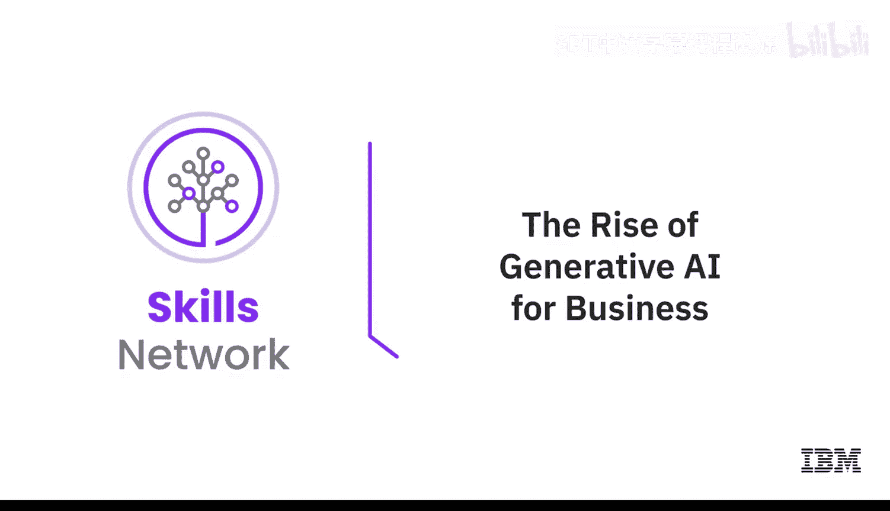

# 067：生成式AI在商业领域的崛起 🚀

在本节课中，我们将探讨生成式AI如何迅速从一种新奇技术转变为商业领域的核心驱动力，并理解其对社会与创新的广泛影响。

---

阿瑟·C·克拉克曾有名言：任何足够先进的技术都与魔法无异。初次接触生成式AI时，它或许确实能唤起一种魔法的感觉。在我们的历史上，这是首次出现能够理解我们的语言、明白我们的请求并创造出全新内容的技术。

AI可以写诗、绘制超凡脱俗的图像、编写代码，甚至能用原创的笑话或音乐作品给我们带来惊喜与愉悦。它的创造行为常常能激发人们的惊叹。AI的影响不仅限于数字世界，也延伸至物理世界。若能恰当应用，可以想象AI将为发现与创新的速度带来何种变革。

上一节我们感受到了生成式AI的“魔力”，本节中我们来看看它如何解决现实世界的重大挑战。AI能为新材料发现、医学、能源、气候以及我们人类面临的诸多紧迫问题做出贡献。最终，我们的成功取决于我们如何对待AI。

回想你第一次听说“生成式AI”这个词，它大约在2022年11月或12月成为公众讨论的一部分。此后，我们见证了新模型的涌现、模型的演进以及开源模型的爆炸式增长。在不到一年的时间里，生成式AI已从一个迷人的新奇事物转变为新的商业必需品。

以下是其发展势头的具体表现：
*   每天都有新的用例或应用被报道。
*   增长如此迅速，以至于我们无法精确预测10年甚至10个月后的景象。

但我确信，你将希望积极参与塑造这一发展历程。AI的未来并非依赖一两个能为所有人做所有事的“全能”模型。它是**多模态**的，并且需要被**民主化**。

这意味着我们需要借助开放科学与开源AI的能量和透明度，让所有人都能对“AI是什么、能做什么、如何使用以及如何影响社会”拥有发言权。你将有机会决定AI能做什么以及如何与你的业务整合。

综上所述，本节课我们一起学习了生成式AI从概念到商业核心的崛起之路，及其在推动创新和解决全球挑战中的潜力。现在，是时候开始规划如何有效、安全、负责任地将AI投入工作了。