# 068：通过生成式AI提升企业竞争力 🚀

在本节课中，我们将学习如何利用生成式AI来提升企业竞争力。我们将探讨“提升”的真正含义，了解负责任地采用生成式AI的关键步骤，并解释生成式AI模型如何增强各项业务功能。

## 什么是“通过生成式AI提升企业”？

“提升”意味着将AI系统负责任地融入业务流程，以对盈利能力、工作文化乃至整个社会产生积极影响。

“提升”不同于简单的“应用”。它超越了仅仅使用生成式AI，要求企业领导者付出坚定的努力，确保考虑到AI采用的所有方面。这些方面包括但不限于：
1.  **可行性分析**
2.  **优先级排序**
3.  **人才获取**
4.  **风险管理**
5.  **组织协同**

可行性分析有助于识别最能从生成式AI中受益的业务功能。

## 哪些企业可以受益？ 📈

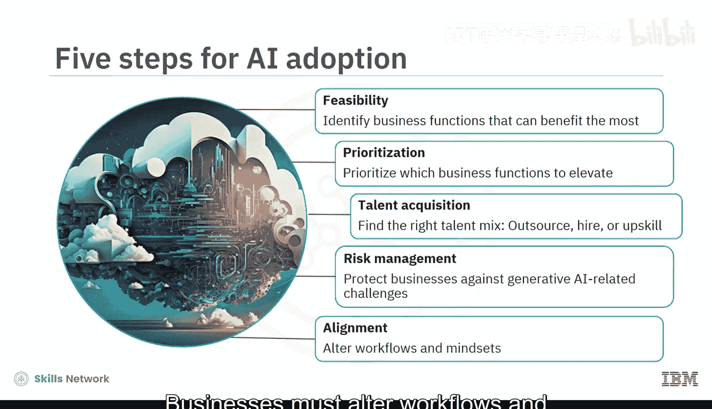

任何企业，从跨国组织、中型企业到本地创业者，都可以利用生成式AI来提高其知名度和收入。

虽然银行、高科技和生命科学等行业可能看到最大的收入增长，但娱乐、体育、教育、制造和健康等其他行业也将受到影响。这是因为生成式AI有潜力彻底改变所有行业的业务功能。

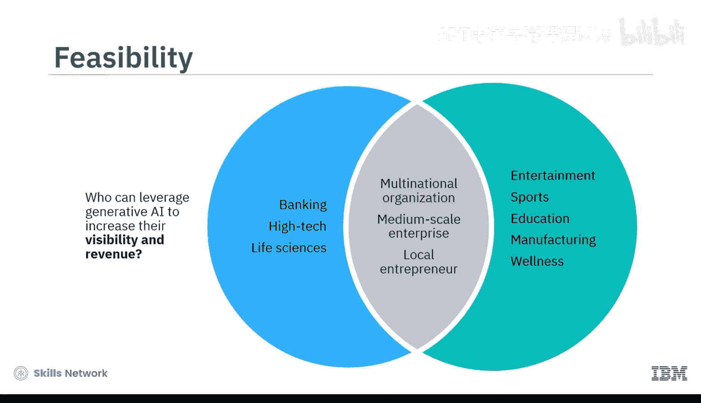

## 生成式AI如何增强业务功能？ ⚙️

生成式AI模型和工具已为多项业务功能带来了效率和创造力的提升。

以下是几个关键业务功能及其应用示例：

*   **客户服务**：对话式生成式AI工具（聊天机器人）能根据每次客户互动调整语气和方式，从而减少问题解决时间并提高客户满意度。
*   **市场营销与销售**：大语言模型分析客户行为和偏好，使营销人员能够定制广告、提供个性化推荐并增加客户互动。
*   **人力资源与运营**：基础模型自动化常规任务并改进数据分析，减少人为错误并最大化生产力。
*   **产品设计与开发**：扩散模型提供尖端技术，用于创造突破性的、独特的、个性化的视觉效果，提升客户参与度和品牌认知度。

然而，对于文本分类、风险评估、内容检索和客户细分等基本任务，你真的需要生成式AI吗？实际上，**判别式AI模型**更适合这些任务，因为它们通常能产生更准确的结果。

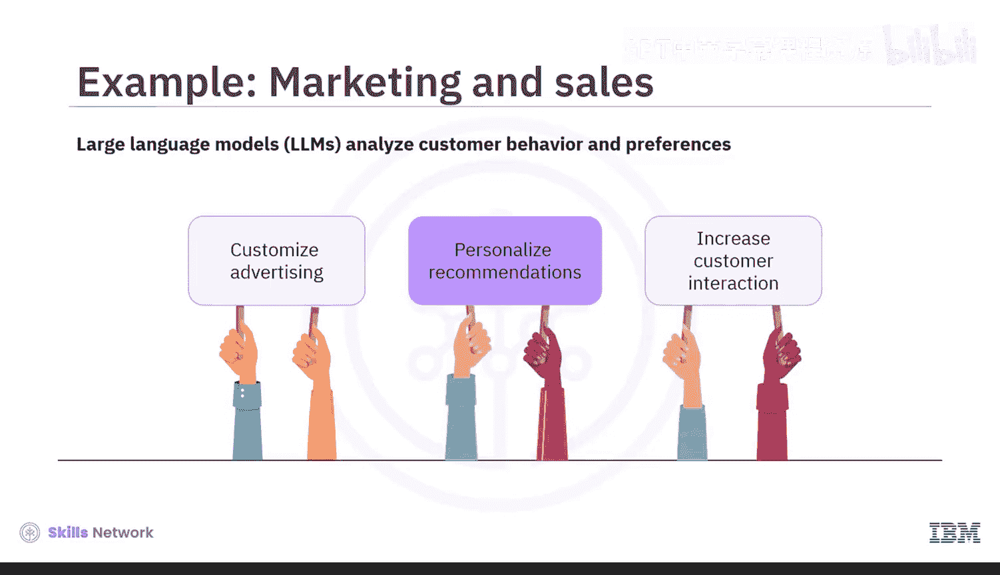

因此，任何企业都必须进行可行性分析与影响评估，以确定在何处应用生成式AI可以驱动价值和利润。

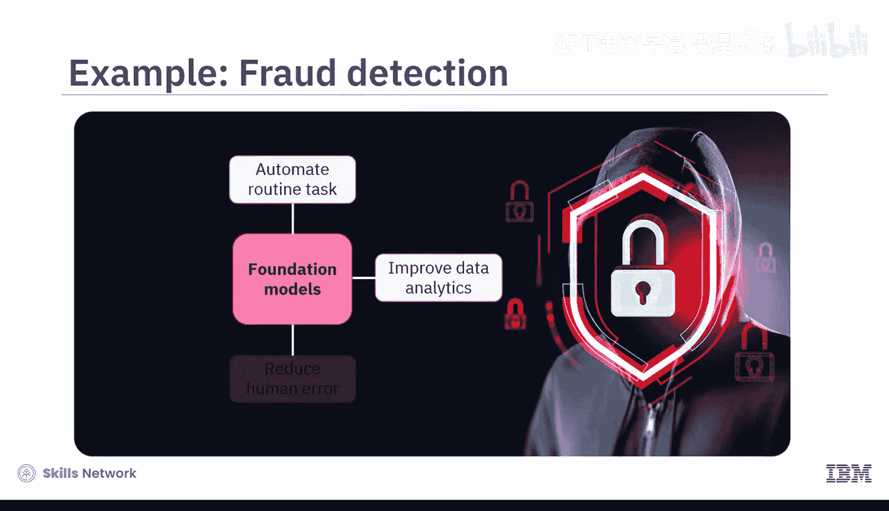

## 如何负责任地采用生成式AI？ 🛡️

上一节我们介绍了生成式AI的应用潜力，本节中我们来看看企业需要遵循哪些关键步骤来负责任地采用它。

### 第一步：进行可行性分析

可行性分析需要：
1.  定义问题以及生成式AI能提供的解决方案。
2.  研究将生成式AI集成到工作流程中的影响。
3.  评估劳动力需求。
4.  选择生成式AI模型、用于预训练模型的数据集，并微调算法以交付所需的输出。

### 第二步：确定优先级

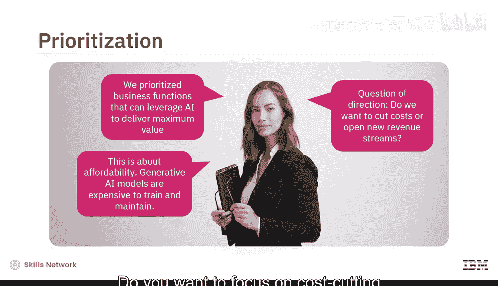

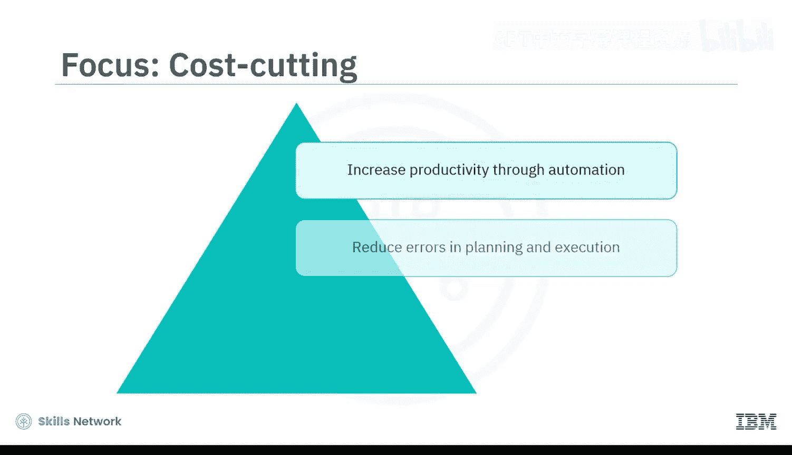

完成可行性分析后，领导者必须优先考虑那些能利用AI带来最大价值的业务功能。这与可负担性直接相关，因为生成式AI模型的训练和维护成本高昂。

这里还涉及方向选择：你是想专注于**降低成本**还是**开辟新的收入来源**？
*   **为了降低成本**，生成式AI可以通过自动化提高生产力，减少计划和执行中的错误，并缩短产品上市时间。
*   **为了开辟新收入来源**，企业可以利用生成式AI预测场景、可视化结果并改进数据分析。

这些能力允许进行更多的实验和创新，并强化团队协作文化，因为员工可以将时间投入到更高价值和更具协作性的活动上。最终结果是销售额增长和客户保留率提高。

### 第三步：获取合适的人才组合

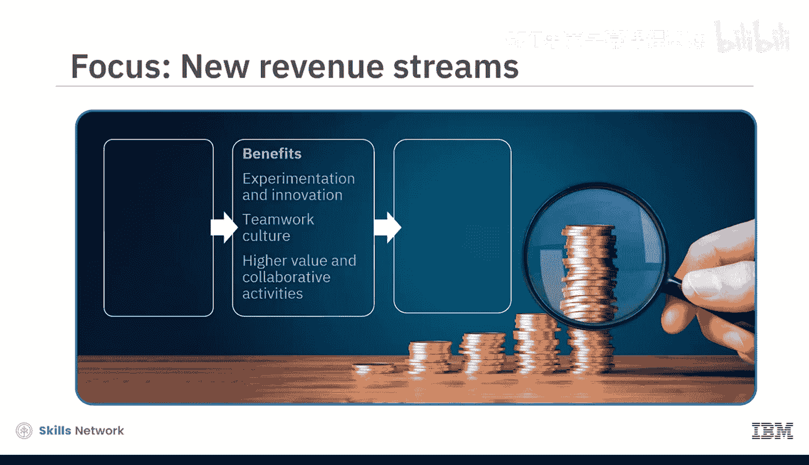

企业需要合适的人才组合。他们可以：
*   **外包**AI特定任务，如构建、训练、部署和微调AI模型。一个由AI赋能者组成的生态系统提供了这方面的专业知识，包括像Hugging Face这样的开源平台和像IBM Watson X这样的专有工具。
*   **招聘**新的AI内部专职人员，如AI开发人员、提示工程师和数据科学家，以监控和维护AI系统。
*   **提升**现有员工的技能，以补充生成式AI的输出并与之协同工作。

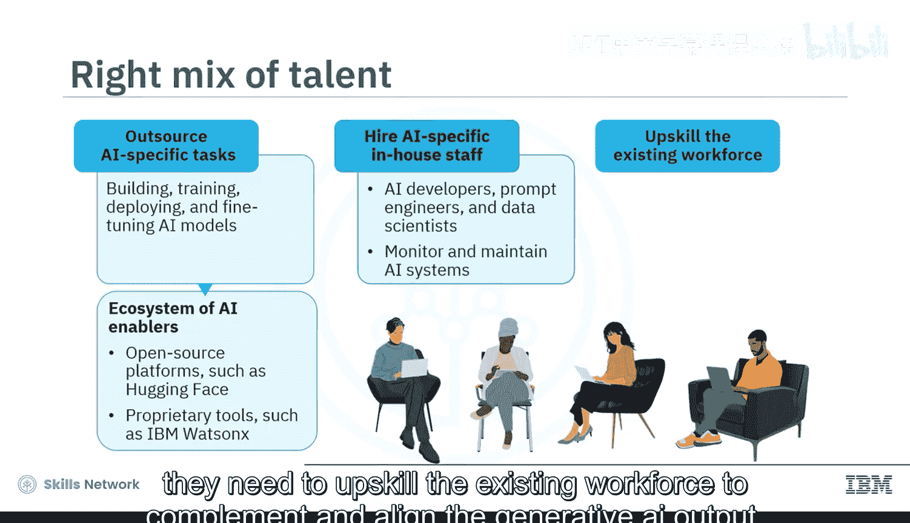

### 第四步：管理风险与确保合规

当一切准备就绪时，需要考虑伦理和合规问题。如果企业不解决诸如版权侵权、数据隐私侵犯、低质量训练数据、算法偏见、幻觉以及安全、透明度和问责措施不足等挑战，采用生成式AI可能会损害品牌。

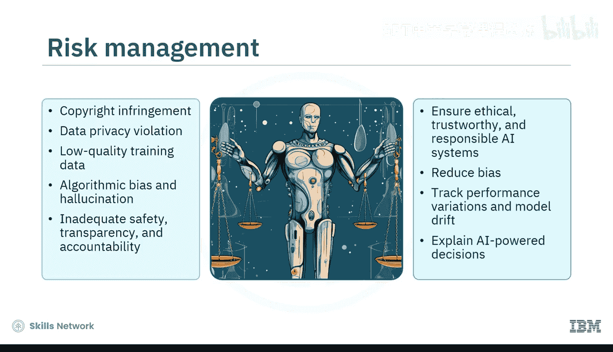

为了确保AI系统合乎伦理、值得信赖和负责任，企业必须减少偏见、跟踪模型漂移导致的性能变化，并向利益相关者和客户解释AI驱动的决策。

### 第五步：实现组织与工作流的协同

与生成式AI模型协同工作，要求团队成员调整新的工作流程、学习新的词汇并转变思维方式。例如：
*   固定的流程让位于灵活的问题处理方法。
*   像“神经网络”、“风格迁移”、“深度伪造”、“幻觉”和“过拟合”这样的词汇成为日常用语。
*   人类的角色会根据AI能力的演变而不断调整。

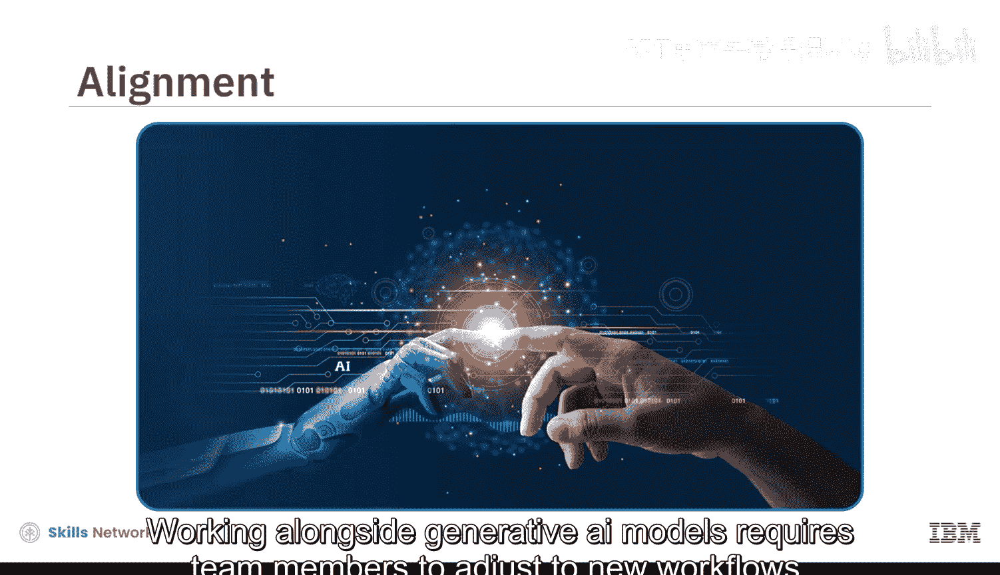

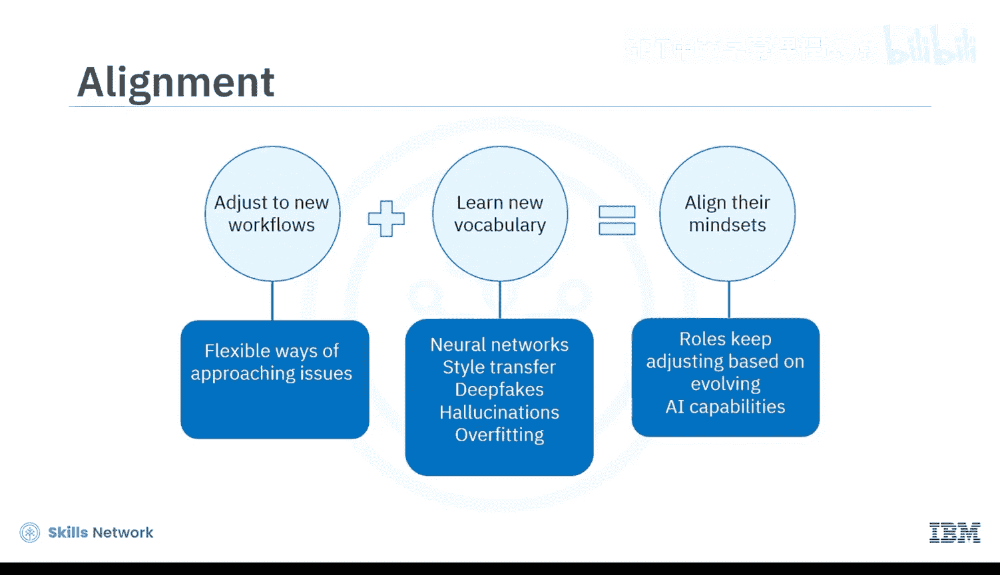

## 总结 📝

本节课中，我们一起学习了如何通过生成式AI提升企业竞争力。

我们了解到，企业应负责任地将AI系统与业务流程融合，以对盈利能力、工作文化和社会产生积极影响。他们必须仔细考虑AI采用的所有方面，如可行性、优先级排序、人才获取、风险管理和组织协同。

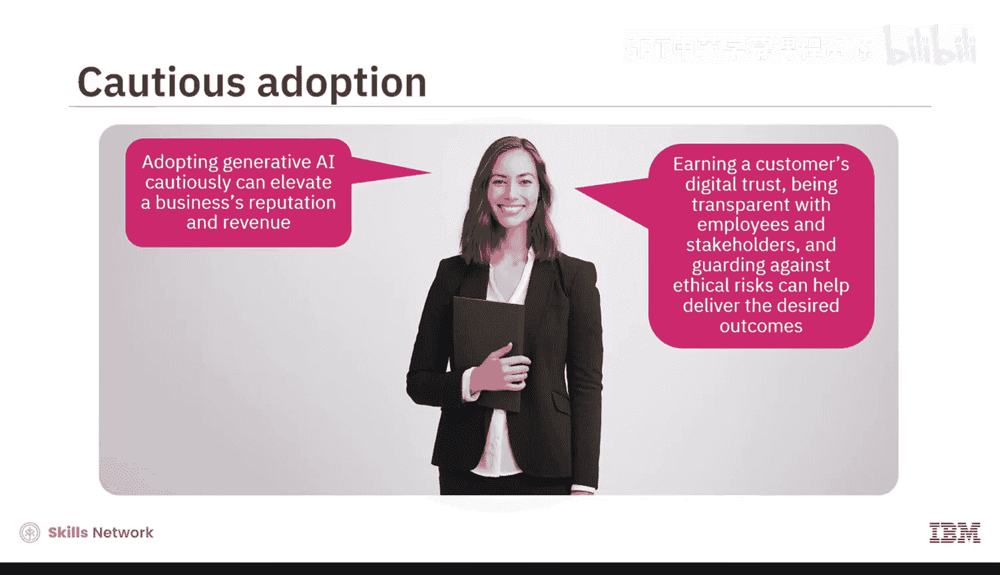

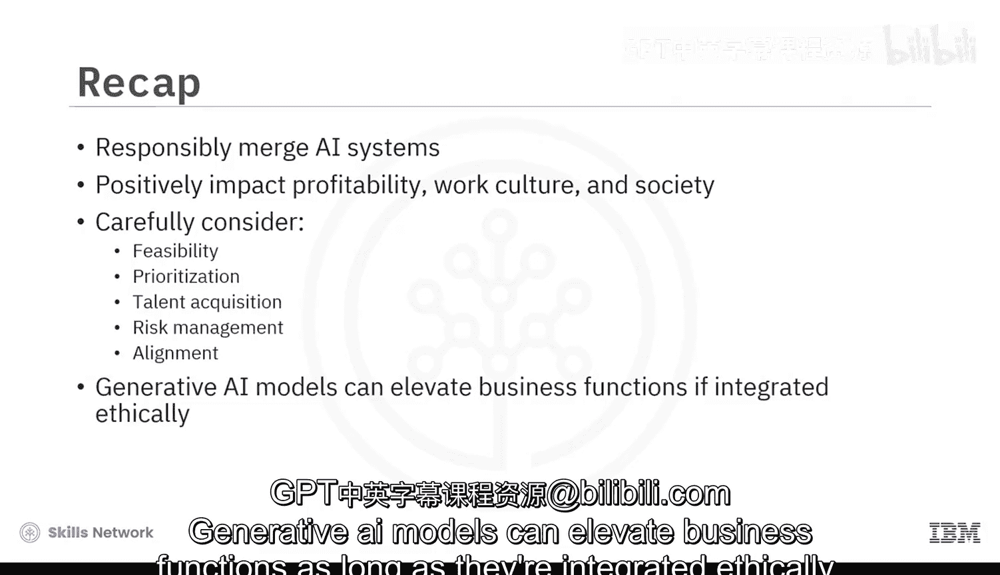

谨慎地采用生成式AI可以提升企业的声誉和收入。赢得客户的数字信任、对员工和利益相关者保持透明以及防范伦理风险，有助于实现预期的成果。只要以合乎伦理的方式集成，生成式AI模型就能提升业务功能。