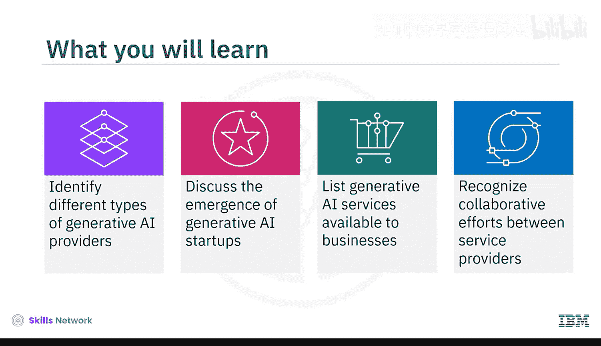
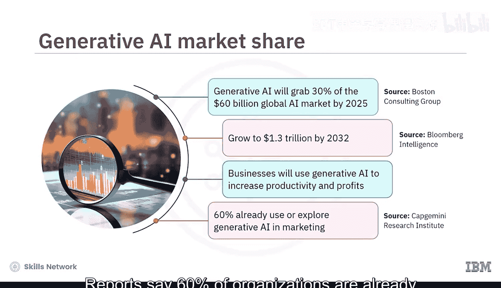
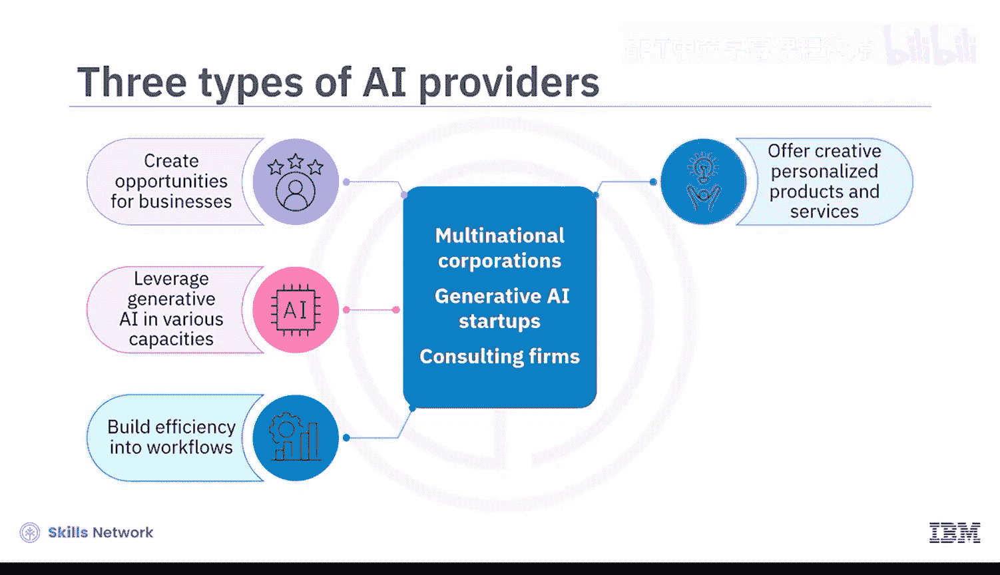
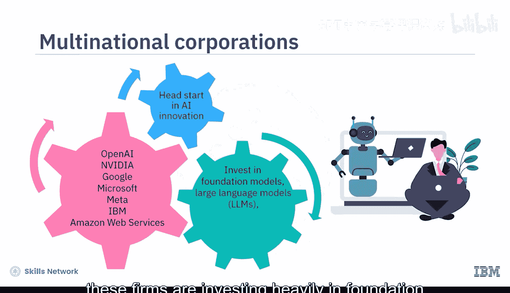
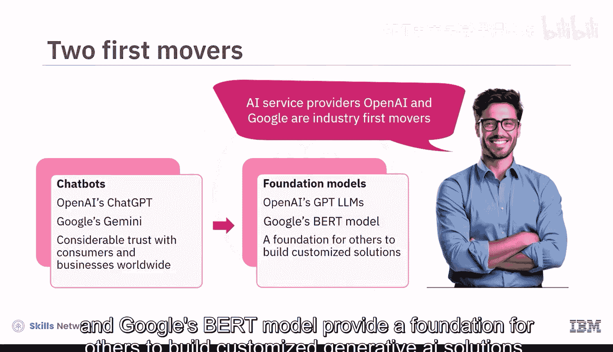
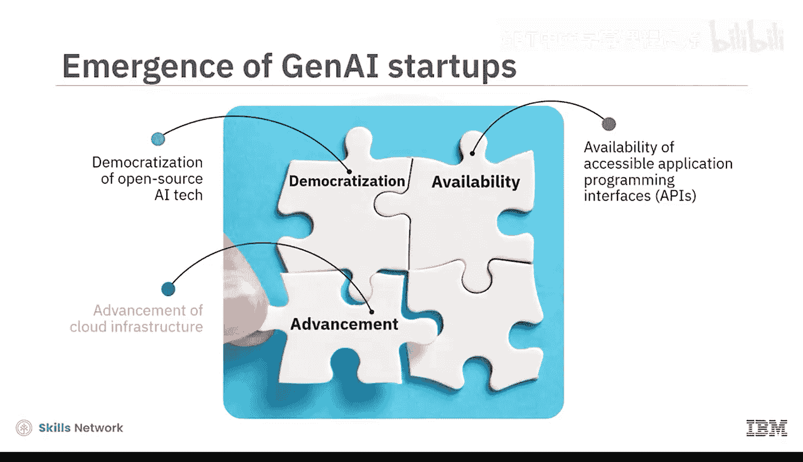
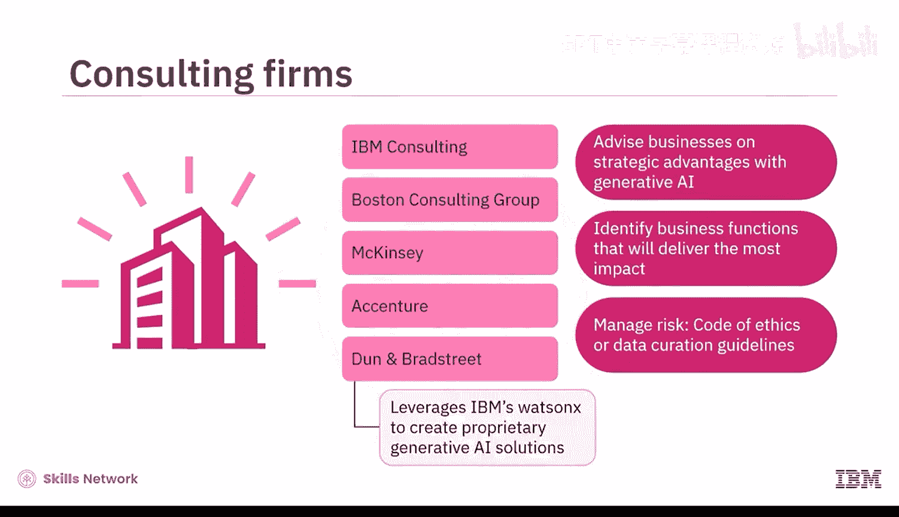
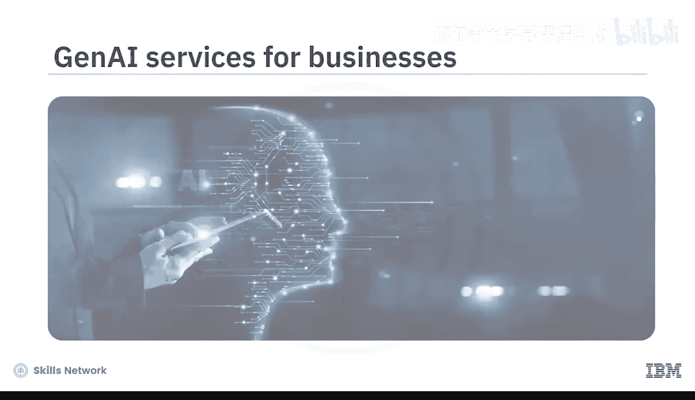
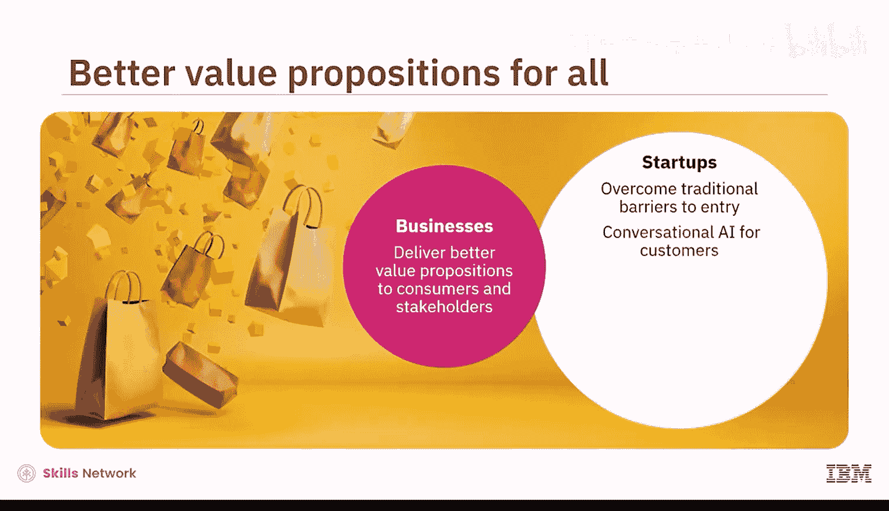
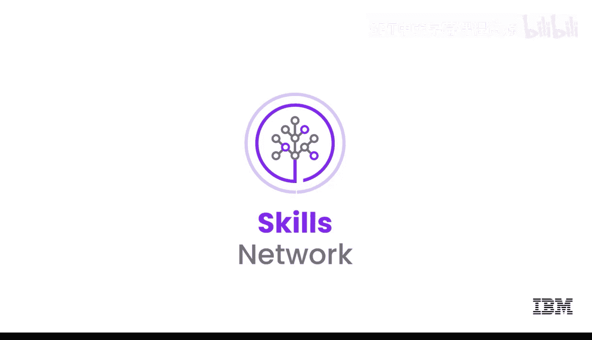

生成式AI基础：05：生成式AI供应商生态系统 🏢

在本节课中，我们将要学习生成式AI的供应商生态系统。我们将了解不同类型的服务提供商，探讨初创企业的兴起，并认识企业可用的各类生成式AI服务。

---

根据预测，到2025年，生成式AI将占据600亿美元全球AI市场的30%份额，并且很可能在2032年增长至1.3万亿美元。这意味着大多数企业将利用生成式AI来提高生产力和利润。报告显示，已有60%的组织在市场营销领域使用或探索生成式AI。

那么，企业是倾向于内部构建生成式AI，还是从市场购买呢？大多数组织选择购买而非自建。这样做的好处是：A. 可以安全地试验生成式AI；B. 节省训练和部署基础模型的时间与金钱；C. 利用市场上的尖端专业知识。

当企业在此领域寻求支持时，会遇到三类AI服务提供商：**跨国公司**、**生成式AI初创公司**和**咨询公司**。这些服务提供商为企业创造了机会，使其能够以多种方式利用生成式AI，例如：将效率融入工作流程、为客户提供更具创意和个性化的产品与服务、扩大运营规模并增加收入。

---

### 跨国公司的主导地位

AI市场的大部分份额由跨国公司占据，例如OpenAI、NVIDIA、Google、Microsoft、Meta、IBM和Amazon Web Services等。凭借在AI创新上的先发优势，这些公司正大力投资于基础模型、大语言模型、扩散模型及其他生成式AI工具。

在AI服务提供商中，OpenAI和Google是行业的先行者。它们的聊天机器人ChatGPT和Gemini已在全球消费者和企业中建立了相当大的信任。OpenAI的GPT系列大语言模型和Google的BERT模型为他人构建定制化的生成式AI解决方案奠定了基础。

---

### 生成式AI初创公司的兴起

与这些跨国公司竞争的是数百家生成式AI初创公司。它们的兴起得益于开源AI技术的普及、易于访问的应用程序编程接口（API）、云基础设施的进步以及用户和风险投资家的鼓励。

尽管2023年全球融资放缓，生成式AI初创公司仍筹集了100亿美元。这使得它们能够提供负担得起的、针对特定领域或业务功能定制的生成式AI工具，以满足市场需求。

以下是值得关注的一些初创公司：
*   **Cohere**：为企业构建多语言大语言模型。
*   **Hugging Face**：面向开发者的协作式AI社区。
*   **Tabnine**：为软件开发人员提供的代码编写AI助手。
*   **Soundraw**：免版税的AI音乐生成器。
*   **Assembly AI**：提供AI即服务。

---

### 咨询巨头的战略角色

生成式AI服务提供商的生态系统还包括咨询巨头，例如IBM Consulting、波士顿咨询集团、麦肯锡、埃森哲和邓白氏。这些公司就企业如何通过生成式AI获得战略优势提供建议。它们帮助企业识别能产生最大影响的业务职能，并通过建立道德准则或制定数据管理指南等方式来帮助管理风险。

例如，邓白氏利用IBM的Watsonx来帮助客户创建专有的生成式AI解决方案。

---

### 服务提供商的核心能力

企业可以期待这些服务提供商在以下方面提供支持：
*   提升基础模型的多模态能力。
*   整理数据集以消除算法偏见和幻觉。
*   对LLMs进行微调和优化以提高准确性。
*   为特定领域和业务功能定制模型。
*   将生成式AI与现有软件和平台集成。
*   提供LLM即服务，以帮助个性化解决方案、设计和部署模型、培训员工并提供技术支持。

凭借这些专业知识，企业能够为其消费者和利益相关者提供更好的价值主张。各行各业的初创公司能够通过以下方式克服传统的市场进入壁垒：使用对话式AI进行客户服务、快速创建内容用于营销和推广、进行产品和服务的情景预测，以及利用生成式设计来创新产品和包装。

---

### 服务提供商之间的协作

服务提供商之间也会进行协作，相互学习并促进生成式AI解决方案的采用。

以下是几个协作案例：
*   两家跨国公司IBM和Amazon Web Services建立了一个创新实验室，供客户对生成式AI应用进行原型设计和测试。
*   IBM的Watsonx AI和初创公司Hugging Face共享其开源AI工具，以帮助开发者构建、测试和部署机器学习解决方案。
*   麦肯锡将其专有的AI和数据模型与Salesforce的客户关系管理技术相结合，帮助企业改善客户购买体验和销售生产力。

业界普遍相信，AI将成为推动经济发展的最强大力量。

---

### 总结

本节课中，我们一起学习了生成式AI服务提供商的生态系统，其中包括跨国公司、生成式AI初创公司和咨询巨头。这些服务提供商帮助企业将效率融入工作流程、提供更具创意的产品与服务、扩大运营规模并增加收入。它们还通过协作，为消费者和企业提供更完善的生成式AI解决方案。