# 070：生成式AI对各行业的影响 🏭

在本节课中，我们将要学习生成式人工智能（Generative AI）如何作为一种变革性力量，深刻影响并重塑多个行业的运作方式。我们将探讨其在不同行业中的具体应用和价值。

---

## 概述

生成式AI是技术和商业领域的一股开创性力量，正在引领各行各业的深刻变革。麦肯锡2023年的一份报告指出，生成式AI预计每年将为全球经济贡献2.6万亿至4.4万亿美元，这展示了其为行业带来的巨大价值。

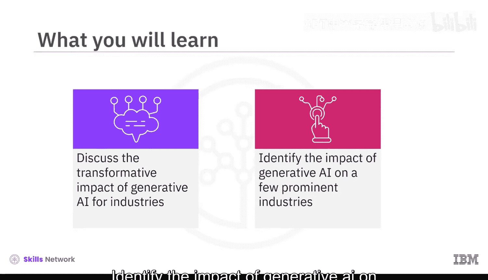

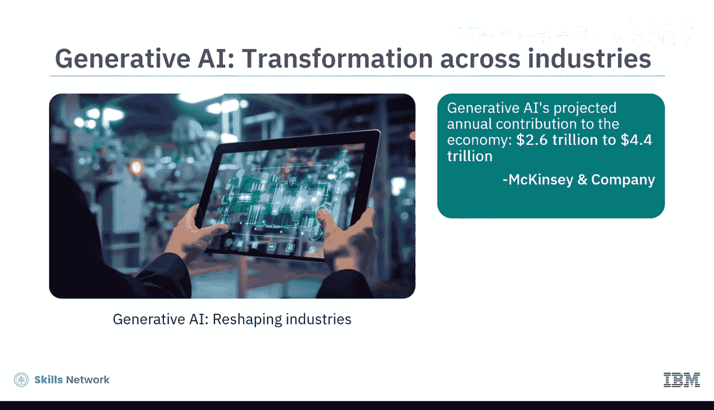

生成式AI在各行业的增长轨迹不仅体现在数字上，更代表了行业运作方式的根本性转变。它不仅仅是自动化任务，更是从概念设计到流程优化的全工作流精炼。生成式AI正在培育一种持续创新的文化，使行业能够更快地适应不断变化的需求和市场趋势。

## 生成式AI的变革潜力

生成式AI的变革潜力体现在多个方面。

以下是其核心能力：

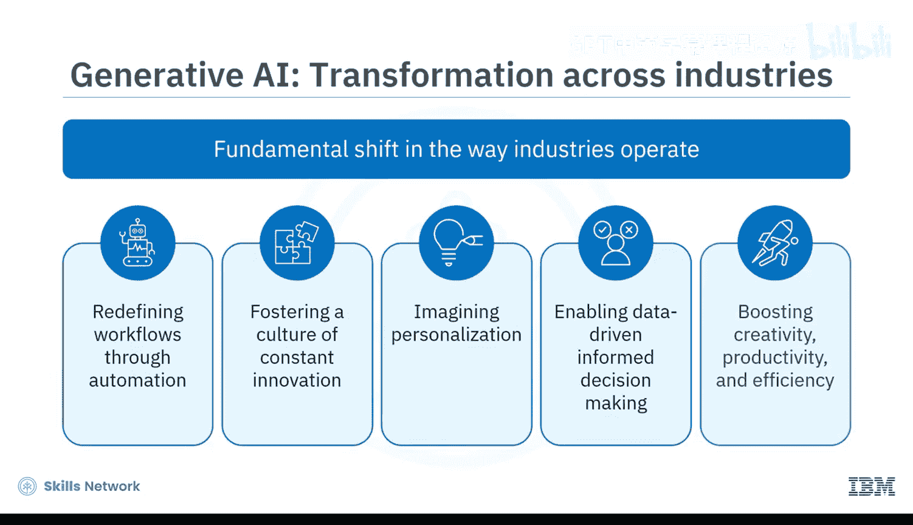

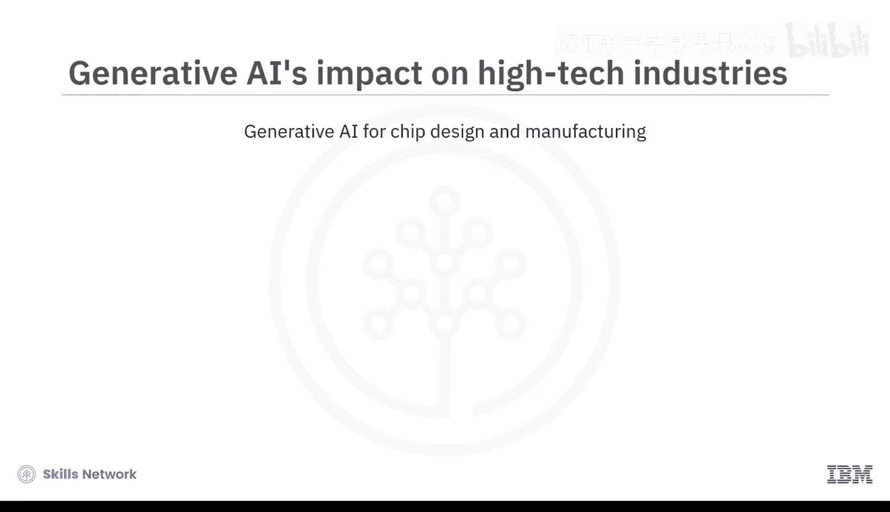

*   **超个性化**：想象一下，为客户提供个性化的体验、营销活动和产品推荐，所有这些都根据个人需求量身定制。
*   **数据洞察与决策**：生成式AI模型可以实时分析海量数据，以预测结果、优化运营并在不同行业做出明智决策。其核心是`模型 = 分析(数据)`的过程。
*   **人机协作**：生成式AI模型正在促进人类与AI之间的协作，以提升人类的创造力、生产力和效率。

生成式AI对几乎每个行业都有变革性影响。接下来，我们来看看它对几个主要行业领域的具体影响。

## 对高科技行业的影响

生成式AI对高科技行业的影响是深远且多方面的。

以下是具体应用案例：

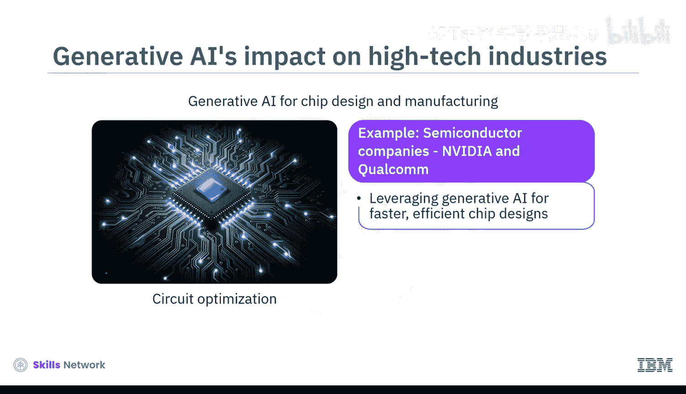

*   **半导体设计**：生成式AI正助力英伟达和高通等半导体公司进行电路优化，从而实现更快、更高效的芯片设计。
*   **网络安全**：生成式AI让网络安全更智能。它可以创建攻击模拟来训练安全分析师和测试系统有效性，识别威胁并建立预测模型。例如，Palo Alto Networks公司利用生成式AI主动检测异常并预防潜在漏洞。
*   **软件开发**：在软件开发中，生成式AI自动化重复性编码任务，并辅助测试和调试。像GitHub Copilot这样的生成式AI产品可以帮助开发者更快、更智能、更高效地编写代码。
*   **机器人技术与自动化**：在机器人技术和自动化领域，生成式AI对于设计和控制能够持续学习和改进的自主机器人至关重要。特斯拉和波士顿动力等公司利用AI来增强机器人的灵活性和问题解决能力。

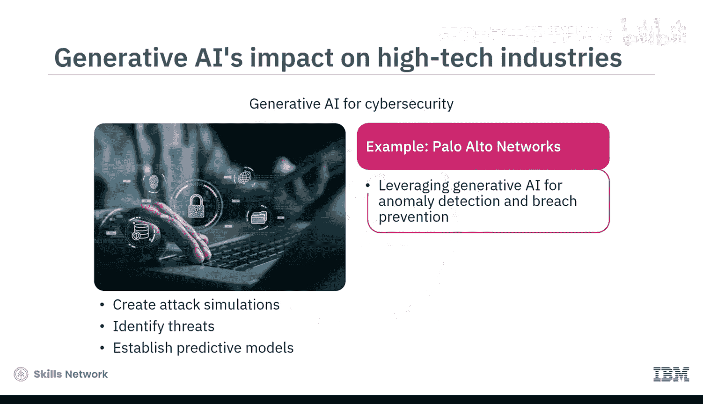

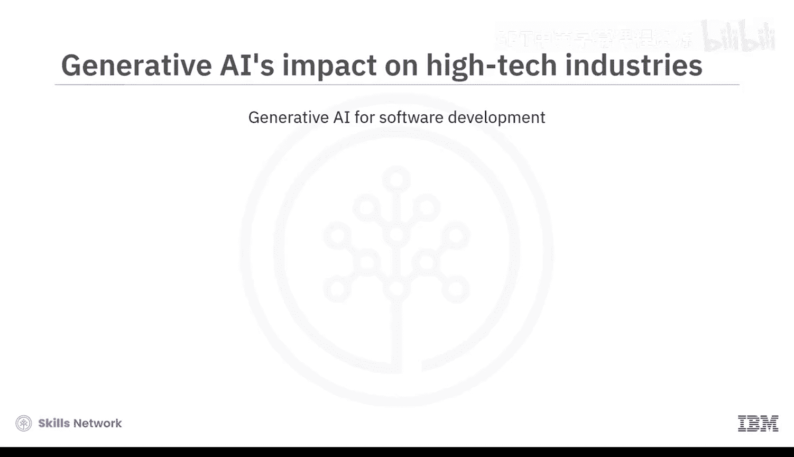

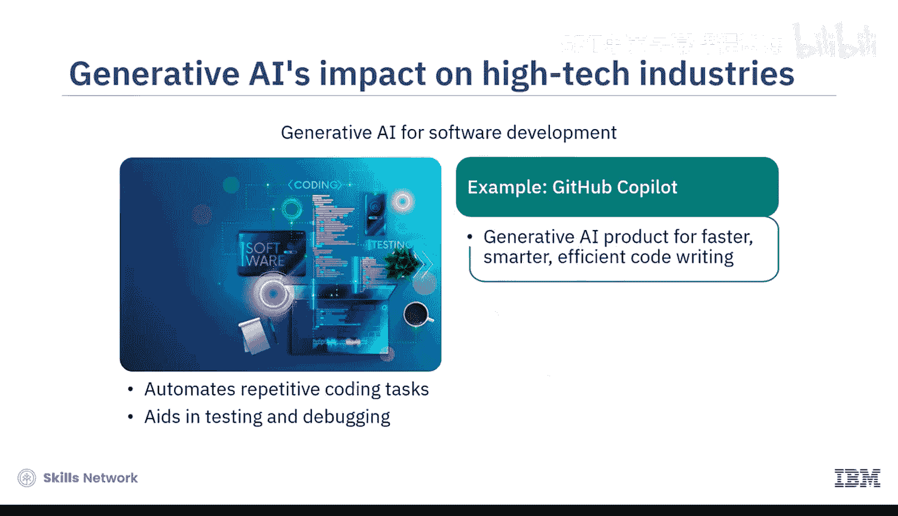

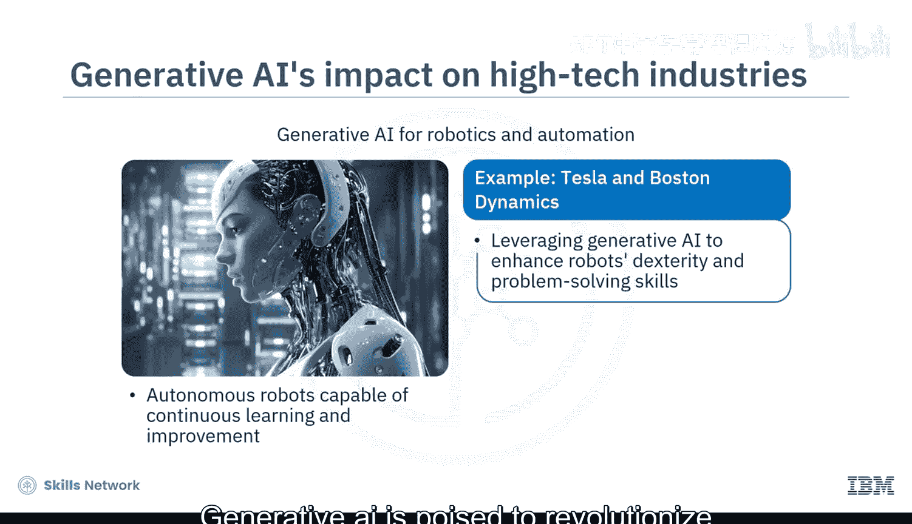

## 对制造业的影响

生成式AI有望彻底改变制造业格局。根据一份市场研究报告，制造业中生成式AI的市场规模在2022年为2.234亿美元，预计到2032年将超过63.988亿美元。

以下是其在制造业的关键作用：

*   **设计与创新**：生成式AI通过自动化复杂任务以及快速创建和评估设计替代方案，加速了制造设计并促进了创新。例如，空客公司利用生成设计将飞机隔断墙的重量减轻了45%。
*   **流程优化**：生成式AI可以模拟生产场景、简化各项任务并最大限度地减少停机时间。例如，西门子利用基础模型来优化生产流程并提高产品质量。
*   **供应链与库存管理**：此外，生成式AI模型可以预测需求并优化库存水平。同时，生成式AI可以通过考虑成本、交付时间和可靠性等因素，创建最优的供应链模型。

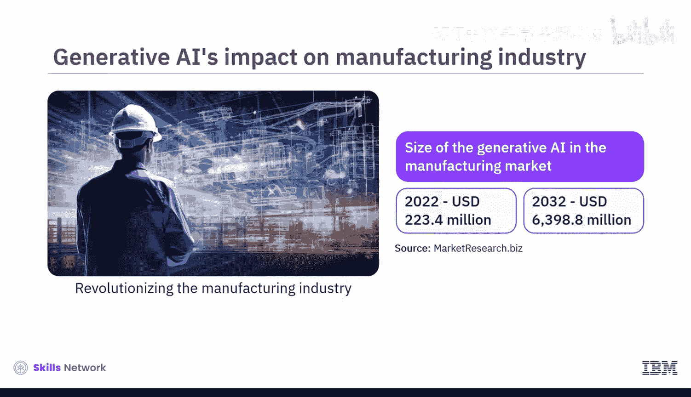

## 对金融业的影响

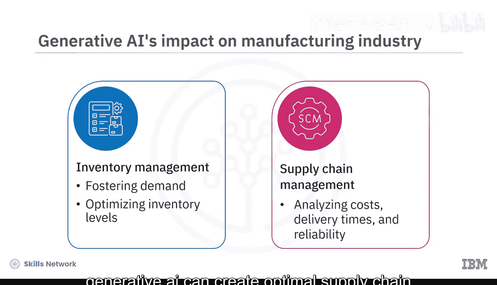

在金融行业，生成式AI展现出自动化常规任务、改善风险缓解和简化金融运营的潜力。根据高盛的研究，生成式AI在金融领域的应用预计将使全球国内生产总值（GDP）增长7%，并将生产率提高1.2%。

在银行业，生成式AI有潜力增强人工智能已带来的效率。麦肯锡指出，如果生成式AI在银行业的应用案例得到全面实施，每年可能带来相当于2000亿至3400亿美元的额外价值。

以下是其变革方式：

*   **个性化客户体验**：生成式AI通过预测客户的财务需求和行为来提供量身定制的建议，从而提升个性化客户体验。例如，摩根士丹利利用OpenAI驱动的聊天机器人来协助其财务顾问团队，通过分析内部研究和数据为客户提供即时、个性化的见解。
*   **风险评估与欺诈检测**：此外，生成式AI能够通过广泛的数据集实现更准确的信用风险评估。同时，对交易和数据的实时分析有助于识别可疑活动，从而减少欺诈。

## 对零售与消费品行业的影响

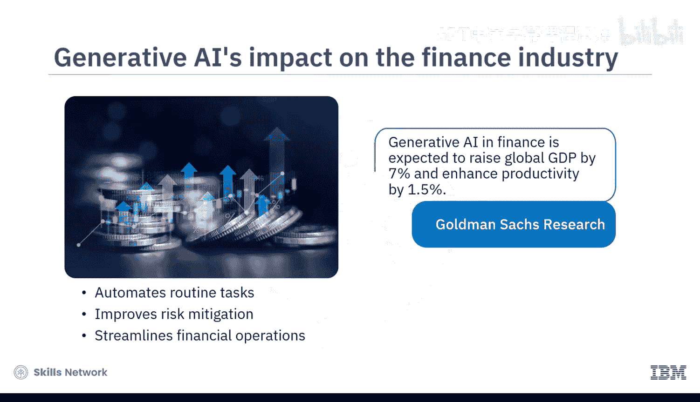

根据麦肯锡的报告，零售和消费品行业通过利用生成式AI，每年有潜力创造4000亿至6600亿美元的价值。

对于消费品公司，生成式AI能够实现：

*   **个性化旅程与营销**：个性化的客户旅程和营销活动。
*   **内容与运营**：简化的营销和品牌内容、增强的聊天机器人以及动态定价。它可以聚合市场数据来测试概念、想法和模型。

消费品公司正越来越多地将生成式AI集成到其运营中。例如，雀巢正在使用生成式AI来验证新产品创意并创建市场研究报告。拥有Kate Spade等品牌的母公司Tapestry利用生成式AI实现在线个性化自动化。

## 对医疗保健行业的影响

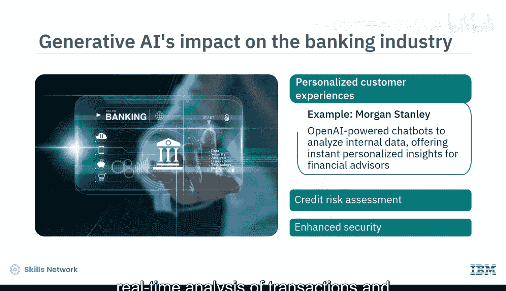

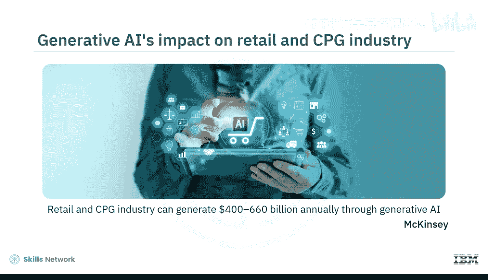

在医疗保健行业，生成式AI正在重新定义药物发现、个性化医疗并加速医学研究。制药公司通常将约20%的收入用于研发，而开发一种新药平均需要10到15年。利用基础模型和生成式AI可以加速这一过程并产生巨大价值。

根据麦肯锡的数据，生成式AI可将药物开发成本降低高达40%，并缩短新药上市的时间。

## 跨行业影响总结

在不同行业中，生成式AI的潜力和影响因职能而异。例如，在高科技行业，最大影响将体现在软件工程领域；而在银行业，它将显著影响客户运营。在医疗领域，其影响将在产品和研发方面表现显著。营销和销售职能在各个行业中都受到高度影响。

大约75%的生成式AI应用案例所产生的预估价值集中在四个关键领域：**客户运营、营销与销售、软件工程以及研究与开发**。

除了本视频涵盖的行业外，生成式AI还在影响其他领域，包括媒体与娱乐、教育、建筑、能源和农业。生成式AI不仅仅是一种趋势，它是推动下一波跨行业创新、效率和个性化体验的驱动力。

---

## 总结

本节课中，我们一起学习了生成式AI的影响，它正导致行业运作方式发生根本性转变。生成式AI正在影响各行各业，以重新定义工作流程、培育创新文化、实现超个性化、促成明智决策并提升创造力、生产力和效率。

生成式AI正在对包括高科技、制造业、金融、零售和医疗保健在内的不同行业产生深远且多方面的影响。