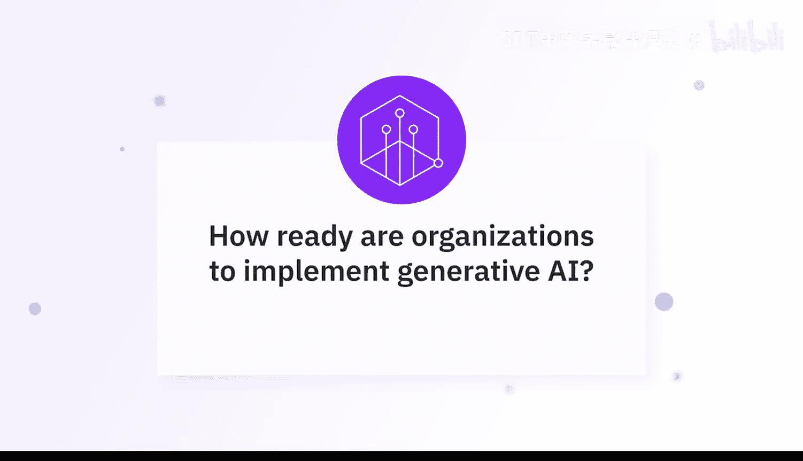
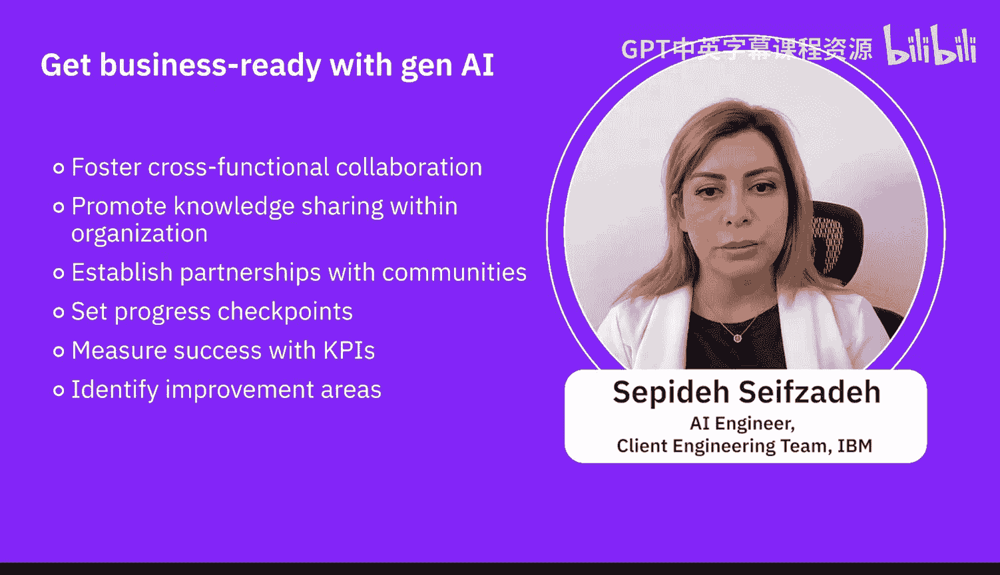

# 071：利用生成式AI实现业务就绪 🚀

在本节课程中，我们将学习专家们关于企业如何为采用生成式AI做好准备的讨论。我们将了解实现“业务就绪”所需的步骤、关键考量因素以及最佳实践。

---

## 概述

企业要准备好应用生成式AI，需要进行大量规划，并有条不紊地将这些技术融入日常活动中。这是一个循序渐进的过程。

## 实现业务就绪的步骤

上一节我们了解了业务就绪的重要性，本节中我们来看看实现它的具体步骤。以下是组织应遵循的关键步骤：

1.  **评估组织准备度**：组织需要识别自身在技术、数据和人才方面的差距、挑战以及生成式AI带来的机遇。
2.  **制定清晰的战略与路线图**：明确发展路径，确保团队对目标有统一的认识。
3.  **投资人才与技能**：决定是培训现有的数据科学家和工程师，还是从外部引入领域专家和知识资源来赋能团队或外包部分任务。
4.  **构建数据基础设施**：这是旅程中至关重要的一步。必须确保能够访问高质量的数据（这些数据将成为生成式AI模型的输入），并配备数据管理工具和运行这些模型所需的计算资源。

## 具体的实施路径

了解了宏观步骤后，我们来看看更具体的实施建议。企业可以从以下方面开始，逐步将生成式AI融入日常运营：

*   从生成演示文稿或进行基础数据分析开始。
*   在创建数据架构时引入生成式AI。
*   利用生成式AI语言模型进行反馈分析、撰写反馈、编写电子邮件或处理特定任务和申请。

## 确保成功的核心要素

在开始实施后，确保成功还需要关注几个核心要素。以下是关键的成功因素：

*   **团队教育**：通过研讨会等形式，教育团队了解生成式AI的基础知识及其在行业中的潜力。
*   **识别高价值应用场景**：确定AI能在哪些领域（如市场营销、产品开发或客户服务）创造最大价值。
*   **跨部门协作**：强调市场、设计和IT等部门之间的协作。
*   **建立坚实的数据战略**：确保拥有高质量、安全的数据和清晰的治理政策。
*   **坚守伦理准则**：制定明确的指导方针并定期审查，以确保负责任的AI使用。

通过持续学习、协作和关注伦理，企业可以释放生成式AI的变革力量，推动业务迈向未来。

## 趋势与建议

最后，让我们关注当前的趋势并给出总结性建议。最新研究表明，70%的人开始自学AI，而这一比例在过去低于30%，预计年底将接近100%。

因此，参加一些商业认证课程来学习AI及其在工作中的应用，并将其整合到自身角色中，对未来发展至关重要。这也是一个促进组织内部跨职能协作与知识共享的绝佳机会。

此外，组织还需与开源社区及不同部门建立伙伴关系和协作，设立检查点以确保关键绩效指标到位，并衡量生成式AI计划如何助力业务，以及如何持续改进。

---

## 总结

本节课中，我们一起学习了企业为采用生成式AI实现“业务就绪”的完整路径。我们从**评估准备度、制定战略、投资人才、构建基础设施**等步骤开始，探讨了**从小处着手、逐步融入**的实施方法，并强调了**团队教育、跨部门协作、数据战略和伦理考量**等成功要素。掌握这些要点，将帮助组织更稳健、更有效地踏上生成式AI的转型之旅。