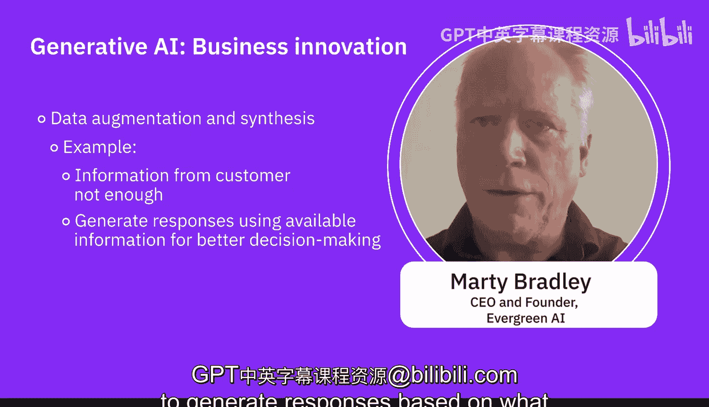

# 072：运用生成式AI推动业务创新 🚀

在本节课中，我们将聆听AI专家关于如何运用生成式AI推动业务创新的见解。专家们将分享多个行业的具体应用案例，并为企业如何开始实施生成式AI提供实用建议。

---

## 概述：从审视业务流程开始

专家指出，企业开始实施和应用生成式AI的最佳方式之一是审视自身的业务流程。思考业务中哪些环节可以通过生成式AI变得更好、更快、更经济。任何需要人力参与的环节，生成式AI通常都能以更优的方式完成。

生成式AI特别擅长创建大量演示文稿，进行系统性数据分析。组织可以利用它在数据科学和数据工程应用中创建更好、更具预测性的模式。这是因为所有技术和信息的民主化，即使你不了解具体模型，生成式AI也能提供现成的模型，供你针对特定任务进行复用和应用。

---

## 生成式AI的行业应用案例

以下是生成式AI在不同领域和行业的一些应用，包括但不限于以下方面：

**内容生成与个性化**
例如，营销机构可以利用这项技术策划个性化的营销活动，生成作为广告发送给最终用户的电子邮件内容，并根据客户信息对这些信息进行个性化定制。

**创意设计与视觉媒体**
例如，时尚零售商可以利用AI生成的图像和创意方式，为其设计创建图像和视频。

**产品创新与原型设计**
例如，汽车公司可以利用生成式AI创建一些3D模型并模拟其设计，以提升性能、优化设计，确保以最高效的方式加速汽车开发。

---

## 创新的商业应用场景

生成式AI能够支持广泛的创新商业构想。

**自动化内容创作**
可以生成网站文案、发布更多文章、制作高质量的营销内容、博客文章、社交媒体内容及更新。

**个性化客户体验**
客户提供信息后，你可以利用AI修改、编辑这些信息，赋予其积极的视角，帮助客户改进。

**自动化绩效反馈**
在语言模型和此类技术的使用方面，一个很好的应用是为执行特定任务的个人创建更好的反馈。生成式AI可以仅通过提供任何个人绩效的关键点来生成反馈。企业中许多人必须处理的这些琐碎活动，可以很容易地通过这些技术实现自动化，从而节省时间。

**设计与原型迭代**
生成式AI可以通过创建产品图像或设计的多个迭代版本，来加速设计过程。关键在于能够快速迭代。我们都讨论过将产品交到客户手中的最快方式。你希望迭代、修改、让他人查看并再次修改。利用生成式AI技术，你可以更快速地完成这一过程。

**自然语言处理**
客户服务平台可以利用生成式AI与最终用户进行交互式聊天。

**人工创造力与创新**
例如，建筑事务所可以利用AI生成的建筑设计，超越创造力的边界，帮助他们找到新的创新方式。

**预测分析**
通过应用生成式AI，例如，金融服务公司可以利用它来预测投资结果，优化投资组合和策略，从而增强公司的决策和风险管理能力。

**跨领域创新与协作**
例如，举办虚拟时装秀，就是时尚与科技之间的一次协作。

---

## 实践案例：提升客服效率

专家分享了一个实践案例。在Skills Network平台上，有数百万学习者，偶尔会出现问题，学习者会创建客服工单。即使问题不常发生，海量的学习者也会产生大量工单，处理起来相当困难。

他们实施了一个AI解决方案，利用生成式AI来解析以任何语言提交的工单文本。AI知道如何将问题与其他类似问题归类，甚至会重写问题描述，使其非常清晰。这样，当团队需要去解决问题时，就能准确知道问题所在，而无需阅读学习者提交的大段文字。这为他们节省了无数时间，并且实施起来极其容易。

---

## 实施建议与总结

寻找那些可以改进的领域，尤其是那些由人力完成的、可能单调重复的工作，这些是替代为生成式AI的绝佳候选。

组织可以通过多种方式受益并实现自动化。同时，创造性方面需要得到更多鼓励。例如，如果你想生成一份特定的PPT，你可以生成风格指南，但注意不要分享公司的私有或机密信息。你可以利用生成式AI，根据AI模型提出的方面和模式来修改PPT。

另一个经常被提及的建议是：审视你的工作流程和业务，决定工作流程中哪些步骤需要人力，哪些步骤可以由AI完成，哪些步骤可以委托给虚拟助手。

此外，还有数据增强与合成。假设你正在进行一项研究，从客户那里获得了一些信息，但这些信息不足以让你做出任何定量决策。你实际上可以使用生成式AI，根据从客户那里观察到的情况来生成更多的响应数据。

---

本节课中，我们一起学习了AI专家关于运用生成式AI推动业务创新的核心观点。关键点在于：从优化现有业务流程入手，识别可由AI提升效率的环节；生成式AI在内容创作、设计、客服、数据分析等多个领域都有广泛应用；实施时，应注重人机协作，将重复性工作自动化，同时利用AI增强而非完全取代人类的创造力。通过具体的行业案例和实践分享，我们可以看到，合理应用生成式AI能够显著提升效率、激发创新并优化决策。