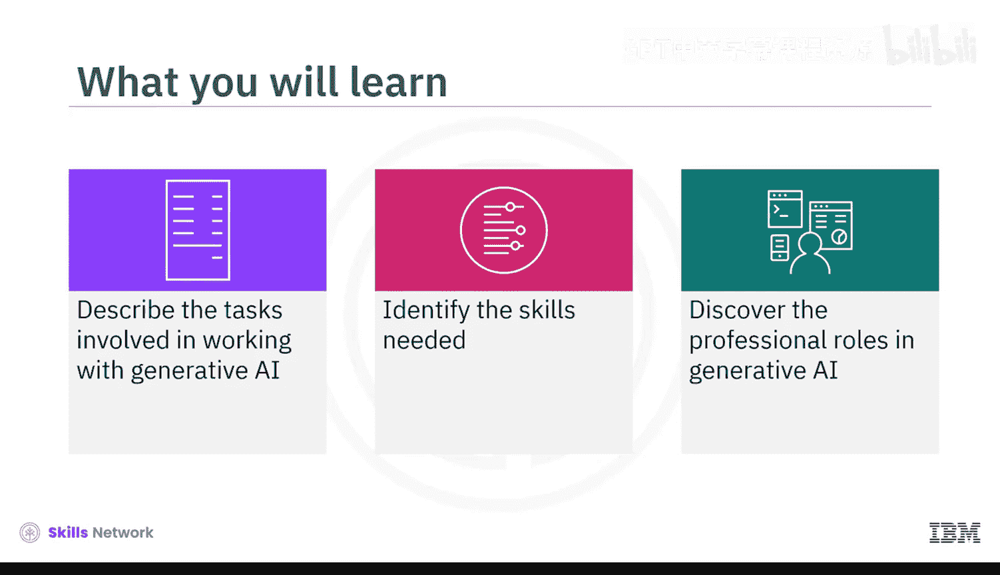
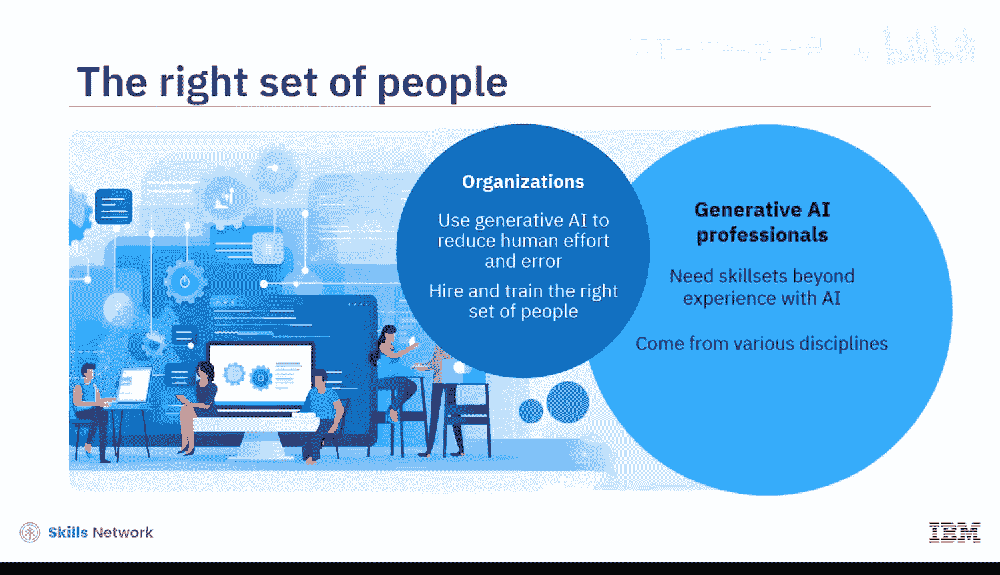
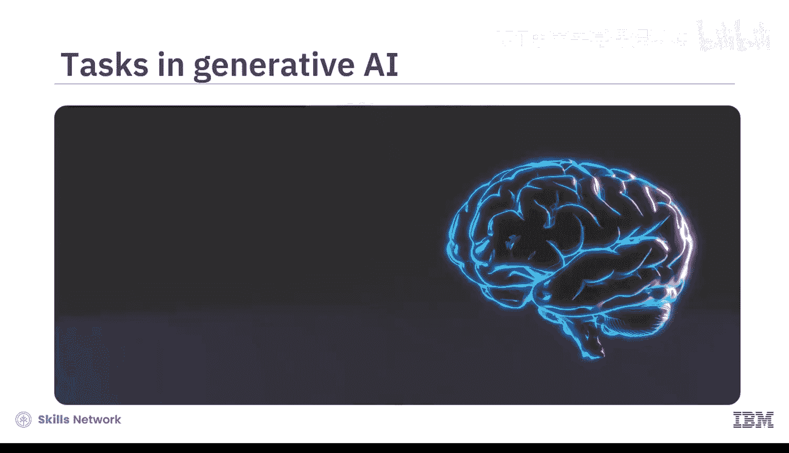
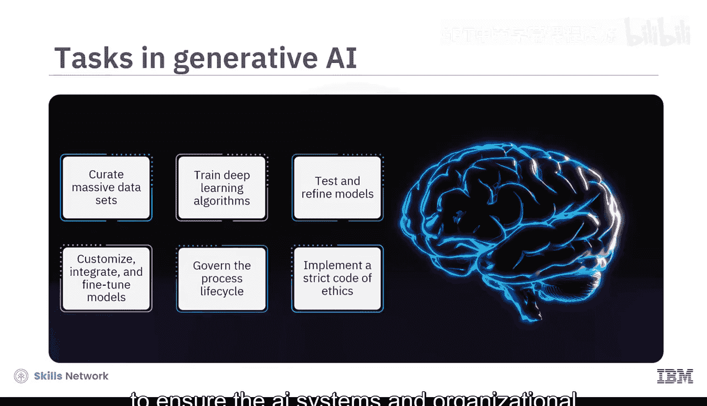
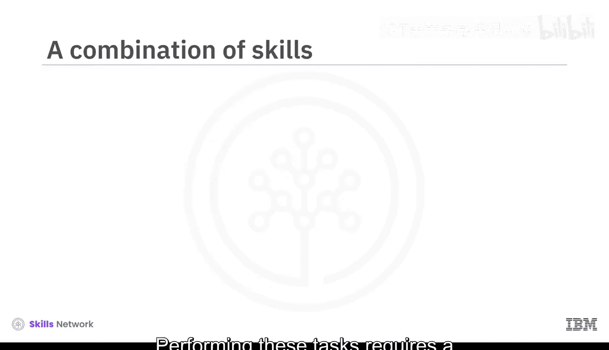
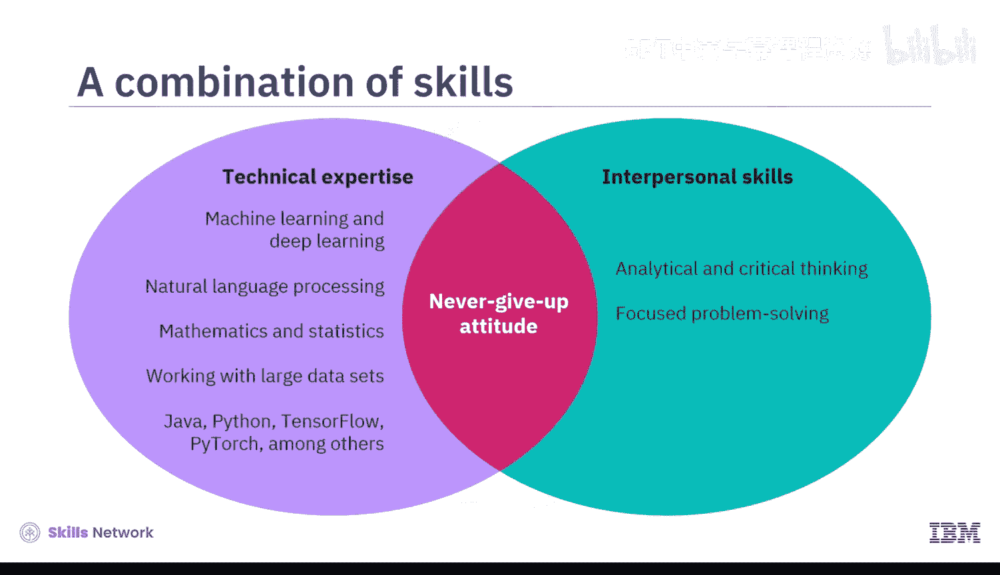
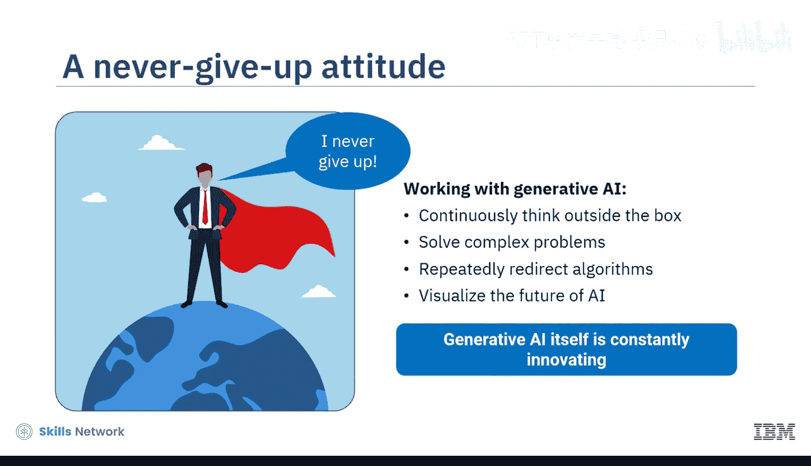
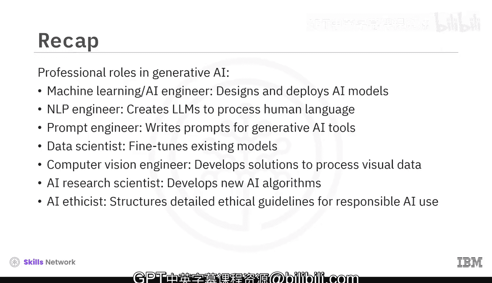

# 073：生成式AI领域的职业机遇 🚀

在本节课中，我们将探讨生成式AI领域的职业机遇。你将了解与生成式AI系统协作所涉及的任务、所需的核心技能，以及该领域内关键的专业角色。

组织使用生成式AI来减少人力投入和错误。然而，他们仍然需要雇佣和培训合适的人员来运用这项技术。这导致了AI专业人员的“重生”。与生成式AI系统协作所需的技能组合，已超越了单纯的AI经验。如今的AI专业人员来自不同学科，并根据其承担的具体任务扮演着多种角色。

## 核心任务概览

为了理解这些角色，我们首先需要了解在生成式AI领域工作的核心任务。

以下是构建和维护生成式AI系统所涉及的主要任务：

*   **数据管理与训练**：你需要策划海量数据集来训练深度学习算法。
*   **模型测试与优化**：你需要测试和优化生成式AI模型，甚至可能需要定制模型或将其与其他技术集成。这意味着需要通过整个生命周期过程对模型进行进一步的微调。
*   **治理与伦理**：你需要良好的治理机制，以确保AI系统和组织员工遵循严格的道德准则。

## 所需的关键技能

执行上述任务需要技术专长、人际交往能力和坚韧不拔的态度相结合。只有这样，AI专业人员才能成功地与生成式AI协作。

以下是成功所需的关键技能组合：

*   **技术专长**：机器学习、深度学习、自然语言处理、数学、统计学以及处理大型数据集方面的专业知识需求很高。建议掌握Java、Python、TensorFlow、PyTorch等编程语言的工作知识。
*   **软技能**：具备分析和批判性思维、专注的问题解决能力以及创新和创造力会很有帮助。
*   **坚韧不拔的态度**：为什么这是与生成式AI协作的关键方面？因为在此领域工作时，你必须持续跳出固有思维模式，解决复杂问题，反复调整算法，并展望这项技术的未来。生成式AI本身也在不断创新。因此，你必须做好充分的心理准备进入这个世界。

## 生成式AI领域的关键角色

现在，让我们来看看对生成式AI团队至关重要的具体角色。

以下是生成式AI领域中的一些核心专业角色：

*   **机器学习/AI工程师**
*   **自然语言处理工程师**
*   **提示工程师**
*   **数据科学家**
*   **计算机视觉工程师**
*   **AI研究科学家**
*   **AI伦理学家**

接下来，让我们通过一些虚构的人物来具体了解这些角色的日常工作。

**认识Eric，一位机器学习工程师。**
他拥有多年线性代数、统计学和计算机编程经验。他设计和实现用于实际应用的生成式AI模型。这包括数据获取、选择合适的机器学习算法、开发模型、测试其准确性并部署它们。

**认识Anita，一位自然语言处理工程师。**
她拥有强大的语言学和编程技能。她的工作是训练和构建大型语言模型来处理人类语言，就像ChatGPT这样的LLM。她设计模型以响应查询，并执行语音识别、机器翻译、情感分析、文本摘要和其他NLP任务。

**认识Jaffa教授，一位提示工程师。**
她曾在当地大学教授心理学，后来参加了一个NLP夜校课程。她最近开始担任提示工程师，她的职责是编写清晰、相关且具体的提示，以测试生成式AI模型将如何响应。一旦她理解了算法的“思考”方式，她就可以帮助组织消除AI系统中的算法偏见并设置防护栏。

**认识Manuel，一位数据科学家。**
他在数据分析、统计建模和机器学习技术方面拥有丰富经验。Manuel负责为特定目的微调现有模型。这包括策划用于训练基础模型的海量数据集。他运用自己的技能，在训练AI算法之前从数据中提取有价值的见解、模式和知识。

**认识Husseain，一位计算机视觉工程师。**
他拥有计算机科学学位，精通C++，并具备应用数学知识。他的工作是训练机器处理视频和图像，使它们能够使用生成式AI识别物体和人脸。他能够执行图像合成和风格迁移等任务。他的核心职责涉及研究和实施先进的计算机视觉技术，这需要经常与他人协作。

**认识Chen，一位AI研究科学家。**
他运用自己在数学、统计学和编程方面的专业知识来开发新的AI算法、模型和技术。他的工作需要持续关注前沿研究，并将其应用于解决复杂问题。

**认识Marianne，一位AI伦理学家。**
她兼具技术和非技术知识。她熟悉基础模型及其能力，同时也精通伦理理论和社会科学，并利用这些来评估生成式AI对社会的影响。她制定详细的指导方针和政策，以克服数据偏见、缺乏透明度和版权侵权等问题。她的重点是确保组织负责任地使用生成式AI。

## 总结

本节课中，我们一起学习了生成式AI领域的职业可能性。你深入了解了可以扮演的专业角色，例如机器学习/AI工程师、自然语言处理工程师、提示工程师、数据科学家、计算机视觉工程师、AI研究科学家和AI伦理学家。每个角色都需要独特的技能组合，并在构建、优化和负责任地部署生成式AI系统中发挥着至关重要的作用。