生成式AI基础：第五课：利用生成式AI提升职业发展 🚀

在本节课中，我们将学习生成式AI如何为不同领域的专业人士赋能，了解其核心优势、具体应用、潜在风险，并掌握将其融入工作的具体步骤。

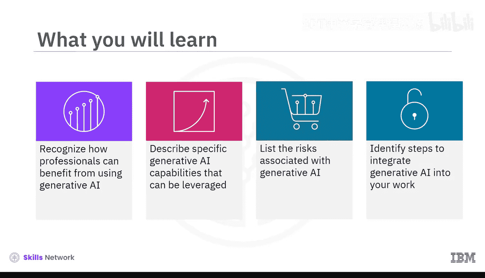

观看本视频后，你将能够：识别专业人士如何从使用生成式AI中受益；描述可被利用的具体生成式AI能力；列举与生成式AI相关的风险；并确定将生成式AI整合到工作中的步骤。

无论你身处哪个行业、哪个地区，扮演何种角色，生成式AI都能帮助你更快、更好地完成你所热爱的工作。你可以尝试免费的多领域大语言模型，或投资于特定领域的生成式AI工具。

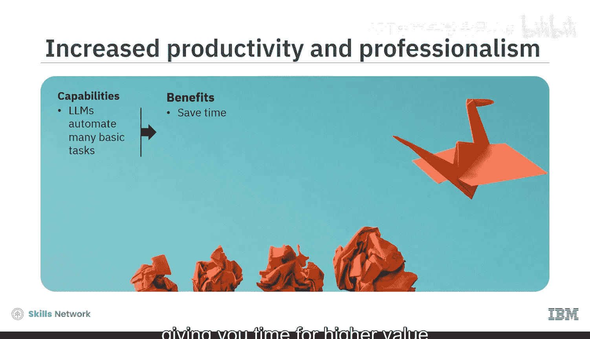

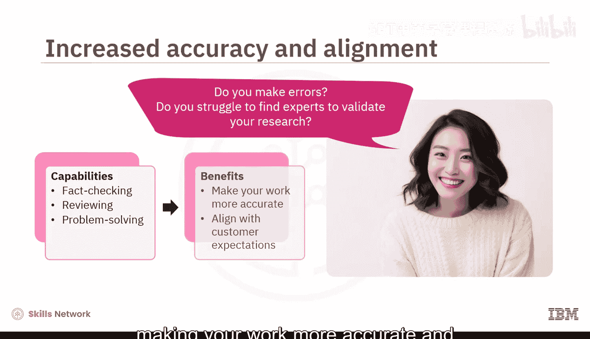

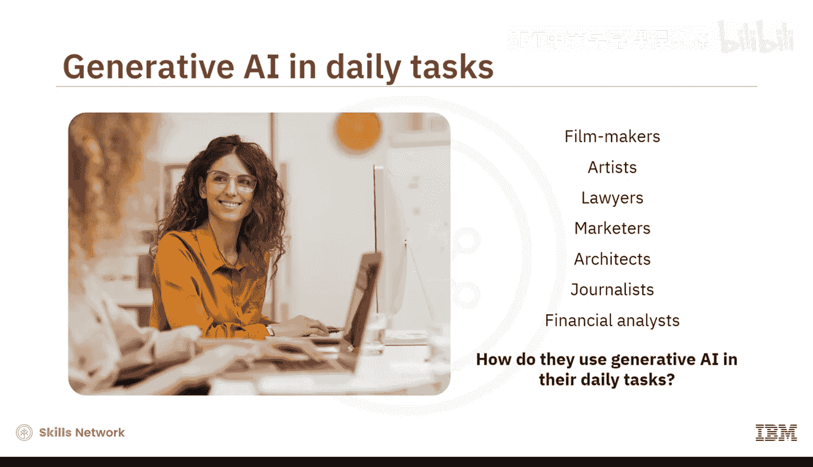

**生成式AI为专业人士带来三大核心益处：**
*   **提升实验与创新能力**：基础模型基于多学科数据训练，你可以通过提示词获取灵感或进行头脑风暴，用于创作视频、图像和演示文稿，甚至使用多种语言，从而提升工作的创造性与独特性。
*   **提升生产力与专业度**：大语言模型可以自动化许多基础任务，为你节省时间，专注于更高价值的决策和问题解决工作，从而提升工作时间的商业价值。
*   **提升准确性与一致性**：当我们工作陷入瓶颈或难以找到专家验证研究时，通过提出恰当的查询，大语言模型可以充当评审员、问题解决者和内容生成器，使你的工作更准确，更符合客户期望。

接下来，我们来看看不同领域的专业人士如何在日常工作中应用生成式AI。

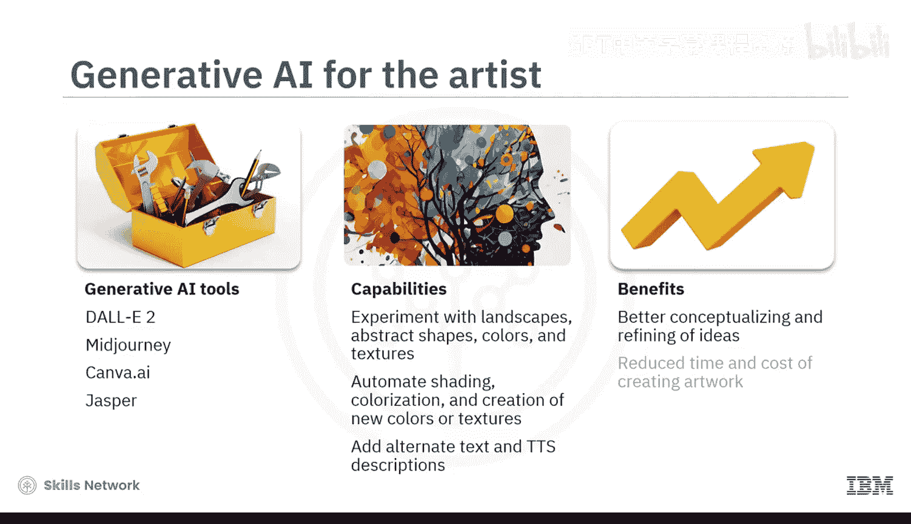

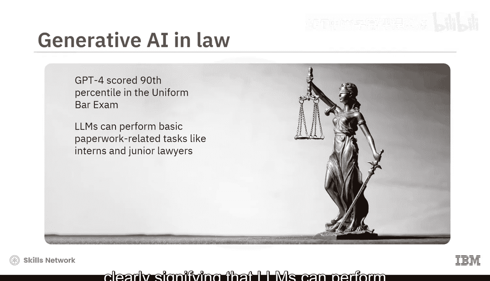

**以下是各行业专业人士使用的生成式AI工具示例：**

*   **电影制作人**：可使用Runway、Wonder Dynamics、Synthesia、Deep Brain AI和Metaphysic等工具，辅助剧本创作、内容本地化、预可视化、音效与视觉特效、剪辑与动态遮罩，从而提升叙事质量、优化制作流程并增强视觉创意。
*   **艺术家**：可使用DALL·E 2、Midjourney、Canva AI和Jasper等工具，尝试不同的风景、抽象形状、色彩与纹理；自动化阴影处理、着色和新色彩/纹理生成等基础流程；并为作品添加替代文本和语音描述以提升可访问性。这使得艺术家能更专注于概念构思与创意完善，同时降低创作的时间与成本。
*   **律师**：GPT-4在律师资格考试中取得了前90%的成绩，这表明大语言模型能像实习生和初级律师一样快速处理基础文书工作。律师可使用Casetext、Logikcull、Amto和Detangle AI等工具，通过生成式AI进行头脑风暴以获得不同视角；在语义层面自动比对合同与公司政策；并研究法律文档的模板与范例。这使得律师能更快地起草合同、通知和条款，从而腾出时间专注于战略谈判、客户获取与管理以及增值服务等高价值工作。
*   **市场营销人员**：可使用ChatGPT、Jasper、Salesforce的Einstein GPT、GPT-4驱动的Rapidly和Flick等工具，赋能营销策略并自动化工作流程。借此，他们能更深入地洞察客户行为，并创建更有效的帖子和在线营销活动。
*   **建筑师与工程师**：可使用Maket.ai、Finch和Tessellate Modulus等生成式AI工具，自动化整个建筑设计流程。它们还能基于承重能力、规范合规性或材料效率等特定参数生成数千种设计方案。这使得建筑师、施工工程师和室内设计师能够优化空间，创建可持续且高效的结构。
*   **新闻记者**：媒体机构与大语言模型存在共生关系。许多AI公司利用媒体档案训练其模型，而记者则使用生成式AI来提高文章的准确性与时效性，并增加用户参与度。例如，Longshot AI、Google Journalist Studio的Pinpoint和Descript等工具专为现代新闻业设计。记者利用生成式AI扫描文本以识别假新闻、误导性内容或歧视；总结并识别有新闻价值的内容；撰写内容可预测的文章（如讣告、体育更新或天气预报）；将文本转换为视频、信息图或插图；根据读者偏好生成个人新闻提醒；以及转录采访和文章以提升可访问性。
*   **金融分析师**：像Planful Predict AI、DataRails、FP&A Genius和Anaplan Plan IQ这类大语言模型专门针对财务数据进行训练，在数据共享、情感分析、新闻分类和集成任务方面非常有效。这使得分析师能够通过利用生成式AI来增强协作与生产力，并做出更明智的决策。

通过整合生成式AI，你的工作日将融合AI的生产力与人类的判断力。然而，其中也存在风险。

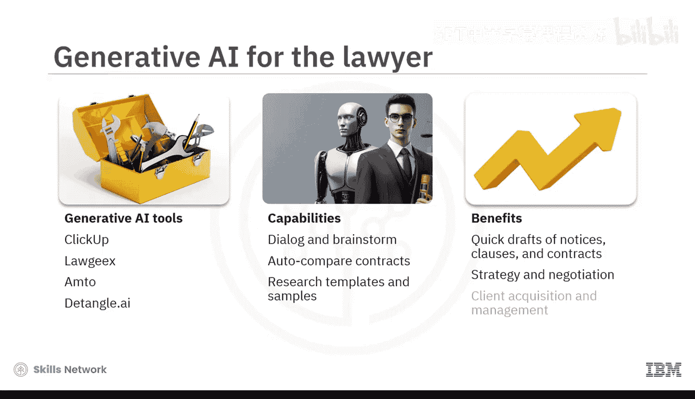

**以下是使用生成式AI时需要注意的主要风险：**
*   **版权与知识产权**：AI工具是否侵犯了专有数据的版权？机器生成的艺术品能否获得版权？你如何证明生成式AI应用未经同意复制了你的作品？
*   **输出不一致与“幻觉”**：大语言模型虽然强大，但对同一提示可能产生不同回应，存在算法偏见，并且经常产生“幻觉”（即生成不准确或虚构的内容）。

因此，建议仅将生成式AI用于创建初稿，然后用自己的话重写内容。只使用那些对你而言完全合理的生成元素。

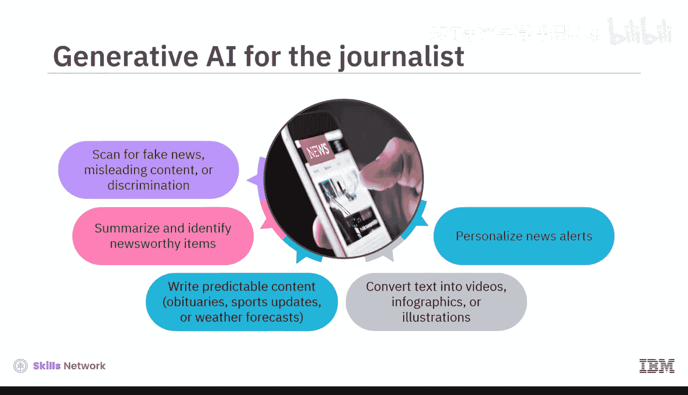

无论你从事何种职业，都可以从今天开始，通过以下五个步骤将生成式AI融入你的工作。

**以下是开始使用生成式AI的五个步骤：**
1.  **学习关键概念**：阅读人工智能的核心概念。
2.  **获取认证**：完成生成式AI相关课程并获得认证。
3.  **尝试免费工具**：动手实验免费可用的工具。
4.  **启动个人项目**：通过个人项目获得实践经验。
5.  **保持更新**：持续关注最新研究，因为生成式AI在不断发展，你也应随之进步。

**总结**

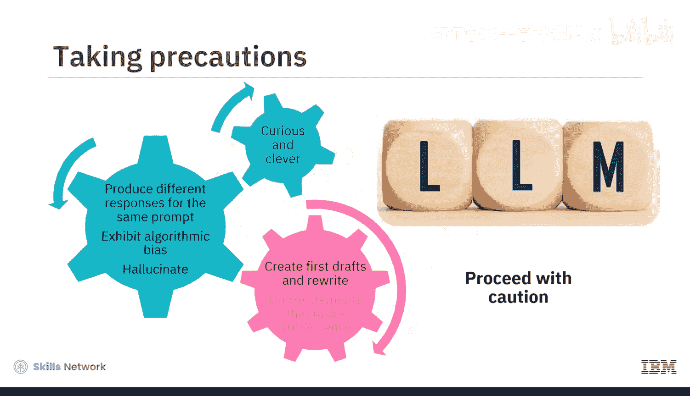

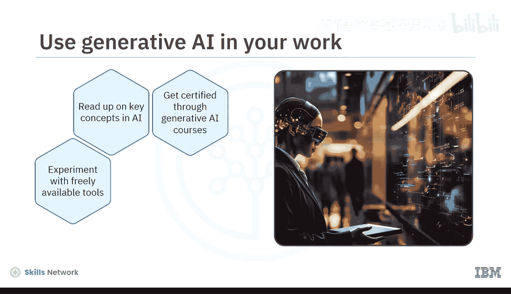

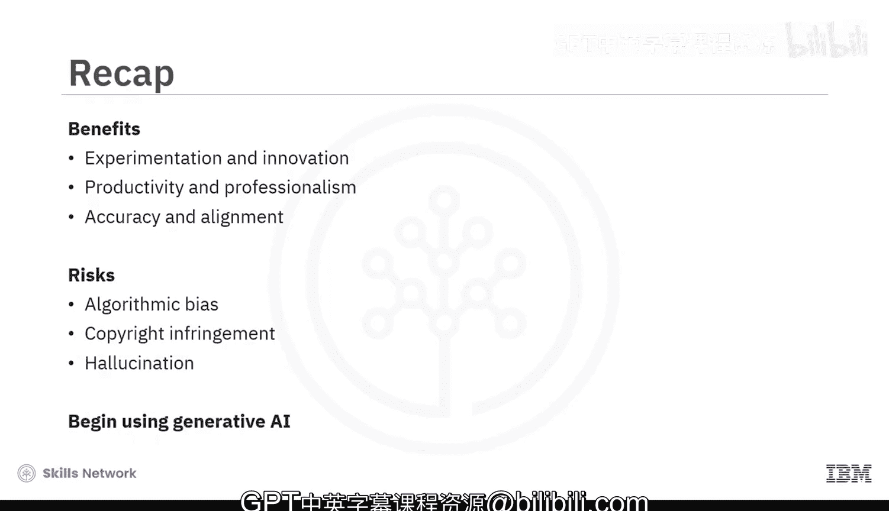

在本节课中，我们一起探讨了生成式AI如何提升你的实验与创新能力、生产力与专业度以及准确性与一致性。然而，使用时需保持谨慎，因为大语言模型可能表现出算法偏见、侵犯版权或产生“幻觉”。请按照步骤，循序渐进地将生成式AI融入你的工作。