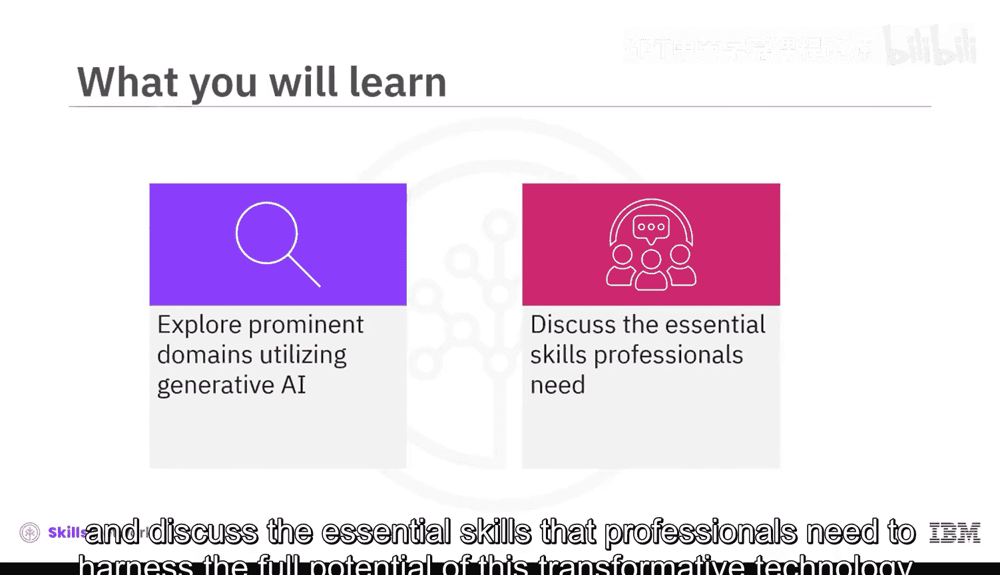
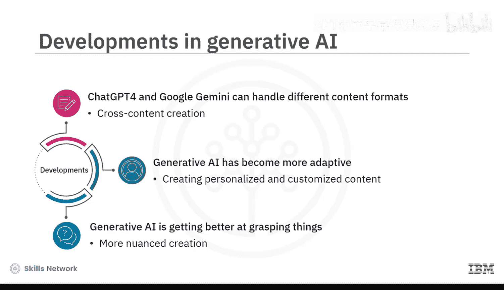
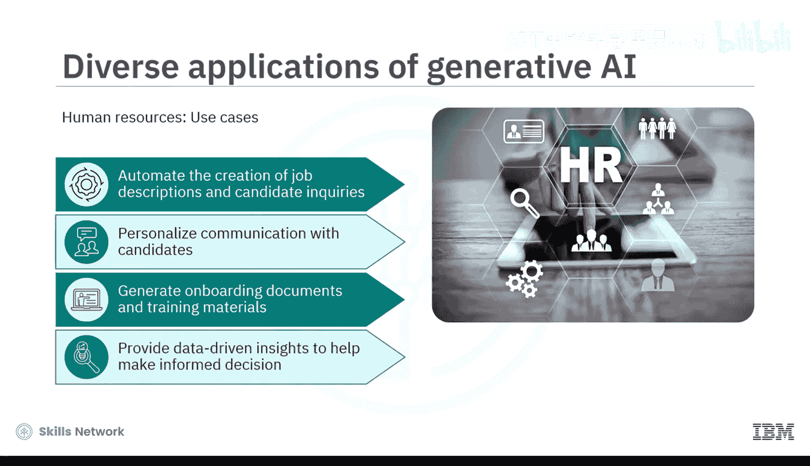
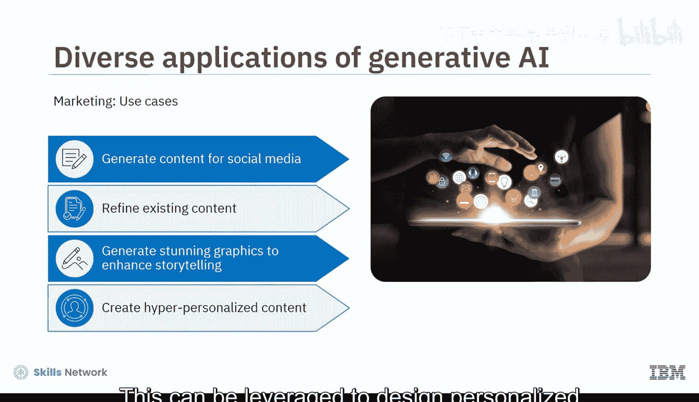
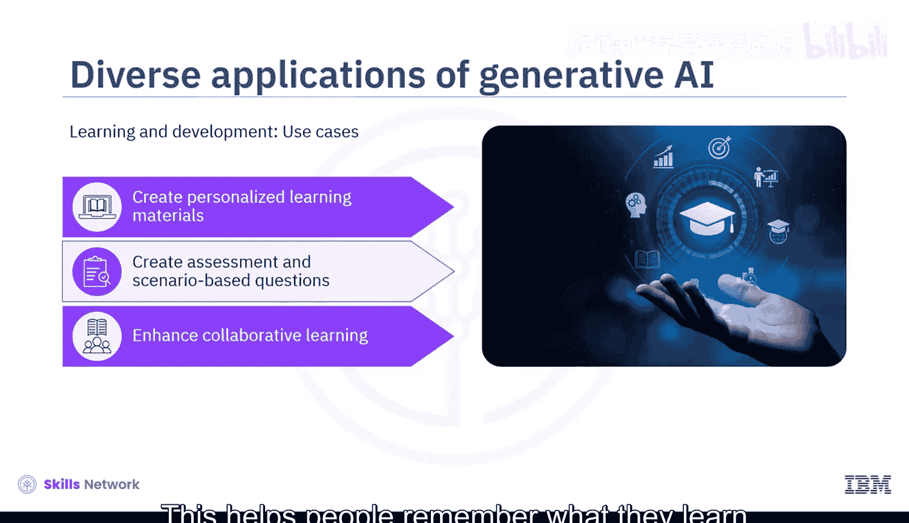
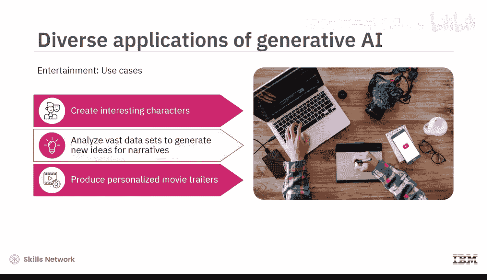
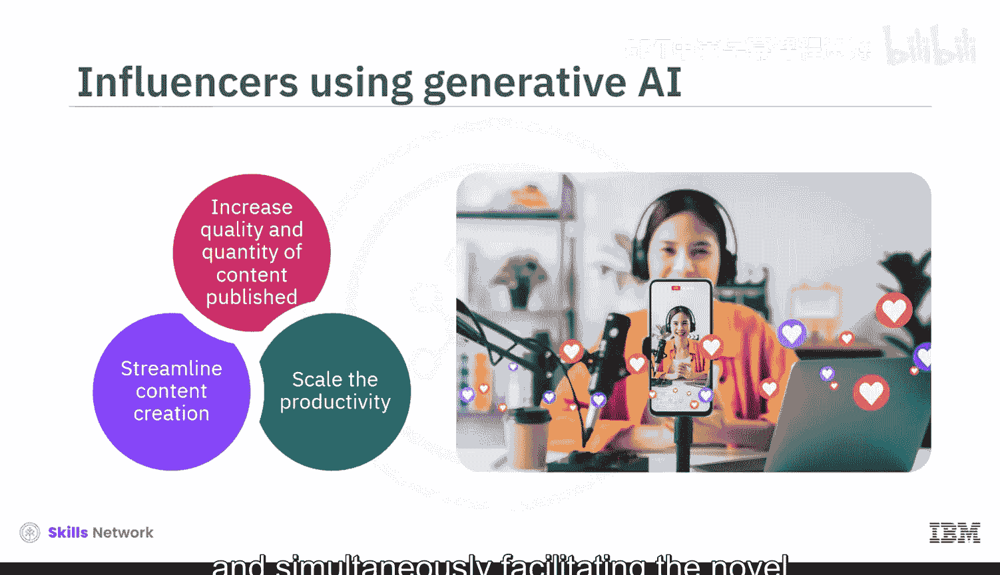
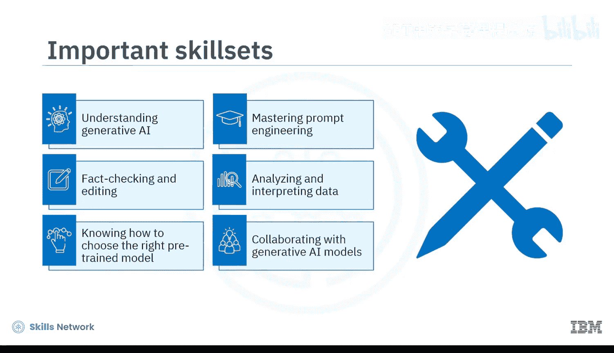
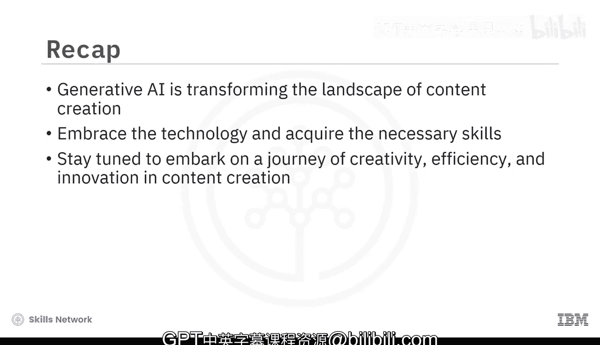

生成式AI基础：5.2：生成式AI在内容创作领域的应用 🎨

欢迎观看本视频。在本节课中，我们将探讨生成式AI在内容创作领域的几个主要应用场景，并讨论专业人士为充分发挥这项变革性技术的潜力所需掌握的关键技能。

内容创作已发展演变，并成为人力资源、市场营销、学习与发展、媒体制作、娱乐等多个领域的关键要素。生成式AI通过提供诸多益处，正在改变内容创作，例如：**提高效率**、**生成独特创新内容**、**创建个性化内容**以及**提供数据驱动的洞察**。

以下是社交媒体管理平台Hootsuite进行的一项调查数据，突显了生成式AI在各领域内容创作者中日益增长的人气。

*   根据调查，23%的美国作家使用生成式AI来保持良好的语法或生成情节构思和角色。
*   此外，57.1%的营销人员使用生成式AI工具来创建博客、白皮书等长篇内容。
*   同时，55.4%的营销人员用它来撰写社交媒体帖子和产品描述等短篇内容。
*   另一份来自Seo AI的报告指出，17%的受访者确认在人力资源部门的招聘流程中使用生成式AI工具。

生成式AI在内容创作者中的普及度正随着不断涌现的激动人心的进展而演变。例如，像ChatGPT-4和Google Gemini这样的多模态模型能够无缝处理图像、代码和音频等不同格式。这为跨内容创作开辟了可能性，例如基于一幅画生成剧本，或生成配有相关图像或视觉场景的叙事。

生成式AI已变得更加适应性强，能够迎合特定的风格、语调和目标受众。这使创作者能够创建个性化和定制化的内容，例如个性化文章、学习教程和产品推荐。有趣的是，生成式AI正变得更擅长理解事物背后的“原因”，从而创造出更细致入微的作品，尤其是在教育材料领域。

作为内容创作者，考虑将生成式AI整合到日常工作中，以在竞争中保持领先。接下来，让我们探索生成式AI在不同领域内容创作中的一些应用。

**人力资源领域**

在人力资源领域，生成式AI可以自动创建职位描述和候选人问询。它可以个性化与候选人的沟通，分享有针对性的信息，定制面试问题，并根据候选人的偏好和经验提供相关信息。它可以生成入职文件和培训材料。AI驱动的聊天机器人可提供即时的人力资源相关支持，回答员工关于福利、薪资或政策的疑问。生成式AI可以从员工数据中提供可操作的洞察，使人力资源专业人员能够就人才管理、劳动力规划和员工敬业度策略做出决策。

以下是一些有助于执行上述任务的生成式AI模型和工具：**OpenAI的GPT系列**、**Google的Smart Compose**和**WriteSonic**。

**市场营销领域**

在市场营销领域，有多种生成式AI工具可供使用，例如**Jasper**、**Copy.ai**或**WriteSonic**，用于自动化内容创作，从而节省时间和精力。这些工具可以创建社交媒体帖子和博客，为营销活动撰写电子邮件，并生成各种其他内容草稿，供人类营销人员完善和个性化。

生成式AI还可以通过提供有价值的洞察和改进建议来优化现有内容。借助生成式AI的多模态能力，营销人员可以生成令人惊叹的视觉效果，包括图形、AI艺术形式和视频，以增强他们的故事叙述、创建引人注目的社交媒体帖子或制作视觉上吸引人的演示文稿。

像GPT-4这样的生成式AI模型可以通过分析数据集并根据个人偏好和行为定制内容来创建超个性化内容。这可用于为目标公司设计个性化营销活动。

**学习与发展领域**

在学习与发展领域，生成式AI正使学习变得更加个性化。它通过分析学生的个人资料，了解他们的兴趣和已有知识来实现这一点。例如，如果一名学生通过音频课程比阅读更能理解事物，那么AI可能会推荐更多与其兴趣和先验知识相匹配的音频资源。

生成式AI还可以为在线平台创建评估和基于场景的模拟问题。这些资源有助于检查学习者对知识的理解程度以及他们具备的技能。它还可以通过创建有趣的讨论话题、引人入胜的案例研究和共同解决问题的活动来增强在线平台上的协作学习。这有助于人们记住所学内容，并鼓励他们进行批判性思考。

**娱乐领域**

在娱乐领域，生成式AI可用于为视频游戏、动画或虚拟世界创造有趣的角色。它可以分析来自电影、剧本和观众偏好的海量数据集，为叙事生成新想法，从而产生更具吸引力和针对性的内容。IBM Watson已被用于分析电影内容并制作电影预告片，包括最具吸引力和最激动人心的场景。另一方面，Netflix正在使用生成式AI来开发迎合个人偏好的个性化电影预告片。

生成式AI也通过简化内容创作、个性化和自动化社交媒体互动以及推动数据驱动的合作，对创作者或网红经济产生了巨大影响。它提高了在YouTube、TikTok和Instagram等平台上发布内容的质量和数量标准。生成式AI在内容创作中的辅助作用正在赋能市场上新兴的新一代内容创作者，同时帮助现有创作者扩大他们的发布规模。

接下来，让我们讨论专业人士为充分发挥这项技术的潜力应具备的重要技能。

*   **熟悉AI模型**：熟悉不同的生成式AI模型、它们的能力、局限性和最佳实践，对于最有效地使用它们非常重要。
*   **提示工程**：提示工程是设计引导AI模型生成所需内容的提示的实践。掌握提示工程是从AI工具获得最佳响应的关键。
*   **编辑与事实核查**：确保AI生成内容的准确性通常需要仔细的编辑和事实核查。
*   **数据分析**：理解如何分析AI工具生成的数据可以帮助你优化提示、跟踪内容表现并找出改进领域。
*   **模型选择与微调**：知道如何选择合适的预训练模型并对生成的输出进行微调也很有价值。
*   **创造性协作**：与生成式AI模型进行创造性协作是一个好方法。内容创作者应将AI建议整合到他们的工作中，并进行完善以符合他们的创意愿景。

在本视频中，我们学习了生成式AI正在改变人力资源、市场营销、学习与设计、娱乐等多个领域的内容创作格局。该模型还通过简化内容创作影响了创作者或网红经济。随着内容创作者拥抱这项技术，掌握必要的技能并利用正确的工具将是释放其全部潜力的关键。通过理解生成式AI的多样化应用，专业人士可以在内容创作中开启一段充满创意、效率和创新的旅程。准备好用生成式AI释放你的创造力吧。