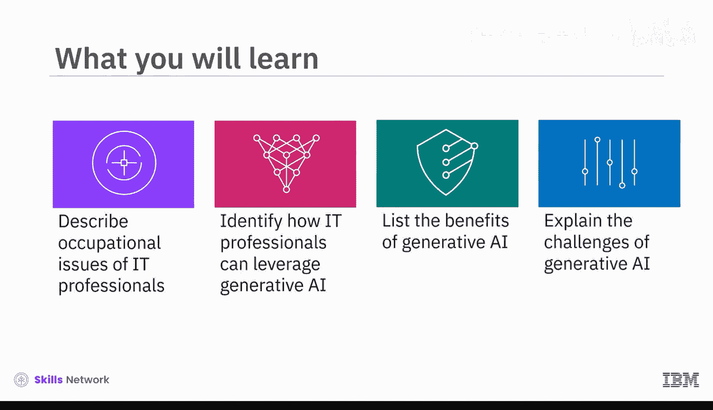
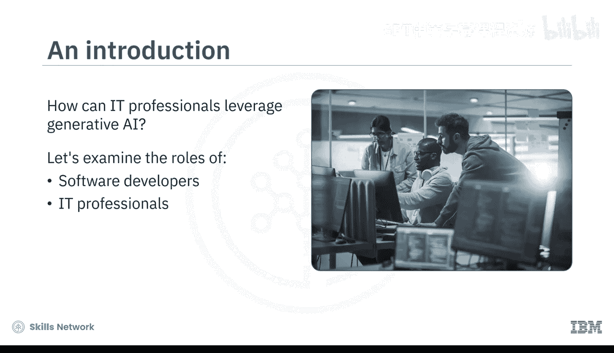
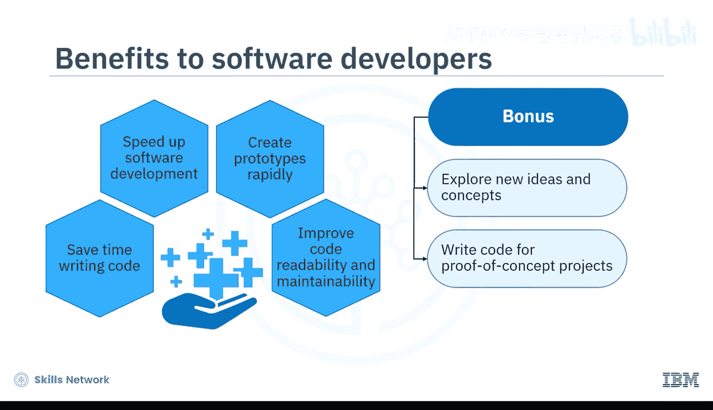
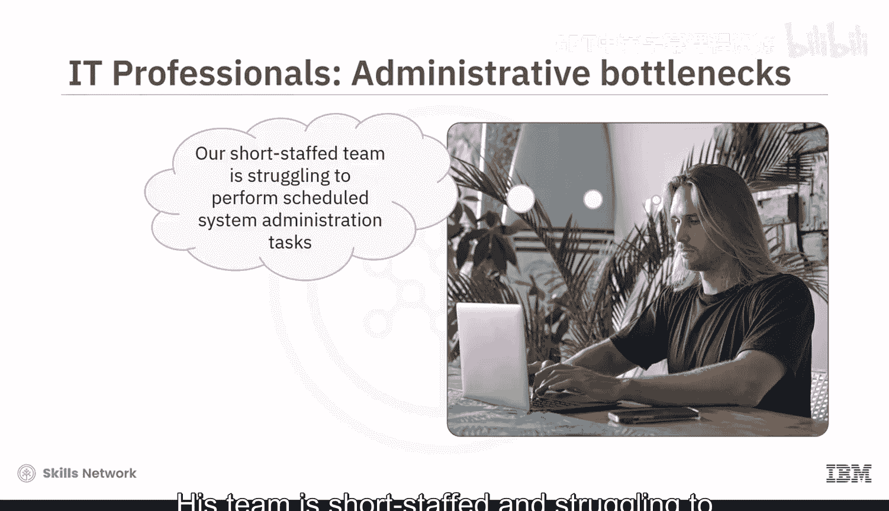
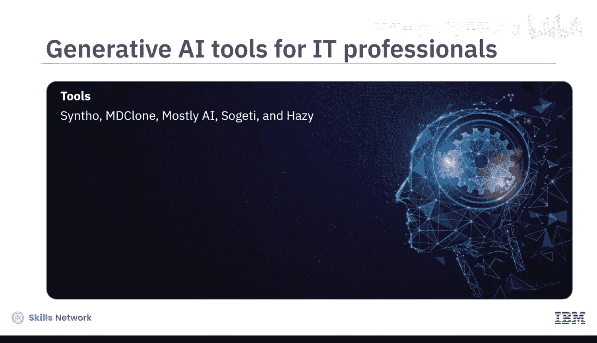
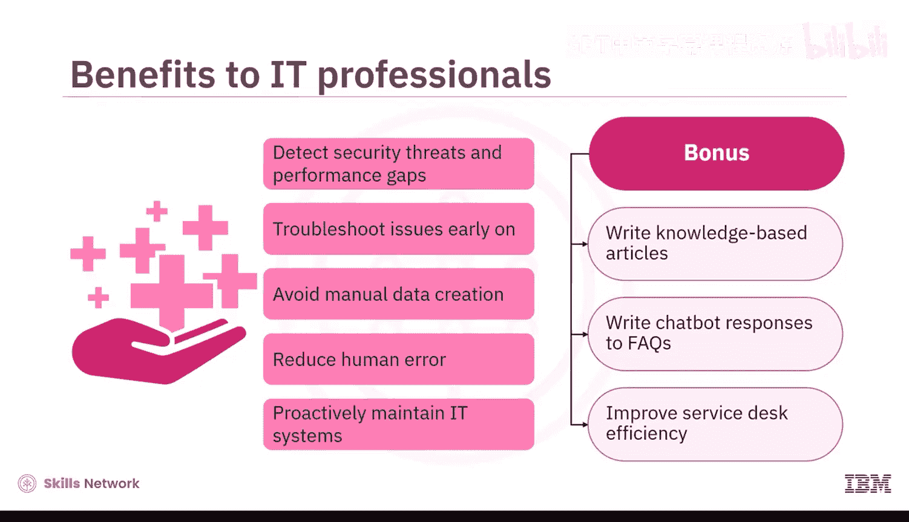
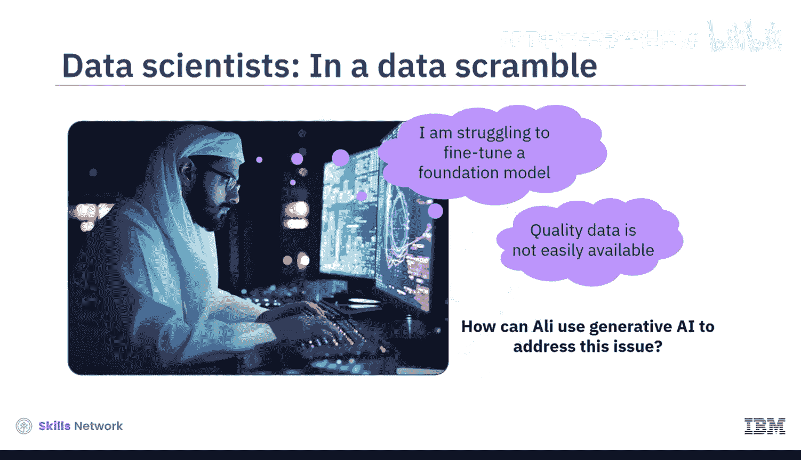
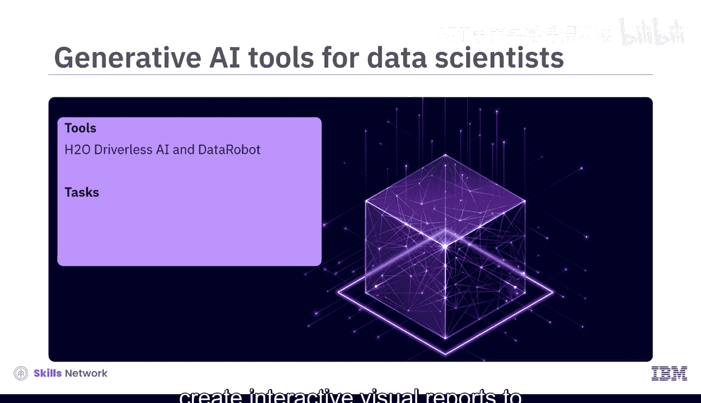
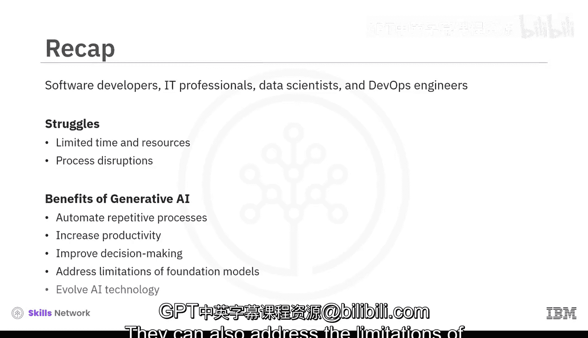

# 076：生成式AI在IT专业领域的应用 🚀

在本节课中，我们将学习生成式人工智能（Generative AI）如何应用于信息技术（IT）领域的各个专业角色。我们将了解软件开发者、IT专业人员、数据科学家和DevOps工程师如何利用生成式AI工具来解决工作中的常见挑战，提升效率与创造力。

---

## 软件开发者如何应用生成式AI 💻

上一节我们介绍了课程概述，本节中我们来看看软件开发者如何借助生成式AI。软件开发者常面临编写重复代码、调试和文档撰写等耗时任务。

生成式AI工具，如 **OpenAI Codex**、**Microsoft Copilot**、**GitHub Copilot**、**Tabnine** 和 **Kite**，能够：
*   生成样板代码。
*   为重复代码段建议补全。
*   根据自然语言提示生成代码片段。

开发者可以利用这些工具分析代码变更、修复简单漏洞，并在代码审查过程中识别潜在问题。例如：
*   **Visual Studio Live Share** 可创建结对编程会话，工具作为编程伙伴实时帮助捕获错误。
*   **Diffblue Cover** 能生成测试用例，以实现更广泛、高效的测试。
*   **Sphinx** 可根据自然语言描述，为代码和系统生成文档。

通过使用生成式AI，软件开发者可以节省编码时间、加速软件开发、快速创建原型，并提高代码的可读性和可维护性。这使他们能将精力从修复重复性代码缺陷转向探索新想法，例如利用生成式AI编写概念验证项目的代码或尝试不同的问题解决方法。

---

## IT专业人员如何应用生成式AI 🛠️

了解了软件开发者的应用场景后，我们转向IT专业人员。他们常面临人手不足、需处理大量例行系统管理任务的挑战。

生成式AI工具，如 **Rundeck**、**Ansible** 和 **Terraform**，能够：
*   为系统管理、配置管理、用户配置、安全补丁等例行任务自动生成代码。
*   **Elasticsearch**、**Logstash** 和 **Kibana** 可识别系统日志中的模式、异常和潜在问题。
*   **Synthetic Data**、**CloneOne**、**Mostly AI**、**Sogeti** 和 **Hazy** 能生成合成测试数据，用于系统预训练。

通过使用生成式AI，IT专业人员可以更早地检测安全威胁和性能差距、排查问题、避免手动创建数据、减少人为错误，并主动维护IT系统。此外，他们还可以利用生成式AI撰写知识库文章和聊天机器人对常见问题的回复，从而提高服务台的效率。

---

## 数据科学家如何应用生成式AI 📊

接下来，我们探讨数据科学家如何应用生成式AI。他们常遇到高质量数据稀缺、数据清洗和特征工程繁琐等问题。

生成式AI工具，如 **Google AI Platform**、**Vertex AI**、**Amazon SageMaker** 和 **Microsoft Azure Machine Learning**，能够：
*   通过在合成数据集上训练和测试AI模型来克服数据稀缺问题。
*   为数据清洗和预处理任务生成代码。
*   根据数据建议并生成特征。
*   **H2O Driverless AI** 和 **DataRobot** 可创建交互式可视化报告，以传达复杂的数据洞察。

通过使用生成式AI，数据科学家可以提高模型微调过程的效率和预训练数据的质量，从而帮助他们做出更明智的决策并节省时间。他们甚至可以利用生成式AI来构思新功能或从现有数据中捕捉洞察。

---

## DevOps工程师如何应用生成式AI ⚙️

最后，我们来看看DevOps工程师的应用。他们负责管理持续集成和持续部署（CI/CD）流水线，确保应用交付的顺畅与可靠。

生成式AI工具，如 **Jenkins**、**GitLab CI/CD** 和 **CircleCI**，能够：
*   自动化CI/CD流水线的各个阶段，例如自动生成测试用例并部署应用。
*   发出警报并提供洞察，以改进监控和故障排除。
*   建议优化基于云环境的基础设施的代码。
*   **Terraform** 可自动化生成基础设施即代码（IaC）脚本。

通过使用生成式AI，DevOps工程师可以促进基础设施管理、自动化测试和部署，并加速软件发布周期。这有助于他们确保自动化流程的可靠性和安全性。

---

## 使用生成式AI的挑战与应对 🧐

尽管生成式AI带来了诸多好处，但其模型也存在一系列风险，包括：
*   **高昂的图形处理器（GPU）成本**
*   **算法偏见**
*   **可能的滥用**
*   **缺乏透明度**
*   **数据安全措施不足**
*   **版权侵权问题**
*   **应用缺乏监管**

IT专业人员通过积极实践生成式AI，可以主动应对这些已知和未知的限制，帮助改进基础模型的能力。这将进一步有助于提升他们自身的生产力和创造力。

---

## 总结 📝

本节课中，我们一起学习了软件开发者、IT专业人员、数据科学家和DevOps工程师如何应对时间有限、资源不足和流程中断等挑战。通过使用生成式AI工具，他们能够自动化重复性流程，从而提高生产力并改善决策。同时，他们也能通过应对基础模型的局限性，助力AI技术的不断演进。