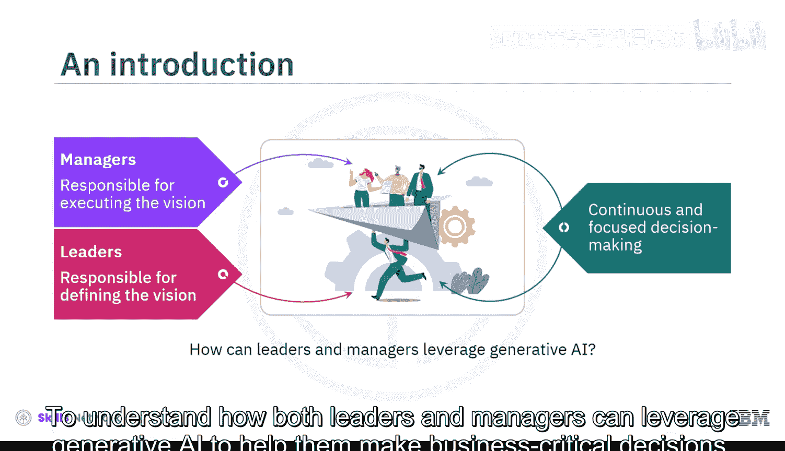
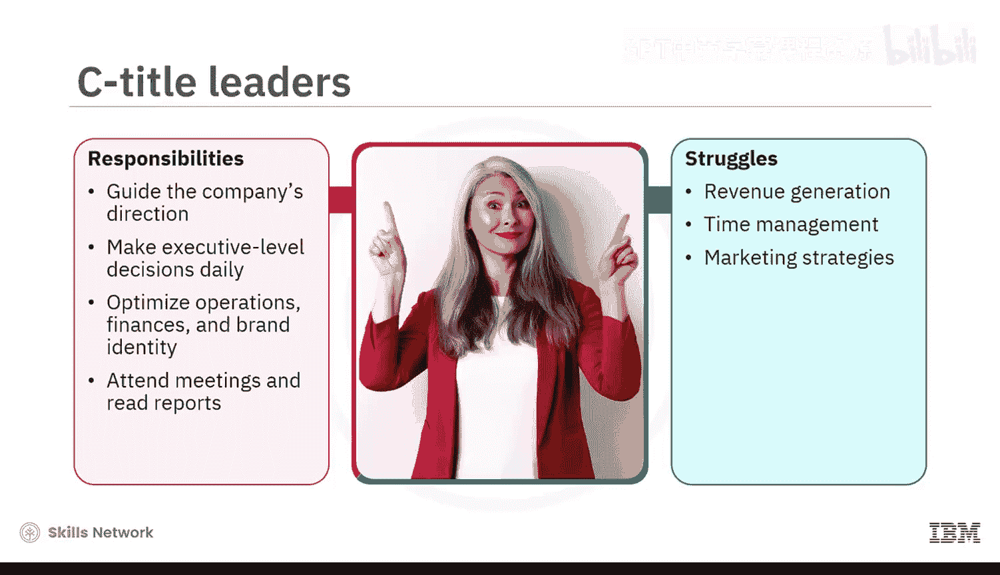
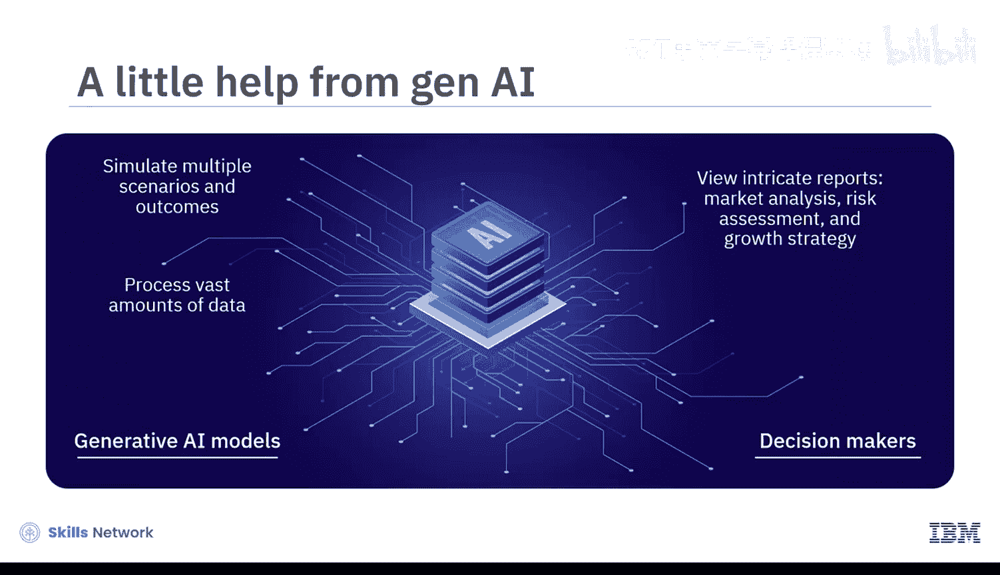
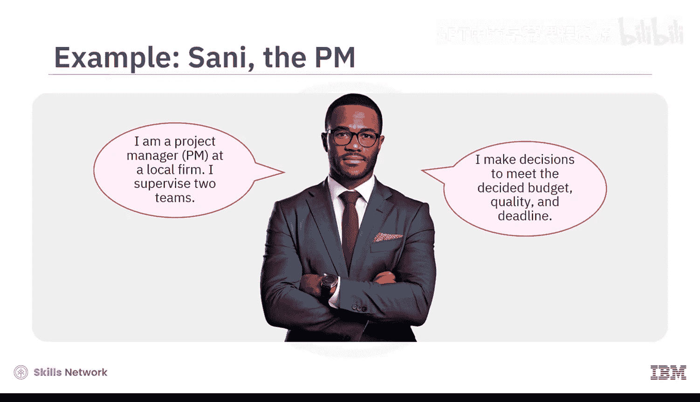
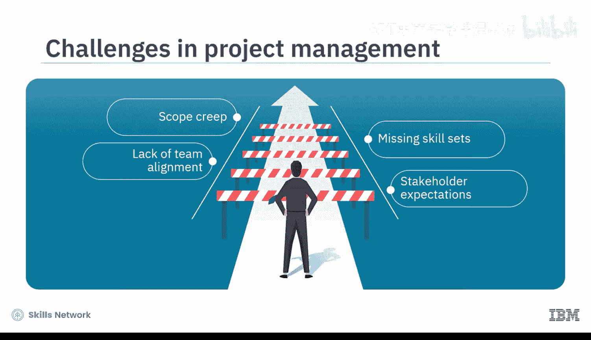
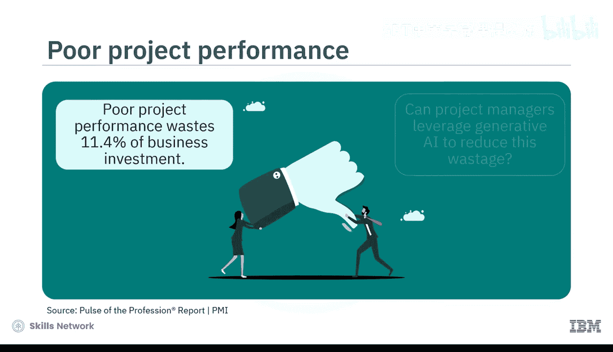
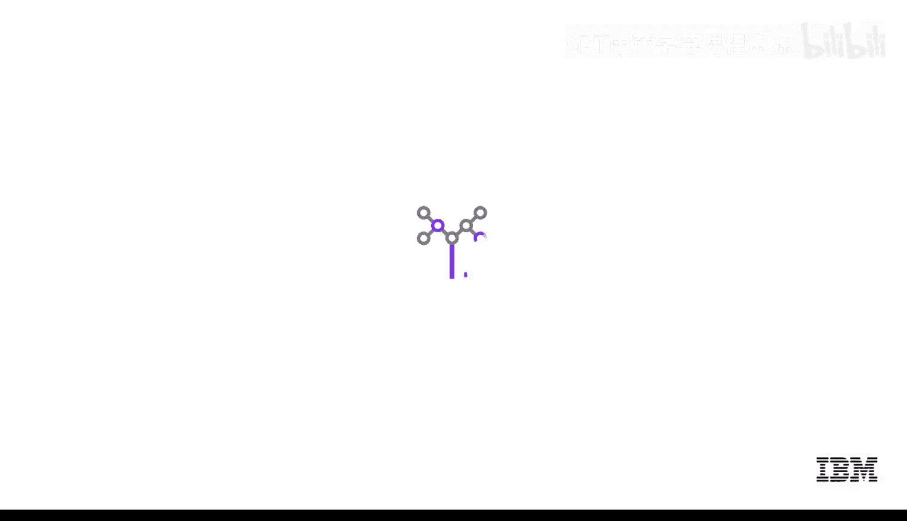

# 077：生成式AI在领导力与管理领域的应用 🧭

在本节课中，我们将探讨生成式AI如何赋能领导者与管理者。我们将了解这两个角色的核心任务与挑战，并学习他们可以如何利用生成式AI的能力来优化决策、提升效率，从而为组织创造价值。

## 领导者的角色与挑战

上一节我们概述了课程目标，本节中我们来看看领导者的具体职责。领导者负责定义组织的愿景，而管理者则负责执行该愿景。这两个角色都需要持续且专注的决策。

领导者面临着一项关键责任：引导公司朝着正确的方向前进。这包括每天做出执行层面的决策，以优化组织的运营、财务和品牌形象。尽管领导者花费大量时间参加会议和阅读报告，他们仍然在收入增长、时间管理、营销策略和领导义务方面面临挑战。

## 生成式AI如何帮助领导者

面对这些挑战，生成式AI可以提供有力支持。生成式AI模型能够处理海量数据并模拟多种场景与结果。这使得决策者能够查看关于市场分析、风险评估和增长策略的复杂报告，并提前可视化其决策的影响。

通过使用生成式AI工具，领导者可以采用一种全新的问题解决和决策方法，这有助于提升人员效能和利润。当组织愿景明确时，管理者就能专注于交付成果。

## 管理者的角色与挑战

接下来，我们转向管理者的视角。管理者需要每天做出决策，以确保项目符合既定的预算、质量和截止日期。然而，项目管理本身伴随着诸多挑战，例如范围蔓延、技能缺失、团队目标不一致、利益相关者期望以及沟通不畅。

根据项目管理协会的数据，由于项目绩效不佳，高达11.4%的商业投资被浪费。管理者能否利用生成式AI来减少这种浪费呢？

## 生成式AI如何帮助管理者

答案是肯定的。生成式AI工具可以自动化重复性任务，例如规划、日程安排、沟通、资源分配以及跟踪与报告。例如，它们可以：
*   创建文档和可视化数据报告。
*   根据团队成员的技能分配所有项目任务。
*   提供实时反馈、警报和建议。

有了这些输入，项目经理就能够做出数据驱动的决策，识别瓶颈并降低风险。具体而言，他们可以：
*   投资于构思和创新。
*   让利益相关者参与早期问题解决。
*   监控和控制项目进度。

## 成功采用生成式AI的步骤

最后，我们探讨如何将生成式AI整合到工作流程中。虽然无需急于在短期内投资过多AI，但为了成功采用AI，有必要了解如何与生成式AI协作，并将其负责任地整合到工作场所和流程中。

以下是您可以考虑的四个步骤：
*   **协作**：领导者应争取管理者、员工、利益相关者和顾问的支持，无需独自做出决定。
*   **优先排序**：确定您希望首先解决的业务问题是什么。
*   **验证**：验证AI模型生成的数据的准确性及其与公司价值观的一致性。
*   **决策**：决定使用什么数据以及何时使用。生成式AI模型会分析、整理和可视化数据，但领导者和管理者必须运用他们的经验、社交智慧和创造力来决定如何使用这些数据。

## 总结

本节课中，我们一起学习了生成式AI如何帮助领导者模拟多种场景，从而提前预判结果并以不同方式处理问题。同时，它也通过任务自动化帮助管理者控制项目进度，使其在规划、调度、沟通、资源分配以及跟踪报告方面更高效。为了实现成功的AI应用，业务团队应遵循协作、优先排序、验证和决策的步骤，并充分发挥自身的经验、社交智慧和创造力。