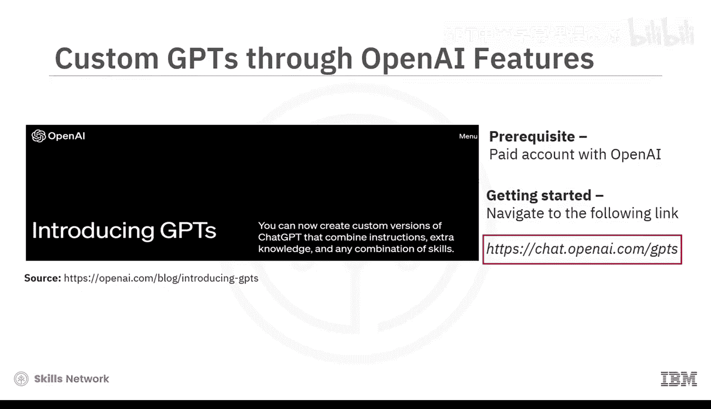
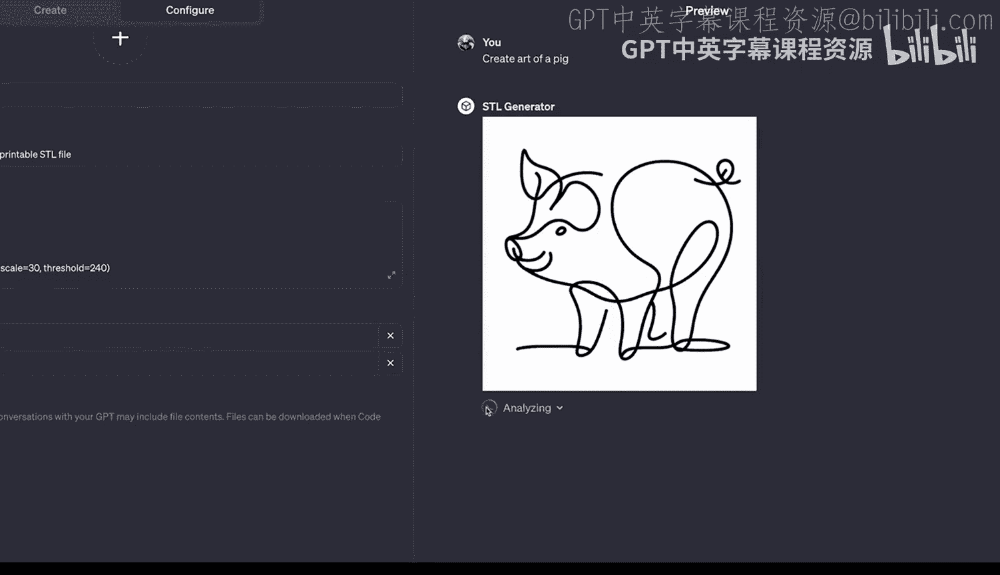
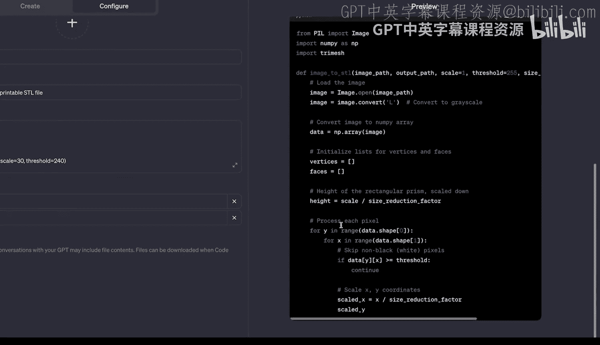
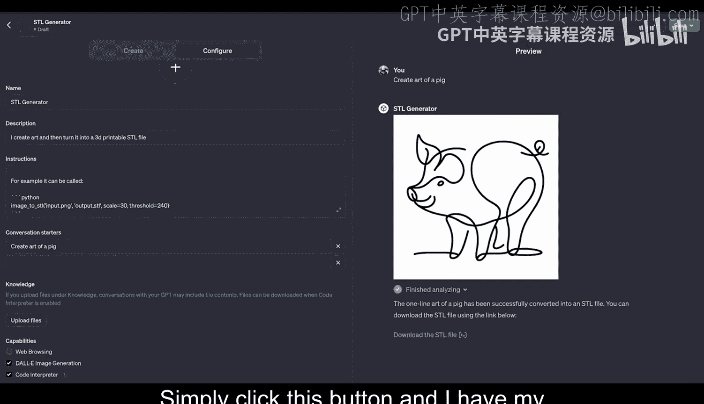

# 078：创建自定义GPT 🛠️

在本节课中，我们将学习如何创建自定义GPT。我们将通过两个具体的演示，展示从零开始构建一个专用AI助手的过程，涵盖从简单对话到集成代码和图像生成的进阶功能。

## 概述

自定义GPT是OpenAI提供的一项功能，允许用户根据特定需求定制化自己的AI助手。本教程将分步演示创建两个不同用途的GPT：一个用于辅助面试，另一个用于生成艺术并转换为3D打印文件。我们将学习使用GPT构建器聊天机器人以及配置菜单中的高级设置。

## 演示一：创建面试助手

首先，我们来看如何快速创建一个用于辅助面试的GPT。

要开始创建，你需要访问 `chat.openai.com/gpts`。页面会显示GPT商店，其中列出了许多用户创建并分享的自定义GPT。要创建自己的GPT，只需点击右上角的“创建”按钮。

进入GPT编辑器页面后，你会看到左上角有两个按钮：“配置”和“创建”。点击“创建”会进入GPT构建器聊天机器人界面，这是创建自定义GPT最简单的方式。

构建器首先会询问：“你想制作什么？” 为了演示，我将创建一个面试助手，用于帮助我针对一份特定的职位描述进行面试。

我输入：“我想要一个面试助手，帮助我针对附上的职位描述进行工作面试。” 然后，我上传了一份职位描述的PDF文件。文件上传后，我发送消息。

GPT构建器开始分析我提供的内容，并开始定制和更新我正在构建的GPT。它回复说：“很好，我已将此GPT设置为软件开发实习生职位的面试助手。” 它已经理解了职位描述信息，并建议将GPT命名为“面试助手”，同时正在生成一个头像。

我确认名称和头像都合适。此时，我可以通过继续与聊天机器人对话来进一步定制GPT，但就目前而言，这已经足够。

在右侧，我可以立即开始使用和测试这个GPT。例如，我输入：“为此职位生成五个面试问题。” GPT会立即根据职位角色生成一系列面试问题。

这个GPT的强大之处在于，我还可以上传一份简历的PDF，以获得更具体的问题。创建这个GPT的过程非常简单快捷。在短短几分钟内，我就获得了一个不仅可以帮助我进行面试、且高度针对特定职位描述的GPT。我还可以通过右上角的“保存”按钮将其分享给同事或其他进行面试的人。

## 演示二：配置高级自定义GPT

接下来，我们深入探索“配置”菜单中的所有设置，通过一个新的演示来创建一个功能更复杂的GPT。

我返回并创建一个新的自定义GPT。这次，我直接从“配置”菜单开始。在这里，我可以自定义GPT的每一个方面。

对于这个演示，我将创建一个自定义GPT，它首先生成一种名为“单线艺术”的特殊艺术形式，然后从该艺术生成一个STL文件（一种可用于3D打印的文件）。

首先，我为它命名：`STL生成器`。
描述为：“我创造艺术，并将其转化为可3D打印的STL文件。”

对于指令，我粘贴了一些预先写好的自定义指令。这些指令包含几个关键部分：
*   你的主要重点是根据用户描述，使用独特且极简的单线绘图技术创作艺术。你的艺术作品必须是黑白的，并且不能有背景。
*   我给出了更多关于如何创建这种单线艺术的规则。
*   然后我说明：在你创建艺术之后，你可以将其转换为STL文件。要转换，请使用以下代码。我提供了一段Python代码，用于将艺术图像转换为STL文件。

你并不一定需要使用代码，但使用代码可以让你对功能的实现更有信心。我将代码粘贴到了指令框中。

接下来是“对话开场白”。这些是当其他人使用你的自定义GPT时的帮助提示。例如，我设置了一个开场白：“创建一头猪的艺术。” 这会添加一个按钮，用户只需点击即可将此内容作为第一条消息发送。

然后是“知识库”。我们在上一个例子中使用了它（上传了职位描述PDF），但这次暂时不使用。

接下来是“功能”：
*   **网络浏览**：允许你的自定义GPT浏览网页以获取信息。
*   **DALL·E图像生成**：允许你的自定义GPT生成图像。
*   **代码解释器**：允许自定义GPT实际运行Python代码。

对我们重要的两个功能是 **DALL·E图像生成**（用于生成单线艺术）和 **代码解释器**（用于实际运行代码将图像转换为STL文件）。

最后是“操作”。这可能是自定义GPT中最强大但也最复杂的功能。它允许你将自定义GPT连接到网络上的外部服务，以执行超越聊天的实际任务。这是一个更高级的主题，本次暂不涉及。

配置完成后，我们的STL生成器GPT就准备好了。我可以点击对话开场白“创建一头猪的艺术”来测试它。

GPT会开始生成我们的单线艺术。它生成了一幅遵循正确单线艺术风格的黑白图片。在图片下方，它显示“正在分析”，并开始运行代码（应该与我提供的代码等效）。这段代码将图片转换为3D打印文件。

完成后，它会显示：“猪的单线艺术已成功转换为STL文件。你可以使用下面的链接下载STL文件。” 点击按钮，我就获得了猪的单线绘图STL文件。最终，3D打印顺利完成，效果很好。

## 总结与要点

本节课中，我们一起学习了创建自定义GPT的两种方法：通过简单的对话构建器快速创建专用助手，以及通过配置菜单进行深度定制，集成图像生成和代码执行等高级功能。

最后有几点需要明确：
1.  你**不需要**自己编写代码来创建自定义GPT。如果你不输入任何代码，GPT会尽力为你填充内容。
2.  然而，你在自定义GPT上投入的越多，得到的回报也越多。如果你想在GPT商店中获得欢迎，或者想创造真正出色的东西，可能需要投入比几分钟更多的时间。
3.  这些GPT最令人惊叹的一点是它们的创建速度之快和难度之低。只需几分钟，无需任何代码，你就可以在网络上创建一个应用程序并与他人分享。这在以前是无法实现的，尤其是如此快速且无需编码。因此，请思考哪些用例对你有意义，可能性非常广泛，未来充满希望。