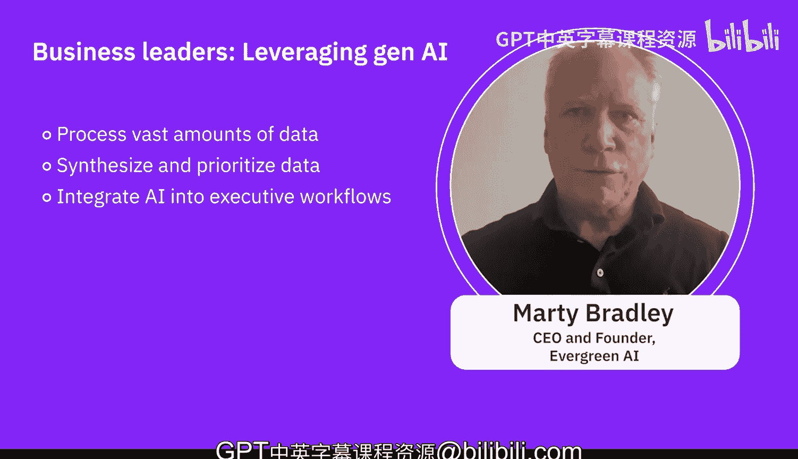
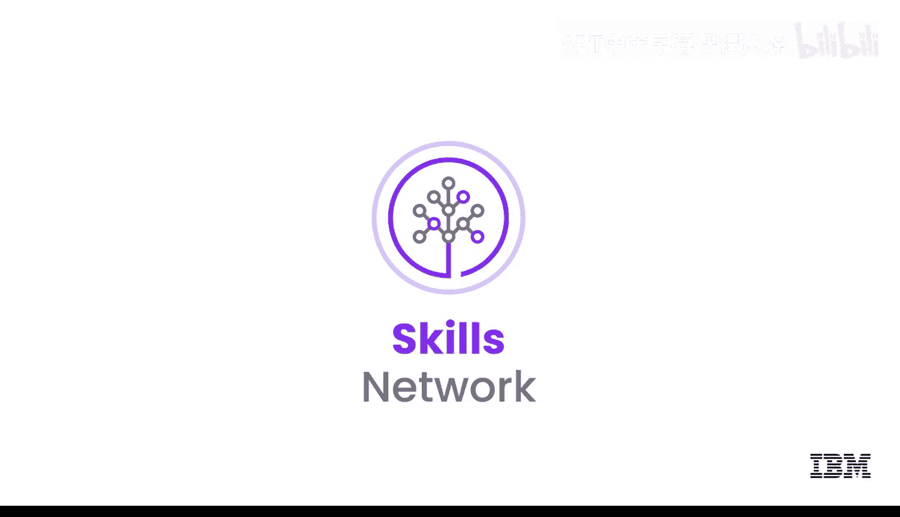

# 080：运用生成式AI提升商业领导力 🚀


在本节课中，我们将探讨商业领导者如何有效利用生成式AI来提升领导力、优化决策并加速业务发展。我们将了解生成式AI在战略规划、内容创作、流程优化等多个核心商业领域的应用方式。

---

上一节我们介绍了生成式AI的基本概念，本节中我们来看看它在商业领导力中的具体应用场景。

商业领导者可以将生成式AI融入日常工作，以加速和自动化部分任务。以下是几个关键的应用领域：

**内容生成与营销**
管理者可以利用生成式AI自动创建营销内容。这个过程可以帮助他们为社交媒体帖子、电子邮件通讯或营销活动生成更具创意的材料，优化信息传递，并创造更多能与最终用户和客户互动的内容。其核心是让AI根据指令自动生成文本，例如：
```python
# 伪代码示例：AI生成营销文案
marketing_copy = generative_ai.generate_content(topic="新产品发布", tone="兴奋", platform="社交媒体")
```

**产品设计与创新**
领导者可以借助AI探索新想法、快速迭代设计，并基于AI生成的洞察优化产品功能。这能帮助团队更高效地进行头脑风暴，并比纯人工方式更快地获得更好的产出。

**战略决策支持**
对于高管而言，生成式AI可以辅助战略决策。通过一个逐步的过程，领导者可以借助AI访问他们以前无法接触的专家智慧。他们可以汇集金融、营销、销售等领域的顶尖思想，生成回应、信息和创意，并将其带入战略规划会议。随后，可以与AI协作，更快地构建和完善这些想法。其核心价值在于：
**AI处理海量数据并提炼优先级的能力 >> 单人脑力**

**客户数据分析与个性化**
AI可以帮助分析客户数据，得出可行的洞察，用于个性化推荐和营销策略，从而提升客户服务质量。

**预测分析与决策支持**
生成式AI可以基于历史数据和市场趋势生成预测、预报和情景分析，为商业领导者提供决策支持。这有助于领导者做出更明智的决策，降低风险并识别增长机会。

**流程优化与自动化**
在供应链管理、库存预测和资源分配等领域，AI可以帮助优化和自动化流程，提升运营效率。

**风险管理与合规**
领导者可以利用生成式AI来检测异常、识别潜在风险或合规问题，从而主动应对挑战，确保符合监管要求。

---

需要记住的关键点是，AI的目的不是取代人类，而是作为一种强大的工具来增强人类的能力。AI能够处理远超个人脑容量所能承载的海量数据，并将其综合、提炼、优先排序，这对组织来说是巨大的价值。

对于企业高管而言，将AI整合到工作流程中，可能是能为组织做的最有益的事情之一。因此，积极寻找适合高管工作的AI解决方案至关重要。

---





本节课中，我们一起学习了商业领导者运用生成式AI的多种方式，包括内容生成、产品创新、战略决策支持、客户洞察、预测分析、流程自动化以及风险管理。核心在于，AI是处理信息、激发创意和优化流程的强大伙伴，能帮助领导者更高效、更明智地推动业务发展。