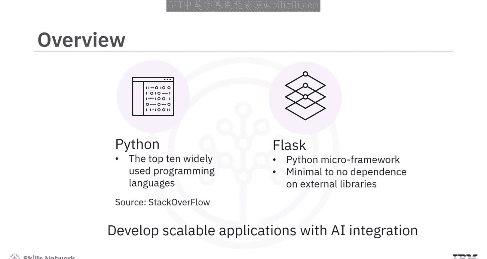
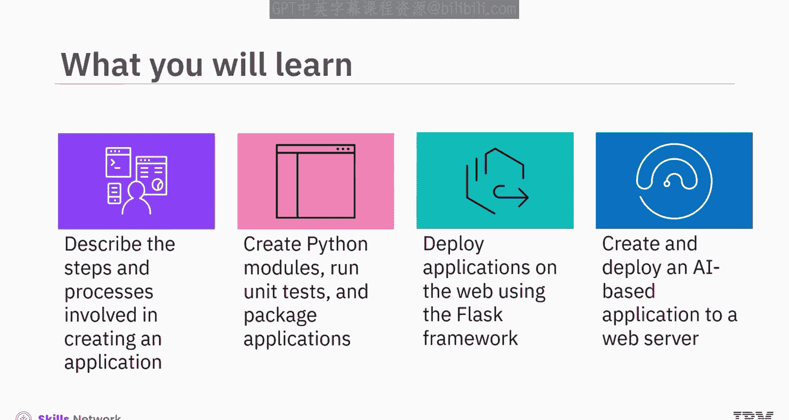
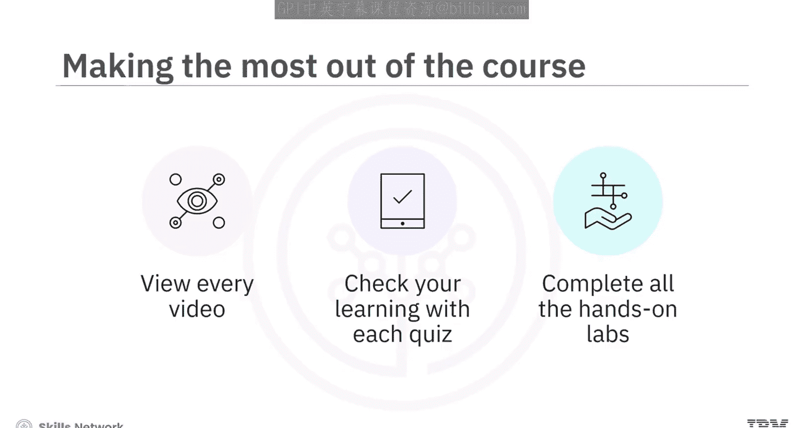

# 生成式人工智能工程：P01：课程介绍 🎯

在本节课中，我们将要学习一门关于使用Python和Flask开发人工智能应用的课程。我们将了解课程的目标、适用人群以及整体的学习路径。

---

## 课程概述

欢迎来到这门关于使用Python和Flask开发人工智能应用的课程。

根据Stack Overflow的一项调查，Python是全球使用最广泛的十大编程语言之一。

Flask是一个Python微框架，对外部库的依赖极少甚至没有。

使用Python和Flask，程序员可以开发简洁的应用，即使是在企业级的AI组件中，也能轻松成为可扩展解决方案的一部分。

完成本课程后，你将能够描述创建应用程序所涉及的步骤和流程，创建Python模块，运行单元测试，以及打包应用程序。

你将能够使用Flask框架在Web上部署应用程序，并使用IBM Watson嵌入式AI库和Flask创建并部署一个基于AI的应用程序到Web服务器。

## 目标学员

本课程面向所有具备基本编程知识、对Python有初步了解，并且有兴趣构建集成AI的可复用Web应用程序的人。

## 课程模块介绍

上一节我们介绍了课程的整体目标，本节中我们来看看课程的具体内容安排。本课程分为三个主要模块。

以下是各模块的学习内容：

1.  **模块一：应用开发基础**
    *   本模块将向你介绍应用程序开发的基础知识，包括生命周期和编码最佳实践。
    *   你将有机会创建模块、运行单元测试和打包应用程序。
    *   你将学习Python的理想编码实践，并了解如何运行静态代码分析。

2.  **模块二：Flask框架入门**
    *   本模块将从Flask的介绍开始。
    *   接下来，你将学习部署概念，包括路由、请求和响应对象、错误处理和装饰器。
    *   你还将能够使用Flask创建并部署一个应用程序。

3.  **模块三：AI应用开发实战**
    *   在模块三中，你将有机会运用之前模块学到的所有知识，使用Watson嵌入式AI库开发功能性的Web应用程序和基于AI的Web应用程序。
    *   通过一个练习项目和一个评分项目，你将能够展示自己使用Flask创建和部署应用程序的熟练程度。
    *   你必须将评分项目的作业提交给同伴进行互评。

## 学习建议

为了从本课程中获得最大收益，这里有很多内容需要学习。

以下是给你的学习建议：

*   确保观看每一个视频。
*   通过每个测验检查你的学习成果。
*   完成所有动手实验。

如果你在课程材料的任何部分遇到困难，请不要犹豫，在讨论论坛中联系我们。

感谢你成为我们课程的一员，欢迎你的加入。

---

## 总结

本节课中我们一起学习了《生成式人工智能工程》课程的第一部分介绍。我们了解了课程将教你如何使用Python和Flask构建AI应用，明确了学习目标、适用人群以及三个核心模块（应用开发基础、Flask框架、AI实战）的内容安排。最后，我们获得了一些高效完成课程的学习建议。准备好开始你的AI应用开发之旅了吗？