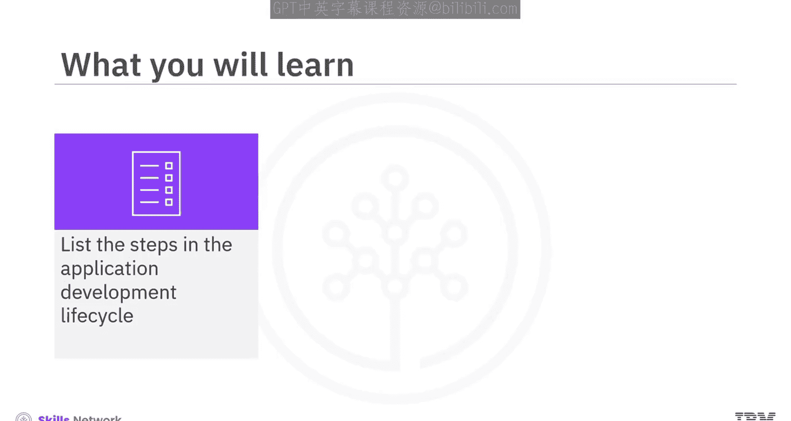
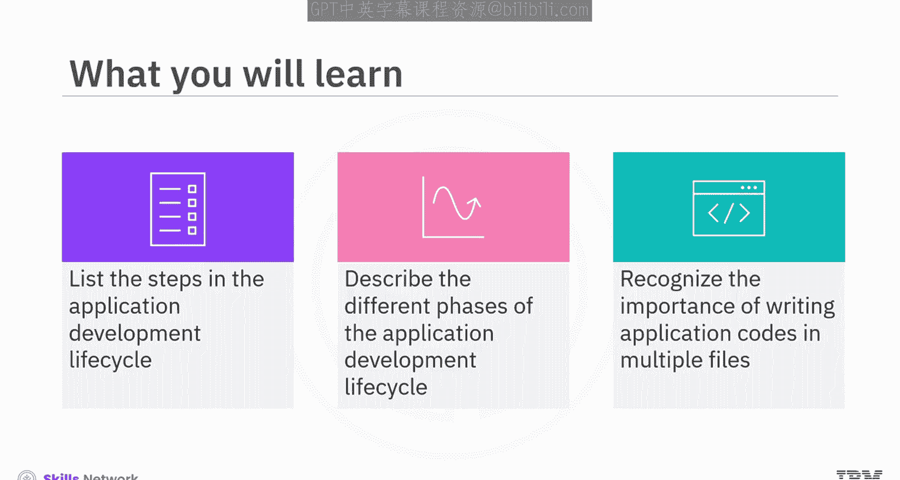
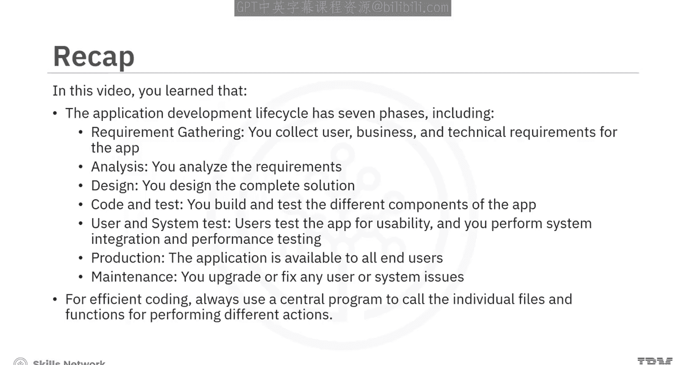

# 生成式人工智能工程：002：应用程序开发生命周期 🚀

在本节课中，我们将要学习应用程序开发生命周期的完整流程。我们将了解从客户提出需求到最终产品上线及维护的各个阶段，并理解为何将代码组织在多个文件中是一种最佳实践。

---

## 概述

想象一下，客户请求你构建一个应用程序来帮助员工追踪每日任务。或者，客户希望你构建一个管理酒店预订的网页应用。在这两种情况下，你都不能在客户提出请求后立即开始构建。你需要执行一系列活动，例如分析需求、规划和编码，然后应用程序才能为用户所用。无论应用程序类型如何，每个应用程序都会经历一系列不同的阶段，这被称为应用程序开发生命周期。

---

## 生命周期的七个阶段

你可以将应用程序开发生命周期划分为七个阶段：
1.  需求收集
2.  分析与设计
3.  编码与测试
4.  用户与系统测试
5.  生产部署
6.  维护
7.  代码组织最佳实践

接下来，让我们详细看看应用程序开发的每个阶段。

---

## 第一阶段：需求收集

需求收集是应用程序开发流程中的第一个阶段。在此阶段，你需要捕获应用程序所有方面的需求，包括用户需求、业务需求和技术需求。

以酒店预订应用为例：
*   **用户需求**：用户必须能够查看不同的房间和可用设施。
*   **业务需求**：确定不同房间和设施的合理收费。
*   **技术需求**：应用必须在所有浏览器和移动设备上运行。

目标是尽可能多地捕获需求，即使有些看起来冗余或微不足道。同时，你必须识别任何设计约束和商业模式的可行性。例如，对于酒店预订应用，一个约束是服务器需要始终保持房间可用状态的更新，这会产生相关成本。因此，为了保持业务可行性，会在最终付款中添加一笔小额便利费。

---

## 第二阶段：分析与设计

在收集了需求和约束之后，你必须对其进行分析，为应用程序的设计创建可能的解决方案。

在分析与设计阶段，可能会进行多轮验证和修订，以创建一个满足所有指定需求的模型解决方案。

在应用程序开发的分析与设计阶段，你必须维护适当的文档，记录设计中的所有更新。文档应清晰简洁，以便在编码与测试阶段使用。最终提出的设计和指定的需求将传递给下一个阶段。

---

## 第三阶段：编码与测试

在编码与测试阶段，团队使用设计文档中指定的编程需求进行编码、测试、修订和再测试，直到代码满足所有文档化的需求。

让我们回顾一下测试阶段。你对单元代码进行的测试称为**单元测试**。在编程级别进行单元测试，以确保满足所有必需的规范。

---

## 第四阶段：用户与系统测试

单元测试之后，你可以生成一个可接受的应用程序版本。然后，这个新版本的应用程序会经过一系列用户和系统级别的测试。

用户测试从用户的角度验证功能。此外，你还需要执行多项系统级测试，包括**集成测试**和**性能测试**。

*   **集成测试**验证所有相关程序在集成后是否继续按预期运行。它还验证应用程序在更大框架内的功能。
*   **性能测试**帮助评估应用程序在不同工作负载下的速度、可扩展性和稳定性。

测试完成后，你可以生成一个新的应用程序版本并将其发送到生产环境。

---

## 第五阶段：生产部署

一旦进入生产环境，最终用户就可以访问和使用它。你必须确保应用程序功能准确并对用户可用。

当应用程序处于生产阶段时，它必须保持稳定状态。在稳定状态下，你不应对应用程序进行任何更改。然而，这并非总是可能。例如，在出现错误时，你可能需要对应用程序进行更改。这些更改在实施到生产环境之前受到严格控制并经过充分测试。

---

## 第六阶段：维护

应用程序开发生命周期的最后一个阶段是维护。应用程序可能需要升级，或者你可能需要添加新功能。在这种情况下，新功能在集成到生产环境中部署的应用程序版本之前，必须经历之前的所有阶段。

---

## 第七阶段：代码组织最佳实践

现在，让我们简要回顾一下为什么为不同功能在多个文件中编码是一种最佳实践。

每个应用程序通常都有多个功能，每个功能的需求可能各不相同。最佳实践是在单独的文件中编码每个功能。

然后，你可以创建一个运行应用程序的**中央程序**，并调用各个文件来执行特定功能。这种组织代码的方法使代码维护高效且容易。

当你需要向现有应用程序添加新功能时，拥有多个文件也会有所帮助。当你将新功能的代码写在单独的文件中时，只有该文件会在集成到运行中的应用程序之前，经历整个设计和验证过程。

---

## 总结

本节课中，我们一起学习了应用程序开发生命周期的七个阶段：
1.  **需求收集**：收集应用程序的用户、业务和技术需求。
2.  **分析**：分析需求。
3.  **设计**：设计完整的解决方案。
4.  **编码与测试**：构建和测试应用程序的不同组件。
5.  **用户与系统测试**：用户测试应用程序的可用性，你执行系统集成测试和性能测试。
6.  **生产**：应用程序对所有最终用户可用。
7.  **维护**：升级或修复任何用户或系统问题。

为了高效编码，应始终使用一个中央程序来调用执行不同操作的各个文件和函数。