# 生成式人工智能工程：003：Web应用程序和API简介 🖥️🔗

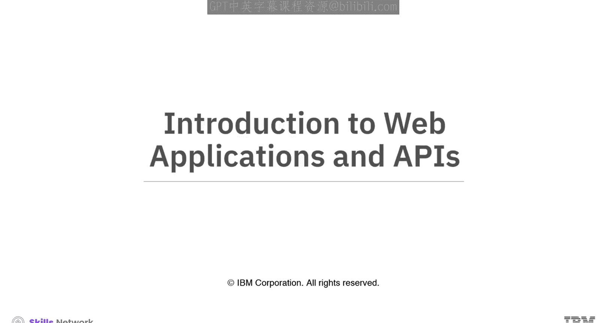

在本节课中，我们将要学习Web应用程序和API的基本概念。我们将了解它们的定义、工作原理、优势以及两者之间的关系。

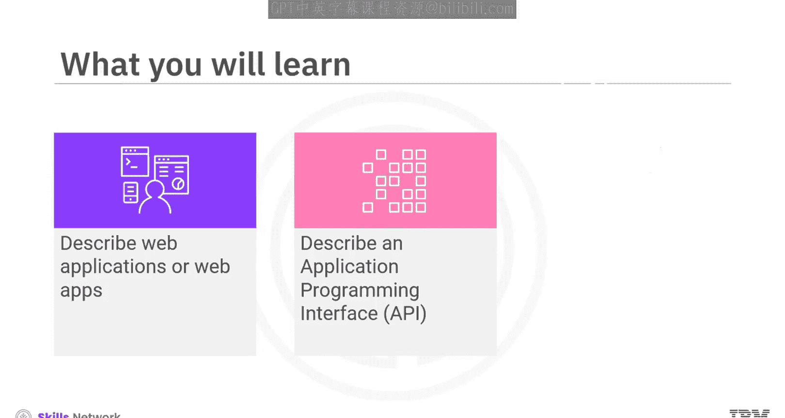

## 什么是Web应用程序？ 🌐

Web应用程序是一种存储在远程服务器上，并通过互联网交付的程序。用户通过浏览器与应用程序进行交互。例如，电子商务网站、网页邮件等服务都属于Web应用程序。虽然某些应用可能依赖于特定的浏览器类型，但大多数现代Web应用程序都能在所有主流浏览器上运行。

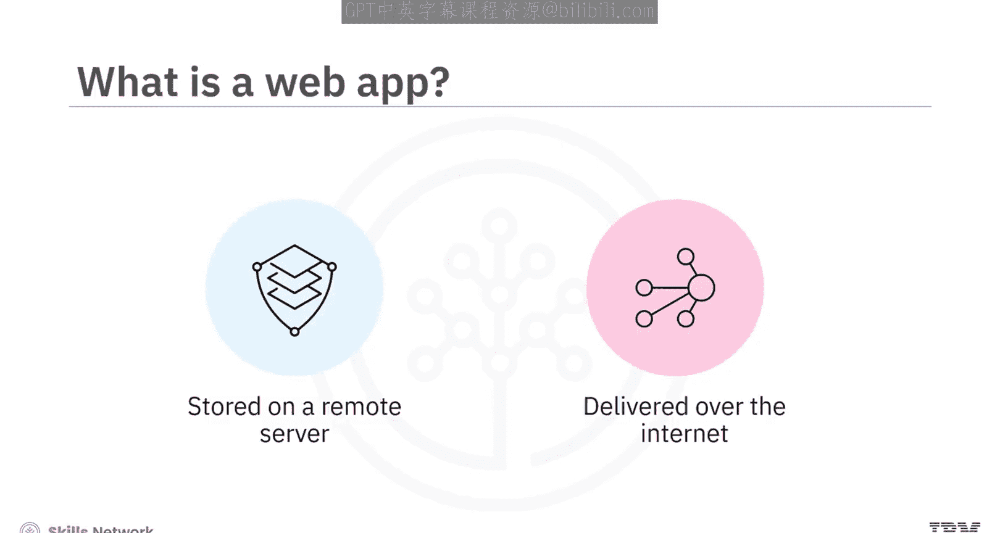

### Web应用程序的构成组件

一个Web应用程序需要三个核心组件来处理客户端请求：

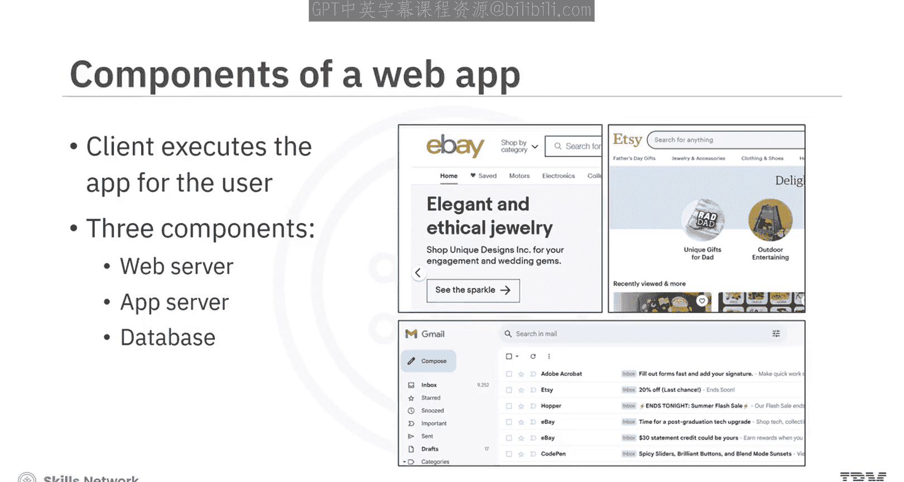

*   **Web服务器**：用于管理接收到的请求。
*   **应用服务器**：用于执行请求的任务。
*   **数据库**：用于存储完成任务所需的信息。

### Web应用程序的开发

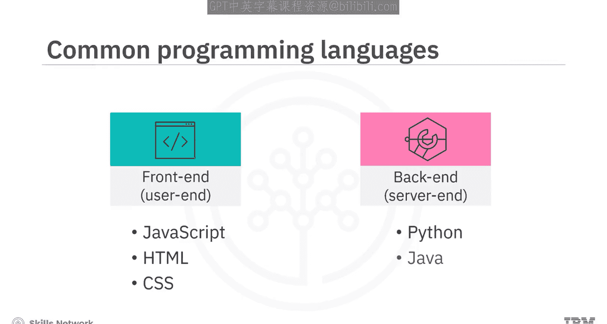

在开发Web应用程序时，你需要编写两部分的代码：

*   **前端（用户端）**：使用如 **JavaScript**、**HTML** 或 **CSS** 等技术。
*   **后端（服务器端）**：使用如 **Python**、**Java** 或 **Ruby** 等编程语言。

### Web应用程序的优势

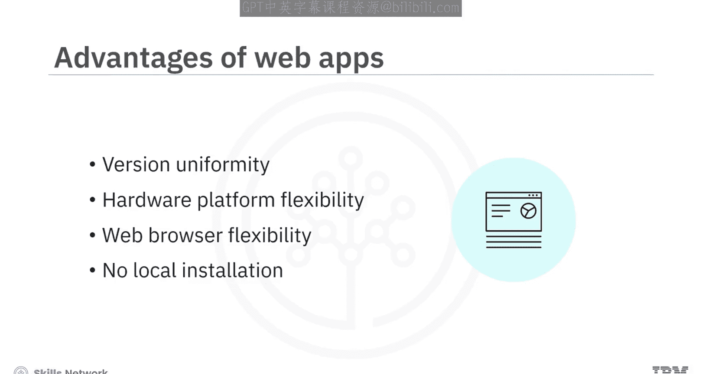

与严格在用户本地系统上运行的应用程序相比，Web应用程序具有多项优势：

*   开发者可以向多个用户同时提供相同版本的应用程序。
*   用户可以在其选择的平台（如台式机、笔记本电脑或移动设备）上灵活使用应用程序。
*   用户可以通过自己选择的浏览器访问应用程序。
*   用户无需在本地系统上安装该应用程序。

## 什么是API？ 🔌

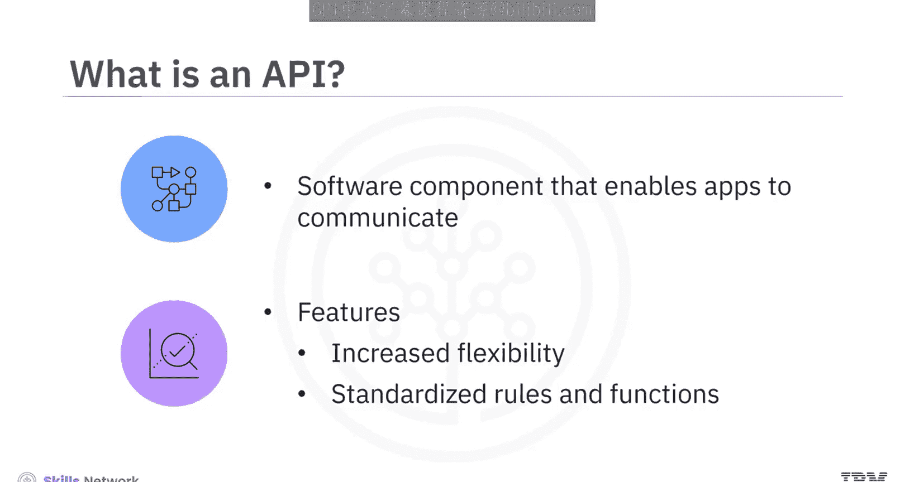

上一节我们介绍了Web应用程序，本节中我们来看看API。API（应用程序编程接口）是一个软件组件，它使得两个原本互不连接的应用程序能够进行通信。

API为程序员创造了更大的灵活性，使他们能够从原本封闭的应用程序中请求数据。因此，API具有标准化的规则和功能，用于确定可以在应用程序内获取或修改哪些数据，以及该过程如何发生。例如，手机上的应用程序会要求你授予访问手机不同功能（如位置、摄像头、音频和录音机）的权限。

### API的实例

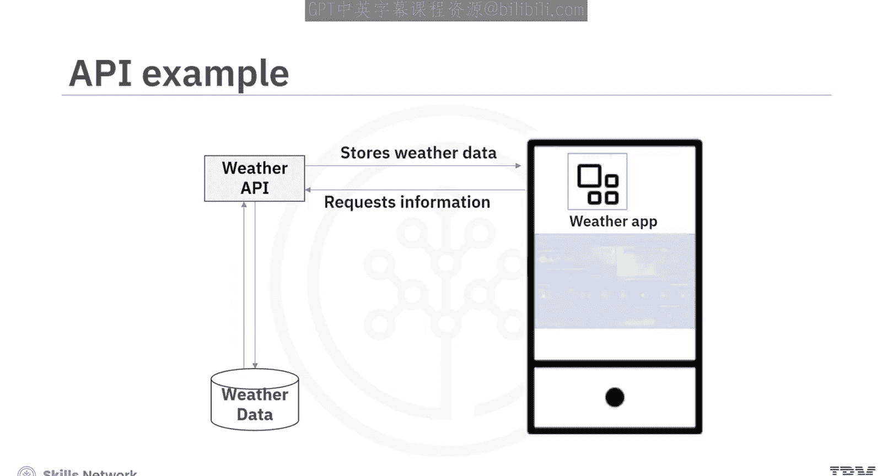

一个使用API的典型例子是天气应用程序。你的天气应用本身并不生成天气数据。相反，它只是向一个天气API请求信息。该API将收集和存储天气数据的软件与你移动设备上的应用程序连接起来。设备随后为你提供第二天的详细天气预报。

### API的架构与优势

软件开发人员在创建API时遵循多种架构，但最流行的是**REST**和**SOAP**。这些架构将在其他视频中讨论。

API之所以有益，原因包括：

*   它改善了应用程序之间的连接性。
*   它支持传统的**CRUD**操作。
*   它使用HTTP动词，包括 **PUT**、**POST**、**DELETE** 和 **GET**。
*   它基于HTTP，因此具有可定制性。

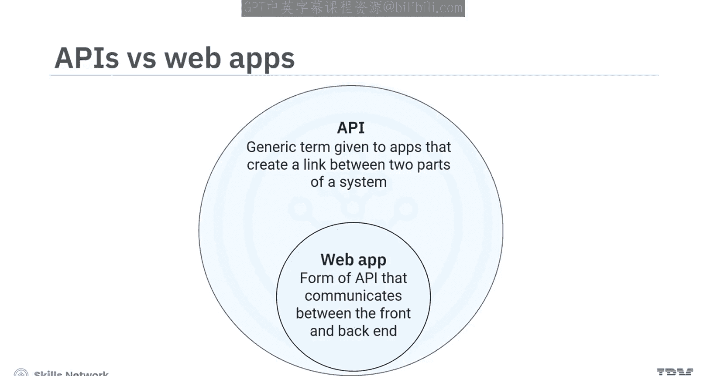

## Web应用程序与API的关系 🔄

API是一个更通用的术语，指代在系统任意两部分之间创建链接的所有形式的应用程序。Web应用程序是API的一种形式，它在前端和后端之间进行通信。

为了澄清Web应用程序和API之间的区别，让我们考虑一个电子商务购物服务的例子。

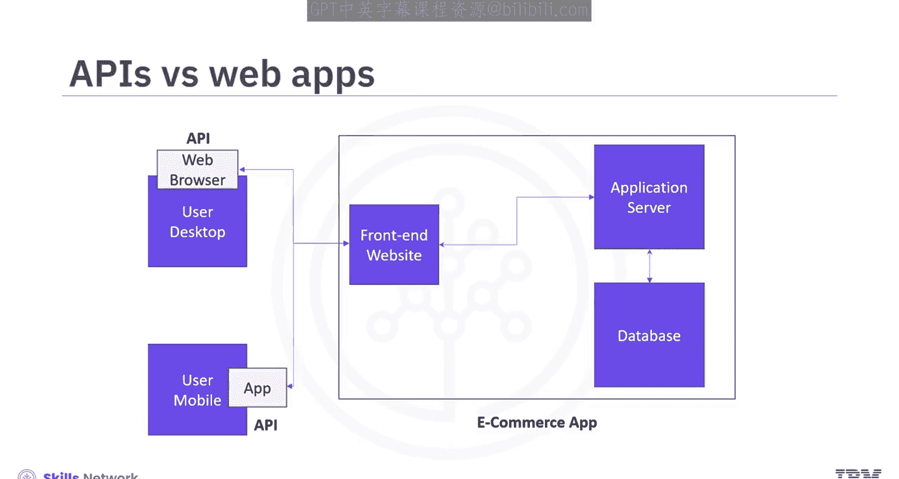

*   当你从浏览器访问电子商务购物服务时，浏览器充当连接你与Web应用程序的API。当你选择商品时，Web应用程序会检查商品的可用性，如果可用，则显示其价格。
*   当你尝试使用移动设备访问电子商务购物服务时，你设备上的应用程序则充当连接到电子商务服务的API。

所有Web应用程序的本质都是与其他应用程序共享数据。从本质上讲，所有Web应用程序都可以被视为API。然而，API是一个通用术语，既包括在线（基于Web的）应用程序，也包括离线应用程序。

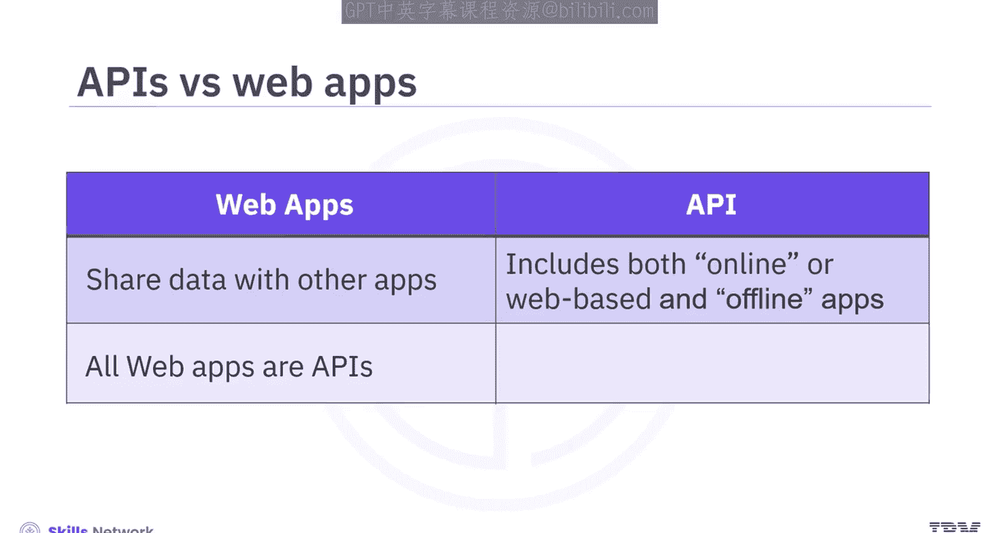

以下是核心结论：
> 所有Web应用程序都是API，但并非所有API都是Web应用程序。

## 总结 📝

本节课中我们一起学习了以下核心内容：

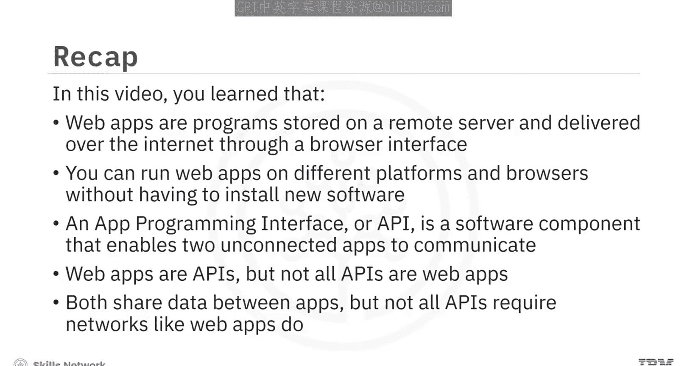

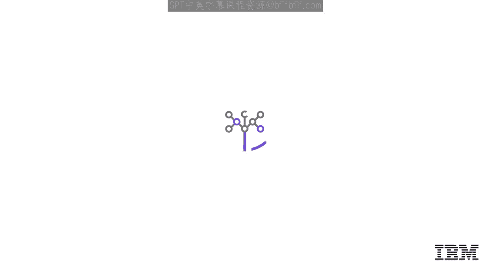

*   **Web应用程序**是存储在远程服务器上并通过浏览器在互联网上交付的程序。你可以在不同的平台和浏览器上运行Web应用程序，而无需安装新软件。
*   **API**是一个软件组件，它使得两个未连接的应用程序能够进行通信。
*   **关系**：Web应用程序是API，但并非所有API都是Web应用程序。两者都在应用程序之间共享数据，但并非所有API都像Web应用程序那样需要网络连接。