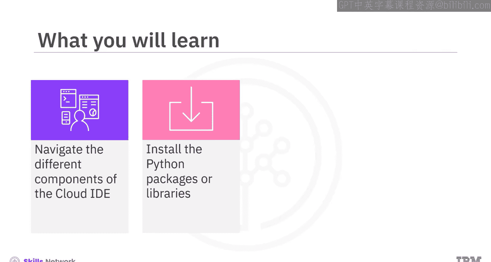
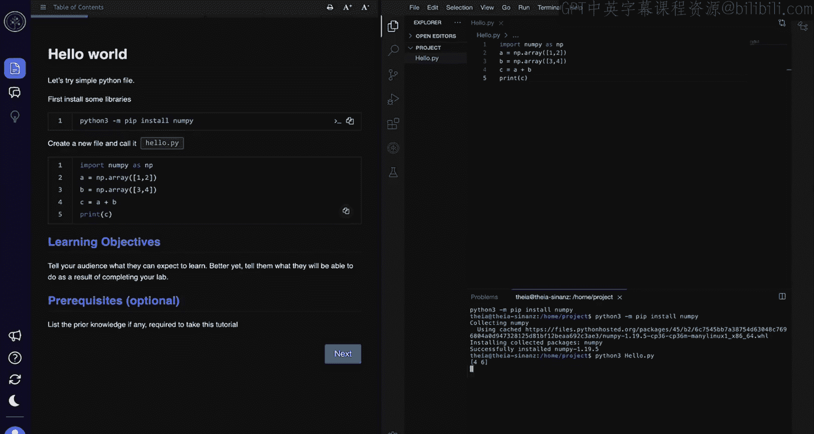
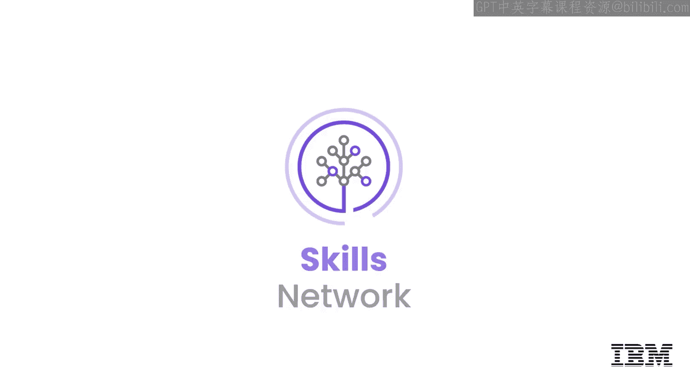

# 云IDE入门教程：004：使用IDE 🖥️

在本节课中，我们将学习如何使用IBM Skills Network团队提供的云IDE（集成开发环境）。这是一个用于学习的编程环境，你可以直接在浏览器中编写、运行、调试和执行代码，无需在个人设备上安装或配置任何软件或工具。

## 界面概览 📐

当你打开云IDE时，会显示两个主要窗格。

左侧窗格被称为**教学窗格**，它显示你需要遵循以完成项目的说明。

右侧窗格显示一个**编程界面**，你可以在其中编写和执行代码。

请注意，右侧窗格类似于VS Code界面，这是一个流行的代码管理IDE。

## 调整窗格与设置 ⚙️

上一节我们介绍了两个主要窗格，本节中我们来看看如何调整它们。

你可以调整教学窗格和代码窗格的大小。例如，可以通过从边缘向左拖动来减小教学窗格的大小，或通过向右拖动来增大其大小。

你还可以根据个人偏好修改字体和字体大小。

如果教学窗格中有多个页面，你会看到“下一页”和“上一页”按钮。这些按钮使你能够在页面之间导航。你也可以预览教学页面。

注意教学窗格左上角的“目录”按钮。使用此按钮可以浏览说明的不同部分。

## 使用AI教学助手聊天机器人 🤖

接下来，让我们看看云IDE上可用的一个AI驱动的聊天机器人。

IBM Skills Network团队为你提供了一个名为“TI”的AI教学助手聊天机器人，它可以帮助你使用实验室环境完成编码作业。TI的图标位于教学窗格的左侧。

要访问聊天机器人，只需点击该图标。让我们尝试问一个问题，例如：“请为我提供一个简单的Python代码”。

如你所见，代码被显示出来，你可以复制或执行该代码。

## 编程界面详解 💻

上一节我们介绍了辅助工具，本节中我们来看看编程界面的核心部分。

编程界面包含多个组件，但你将经常使用的两个标签页包括：
*   **编辑器标签页**：用于编写代码。
*   **终端标签页**：用于执行代码。

在编程窗格中，还有一个“Skills Network工具箱”，它使你能够使用各种数据库管理环境、大数据工具、云工具、嵌入式AI库，并启动你构建的应用程序。

## 安装Python库 📦

在开始编写代码之前，你需要在这个基于云的环境中安装所需的Python库或包。

你需要在终端标签页中执行此任务。要打开新终端，点击“终端”菜单，然后点击“新建终端”。

为了演示目的，让我们从教学窗格复制代码块并将其粘贴到终端中。然后，按回车键执行命令。

请注意，NumPy库已成功安装，你现在可以将此库导入到你的代码中。

## 创建并运行Python程序 🚀

现在让我们在编程窗格中创建一个基本的Python程序。点击“文件”，然后选择“新建文件”。新文件将在编辑器标签页中打开。

在开始添加代码之前保存文件是最佳实践。由于我们正在编写Python代码，请使用`.py`扩展名保存文件。从文件菜单中，点击“保存”或按`Ctrl+S`。出现提示时，提供文件名。对于此示例，让我们将文件保存为`hello.py`。

下一步是添加代码。你可以在编辑器标签页中手动键入代码，或者如果教学窗格中有可用代码，可以将其复制并粘贴到你的文件中。

为了本次演示的目的，让我们从教学窗格复制代码并将其粘贴到文件中。别忘了保存文件。

是时候执行代码了，让我们导航回终端标签页。确保你位于存储程序文件的文件夹中，可以通过键入`python3`后跟文件名来执行文件。对于此示例，命令是`python3 hello.py`。

请注意，输出已显示且没有任何错误。

## 总结 📝

本节课中我们一起学习了云IDE的使用。

总结一下，云IDE是IBM Skills Network提供的一个类似于VS Code的编程环境，用于学习和培养实践技能。

云IDE有两个窗格：教学窗格和编程窗格。你可以使用教学窗格上的“目录”按钮在教学页面之间导航。

编程窗格提供编辑器标签页来编写代码，以及终端标签页来执行代码。你需要通过终端安装所需的库。

在实验过程中的任何时候，你都可以从教学窗格复制代码块，并将其粘贴到编辑器或终端标签页中。