# 生成式人工智能工程：005：Python风格指南与编码实践

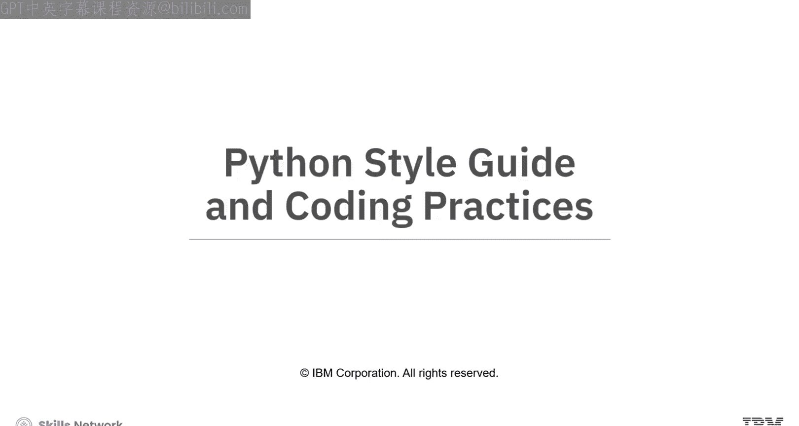

在本节课中，我们将学习如何编写清晰、一致且易于维护的Python代码。我们将重点介绍官方的PEP 8风格指南、关键的编码惯例，以及如何使用静态代码分析工具来确保代码质量。

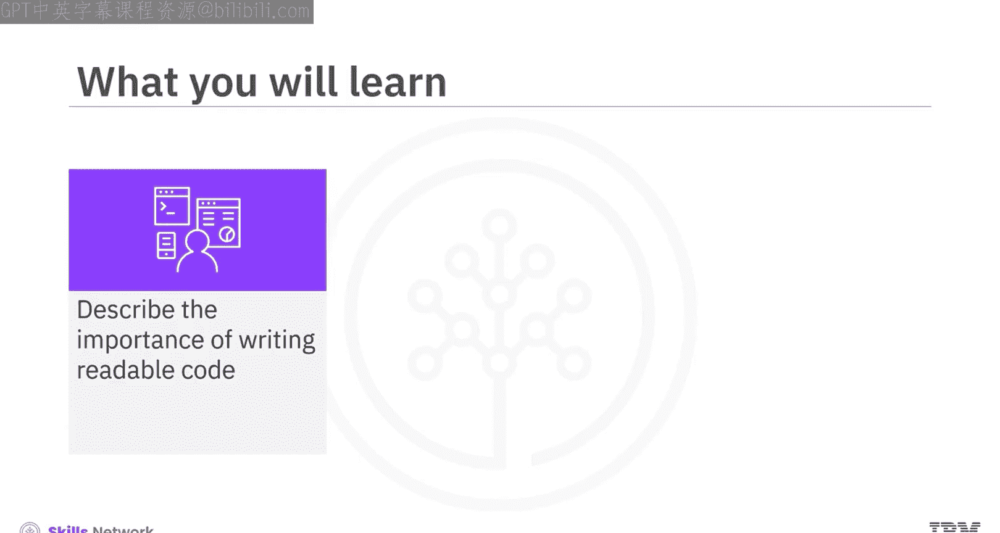

---

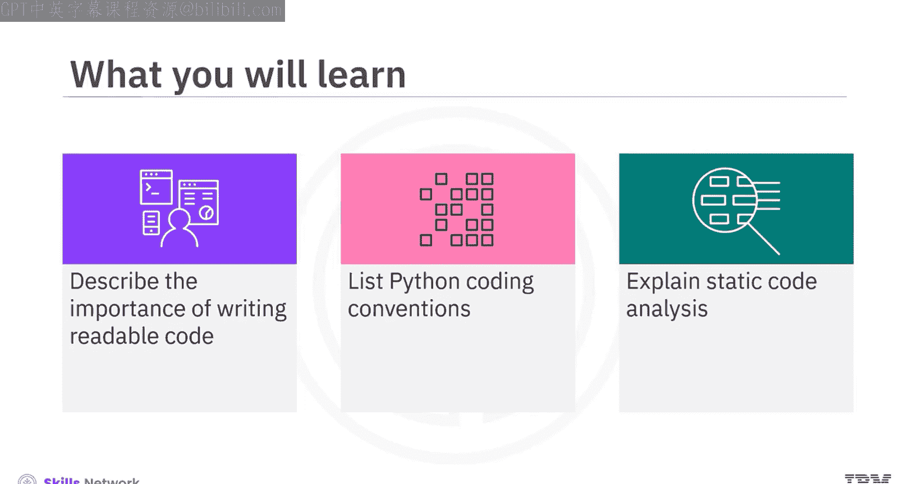

## 编写可读代码的重要性

当你编写代码时，需要确保团队成员能够轻松阅读和理解它。这项任务需要遵循一些编码标准和惯例。Python.org发布了一份名为 **Python增强提案8** 或 **PEP 8** 的文档，它提供了使你的Python代码可读且格式一致的惯例和指南。

上一节我们介绍了编写可读代码的重要性，本节中我们来看看PEP 8中的一些关键指南。

## 关键指南：提升代码可读性

以下是提升代码可读性的几个关键指南。

### 缩进：使用空格而非制表符

PEP 8建议使用空格而非制表符进行缩进。这是因为不同的文本编辑器和集成开发环境对制表符所代表空格数的解释可能不同。例如，一个编辑器可能将制表符解释为三个空格，而另一个可能解释为四个。使用制表符缩进可能导致代码格式不统一，从而引发格式错误。

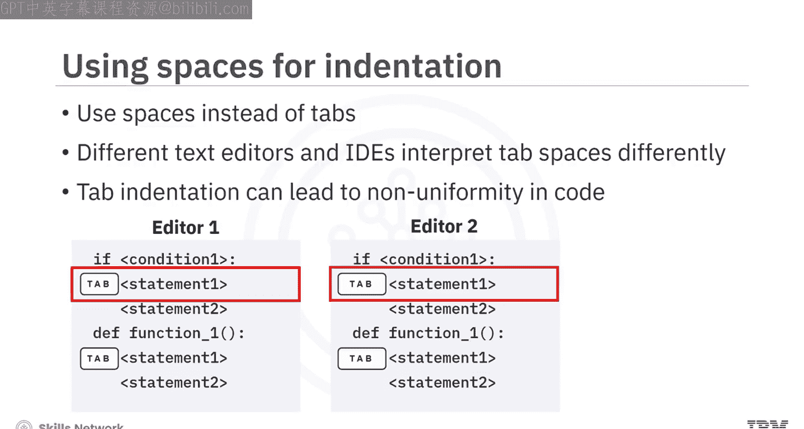

为了避免此类错误，你应该在缩进代码时使用**一致数量的空格**。为了统一性，指南建议在代码的每个缩进级别使用**四个空格**。四个空格足以保证良好的可读性。

> 请注意，示例中在语句前添加的四个点是为了表示四个空格。

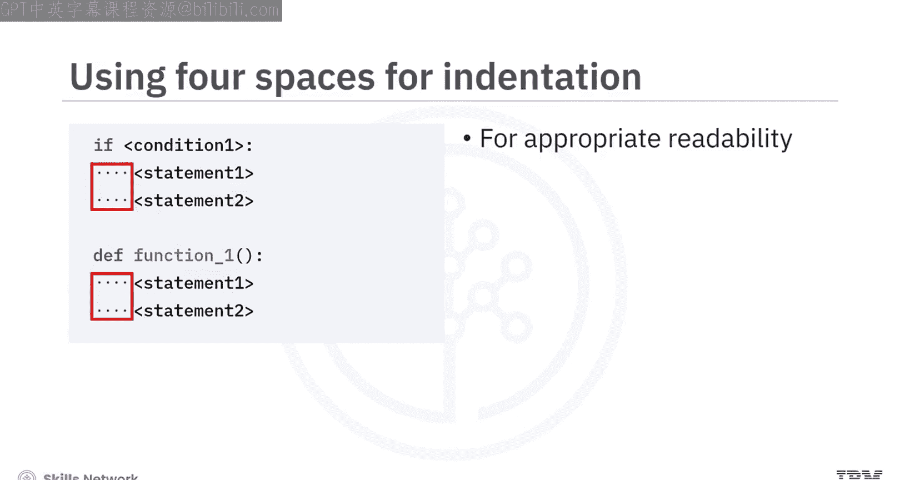

### 使用空行分隔代码块

PEP 8还建议使用空行来分隔代码中的函数和类。空行有助于界定代码不同部分的开始和结束。

例如，在不遵循PEP 8的代码块中，函数结束和类定义之间可能没有空行。而遵循规范的代码则会在类定义前添加一个空行，使结构更清晰。

### 在运算符和逗号后使用空格

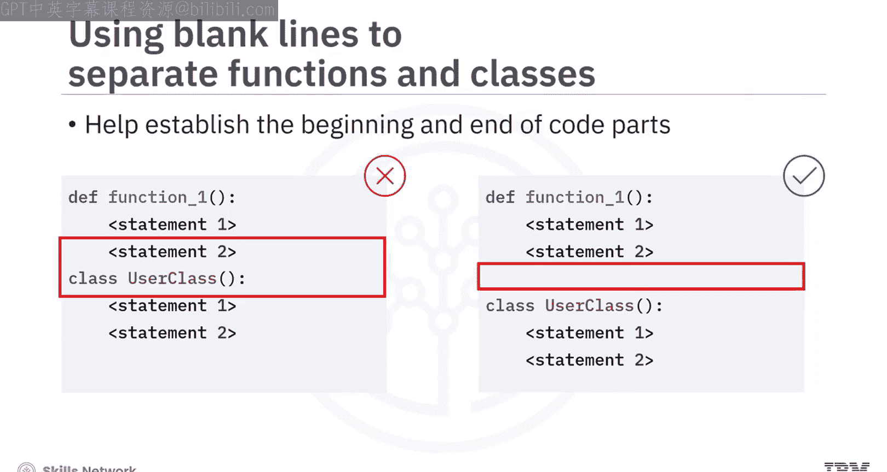

为了提高代码可读性，应在运算符周围和逗号后使用空格。这会使代码看起来更宽松、更清晰，从而提升命令的可读性。

让我们看一些例子：
*   当你不加空格地写 `A=B+C` 时，可能会令人困惑。
*   然而，当你添加空格，写成 `A = B + C` 时，可读性就提高了。

---

## 编码惯例：保持一致性与可维护性

上一节我们介绍了提升可读性的格式指南，本节中我们来看看一些保持代码一致性和可管理性的编码惯例。

以下是几个重要的编码惯例。

### 将大块代码封装在函数中

一个关键的编码惯例是为包含较大代码块的功能创建独立的函数，然后从主程序中调用这些函数。

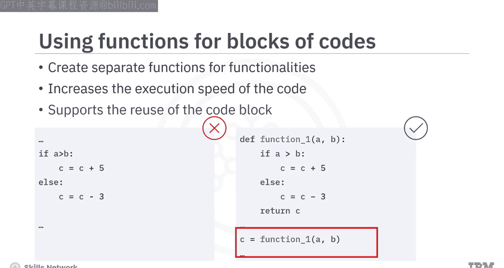

例如，在代码中，如果 `if-else` 语法没有封装成函数，那么每次需要该功能时都需要重写。然而，如果你将其写成一个函数，例如 `function_1(A, B)`，就可以方便地调用，如 `C = function_1(A, B)`。这提高了代码的执行速度，并以更便捷的方式支持代码块的重用。

### 函数与文件的命名：小写字母加下划线

命名函数和文件时，应使用小写字母和下划线。这是因为Python本身及其许多内置库和预定义函数都遵循这种常见的命名惯例。因此，使用小写函数名（最好加下划线）有助于使你的函数具有独特性。

例如：
*   **不建议**：`compSurfaceRadiation()`
*   **建议**：`comp_surface_radiation()`

> 此规则的一个例外是Python包的命名，通常不鼓励使用下划线。例如，应使用 `Mypackage` 而非 `My_package`。

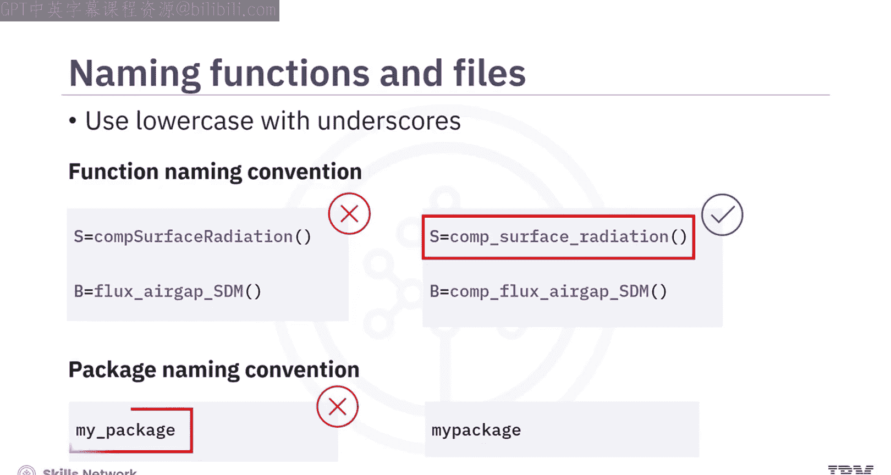

### 类的命名：使用驼峰命名法

使用驼峰命名法命名类也是一个编码惯例。驼峰命名法在编码社区中被广泛接受，也有助于在代码中区分类和函数。

例如：
*   **不建议**：`class la_sirrel_c`
*   **建议**：`class LaSirrelC`

### 常量的命名：全大写字母加下划线

为了保持一致性，应使用全大写字母命名常量，并用下划线分隔单词。名称通常表明常量的用途。

例如：`MAX_FILE_UPLOAD_SIZE`

---

## 静态代码分析

在讨论了编码惯例和指南之后，我们来看看软件开发者常用的一种确保遵守这些风格指南的方法：静态代码分析。

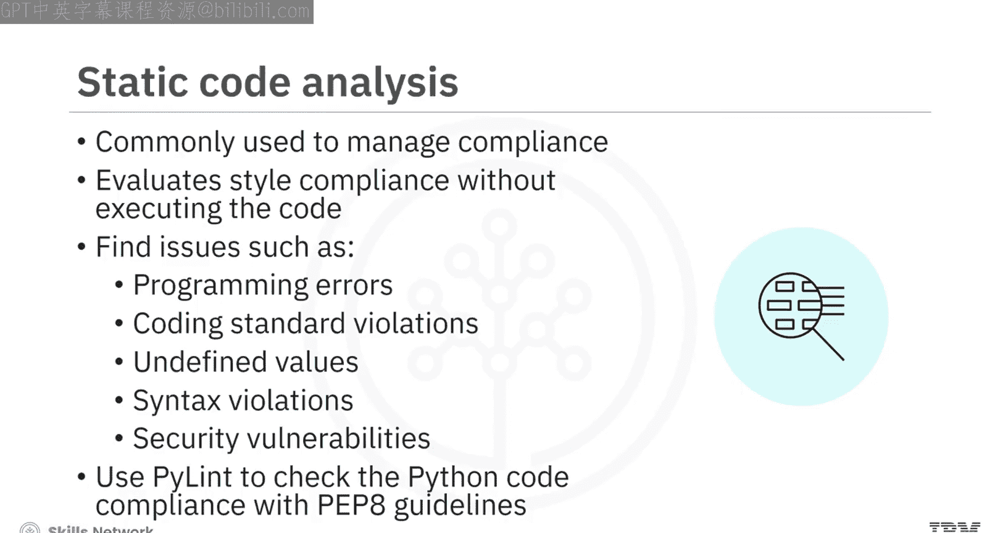

静态代码分析是一种在不执行代码的情况下，根据预定义的风格和标准评估代码的方法。静态分析有助于发现诸如编程错误、编码标准违规、未定义值、语法违规和安全漏洞等问题。

你可以使用 **Pylint** 等库来检查你的Python代码是否符合PEP 8指南。

---

## 总结

本节课中我们一起学习了如何编写高质量的Python代码。

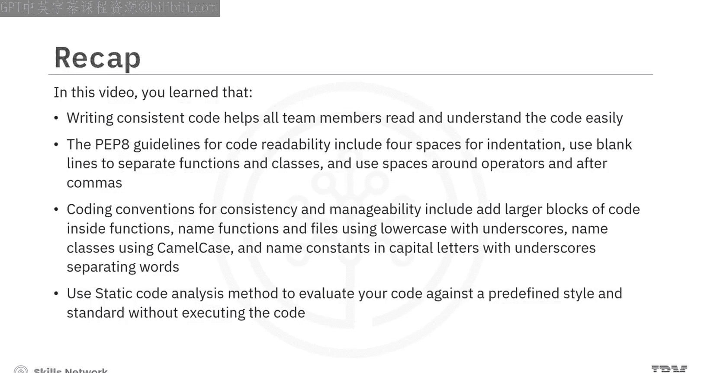

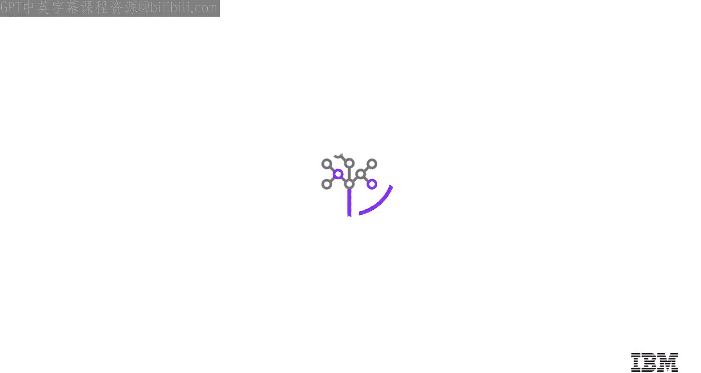

*   编写格式一致的代码有助于所有团队成员轻松阅读和理解代码。
*   PEP 8中提升代码可读性的指南包括：使用四个空格缩进、使用空行分隔函数和类、在运算符周围和逗号后使用空格。
*   保持代码一致性和可管理性的编码惯例包括：将大块代码封装在函数内、使用小写字母和下划线命名函数与文件、使用驼峰命名法命名类、使用全大写字母和下划线命名常量。
*   可以使用**静态代码分析**方法来对照预定义的风格和标准评估你的代码，而无需执行它。