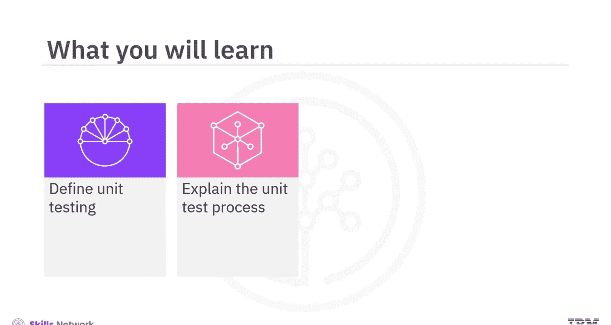
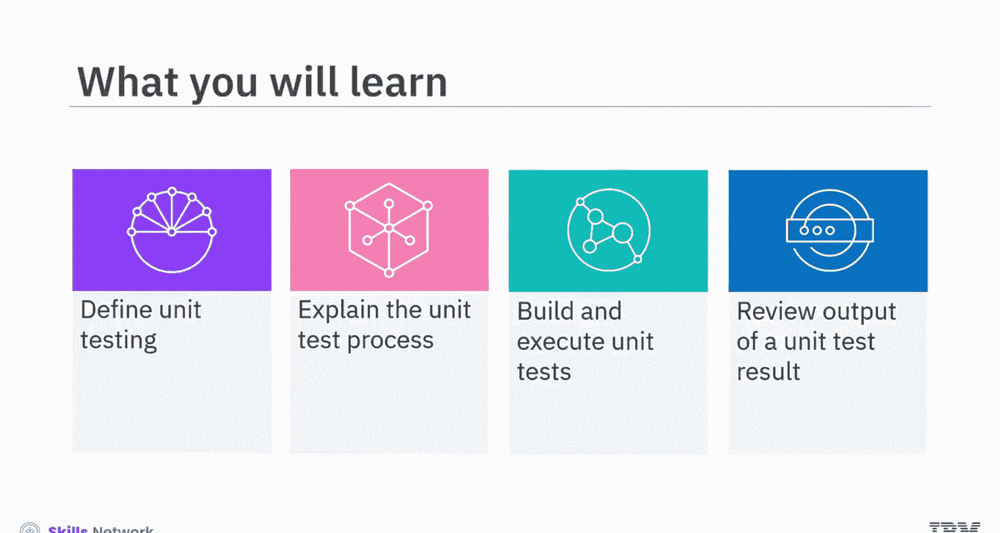
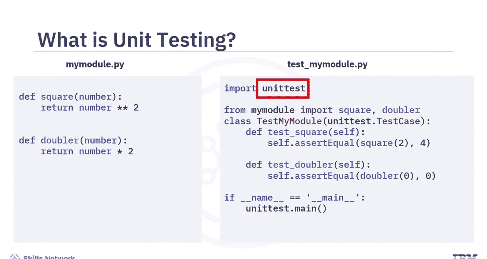
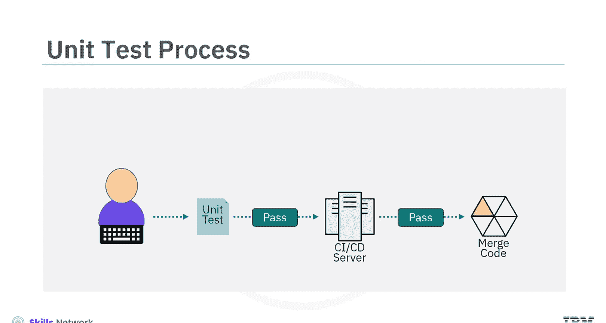
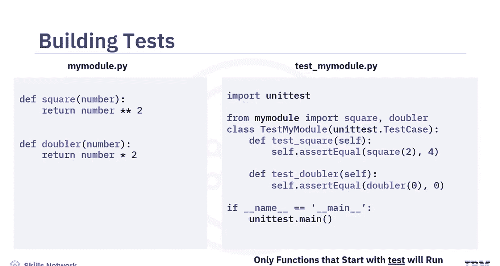
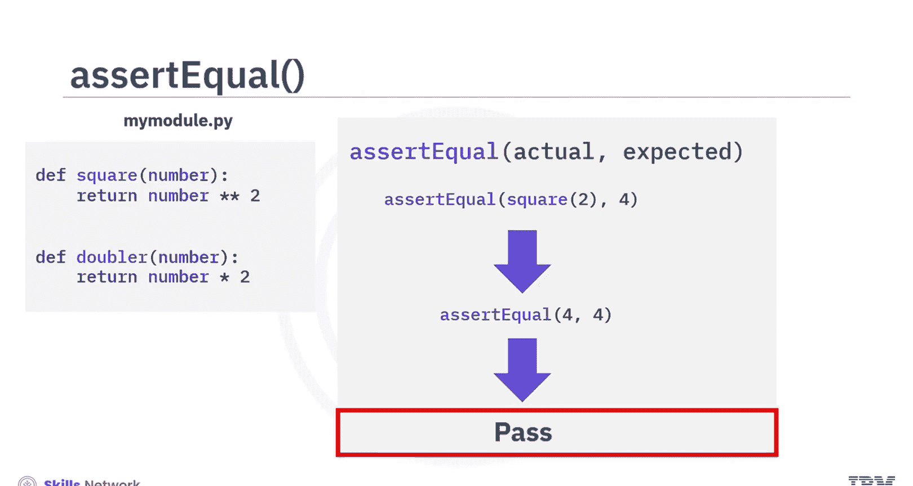
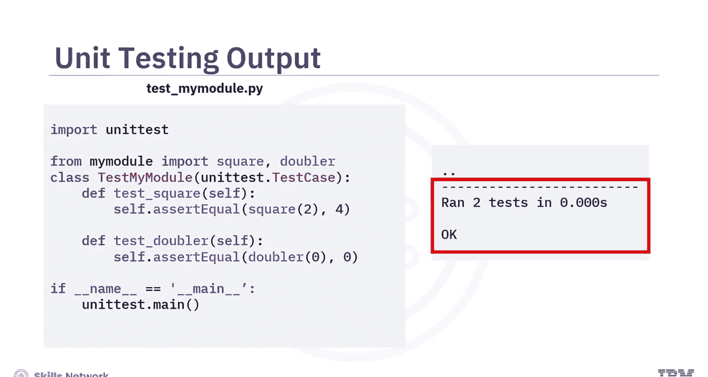
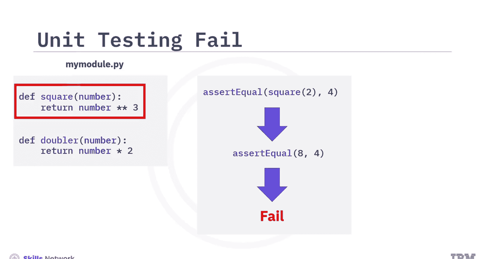
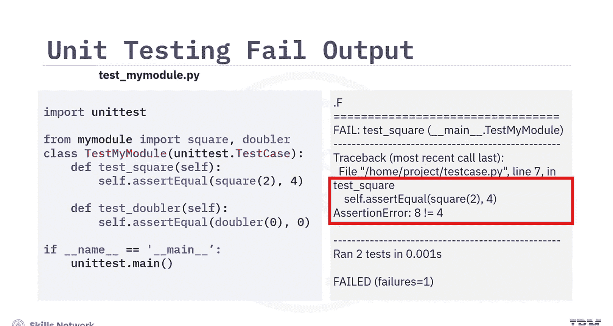
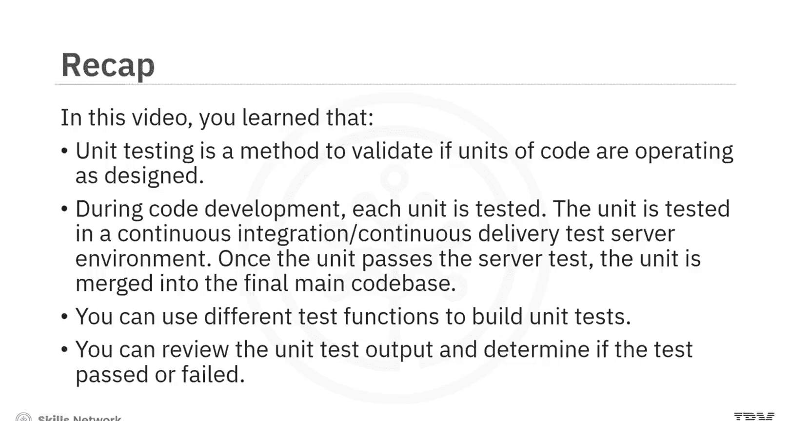

# 生成式人工智能工程：006：单元测试 🧪




在本节课中，我们将学习单元测试。你将能够定义单元测试，解释单元测试的流程，构建并执行单元测试，以及解读单元测试的输出结果。



## 什么是单元测试？

单元测试是一种验证代码单元是否按设计运行的方法。一个“单元”是应用程序中一个较小且可测试的部分。

以下是一个单元的例子，它包含两个函数：`square` 和 `doubler`，位于 `my_module.py` 文件中。

`square` 函数的代码为：
```python
def square(number):
    return number ** 2
```



`doubler` 函数的代码为：
```python
def doubler(number):
    return number * 2
```

为了开发单元测试，你将使用 `unittest` 库。这是一个已安装的 Python 模块，提供了一个包含测试功能的框架。

## 单元测试流程概述

上一节我们介绍了单元测试的基本概念，本节中我们来看看从单元测试到发布到生产代码库的端到端测试流程。



在代码开发过程中，你需要测试每个单元。测试分两个阶段进行。

第一阶段是在本地系统上测试单元。如果测试失败，你需要确定失败原因并修复问题，然后再次测试该单元。

在单元测试通过后，你需要在服务器环境（例如持续集成/持续交付，即 CI/CD 测试服务器）中测试该单元。

如果单元未通过服务器测试，你将收到失败详情。你需要确定并修复问题。一旦单元通过服务器测试，它就会被集成到最终的代码库中。

## 如何构建单元测试

在概述了单元测试流程之后，让我们回顾一些测试函数，以了解如何构建单元测试。

请注意单元代码和单元测试代码。单元文件名是 `my_module.py`。单元测试文件名则附加或前缀了单词 `test`。这是一个良好的命名约定，有助于清晰地区分单元文件和单元测试文件。

以下是创建单元测试文件的步骤。

第一步是导入 `unittest` Python 库：
```python
import unittest
```

接下来，导入要测试的函数。例如，要从 `my_module` 单元导入 `square` 和 `doubler` 函数进行测试：
```python
from my_module import square, doubler
```

然后，构建单元测试类，以便从单个类对象调用单元测试。例如，创建一个名为 `TestMyModule` 的类：
```python
class TestMyModule(unittest.TestCase):
```

请注意，类名在单元名前加了 `Test` 前缀。在类名前加上 `Test` 是一个好的命名约定，有助于区分单元类和单元测试类。

接下来，让该类继承 `unittest` 库中的 `TestCase` 类。继承该类允许你利用 `TestCase` 类中现有的方法。



然后，在单元测试类中创建与每个需要测试的函数相对应的函数。例如，在 `TestMyModule` 类中，两个函数 `test_square` 和 `test_doubler` 对应于 `my_module` 单元中的 `square` 和 `doubler` 函数。

请注意，确保在单元测试模块中，函数名以 `test` 开头，因为只有以 `test` 开头的函数才会运行。

最后，你可以创建测试用例。

在创建测试用例时，添加一个或多个断言方法以确保满足单元测试条件。一个常用的断言函数是 `assertEqual`。请注意，在代码中，该方法已被添加到 `TestCase` 类中。



## 使用 `assertEqual` 函数

`assertEqual` 函数比较两个值或实体，并判断它们是否相等。该方法用于检查函数是否返回了正确的值。



`assertEqual` 函数接收的参数之一是实际值。对于实际值，你将调用你想要测试的函数。第二个参数是期望值，你需要在此处添加函数预期返回的内容。

在示例中，第一个测试是针对 `square` 函数，使用数字 `2`。如果函数正确执行，它应该返回值 `4`。作为测试的一部分，首先评估函数，然后比较两个值是否相等。根据比较的输出结果，测试通过或失败。



## 解读单元测试输出

运行测试文件后，会生成一个输出。该输出显示测试结果以及一些额外细节。例如，如果输出显示运行了 2 个测试，耗时 0 秒，并且显示 `OK`，则表示测试通过，两个函数都正确实现了。

但是，如果函数没有正确实现会发生什么？

考虑 `square` 函数，你编写了计算数字立方而不是平方的代码。函数会失败，并生成一个输出。



让我们回顾一下失败的单元测试的示例输出。输出清晰地显示单元测试失败。例如，输出显示 `FAILED test_square (__main__.TestMyModule)`。你还可以查看单元测试失败的具体函数。例如，`test_square (self.assertEqual(square(2), 4))` 表明 `square` 函数失败。`AssertionError: 8 != 4` 表示值不匹配。详细的输出使你能在实际部署解决方案之前纠正错误。

## 总结

本节课中我们一起学习了单元测试。



*   单元测试是一种验证代码单元是否按设计运行的方法。
*   在代码开发过程中，每个单元都会被测试。单元测试分两个阶段进行。一旦单元通过服务器测试，它就会被合并到最终的代码库中。
*   确保测试文件以 `test` 作为前缀或后缀，以清晰地区分它们与模块文件。
*   你可以使用不同的测试函数来构建单元测试。
*   `assertEqual` 函数是一种常用的断言方法，用于比较两个值。
*   你可以查看单元测试输出，并确定测试是通过还是失败。