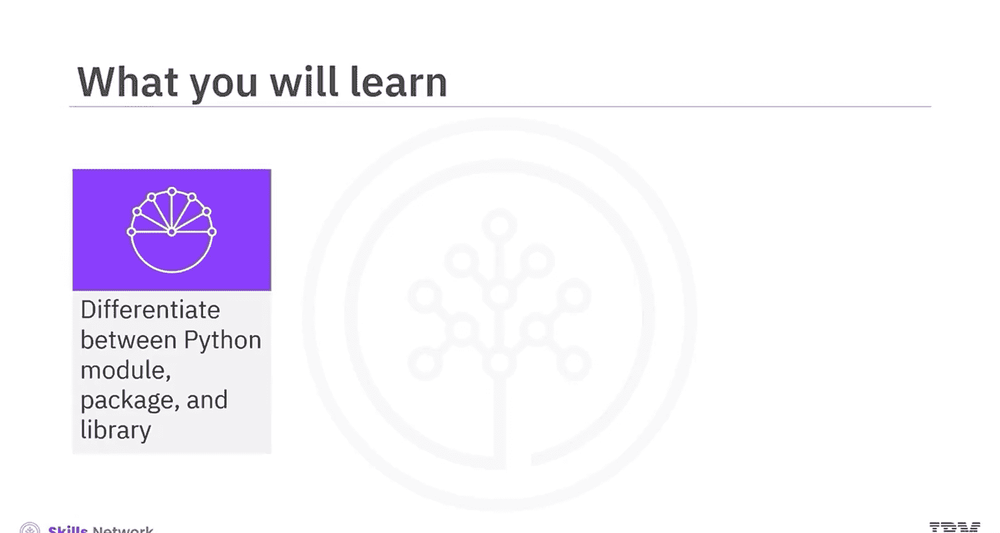
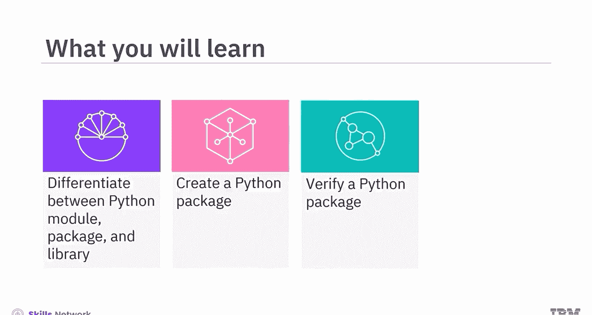
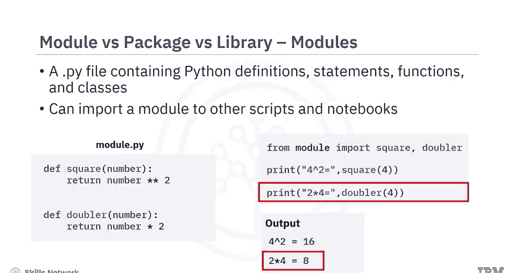
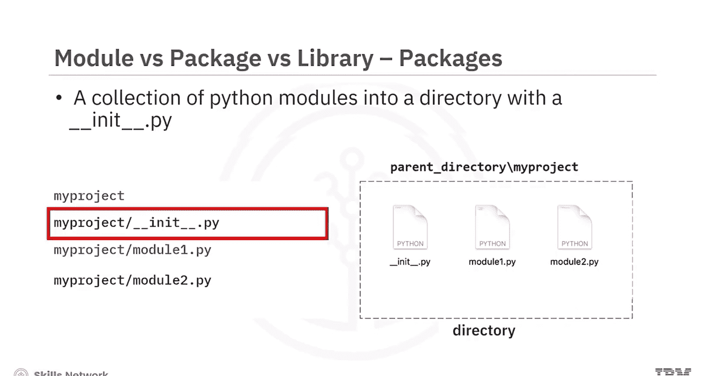
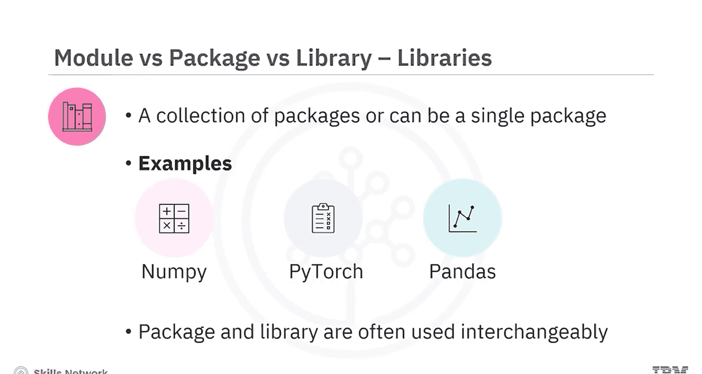
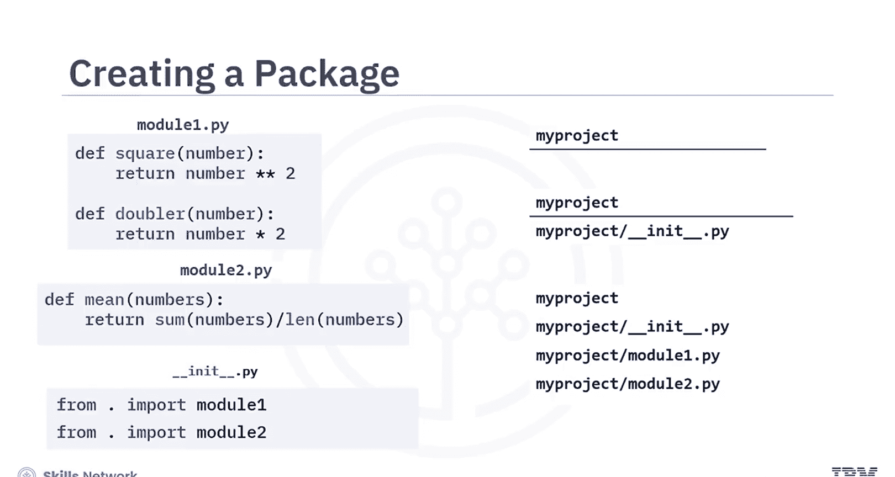
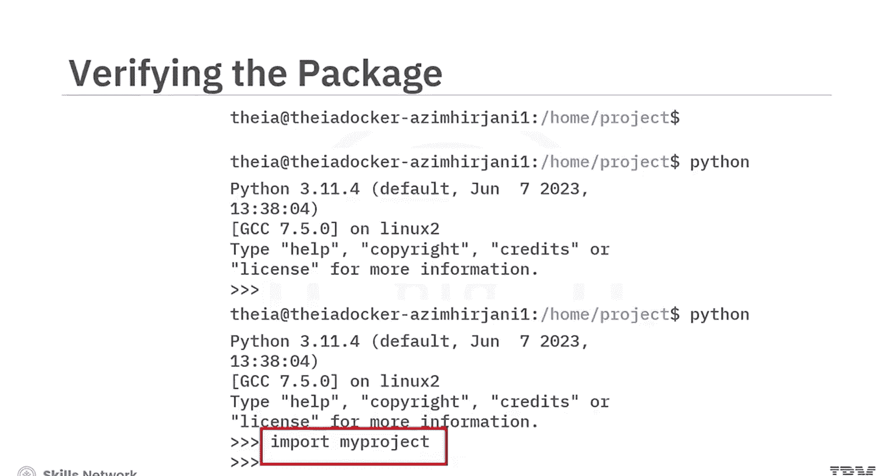
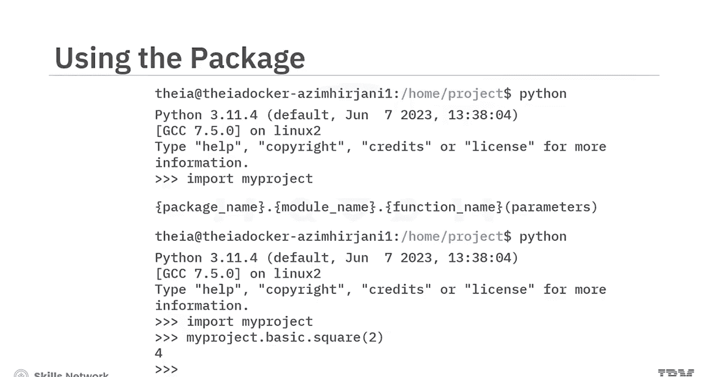
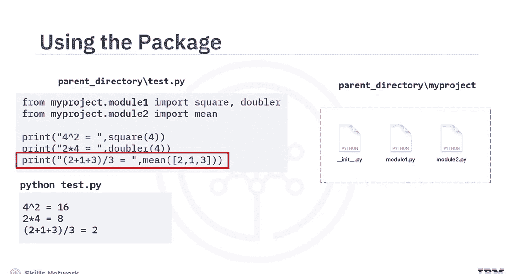
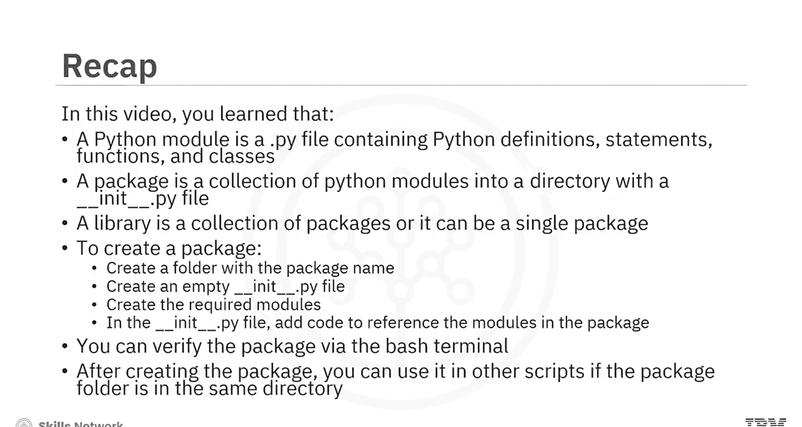

生成式人工智能工程：007：Python 打包 📦



在本节课中，我们将要学习 Python 中模块、包和库的概念与区别，并掌握如何创建、验证和使用一个 Python 包。



---

### 模块、包与库的概念 🔍

模块、包和库是 Python 中经常使用的术语。上一节我们介绍了课程概述，本节中我们来看看这些核心概念的具体含义。

**Python 模块** 是一个 `.py` 文件，其中包含 Python 的定义、语句、函数和类。你可以将模块导入到其他脚本或笔记本中使用。

例如，考虑一个名为 `module.py` 的模块，它包含两个函数：
*   第一个函数是 `def square(number): return number ** 2`，用于计算输入数字的平方。
*   第二个函数是 `def doubler(number): return number * 2`，用于将输入数字翻倍。



如果该模块文件与你的脚本在同一目录下，你可以导入并使用其中的函数。例如，调用 `square(4)` 会输出 `4^2 = 16`；调用 `doubler(4)` 会输出 `2*4 = 8`。

**Python 包** 是一个包含 `__init__.py` 文件的目录，该目录下汇集了多个 Python 模块。这个 `__init__.py` 文件的存在，使其区别于普通的脚本目录。

例如，一个名为 `my_project` 的包，其目录结构可能包含 `module1.py`、`module2.py` 和 `__init__.py` 文件。当你导入一个模块或包时，Python 创建的对象类型始终是 `module`。请注意，模块和包的区别仅在于文件系统层面。



**Python 库** 是一个或多个包的集合。例如，NumPy、PyTorch 和 Pandas 都是库。需要注意的是，“包”和“库”这两个术语经常互换使用，因此 NumPy、PyTorch 和 Pandas 也常被称为包。

---



### 创建 Python 包的步骤 🛠️

理解了基本概念后，接下来我们看看如何动手创建一个 Python 包。假设我们有两个模块：
*   `module1.py` 包含 `square` 和 `doubler` 函数。
*   `module2.py` 包含 `mean` 函数。

要将 `my_project` 文件夹变成一个包，必须在该文件夹内创建一个 `__init__.py` 文件。该文件的内容通常用于引用包内的模块，例如：
```python
from . import module1
from . import module2
```

以下是创建包的典型步骤：
1.  创建一个以包名命名的文件夹（例如 `my_project`）。
2.  在该文件夹内创建一个空的 `__init__.py` 文件。
3.  创建所需的模块文件（例如 `module1.py`, `module2.py`）。
4.  在 `__init__.py` 文件中添加代码，以引用包中需要的模块。

---



### 验证 Python 包 ✅

创建包之后，需要验证它是否能被正确加载。验证步骤如下：
1.  打开 Bash 终端。
2.  确保当前目录与你的包所在的文件夹处于同一层级。
3.  在 shell 中运行 `python` 命令，打开 Python 解释器。



在 Python 提示符下，键入 `import` 后跟你的包名，例如：
```python
import my_project
```
如果该命令运行无误，则表明包已成功加载。

测试包中函数的一般结构是：`包名.模块名.函数名(参数)`。例如，调用 `my_project.module1.square(2)`，该函数应返回值 `4`。



---

### 使用 Python 包 🚀

成功创建并验证包后，就可以在其他脚本中使用它了，前提是包文件夹与脚本在同一目录下。



例如，在父目录中有一个 `test.py` 文件，你可以这样导入包中的函数：
```python
from my_project.module1 import square, doubler
from my_project.module2 import mean

print(f“4^2 = {square(4)}“)
print(f“2*4 = {doubler(4)}“)
print(f“(2+1+3)/3 = {mean(2, 1, 3)}“)
```
运行这些函数，即可检查是否能得到正确的结果。

---

### 总结 📝




本节课中我们一起学习了 Python 中模块、包和库的核心概念与操作方法：
*   **Python 模块** 是一个包含 Python 代码的 `.py` 文件。
*   **Python 包** 是一个包含 `__init__.py` 文件和多个模块的目录。
*   **Python 库** 是一个或多个包的集合。
*   创建包的步骤包括：创建文件夹、添加 `__init__.py` 文件、编写模块、在 `__init__.py` 中引用模块。
*   可以通过 Python 解释器导入包来验证其是否创建成功。
*   创建完成后，即可在相同目录下的其他脚本中导入并使用该包。