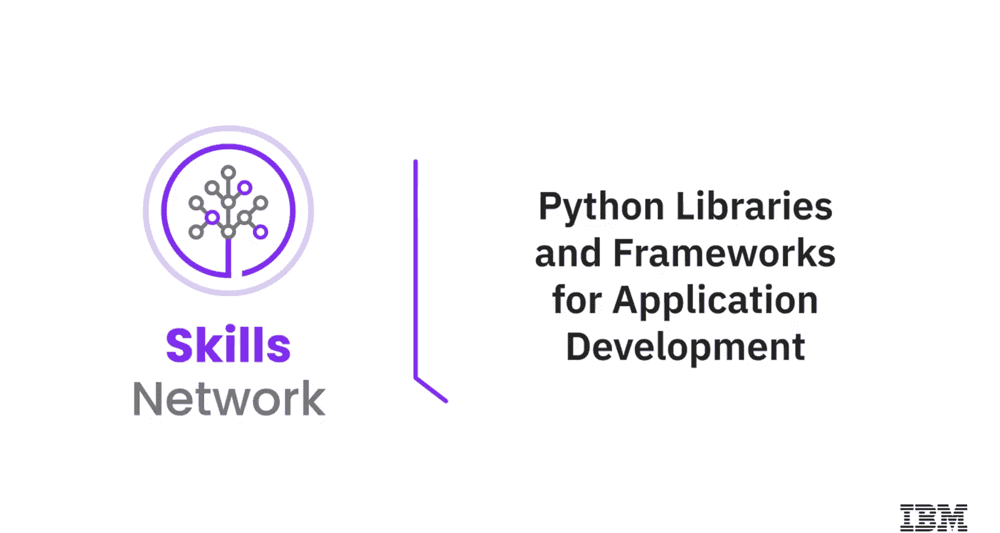
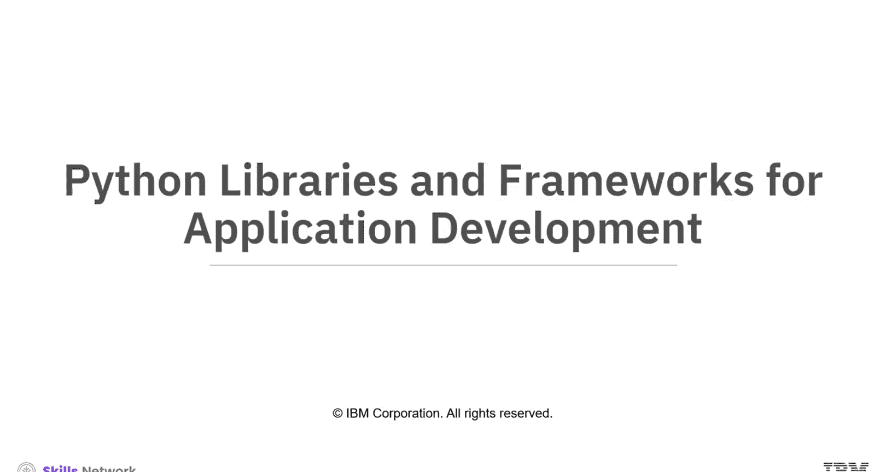
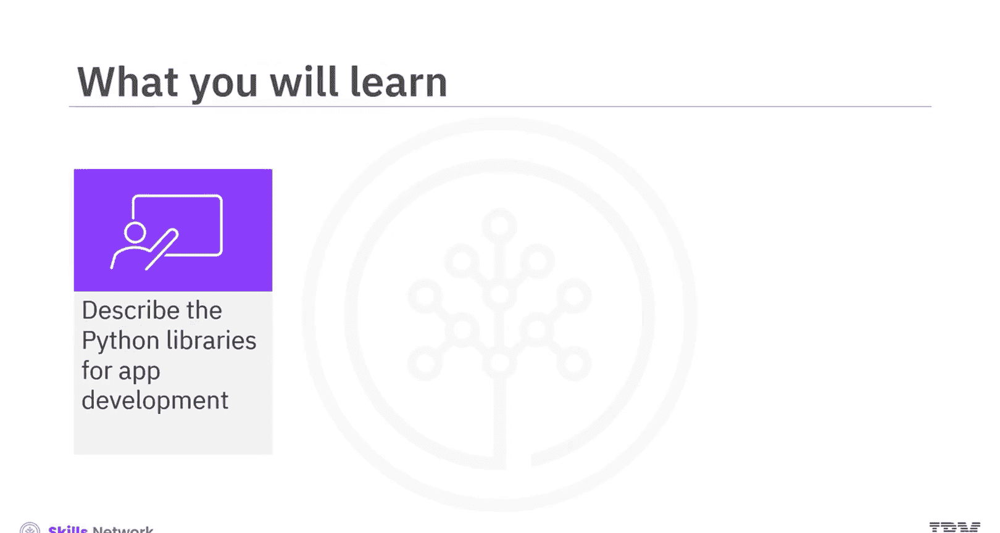
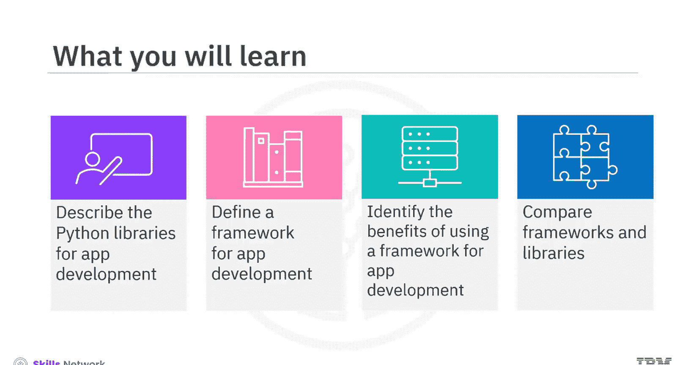
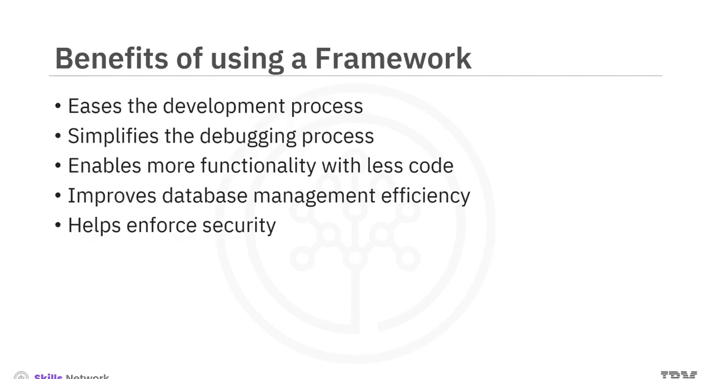
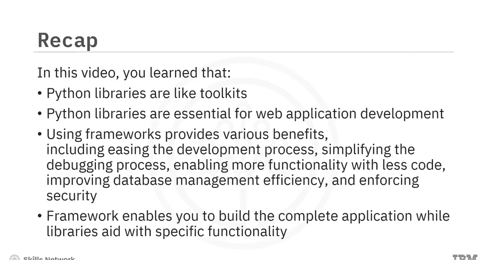
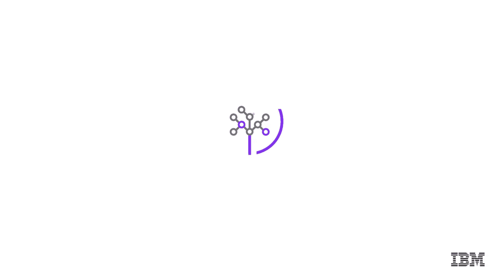

生成式人工智能工程：008：应用程序开发的Python库和框架 🐍

在本节课中，我们将要学习用于应用程序开发的Python库和框架。我们将了解库和框架的定义、它们各自的优势，以及它们之间的区别。

---

### Python库：你的编程工具箱 🧰

Python库可以被视为一个工具箱。每个库都包含特定的工具，旨在简化和加速特定的编程任务。开发者无需从零开始编写所有功能，可以直接调用这些库来节省大量时间和精力。

以下是几个在应用开发中至关重要的Python库示例：

*   **NumPy**：该库便于进行高级数学计算。
*   **Pandas**：该库提供了强大的数据操作和分析能力。
*   **Matplotlib**：该库简化了数据可视化的过程。
*   **Requests**：该库简化了发送HTTP请求的过程。
*   **Beautiful Soup**：该库使得从网页中抓取信息、遍历、搜索和修改解析树变得容易。
*   **SQLAlchemy**：这是一个SQL工具包和对象关系映射（ORM）工具。它为应用开发者提供了SQL的全部功能和灵活性。
*   **PyTest**：这是一个测试框架，允许用户轻松创建小型、简单的测试，同时也能扩展以支持对应用程序和库进行复杂的功能测试。

---

### 框架：应用程序的预定义结构 🏗️

上一节我们介绍了Python库，本节中我们来看看框架。框架是用于应用程序开发的预定义结构。此外，框架还为应用程序开发提供了一套指导原则。

框架通过提供一个定义良好的结构来编写和组织代码，并支持复用代码库以添加功能，从而促进了良好的编码实践。

一些常见的Python Web框架示例包括Django、Flask和Web2py。

---

### 使用框架的优势 ✨

使用框架进行应用开发能带来多方面的好处。以下是其主要优势：

*   **简化开发过程**：框架通过提供预写的代码库、模块和开发者指南，简化了开发过程。
*   **简化调试过程**：借助预构建的调试工具，Web框架为开发者简化了调试Web应用程序的过程。
*   **用更少的代码实现更多功能**：开发者可以使用更少的代码添加更多功能。因为框架配备了多个预构建的库和模块，开发者在编写代码时可以充分利用这些资源，无需从零开始创建所有必需的功能。
*   **提高数据库管理效率**：框架自带内置的数据库集成工具，有助于无缝集成数据库端点以传输数据。
*   **增强安全性**：安全性是应用程序用户关注的关键问题。使用框架的一个好处是，开发者可以利用内置的安全功能和指南来加强应用安全。

---

### 框架与库的区别 🔄

让我们简要地看看框架和库之间有何不同。

**框架**包含了应用程序的基本流程和架构，使你能够构建完整的应用程序。你可以将其想象成建造房屋的蓝图和主体结构。

**Python库**是一组仅执行特定功能的包。它更像是工具箱里的一把锤子或螺丝刀，用于完成某个具体任务。

---

### 总结 📝

本节课中我们一起学习了Python库和框架的核心概念。我们了解到，Python库如同工具箱，每个库都有特定工具来简化和加速编程任务。框架则是应用程序开发的预定义结构，使用框架能带来诸多好处，包括简化开发与调试过程、用更少的代码实现更多功能、提高数据库管理效率以及增强安全性。最后，我们明确了框架用于构建完整应用程序，而库则辅助实现特定功能。