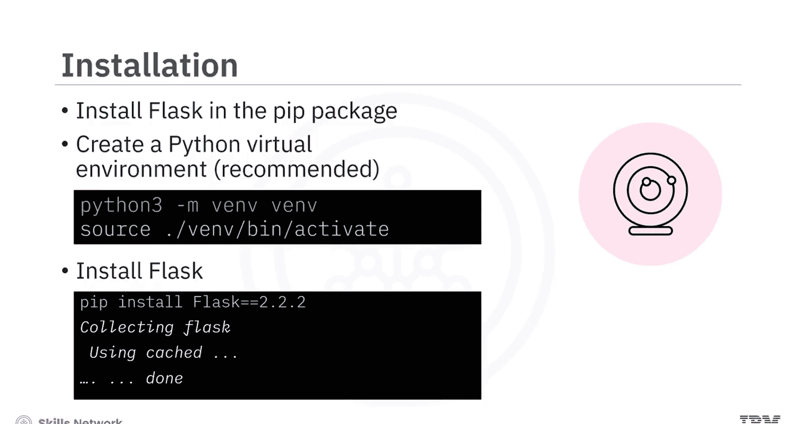
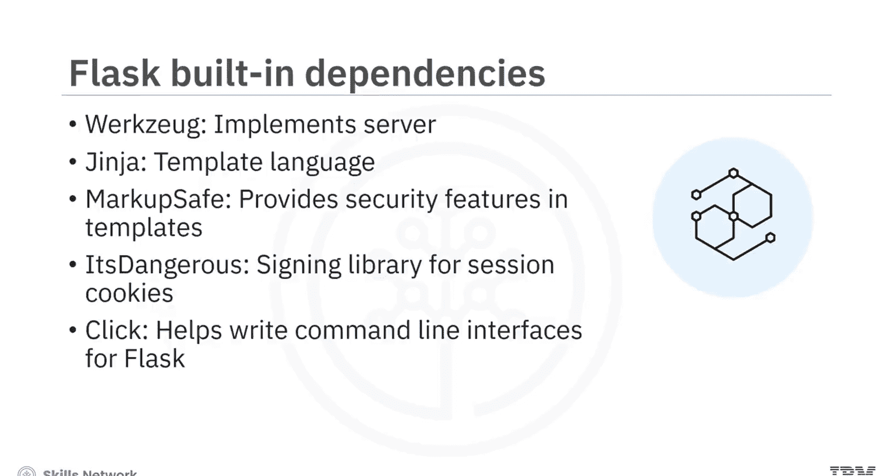
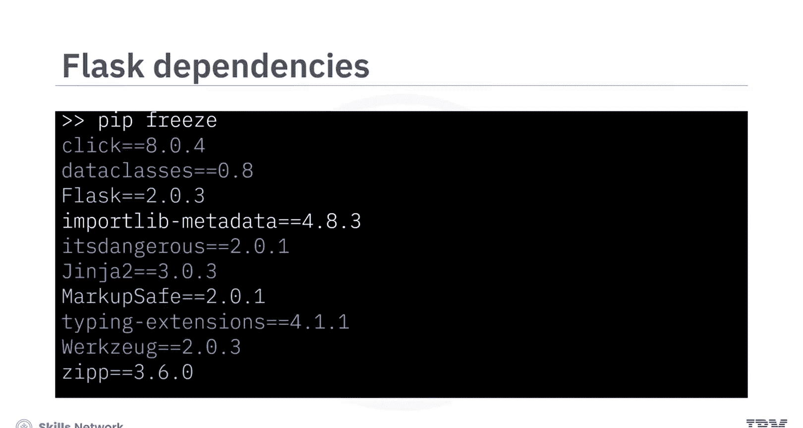
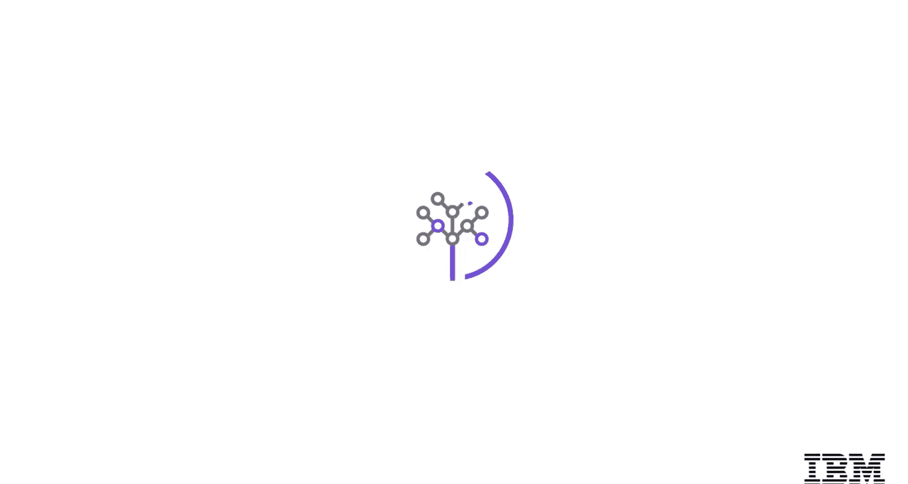

# 生成式人工智能工程：009：Flask简介 🐍

在本节课中，我们将学习Flask Web框架。我们将定义Flask，描述其主要特性，解释如何安装Flask及其主要依赖项，并比较Flask与另一个Python Web框架Django的主要区别。

Flask是一个用于创建Web应用程序的微框架。它不像一些大型框架那样具有强制的“约定”，也不强制用户使用特定的工具集。

## Flask的起源与核心特性

Flask由Armin Ronacher于2004年创建，最初是一个愚人节玩笑。它因其易用性和可扩展性而迅速流行起来。Flask提供了创建Web应用程序所需的最小依赖，但它本身是可扩展的，许多社区扩展为其添加了额外功能。

以下是Flask的主要特性：

*   **内置开发服务器与调试器**：Flask自带一个在开发模式下运行应用程序的Web服务器。它还包含一个调试器，可在浏览器中显示交互式回溯和堆栈跟踪，帮助调试应用程序。
*   **日志记录**：Flask使用标准的Python日志记录功能来处理应用程序日志。开发者可以使用相同的记录器来记录关于应用程序的自定义消息。
*   **测试支持**：Flask提供了测试应用程序不同部分的方法。此功能使开发者能够遵循测试驱动开发方法，并可以使用像`pytest`和`coverage`这样的框架来确保代码按预期工作。
*   **请求与响应对象**：开发者可以访问请求和响应对象，以提取参数并自定义响应。

## Flask的附加功能

上一节我们介绍了Flask的核心特性，本节中我们来看看它提供的其他重要功能。

以下是Flask的附加功能：

*   **静态文件支持**：该框架支持静态资源，如CSS文件、JavaScript文件和图像。Flask提供了在模板中加载静态文件的标签。
*   **动态页面与模板**：开发者可以使用Jinja2模板框架开发动态页面。这些动态页面可以显示可能随每个请求而变化的信息，或者检查用户是否已登录。
*   **路由与动态URL**：Flask提供路由功能，并支持动态URL，这对于构建RESTful服务极为有用。开发者可以为不同的HTTP方法创建路由，并在应用程序中提供重定向。
*   **错误处理**：开发者可以在Flask中编写全局错误处理程序，这些处理程序在应用程序级别工作。
*   **会话管理**：Flask支持用户会话管理。

## 社区扩展

Flask的轻量级设计意味着许多高级功能通过社区扩展实现。以下是可添加到应用程序中的一些流行社区扩展：

*   **Flask-SQLAlchemy**：为Flask添加了对名为SQLAlchemy的ORM的支持，使开发者能够用Python操作数据库对象。
*   **Flask-Mail**：提供了设置SMTP邮件服务器的能力。
*   **Flask-Admin**：让开发者可以轻松地为Flask应用程序添加管理界面。
*   **Flask-Uploads**：允许向应用程序添加自定义的文件上传功能。

除了上述扩展，这里还有一些其他有用的扩展：

*   **Flask-CORS**：使应用程序能够处理跨源资源共享，从而实现跨源JavaScript请求。
*   **Flask-Migrate**：为SQLAlchemy ORM添加数据库迁移功能。
*   **Flask-User**：添加用户认证、授权和其他用户管理功能。
*   **Marshmallow**：为代码添加了强大的对象序列化和反序列化支持。
*   **Celery**：一个强大的任务队列，可用于简单的后台任务和复杂的多阶段程序和调度。

## 安装与依赖管理

了解了Flask的功能后，接下来我们看看如何安装它以及如何管理其依赖。

Flask可通过Python包管理器`pip`获取。在实验环境中，`pip`已可用。但是，如果要在自己的机器上安装，建议首先使用`venv`或`Pipenv`模块创建一个虚拟环境。然后，可以安装Flask 2.2.2版本。



```bash
pip install flask==2.2.2
```

建议在应用程序中固定依赖项的版本号。这确保了应用程序可以在不同的环境（如开发、预发布和生产）中从头开始复现。同时，这也避免了在自动更新包时，因未指定版本号而意外引入新问题或错误。

Flask附带了一些内置依赖，以实现各种功能：



*   **Werkzeug**：实现了WSGI（Web服务器网关接口）。这是应用程序和服务器之间的标准Python接口。
*   **Jinja2**：一种模板语言，用于渲染应用程序中的页面。
*   **MarkupSafe**：随Jinja2一同提供。它在渲染模板时转义不受信任的输入，以避免注入攻击。
*   **ItsDangerous**：用于安全地签名数据。这有助于确定数据是否被篡改，并用于保护Flask的会话Cookie。
*   **Click**：一个用于编写命令行应用程序的框架。它提供了`flask`命令，并允许添加自定义管理命令。



要查看内置依赖，可以在虚拟环境中使用`pip freeze`命令，你将看到所有内置包默认都已安装。

## Flask与Django的对比

另一个流行的Python Web开发框架是Django。以下是Flask和Django之间的一些关键区别：

*   **定位与功能**：Flask旨在成为一个非常轻量级的框架。而Django是一个全栈框架。因此，Flask只提供创建Web应用程序所需的基本依赖，开发者可以选择其他扩展来提供附加功能。相反，Django包含了创建全栈应用程序所需的一切。
*   **灵活性与约定**：Flask非常灵活，可以以“即插即用”的方式添加和移除组件。另一方面，Django是“约定优于配置”的，它为开发者做出了大部分决策，以便他们可以专注于应用程序的逻辑。

## 总结



本节课中我们一起学习了Flask Web框架。我们了解到Flask是一个附带最小依赖的微框架，用于构建网站。它具有调试服务器、路由、模板和错误处理等功能。Flask可以通过使用社区扩展来增强功能，并可作为Python包安装。与Flask相比，Django是一个全栈框架。