# 生成式人工智能工程：011：使用GET和POST模式的请求和响应对象 🚀

在本节课中，我们将学习Flask框架中的两个核心对象：请求对象（Request Object）和响应对象（Response Object）。你将了解如何定义路由以响应不同的HTTP方法（如GET和POST），如何从客户端请求中提取数据，以及如何构建和定制返回给客户端的响应。

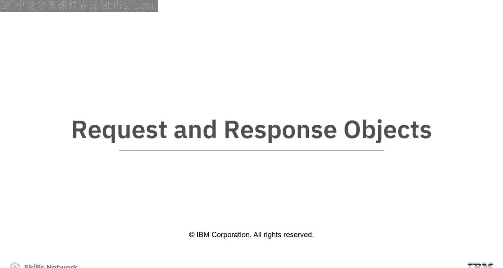

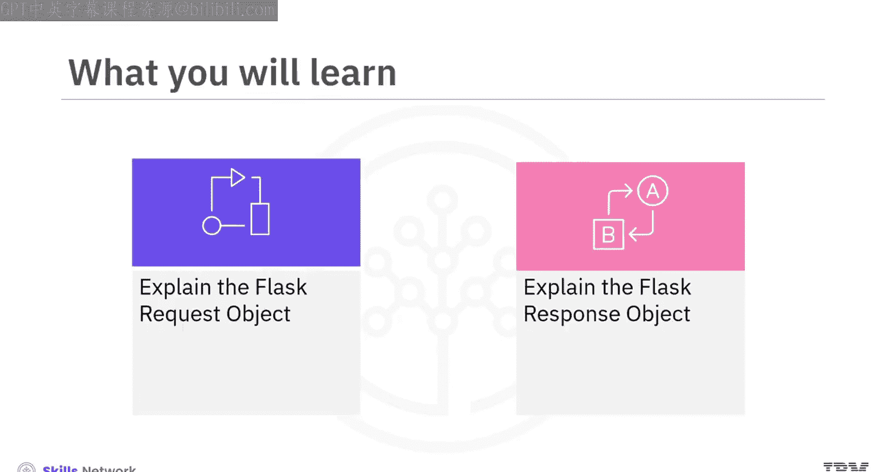

---

## 自定义Flask路由 🔧

上一节我们介绍了Flask应用的基本结构，本节中我们来看看如何自定义路由以响应不同的HTTP请求方法。

在Flask中，你可以使用 `@app.route` 装饰器来定义路径。默认情况下，该装饰器只响应GET方法的请求。客户端只能向指定路径发送GET请求。

现在，你可以传入第二个参数 `methods` 来控制该路径响应哪些HTTP方法。

例如，以下两种写法是等价的。第一种写法中，GET方法是隐式指定的；第二种写法则明确指定了GET方法。

```python
@app.route('/')
def home():
    return 'Home Page'

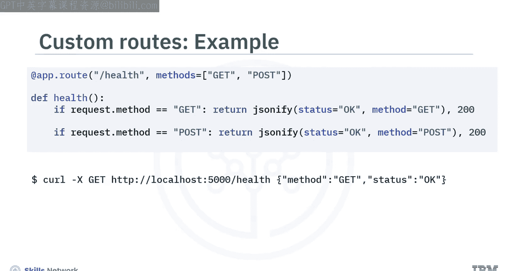

@app.route('/', methods=['GET'])
def home_explicit():
    return 'Home Page'
```

以下是另一个例子。路径 `/health` 将同时响应GET和POST请求。

```python
@app.route('/health', methods=['GET', 'POST'])
def health_check():
    if request.method == 'GET':
        return 'Status: OK, Method: GET'
    elif request.method == 'POST':
        return 'Status: OK, Method: POST'
```

使用curl命令测试，GET请求的输出是 `Status: OK, Method: GET`，而POST请求的输出是 `Status: OK, Method: POST`。

---

## 理解Flask请求对象 📥

当客户端向Flask服务器请求资源时，Flask会为每次HTTP调用创建一个来自 `flask.request` 类的请求对象。这个请求由 `@app.route` 装饰器处理，你可以在对应的视图方法中检查和探索这个请求对象。

以下是请求对象中可用的部分信息：

*   **`request.host`**: 服务器的地址，形式为 `(主机, 端口)` 的元组。
*   **`request.headers`**: 随请求发送的头部信息。
*   **`request.url`**: 客户端请求的资源URL。
*   **`request.access_route`**: 列出所有IP地址的列表，适用于请求被多次转发的情况。
*   **`request.full_path`**: 表示请求的完整路径，包括任何查询字符串。
*   **`request.is_secure`**: 如果客户端使用HTTPS或WSS协议发起请求，则为 `True`。
*   **`request.is_json`**: 如果请求包含JSON数据，则为 `True`。
*   **`request.cookies`**: 包含随请求发送的任何Cookie的字典。

此外，你还可以从请求头中访问以下数据：

*   **`Cache-Control`**: 控制浏览器如何缓存。
*   **`Accept`**: 告知服务器客户端理解的内容类型。
*   **`Accept-Encoding`**: 指示可接受的内容编码。
*   **`User-Agent`**: 标识客户端应用程序、操作系统或版本。
*   **`Accept-Language`**: 请求特定的语言和区域设置。
*   **`Host`**: 指定所请求服务器的主机和端口号。

通常，Flask内置的请求类提供的属性和方法已经足够，替换为自定义请求对象是可选的。

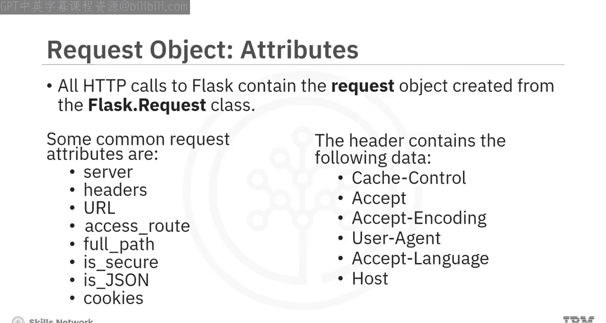

---

## 请求对象属性示例 💻

现在，让我们看看当客户端（例如，使用终端curl命令）发起请求时，服务器上打印出的一些实际值。

假设客户端向 `http://127.0.0.1:5000/` 发起GET请求。

以下是部分请求对象属性的值：

*   `request.host`: `localhost:5000`
*   `request.headers['User-Agent']`: `curl/7.79.1`
*   `request.headers['Accept']`: `application/json`
*   `request.url`: `http://localhost:5000/`
*   `request.access_route`: `['127.0.0.1']`
*   `request.full_path`: `/`
*   `request.is_json`: `False` （因为GET请求未发送数据）
*   `request.is_secure`: `False` （因为URL是HTTP而非HTTPS）
*   `len(request.cookies)`: `0`

---

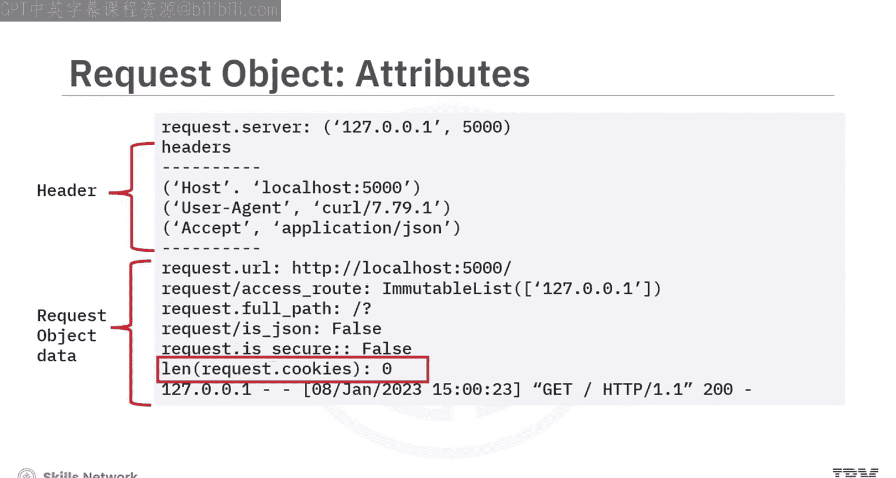

## 从请求中提取数据 🛠️

有多种方法可以从请求对象中获取信息。

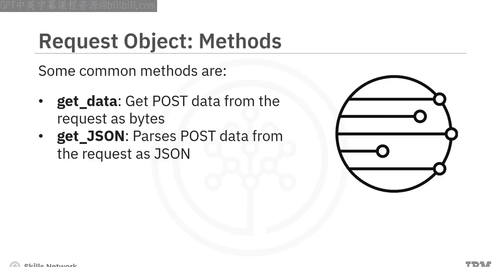

*   使用 `request.get_data()` 以字节形式访问POST请求的数据，然后你需要负责解析这些数据。
*   使用 `request.get_json()` 方法获取已解析为JSON格式的POST请求数据。

Flask还提供了更聚焦的方法来直接从请求中获取特定类型的信息，无需手动解析：

*   **`request.args`**: 以字典形式提供查询参数（URL中的 `?key=value`）。
*   **`request.json`**: 将请求体数据解析为字典（如果内容是JSON）。
*   **`request.files`**: 提供用户上传的文件。
*   **`request.form`**: 包含表单提交中发布的所有值。
*   **`request.values`**: 结合了 `args` 和 `form` 的数据。

---

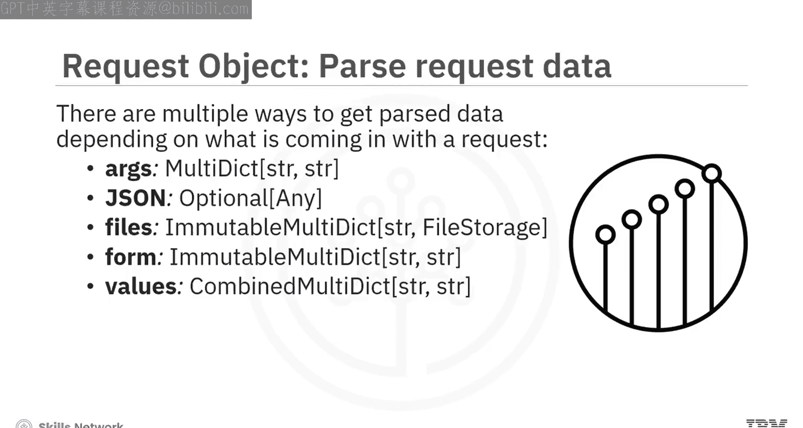

## 提取特定值 📝

现在你知道了请求对象的样子以及获取数据的方法，让我们看看如何从这些数据中提取具体的值。

到目前为止你看到的方法的返回类型是 `MultiDict`、`ImmutableMultiDict` 或 `CombinedMultiDict`。这些数据结构的行为类似于Python字典，你可以使用索引或 `.get()` 方法来提取值。

假设对于给定的URL `http://localhost:5000/course?name=capstone&rating=10`，你想提取查询参数 `name` 和 `rating`。

```python
from flask import Flask, request

@app.route('/course')
def get_course():
    # 使用索引方式提取，如果参数不存在会引发错误（400 Bad Request）
    course_name = request.args['name']  # 返回 'capstone'

    # 使用.get()方法提取，如果参数不存在则返回None（或指定的默认值）
    course_rating = request.args.get('rating')  # 返回 '10'
    # 或 request.args.get('rating', default=0, type=int)  # 返回整数 10

    return f"Course: {course_name}, Rating: {course_rating}"
```

`.get()` 方法在参数不存在时返回 `None`（或你指定的默认值），而索引方法在参数不存在时会引发错误并导致服务器返回400错误。

---

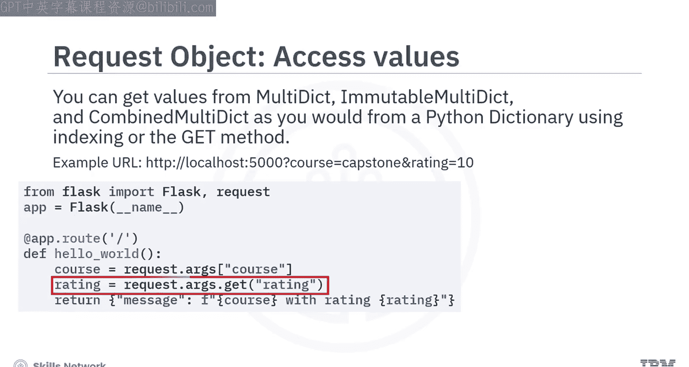

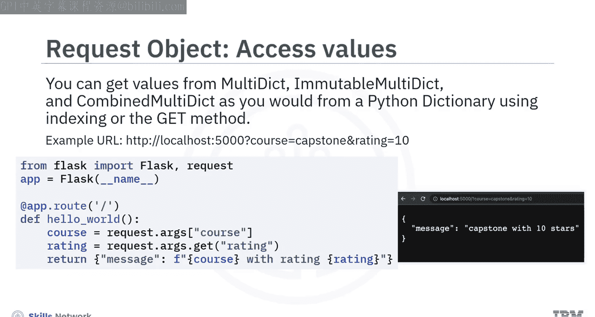

## 理解Flask响应对象 📤

就像提供请求对象一样，Flask也会为每个客户端调用提供一个响应对象。你可以使用响应对象向客户端发送自定义属性和头部信息。

一些常见的响应属性包括：

*   **`status_code`**: 指示请求的成功或失败状态（如200表示成功，404表示未找到）。
*   **`headers`**: 提供关于响应的更多信息。
*   **`content_type`**: 显示所请求资源的媒体类型（如 `text/html`）。
*   **`content_length`**: 响应消息体的大小。
*   **`content_encoding`**: 指示应用于响应的任何编码，以便客户端知道如何解码数据。
*   **`mimetype`**: 设置响应的媒体类型。
*   **`expires`**: 包含响应被视为过期的日期或时间。

响应对象上还有一些标准方法：

*   **`set_cookie()`**: 在客户端设置浏览器Cookie。
*   **`delete_cookie()`**: 删除客户端上的Cookie。

---

## 使用响应对象的方法 🎯

现在让我们学习Flask如何使用不同的方法与响应对象协作。

1.  **自动创建**：当你从 `@app.route` 方法返回数据（如字符串）时，Flask会自动为你创建一个状态码为200、MIME类型为 `text/html` 的响应对象。
2.  **`jsonify()`**：`jsonify()` 函数也会自动创建一个带有正确 `application/json` 内容类型的响应对象。
    ```python
    from flask import jsonify
    return jsonify({'message': 'Hello'})
    ```
3.  **`make_response()`**：使用 `make_response()` 可以创建自定义的响应对象，以便设置状态码、头部等。
    ```python
    from flask import make_response
    resp = make_response('Custom Response', 201)
    resp.headers['X-Custom-Header'] = 'Value'
    return resp
    ```
4.  **`redirect()`**：Flask提供了一个特殊的 `redirect()` 方法，用于返回302状态码并将客户端重定向到另一个URL。
    ```python
    from flask import redirect
    return redirect('/new_location')
    ```
5.  **`abort()`**：最后，Flask提供了 `abort()` 方法来返回一个带有错误条件的响应（如404）。
    ```python
    from flask import abort
    abort(404)  # 返回 404 Not Found 错误页面
    ```

---

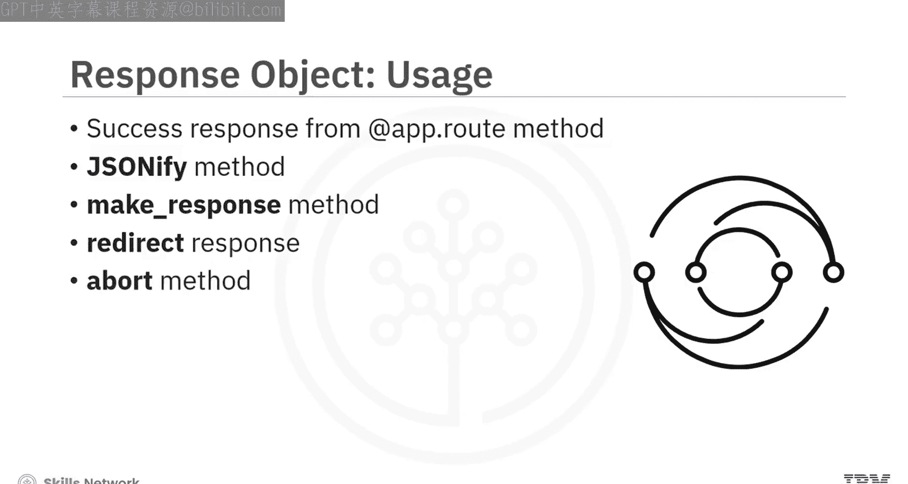

## 总结 📚

本节课中我们一起学习了Flask框架中请求与响应对象的核心用法。

*   Flask为每个客户端调用提供了一个**请求对象**和一个**响应对象**。
*   你可以从Flask请求对象中获取额外信息，如**头部**。
*   你可以解析请求对象以获取**查询参数**、**请求体**和其他参数。
*   你可以在将响应发送回客户端之前，在响应对象上设置**状态码**、**头部**等属性。

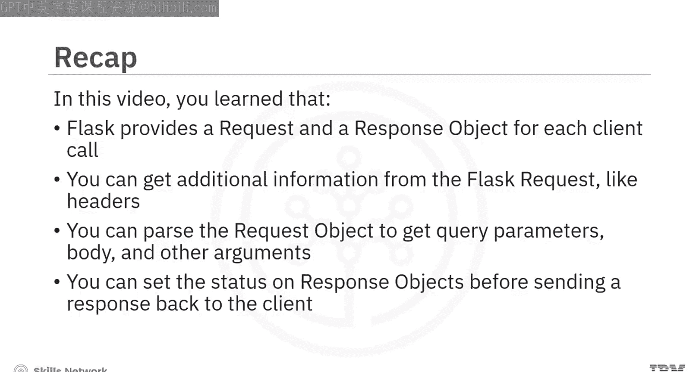

掌握这些对象和方法，是构建能够处理复杂客户端交互的Web应用的基础。