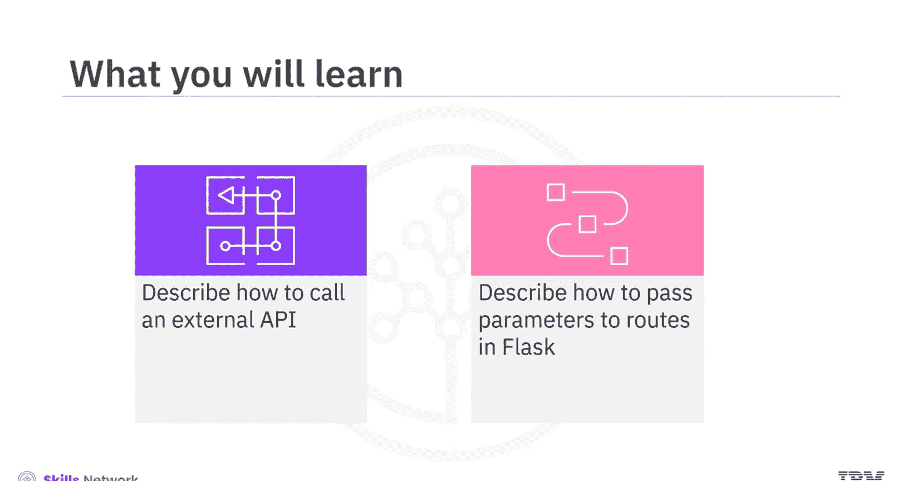
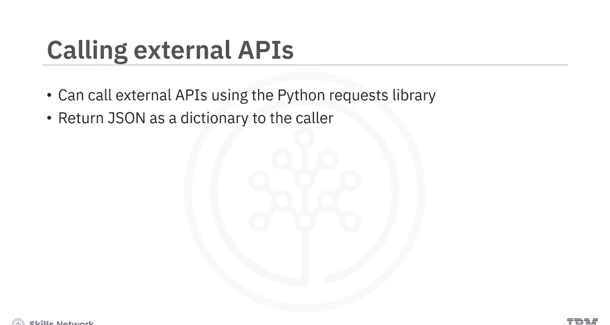
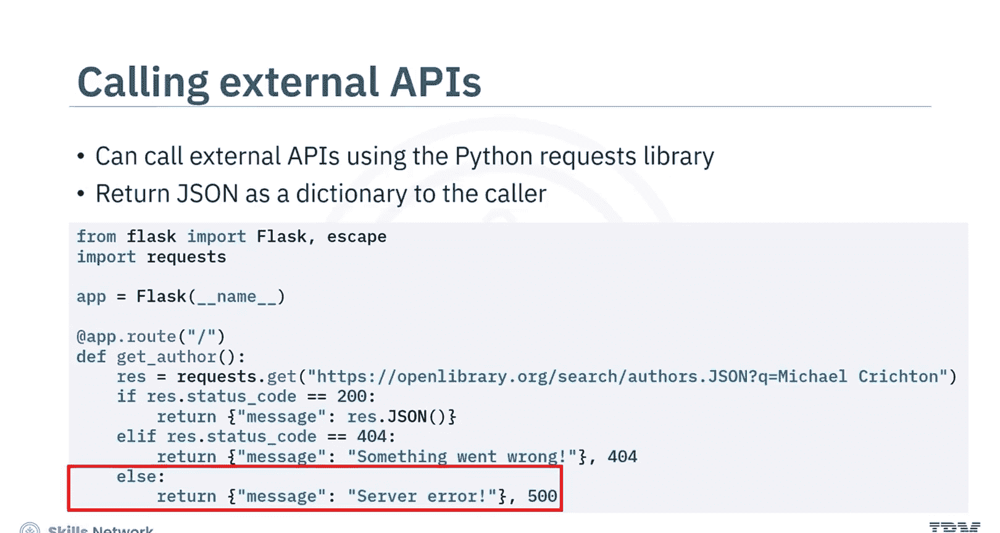
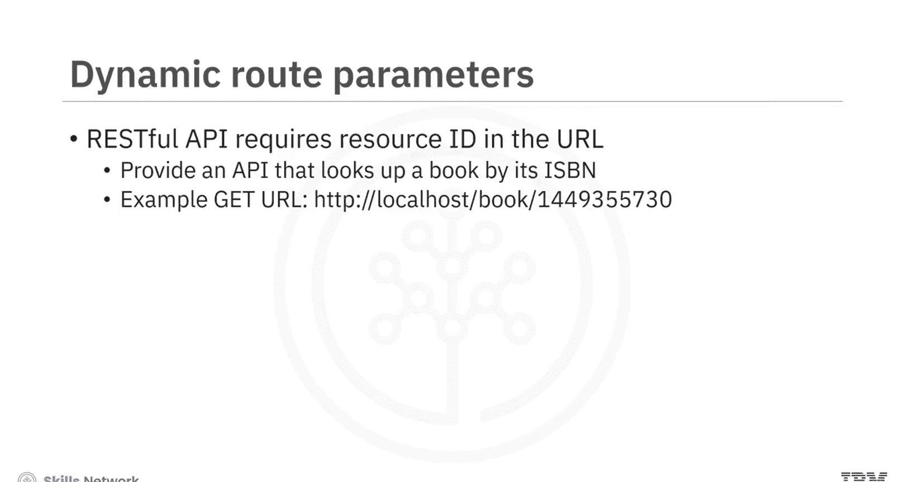
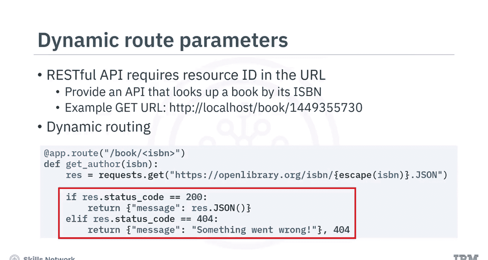
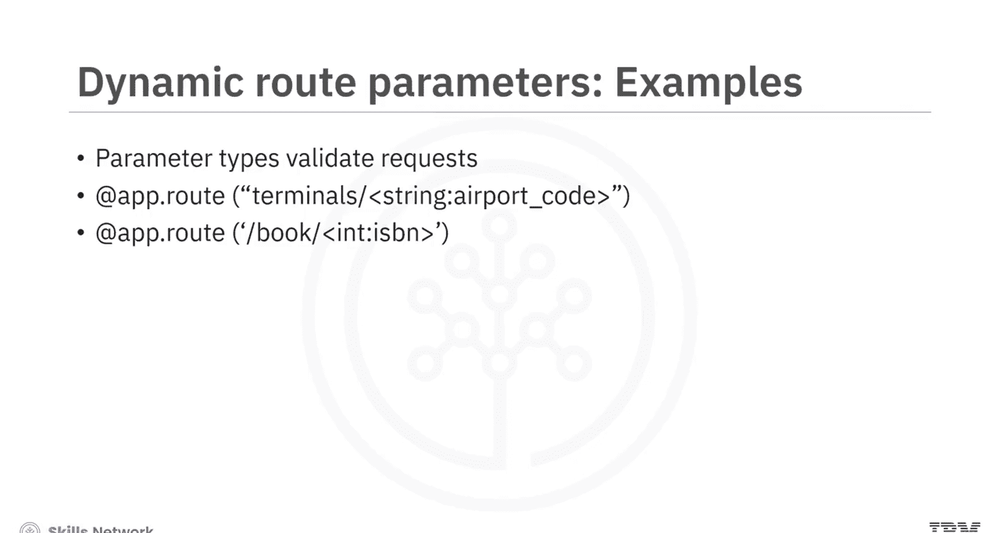
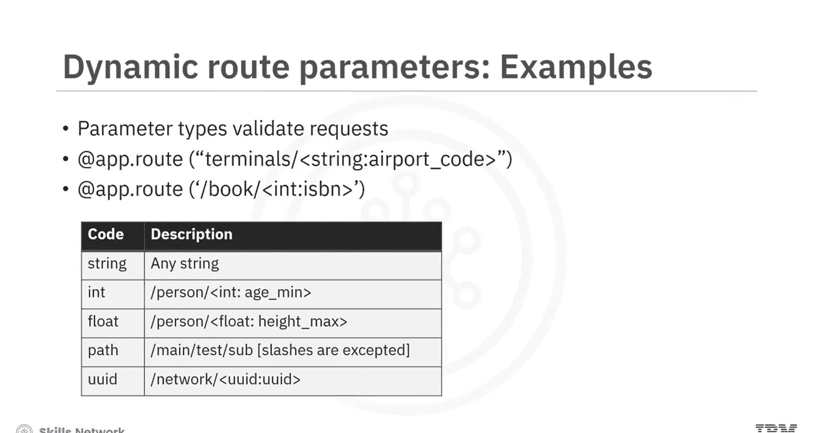
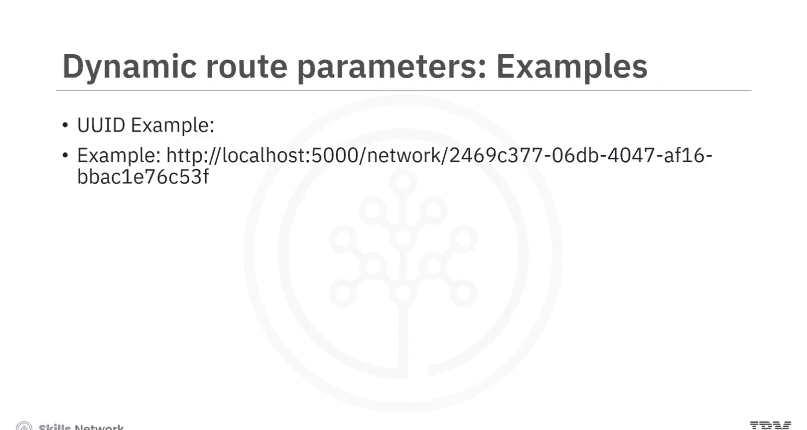
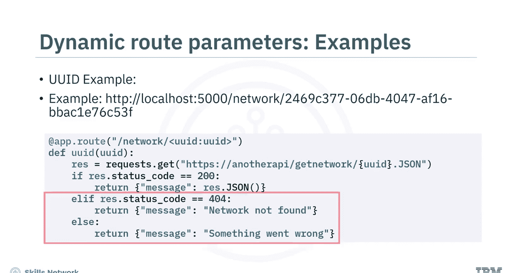
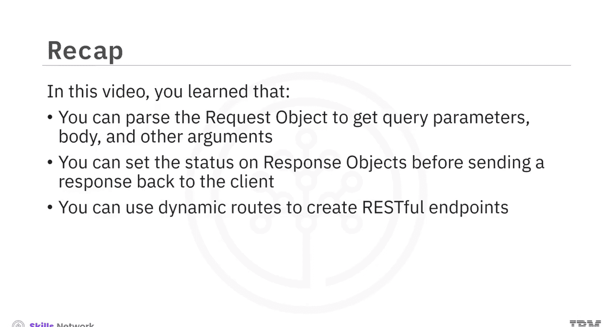

# 生成式人工智能工程：012：动态路由 🛣️

在本节课中，我们将学习如何在 Flask 框架中调用外部 API，以及如何通过动态路由向 URL 传递参数。掌握这些技能对于构建能够与外部服务交互、并能处理不同请求的 RESTful API 至关重要。


## 调用外部 API 📡



在 Flask 应用中，调用外部 API 是一种常见需求。最简单的方法是使用 Python 的 `requests` 库。你可以将外部 API 返回的 JSON 数据直接发送给客户端，也可以在发送前对结果进行处理。

以下是一个调用外部 API 的示例。

首先，导入必要的模块。这段代码假设你已经安装了 `requests` 库。

```python
import flask
import requests
```

接下来，定义你的路由。使用 `requests` 库请求 Open Library API，并搜索作者 Michael Crichton 的信息。

```python
@app.route('/author')
def get_author():
    res = requests.get('https://openlibrary.org/search/authors.json?q=Michael Crichton')
```

然后，将响应存储在变量 `res` 中。检查来自 Open Library API 的响应状态码是否为 200。



```python
    if res.status_code == 200:
        return res.json()
```

如果响应状态码恰好是 404，则发送一条“出错了”的消息。



```python
    elif res.status_code == 404:
        return 'Something went wrong.', 404
```

最后，在这个假设的场景中，如果响应是其他任何状态码，则返回状态码 500 和一条“服务器错误”的消息。

```python
    else:
        return 'Server error.', 500
```

## 动态路由参数 🔄



上一节我们介绍了如何调用外部 API，本节中我们来看看如何让路由变得更灵活。在开发 RESTful API 时，你可以将一些资源 ID 作为请求 URL 的一部分发送。例如，你想创建一个通过国际标准书号（ISBN）返回图书信息的端点，但你不希望硬编码 ISBN，而是希望客户端将其作为 URL 的一部分发送。Flask 为此提供了动态路由功能。

现在让我们看一个具体例子。在 URL 中添加一个名为 `isbn` 的变量作为动态部分，然后将这个变量传递给 Open Library API，最后将结果发送回客户端。



```python
@app.route('/book/<isbn>')
def get_book(isbn):
    res = requests.get(f'https://openlibrary.org/isbn/{isbn}.json')
    if res.status_code == 200:
        return res.json()
    else:
        return 'Book not found.', 404
```

## 参数类型验证 ✅

Flask 还允许你设置参数类型。框架会利用这些信息来验证传入的请求。例如，你可以创建一个端点 `/terminals/<string:airport_code>` 来获取某个机场的航站楼数量。当用户在 URL 末尾发送一个字符串时，这个路由装饰器就会被触发。

同样地，在上一个例子中，你可以指定 `isbn` 必须是一个数字。



```python
@app.route('/book/<int:isbn>')
def get_book_by_int_isbn(isbn):
    # 注意：ISBN 通常是字符串，这里仅作类型示例
    res = requests.get(f'https://openlibrary.org/isbn/{isbn}.json')
    # ... 处理逻辑
```

以下是 Flask 中其他一些参数类型的例子。

*   **`string`**： 接受任何不带斜杠的文本（默认类型）。
*   **`int`**： 接受正整数。
*   **`float`**： 接受正浮点数。
*   **`path`**： 类似 `string`，但接受斜杠，常用于表示路径。
*   **`uuid`**： 接受 UUID 字符串，用于表示全局唯一标识符。





虽然 `string`、`int` 和 `float` 是简单参数，但你也可以使用复杂的类型，如 `path` 来表示网页路径或文件夹路径，或者使用 `uuid` 来表示像 GUID 这样的唯一 ID。

这里是一个使用 `uuid` 类型的示例。

你可以创建一个端点 `/network/<uuid:network_id>` 来获取具有特定 UUID 的网络信息。

你可以这样编写代码：路由期望一个类型为 `uuid` 的变量 `network_id`，该 UUID 会作为参数传递给方法。如果找到该 UUID，则返回成功消息；否则，返回带有相应消息的错误代码。



```python
import uuid

@app.route('/network/<uuid:network_id>')
def get_network(network_id):
    # 假设有一个函数 check_network_exists 来检查网络是否存在
    if check_network_exists(network_id):
        return f'Information for network {network_id}', 200
    else:
        return 'Network not found.', 404
```

## 总结 📝




本节课中我们一起学习了 Flask 中动态路由的核心概念。你了解到可以解析请求对象来获取查询参数、请求体和其他参数；可以在将响应发送回客户端之前，在响应对象上设置状态码；并且可以使用动态路由来创建灵活的 RESTful 端点。这些是构建现代 Web 应用和 API 服务的基础技能。