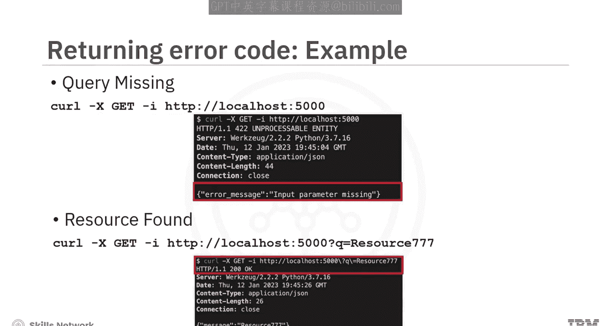
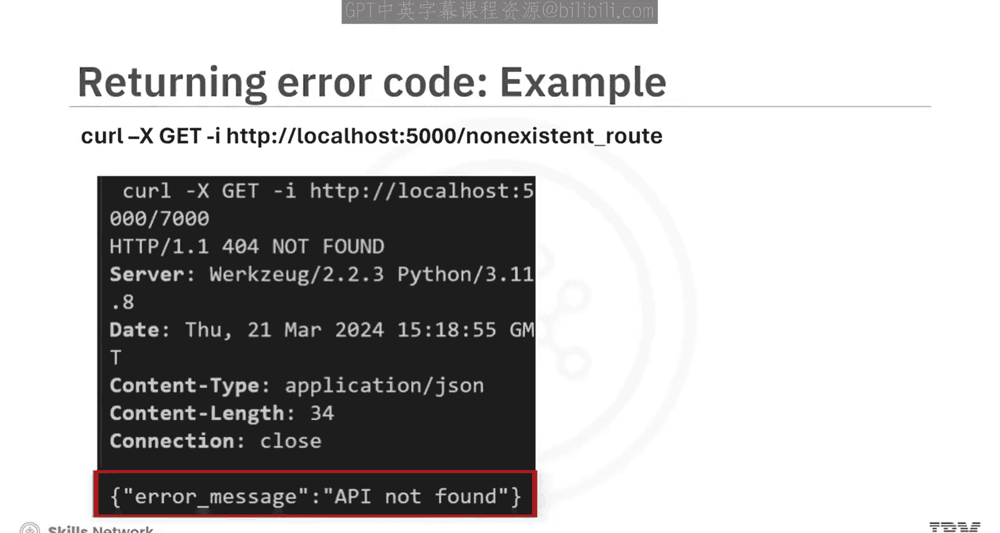
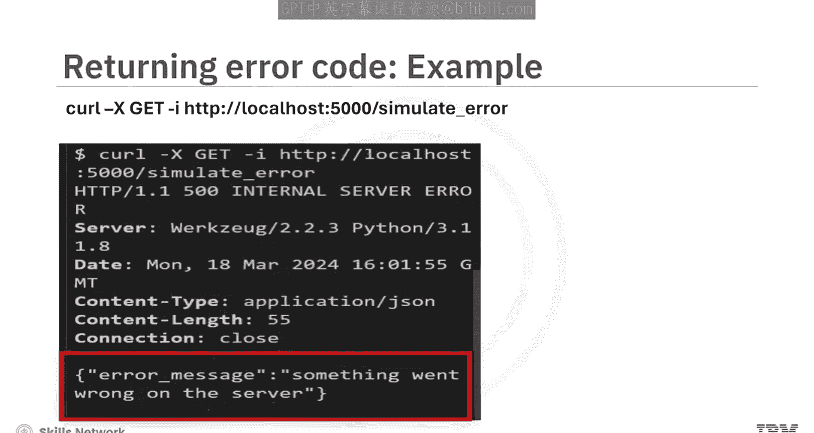
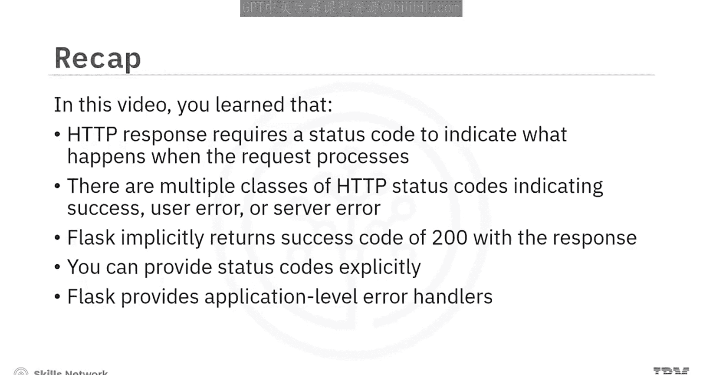

# 生成式人工智能工程：013：错误处理 🛠️

在本节课中，我们将学习API服务中的错误处理。你将了解不同的HTTP状态码、Flask框架中错误处理的工作原理，以及如何从你的API端点返回适当的错误信息。

## HTTP状态码概述

HTTP响应包含一个三位数的状态码，用于指示请求的成功或错误状态。客户端负责解析这个状态码。有效的状态码范围从100到599。

这些状态码按类别组织，每100个为一类。

以下是主要的HTTP状态码类别：

*   **100-199**： 表示请求已被接收，属于信息性状态码。
*   **200-299**： 表示请求已被成功接收和处理。
*   **300-399**： 表示服务器需要进行重定向。
*   **400-499**： 表示客户端请求存在错误。
*   **500-599**： 表示服务器在处理请求时发生了错误。

本课程中编写的API将遵循此规范。例如，如果客户端请求一个不存在的资源，你可以返回一个**404**状态码。

## Flask中的默认与显式状态码

默认情况下，当你从 `@app.route` 装饰的函数返回时，Flask服务器会自动返回**200 OK**状态。使用 `jsonify` 方法响应请求时，默认也会返回200。

一个成功的响应会伴随状态码200被发送回客户端。

然而，你的代码可以返回不同于默认值的状态码。Flask允许你通过一个元组来发送响应和状态码。

```python
return “我的第一个应用正在运行”, 200
```

在这段代码中，你返回了HTML响应“我的第一个应用正在运行”以及状态码**200**。

你也可以使用 `make_response` 方法来显式地设置状态码。

```python
from flask import make_response
resp = make_response(“我的第一个应用正在运行”)
resp.status_code = 200
return resp
```

这段代码返回与上一段代码相同的HTML消息和HTTP状态码**200**，但这里使用了 `make_response` 方法。

## 常用HTTP状态码示例

现在，让我们看看本课程中可能用到的更多状态码示例。

*   **200**： 默认返回的状态，表示请求成功。
*   **201**： 告诉客户端服务器已成功创建资源。
*   **202**： 表示请求已被接受，正在处理中，常见于批处理操作。
*   **204**： 服务器成功完成请求后返回，不返回任何内容。此状态适用于你不想让浏览器执行任何操作的情况，例如用户停留在当前页面。
*   **400**： 表示无效请求。可能意味着参数缺失、不正确，或请求在其他方面无效。
*   **401**： 表示凭据缺失或无效。
*   **403**： 表示客户端凭据不足以完成请求。
*   **404**： 如果服务器找不到资源，则返回此状态。
*   **405**： 表示请求的操作不被支持。
*   **500**： 当服务器端发生错误时使用。

## 在API端点中返回错误

了解了不同的HTTP状态码后，作为开发者，你需要从服务中返回正确的代码。让我们看一个例子。

这个 `search_response` 方法在数据库（通过 `query` 参数 `q`）中查找资源。服务在解析你的查询后调用模拟的 `fetch_from_database` 方法。

```python
@app.route(‘/search’)
def search_response():
    query = request.args.get(‘q’)
    if not query:
        return jsonify({“error”: “输入参数缺失”}), 422

    resource = fetch_from_database(query)
    if resource:
        return jsonify(resource) # 隐式返回 200
    else:
        return jsonify({“error”: “未找到资源”}), 404
```

如果资源存在，代码会将资源返回给客户端，并隐式返回状态码**200**。如果资源未找到，则返回**404**。

现在，让我们使用 `curl` 程序调用这个端点。

1.  调用不带查询参数的路由：
    `curl` 程序返回消息“输入参数缺失”和状态码**422**。
2.  使用正确的资源ID调用路由：
    `curl` 命令返回资源作为响应体，状态为**200**。
3.  使用不存在的资源调用路由：
    `curl` 命令返回消息“未找到资源”和状态码**404**。

## Flask应用级错误处理



Flask提供了一种在应用级别处理错误消息的方法。这里我们看到一个处理**404**错误的方法，它返回消息“API未找到”和状态码**404**。

```python
@app.errorhandler(404)
def not_found(error):
    return jsonify({“error”: “API未找到”}), 404
```

同样，这段代码片段为**500**错误创建了一个错误处理器，并返回消息“服务器端出错了”。





```python
@app.errorhandler(500)
def internal_error(error):
    return jsonify({“error”: “服务器端出错了”}), 500
```

## 总结

本节课中，我们一起学习了HTTP错误处理的核心知识。你了解到HTTP响应需要一个状态码来指示请求处理的结果。存在多类HTTP状态码，分别表示成功、用户错误或服务器错误。



Flask会隐式地随响应返回一个成功的**200**状态码，但你也可以显式地提供其他状态码。此外，Flask还提供了应用级的错误处理器，让你能够集中处理特定类型的错误，从而构建更健壮、用户友好的API服务。