生成式人工智能工程：014：使用Flask部署Web应用

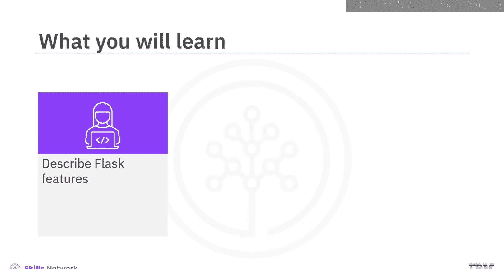

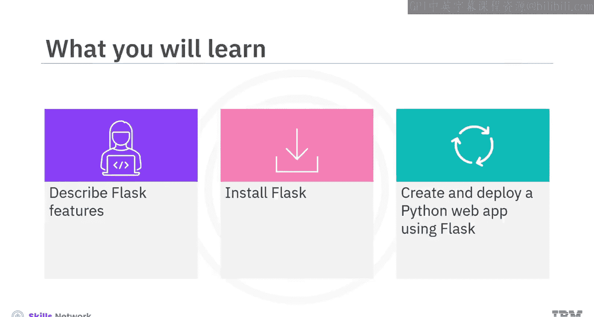

在本节课中，我们将学习如何使用Flask框架来创建和部署一个Python Web应用。我们将从Flask的基本概念讲起，逐步介绍其安装、基本应用结构、路由定义以及如何渲染静态和动态页面。

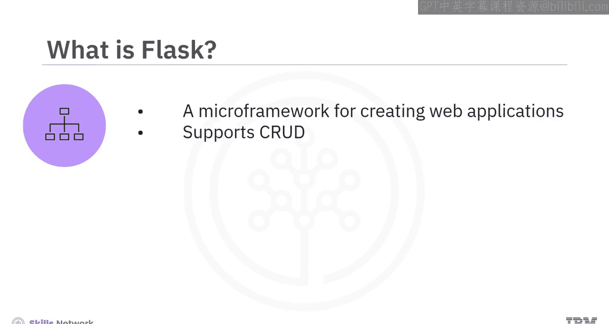

---

Flask是一个用于快速、轻松创建Web应用的微框架。它支持CRUD操作，即通过发起POST、PUT、GET、UPDATE和DELETE请求来实现创建、读取、更新和删除功能。

以下是Flask应用的基本结构。请注意Flask包的标志。

上一节我们介绍了Flask的基本概念，本节中我们来看看如何使用Flask进行CRUD操作。

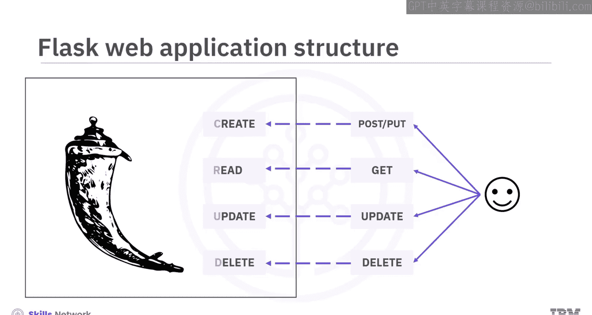

*   **POST** 和 **PUT** 请求用于创建对象或数据。例如，可以使用它们来创建一个用户。两者的区别在于：**POST** 在每次请求时都会创建对象或数据；而 **PUT** 仅在第一次请求时创建对象或数据，并在后续请求中持续更新该对象或数据。在大多数Web应用中，通常使用 **POST** 来创建对象或数据。
*   可以使用 **GET** 请求从服务器读取数据。
*   可以使用 **UPDATE** 请求来更新现有数据或对象。
*   可以使用 **DELETE** 请求来删除现有数据或对象。

需要注意的是，大多数Web应用倾向于使用 **POST** 进行创建、更新和删除操作，使用 **GET** 进行读取操作。另一个视频会详细解释POST、PUT和GET请求。

接下来，我们看看如何用Flask创建一个Web应用。

---

创建Flask Web应用的第一步是使用Python的标准包管理器Pip来安装Flask包。

与安装其他包一样，可以使用命令 `pip install flask` 来获取Flask的最新版本。

安装好Flask包后，就可以开始创建Web应用了。接下来，需要导入Flask包，实例化Flask类，创建Web应用，然后运行该应用。

为了演示，我们来看一个返回“Hello World”字符串作为GET请求响应的Web应用。

以下是创建此应用的步骤：

1.  **安装Flask**：使用 `pip install flask`。
2.  **导入模块**：从flask包中导入Flask模块。代码为：`from flask import Flask`。
3.  **创建应用实例**：创建一个Flask类的对象作为Web应用，例如命名为“My first web application”，并将其存储为 `app`。代码示例：`app = Flask("My first application")`。大多数应用为清晰起见使用 `app` 作为引用名，但这只是一个引用名，可以使用任何其他名称。
4.  **定义路由和方法**：定义路由以及访问该路由时将调用的方法。例如：`@app.route('/')`。在这个例子中，没有指定GET或POST。当不指定请求类型时，默认是GET请求。因此，此端点现在将能够服务于对该路由的GET请求。
5.  **定义处理函数**：编写一个名为 `hello` 的方法，当系统访问上一步定义的API端点时，将调用此方法。该函数不接受参数并返回字符串“Hello world!”。代码为：
    ```python
    def hello():
        return 'Hello world!'
    ```
6.  **添加运行条件**：添加一个条件，确保Web应用仅在 `__name__` 属性设置为 `__main__` 时才运行。默认情况下，`__name__` 被设置为 `__main__`，除非被显式更改。
7.  **运行应用**：添加代码以运行应用。代码为：`app.run(debug=True)`。

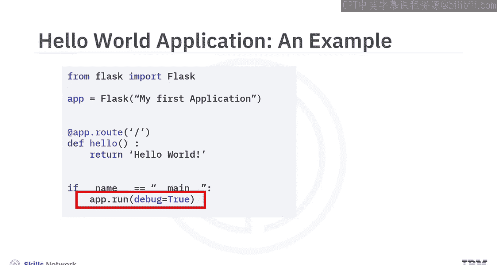

可以像运行其他Python应用一样保存并运行此代码。

---

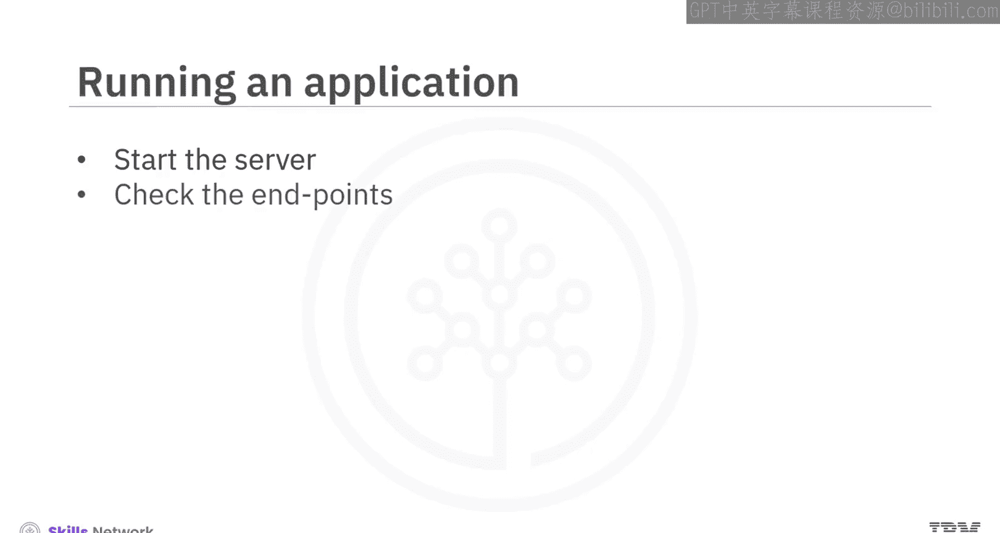

要在开发环境中启动服务器，需要将代码保存在一个Python文件中，并像运行其他Python应用一样运行它。

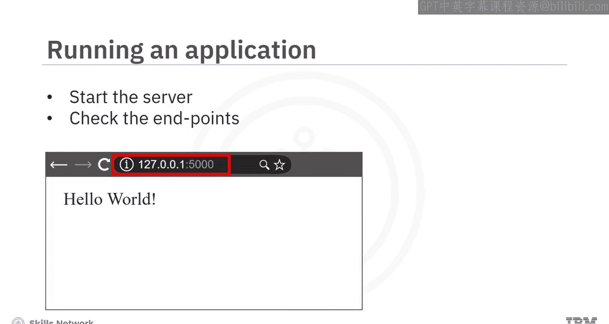

当Web应用服务器启动时，它会提供可以访问该应用的IP地址和端口。

要检查端点，可以打开浏览器并连接到服务器输出中看到的这个端点（例如 `127.0.0.1:5000`），然后看到从Web服务器应用返回的字符串“Hello world!”。

---

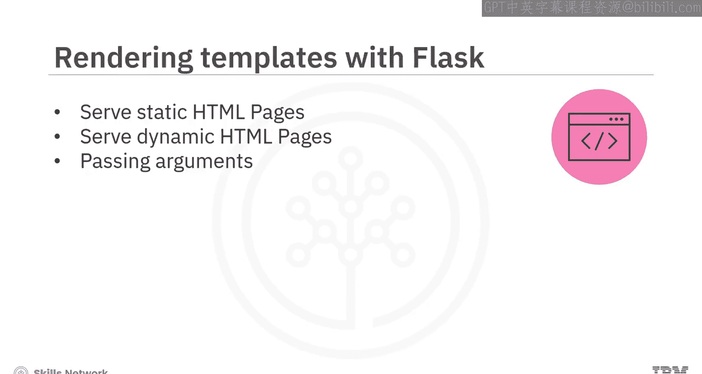

模板是Web应用中提供的预创建的HTML页面。它们可以是静态的，也可以是动态的。

默认情况下，Flask应用在根目录下名为 `templates` 的目录中查找模板。如果模板需要使用图像、样式表或JavaScript文件，这些文件存储在根目录下名为 `static` 的文件夹中。

静态页面按原样渲染。动态页面通常包含为每个请求动态填充的信息。这些页面通常基于作为参数传递的值来渲染。参数可以通过URL传递，也可以作为请求参数传递。

让我们看一个示例Flask应用。

首先导入必要的模块：导入Flask以创建Web应用，导入request以处理传入的请求，导入 `render_template` 以渲染静态和动态HTML页面。代码为：`from flask import Flask, render_template, request`。

接下来，实例化Flask并设置静态文件夹。例如：`app = Flask("My first application")`。默认文件夹名是 `static`，但只要显式设置，也可以将静态内容放在不同名称的目录中。

注意，这个Web应用中有三个端点：

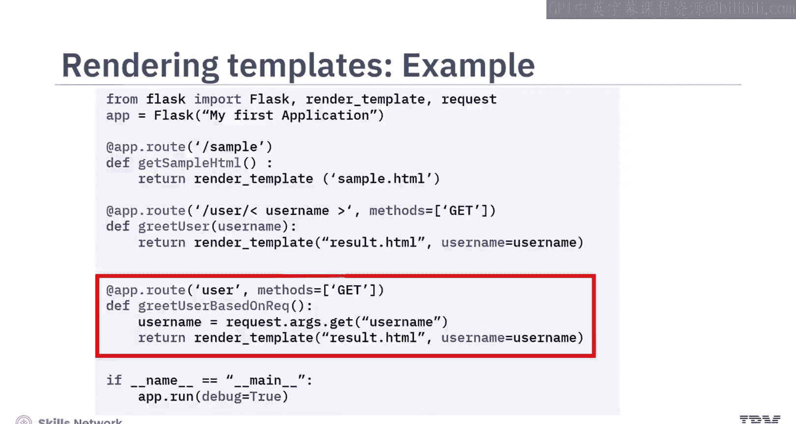

1.  **第一个端点是 `/sample`**：这将渲染一个静态HTML页面。该HTML中的图像来源于静态目录。实现代码如下：
    ```python
    @app.route('/sample')
    def get_sampleHTML():
        return render_template('sample.html')
    ```
2.  **第二个端点是 `/user/<username>`**：其中 `<username>` 是URL中的参数。代码如下：
    ```python
    @app.route('/user/<username>', methods=['GET'])
    def get_user(username):
        return render_template('user.html', username=username)
    ```
    这里显式地将方法设置为GET，这只是为了展示如何设置请求类型。如果未指定任何内容，则默认为GET请求。页面将使用我们在URL中传递的参数进行渲染。
3.  **第三个端点是 `/user`**：其中用户名作为请求参数传递。页面将使用作为请求传递的参数进行渲染。

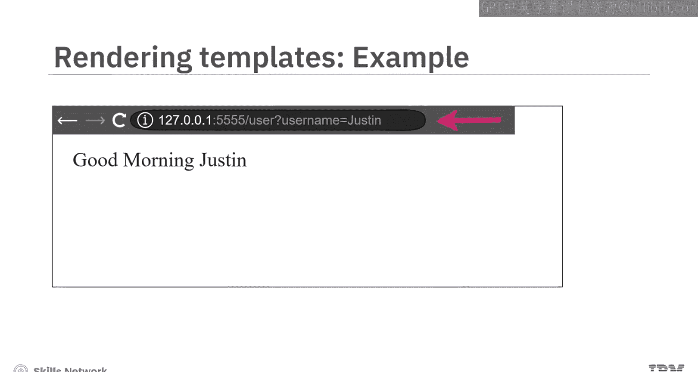

---

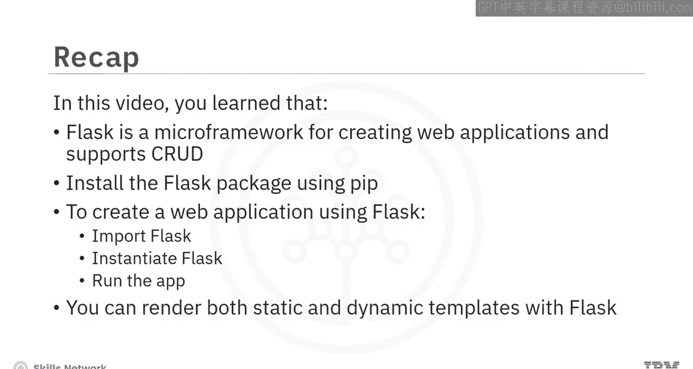

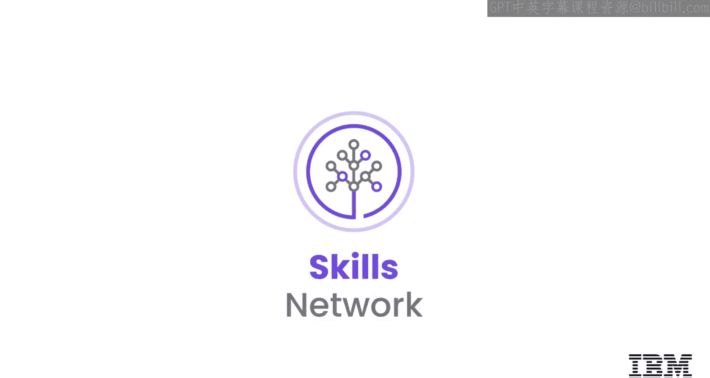

本节课中我们一起学习了以下内容：
*   Flask是一个用于创建Web应用的微框架，并支持CRUD操作。
*   使用 `pip install flask` 安装Flask包。
*   要使用Flask创建Web应用，需要导入Flask、实例化Flask、然后运行应用。
*   可以使用Flask渲染静态和动态模板。