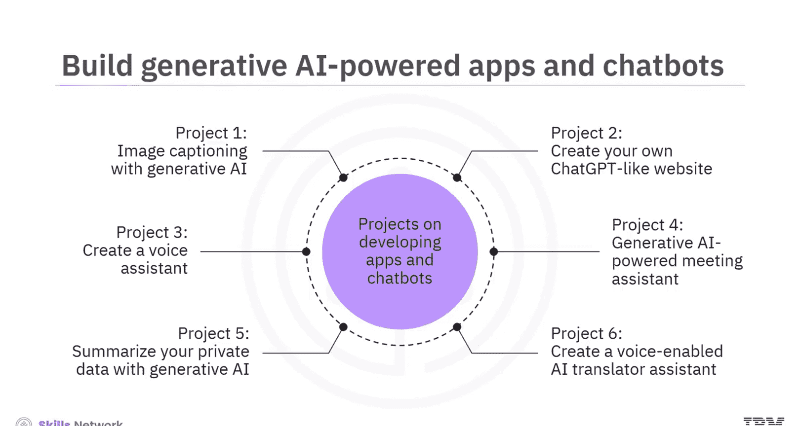
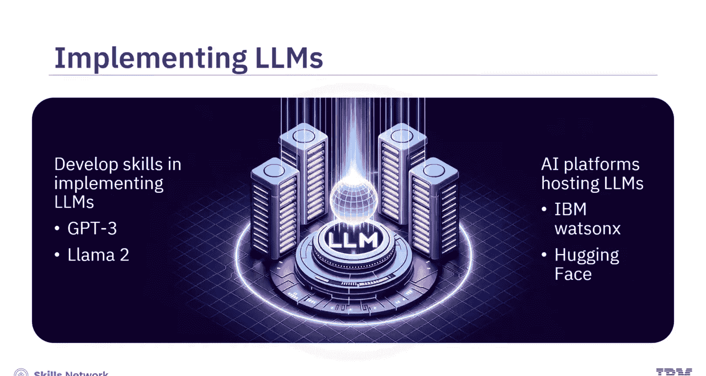
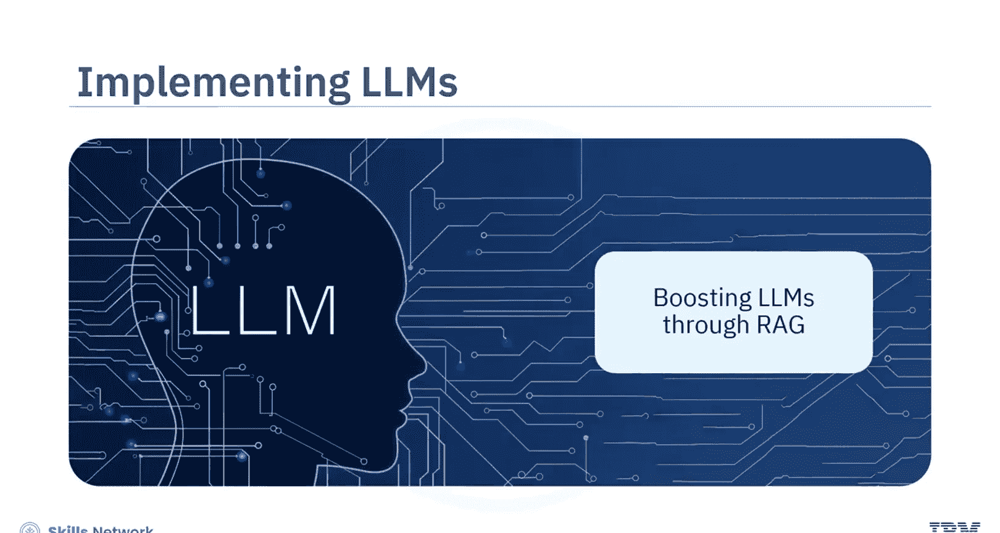
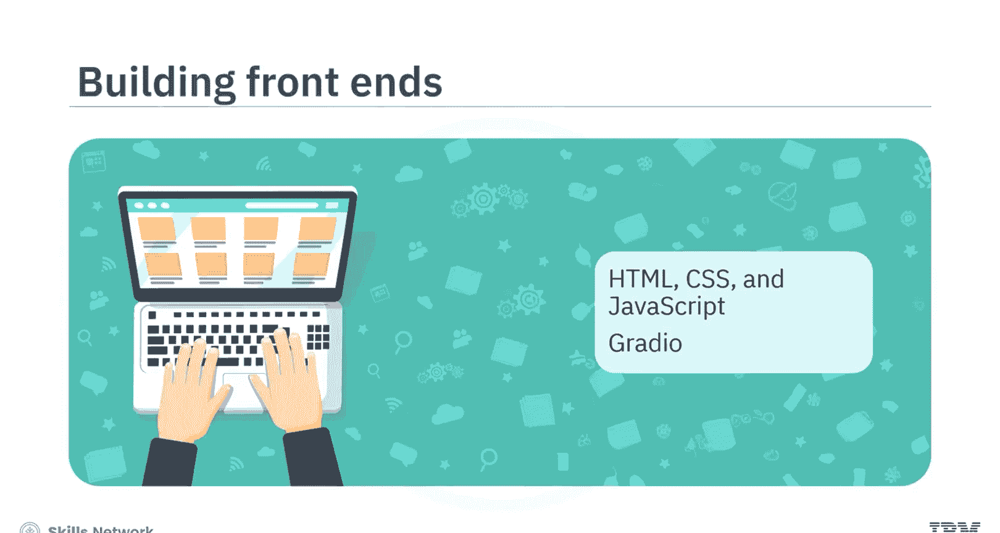
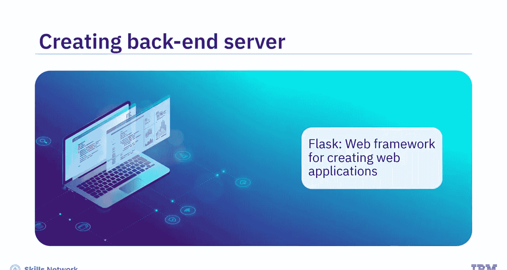
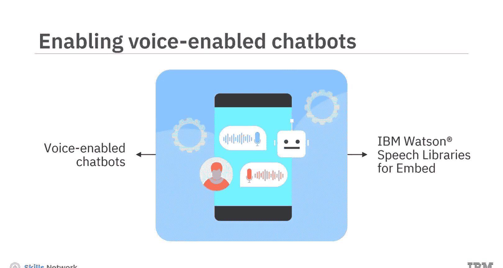
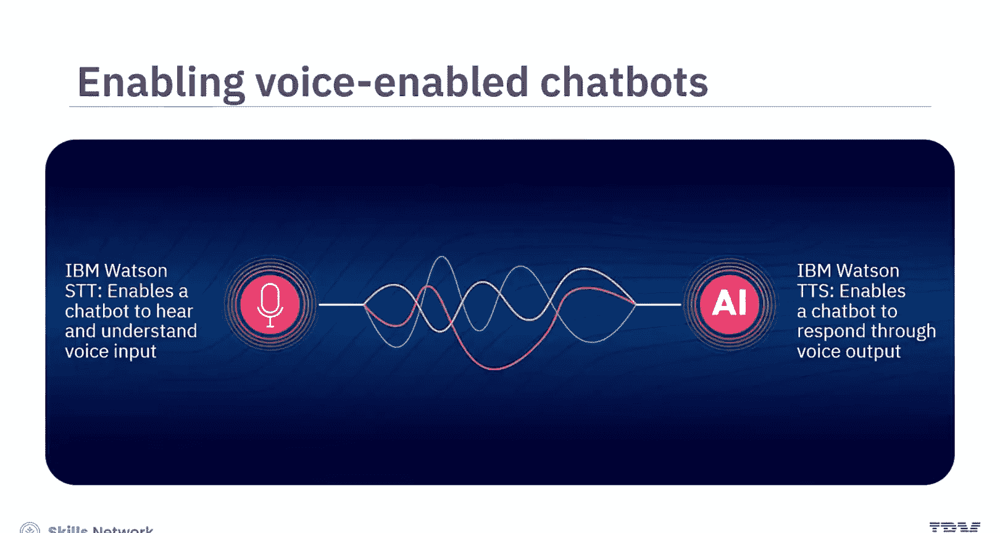
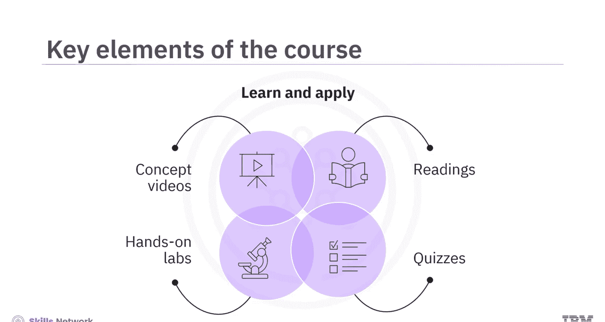
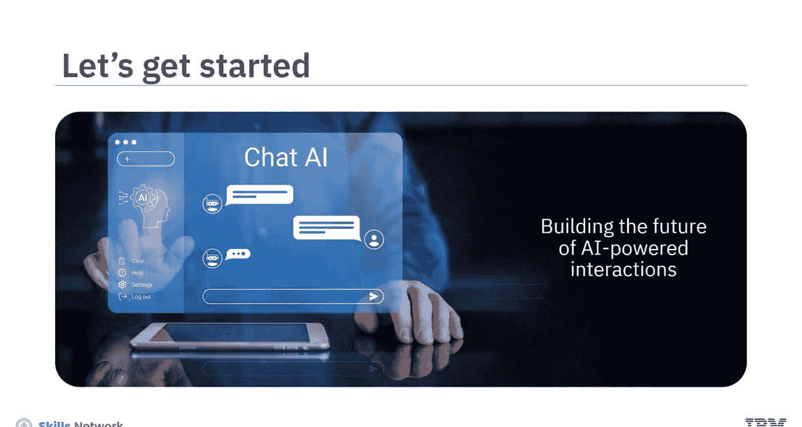

# 生成式人工智能工程：015：课程介绍 🚀

在本节课中，我们将要学习《生成式人工智能工程》课程的总体介绍。课程将引导你从零开始，通过六个实践项目，掌握构建由生成式AI驱动的应用程序和聊天机器人的核心技能。

你是否曾与虚拟助手聊天，或从AI驱动的应用或聊天机器人那里获得过有用的推荐？你是否好奇聊天机器人如何进行对话，或者应用程序如何似乎知道你的需求？更有趣的是，一些应用如何能通过语音自然地交流？这背后是生成式AI模型与其他AI技术结合的力量，共同造就了这些智能且交互性强的聊天机器人和应用程序。

本课程将带你深入幕后，并为你提供构建生成式AI驱动的应用和聊天机器人所需的技能。

## 课程项目概览 📋

以下是本课程将涵盖的六个实践项目，每个项目都专注于为特定用例开发一个聊天机器人或应用程序。

1.  **项目一：图像描述AI工具**：创建一个AI工具，为你的照片生成有意义的描述。
2.  **项目二：集成式网页聊天机器人**：创建一个类似ChatGPT的聊天机器人，并将其集成到网页界面中，使其能够访问信息并回答你的查询。
3.  **项目三：语音助手**：开发一个基于语音的助手，它能听取你的问题并使用语音进行回复。
4.  **项目四：会议转录与摘要应用**：构建一个应用程序，用于转录会议讨论，然后提供聚焦于关键要点的简洁摘要。
5.  **项目五：PDF文档问答机器人**：开发一个聊天机器人，允许你上传PDF文件并提问，以从中提取特定信息。
6.  **项目六：语音翻译助手**：创建一个支持语音的AI翻译助手，将语音输入转换为文本，然后用指定语言进行语音输出。

这些项目将帮助你培养强大的技能，即如何实现**大语言模型**来增强你的聊天机器人和应用程序的智能。

## 核心技术栈与工具 🛠️

上一节我们介绍了课程项目，本节中我们来看看完成这些项目将使用哪些核心技术和工具。

*   **大语言模型**：你将与流行的LLMs合作，例如托管在IBM Watson X和Hugging Face平台上的GPT-3和Llama 2。
*   **检索增强生成**：你将学习**RAG**技术，该技术通过整合训练数据之外的外部信息来增强LLMs的能力。
*   **前端开发**：部分项目将教你使用**HTML、CSS和JavaScript**创建前端应用程序。另一些项目则会展示如何使用开源Python库（如**Gradio**）来开发交互式且视觉吸引人的基于Web的用户界面。
*   **后端开发**：构建网站或应用需要一个后端服务器。部分项目将教你使用**Flask**（一个用于创建Web应用程序的Web框架）来构建应用的后端。
*   **语音技术**：基于语音的聊天机器人或应用程序项目将演示如何使用和集成IBM Watson语音库。**IBM Watson语音转文本**使聊天机器人能够“听”懂用户语音输入，而**IBM Watson文本转语音**则使聊天机器人能够通过语音输出与用户交流。
*   **开发框架**：项目还将介绍用于构建LLM应用的其他工具。例如，**LangChain**通过提供预构建的组件和上下文感知的推理，简化了更智能的LLM应用的创建过程。

## 学习前提与课程结构 📚

在深入技术细节之前，了解学习本课程所需的基础知识和课程组织形式非常重要。

你将使用**Python**来开发这些项目，因此具备Python基础知识是必需的。虽然具备**HTML、CSS和JavaScript**的基础知识会有帮助，但这并非强制要求。课程提供了支持性的视频和阅读材料，帮助你建立对项目中使用的框架和技术的基础理解。

本课程的设计兼顾了学习与实践应用。概念视频与支持性阅读材料的结合，帮助你构建关于模型、技术和工具的基础。项目被设计为动手实验，并提供关于如何编写代码和完成不同活动的分步指导。此外，课程还包含分级测验，以测试你对核心概念和技术的理解。

## 学习目标 🎯

在本课程结束时，你将能够达成以下目标：

1.  解释生成式AI模型的核心概念。
2.  描述LLM的能力，并将其集成到应用或聊天机器人中以增加智能。
3.  为实现AI驱动的应用程序，实施多样化的AI技术和数据框架。
4.  使用Python编程构建AI驱动的聊天机器人。

## 总结

本节课中我们一起学习了《生成式人工智能工程》课程的完整介绍。我们了解了课程将通过六个循序渐进的实践项目，带领我们掌握集成大语言模型、应用RAG技术、并结合前后端及语音技术来构建智能应用的全套技能。请观看所有视频，完成所有阅读材料，并积极参与动手实验，以培养使用Python编程创建生成式AI驱动应用的技能。本课程是你构建未来AI驱动交互的入门之钥。让我们开始吧！