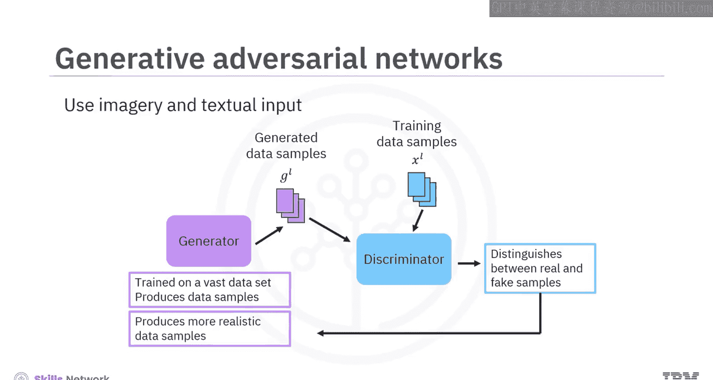
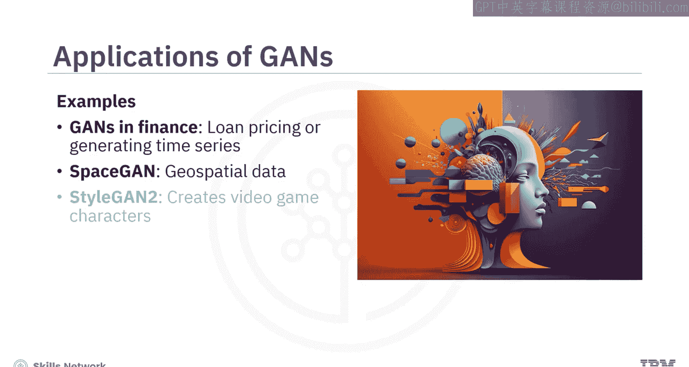
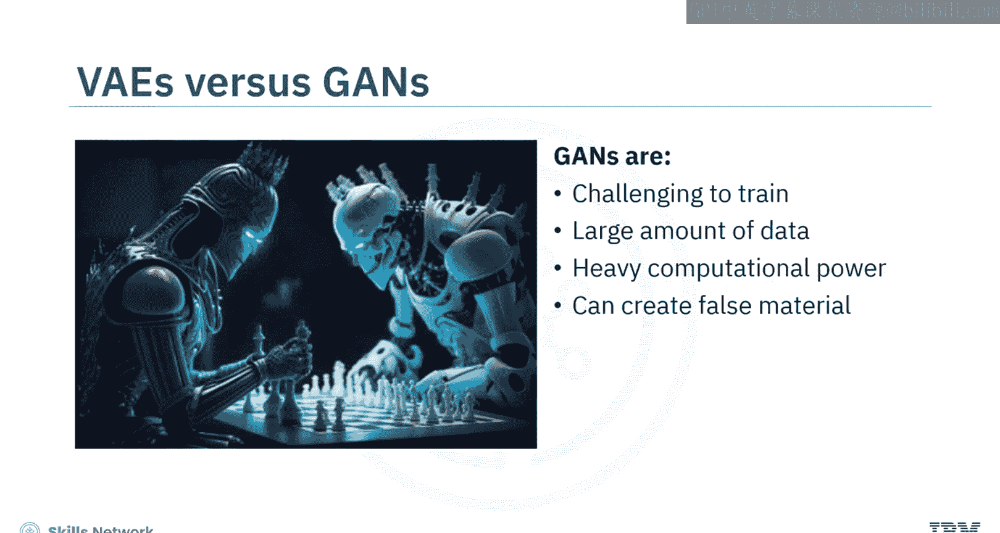
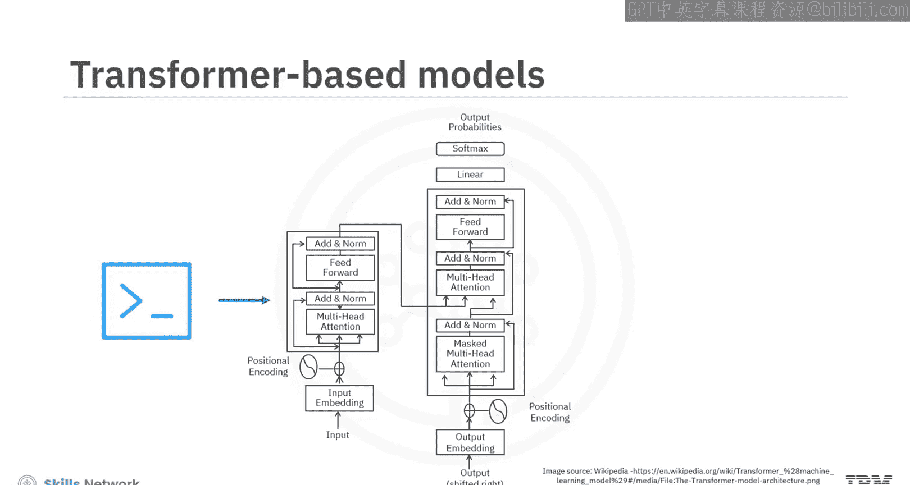
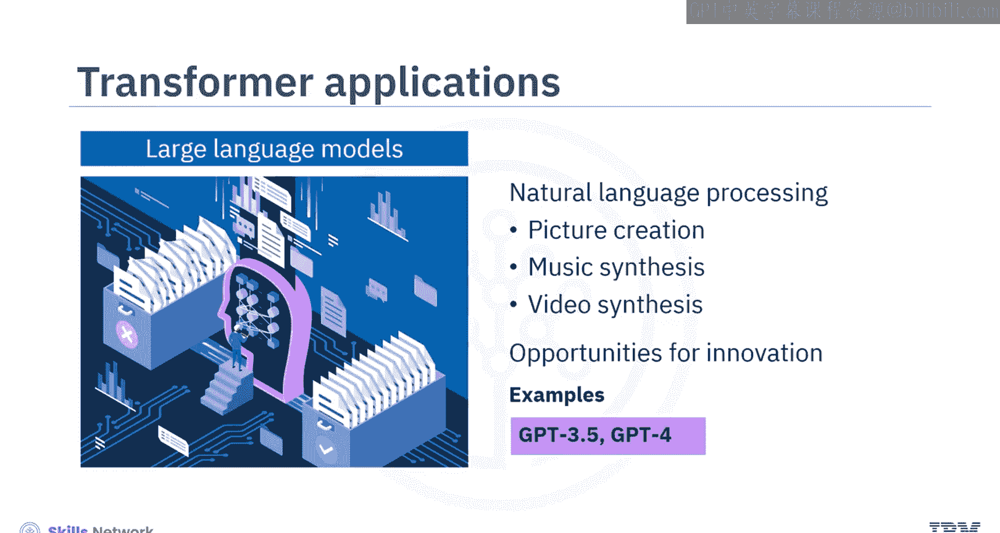
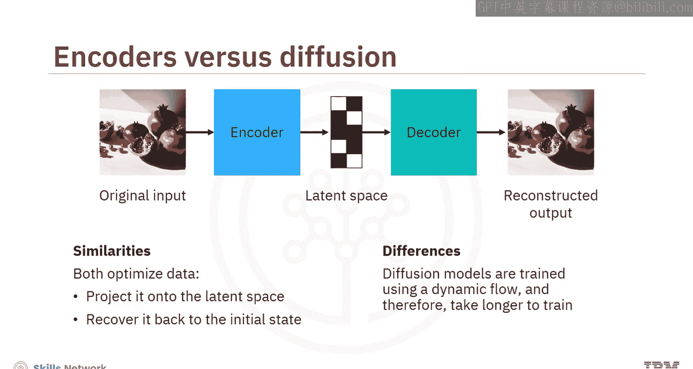
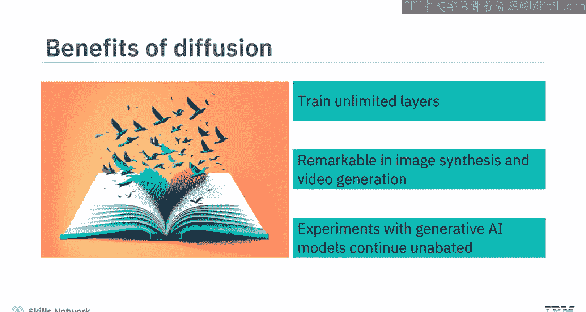

# 生成式人工智能工程：016：生成式AI模型 🧠

在本节课中，我们将学习构成生成式人工智能核心基础的四种关键模型。我们将逐一介绍它们的工作原理、独特之处以及应用场景。

## 概述

生成式人工智能模型能够从现有数据中学习，并创造出全新的、类似的数据样本。理解这些核心模型是掌握生成式AI技术的第一步。接下来，我们将深入探讨变分自编码器、生成对抗网络、基于Transformer的模型以及扩散模型。

## 变分自编码器

上一节我们概述了课程内容，本节中我们来看看第一种核心模型：变分自编码器。

变分自编码器在所有生成式AI模型中最为流行，原因有二：第一，它们能处理图像、文本和音频等多种训练数据；第二，它们能快速降低数据的维度，以创建更新、更优的版本。

其工作流程如下：
1.  **编码器**：这是一个自给自足的神经网络，它研究输入数据的概率分布。简单来说，它会分离出最有用的数据特征。这使得编码器能够创建数据样本的压缩表示，并将其存储在**潜在空间**中。潜在空间可以看作是模型架构内的一个数学空间，高维数据在此以压缩格式表示。
2.  **解码器**：这也是一个自给自足的神经网络，它将潜在空间中的压缩表示解压缩，以生成期望的输出。

基本上，算法使用**最大似然原理**进行训练，这意味着它们试图最小化原始输入数据与重建输出之间的差异。

尽管VAE在静态环境中训练，但其潜在空间是连续的。因此，它们可以通过从数据的概率分布中随机采样来生成新样本。由于它们能用少量训练数据生成逼真且多样的图像，VAE被用于图像合成、数据压缩和异常检测等任务。

以下是VAE的一些应用实例：
*   **娱乐行业**：用于创建游戏地图和动漫头像。
*   **金融行业**：用于预测股票的波动率曲面。
*   **医疗保健领域**：利用心电图信号检测疾病。

## 生成对抗网络

了解了基于编码-解码结构的VAE后，我们来看看另一种采用竞争机制的模型：生成对抗网络。

生成对抗网络是另一种使用图像和文本输入数据的生成式AI模型。在这个模型中，两个卷积神经网络在一个对抗性游戏中相互竞争。

*   一个CNN扮演**生成器**的角色，在大量数据集上进行训练以产生数据样本。
*   另一个CNN扮演**判别器**的角色，试图根据判别器的反馈来区分真实样本和伪造样本。

基于判别器的响应，生成器会努力产生更逼真的数据样本。GAN可以生成新的逼真图像、执行风格迁移或图像到图像的转换，甚至创建深度伪造内容。

以下是GAN的一些应用：
*   **金融行业**：使用GAN训练贷款定价模型或生成时间序列工具。
*   **地理空间数据**：SpaceGAN等工具可处理地理空间数据。
*   **游戏角色**：英伟达的StyleGAN2以创建视频游戏角色而闻名。

与变分自编码器不同，GAN的训练可能具有挑战性，因为它们需要大量数据和强大的计算能力。它们还可能产生虚假材料，这是一个伦理问题。

## 基于Transformer的模型

前面两种模型主要处理图像数据，本节我们转向文本领域，看看基于Transformer的模型。

基于Transformer的模型是在几年前被引入的，当时循环神经网络开始面临一个称为“梯度消失”的问题。由于这个问题，RNN难以处理长文本序列。

为了克服这一挑战，Transformer被构建出来，它带有**注意力机制**，能够聚焦于文本中最有价值的部分，同时过滤掉不必要的元素。这使得Transformer能够对文本中的长期依赖关系进行建模。

例如，当你输入一个简单的提示时，双栈Transformer架构使用编码器-解码器机制来生成连贯且上下文相关的文本。由于Transformer模型可以查询庞大的数据库，它们能够创建大型语言模型，并执行自然语言处理任务，如图片创作、音乐合成甚至视频合成。这标志着我们在内容创作方法上的一次重大突破，并为创新提供了许多机会，正如我们在GPT-3.5及其后续版本、BERT和T5等模型中所看到的那样。

## 扩散模型

最后，我们来探讨生成式AI模型世界中的一个较新成员：扩散模型。

扩散模型通过应用扩散原理，解决了因潜在空间噪声导致的数据系统性衰减问题，从而试图防止信息丢失。就像在扩散过程中分子从高密度区域移动到低密度区域一样，扩散模型使用两步过程将噪声移入和移出数据样本。

以下是其核心过程：
1.  **前向扩散**：算法逐渐向训练数据中添加随机噪声。
2.  **反向扩散**：算法逆转噪声以恢复数据并生成期望的输出。

OpenAI的DALL-E 2、Stability AI的Stable Diffusion以及Google的Imagen都是成熟的扩散模型，能够生成高质量的图形内容。

与变分自编码器类似，扩散模型也试图通过先将数据投影到潜在空间，然后再将其恢复回初始状态来优化数据。然而，扩散模型使用动态流进行训练，因此训练时间更长。

那么，为什么这些模型被认为是创建生成式AI模型的最佳选择呢？因为它们训练了数百层，甚至可能是无限数量的层，并且在图像合成和视频生成的实验中显示出显著的效果。随着无监督算法不断带来惊喜，对生成式AI模型的探索仍在持续进行。

## 总结

本节课中，我们一起学习了作为生成式AI构建基石的四种核心模型：
*   **变分自编码器**：快速降低样本维度。
*   **生成对抗网络**：使用竞争网络产生逼真样本。
*   **基于Transformer的模型**：使用注意力机制对文本长期依赖关系进行建模。
*   **扩散模型**：通过在潜在空间中去除噪声来解决信息衰减问题。

理解这些模型的基本原理和特点，是进一步学习生成式人工智能应用、微调和高级架构的基础。