# 生成式人工智能工程：017：基础模型 🧱

在本节课中，我们将要学习**基础模型**的核心概念。你将能够理解这一术语的定义，识别其关键特征与能力，并探索一些具体的例子。

---

## 概述

斯坦福大学基础模型研究中心将基础模型定义为一种构建AI系统的新范式：**在一个海量数据集上训练一个模型，并将其适配到多种应用中**。我们称这样的模型为基础模型。

接下来，让我们深入剖析这个定义。

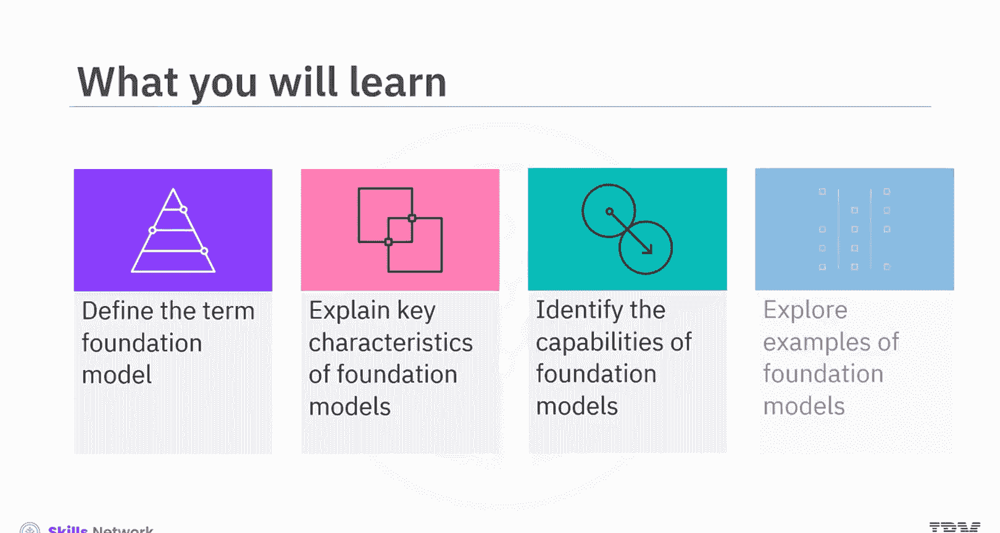

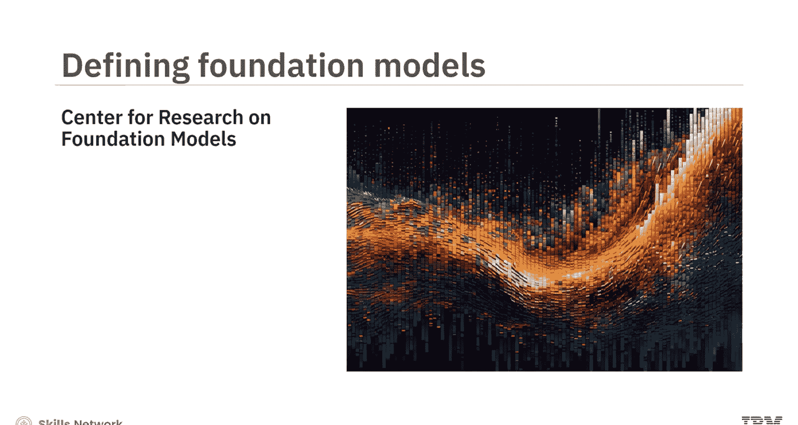

---

## 核心定义解析

定义的第一部分指出：“在一个海量数据集上训练一个模型”。

### 工作原理
基础模型是一种**大型、通用目的的自监督模型**，它在海量的无标签数据上进行预训练，从而建立起数十亿的参数。预训练是一种技术，在此过程中，无监督算法被反复赋予连接不同信息片段的自由。这使得基础模型能够发展出**多领域、多模态**的能力。

**公式表示其核心思想：**
`基础模型 = 预训练(海量无标签数据) -> 数十亿参数 -> 多模态/多领域能力`

这意味着它们可以接受多种模态的输入提示（如文本、图像、音频或视频），并执行复杂且富有创造性的任务，例如：
*   回答问题
*   总结文档
*   撰写文章
*   解方程
*   从图像中提取信息
*   甚至编写代码

这种广泛的技能组合使这些模型与多个领域相关。

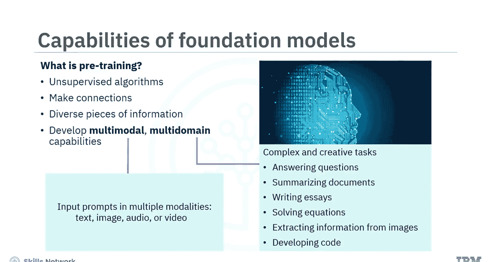

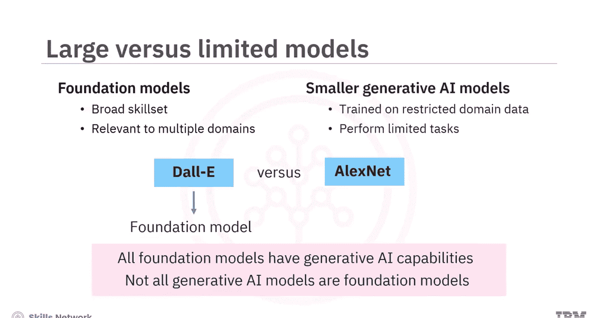

---

## 基础模型 vs. 其他生成式AI模型

这与较小的生成式AI模型形成对比。较小的模型通常在受限的领域数据上训练，并被要求执行有限的任务。

以下是关键区别：
*   **基础模型**：如OpenAI的DALL-E系列，能够执行多种图像相关任务。
*   **非基础模型**：如AlexNet，仅执行图像分类任务。

因此，我们可以明确：**虽然所有基础模型都具有生成式AI能力，但并非所有生成式AI模型都是基础模型**。

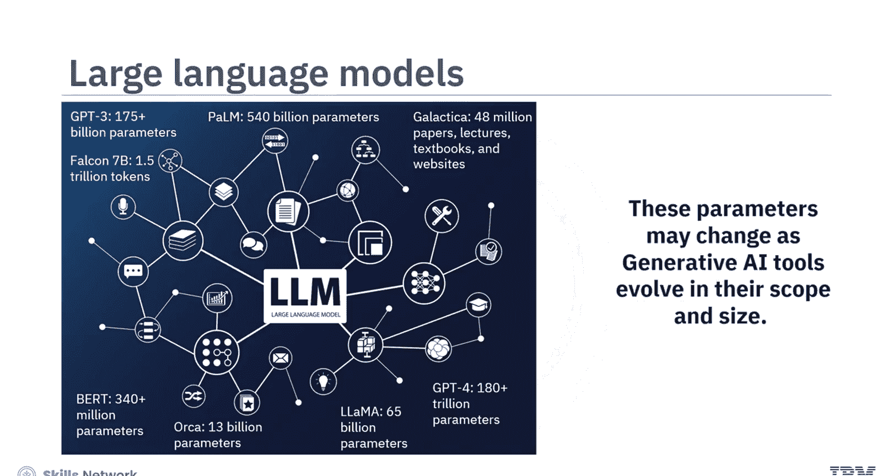

---

## 大型语言模型

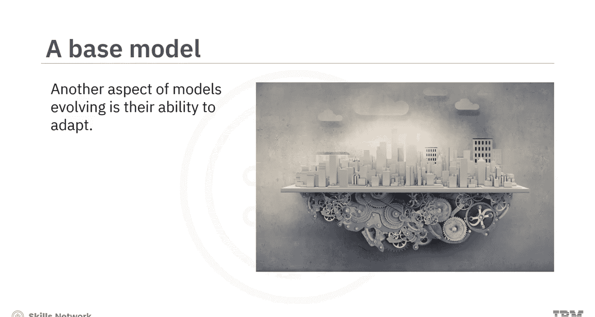

当基础模型在庞大的自然语言处理数据库上训练时，它们被称为**大型语言模型**。

LLMs发展出了独立的推理能力，使它们能够独特地回应查询。例如：
*   **OpenAI的GPT系列**：GPT-3预训练参数超过1750亿，GPT-4估计超过180万亿。
*   **Google的PaLM**：预训练参数5400亿。
*   **Meta的LLaMA**：预训练参数650亿。
*   **Google的BERT**：预训练参数超过3.4亿。
*   **Meta的Galactica**：为科学家设计的LLM，在4800万篇论文、讲座、教科书和网站上预训练。
*   **TII的Falcon**：在1.5万亿个词元上预训练。
*   **微软的Orca**：预训练参数130亿，小到可以在笔记本电脑上运行。

随着生成式AI工具在范围和规模上的发展，这些参数很可能会发生变化。

---

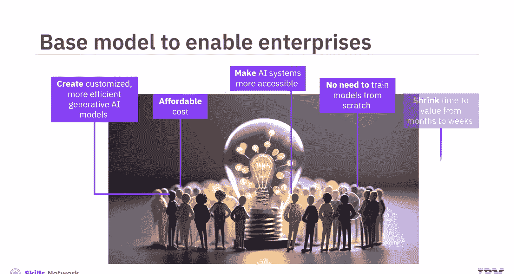

## 模型的适应能力

定义的另一个方面是：“将其适配到许多应用”。

这是可能的，因为基础模型的广泛训练使其能够学习新事物并适应新情况。小型企业可以利用这一能力，以可负担的成本创建定制化、更高效的生成式AI模型。这就是为什么基础模型也被称为**基础模型**——它们帮助那些没有资源从头开始训练自己模型的企业和个人更容易地使用AI系统。通过这种方式，基础模型使企业能够将价值实现时间从数月缩短到数周。

例如，聊天机器人的演变：
*   **早期聊天机器人**：在较小的数据集上训练，生成能力有限。它们只能基于关键词预测回复，提供预设的响应。
*   **现代聊天机器人**：在广泛的数据集上进行了多次预训练，因此能够提高词语预测的准确性，并以更有帮助和创造性的方式回应。

**代码示例（概念性提示）：**
```
用户输入：“写一首关于春天的诗。”
现代LLM驱动的聊天机器人可以生成一首原创的、富有韵律的诗歌。
```

---

## 多模态基础模型示例

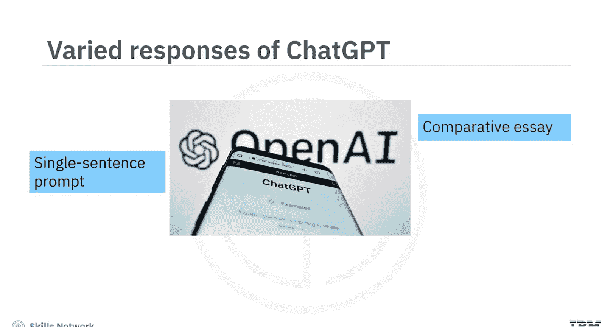

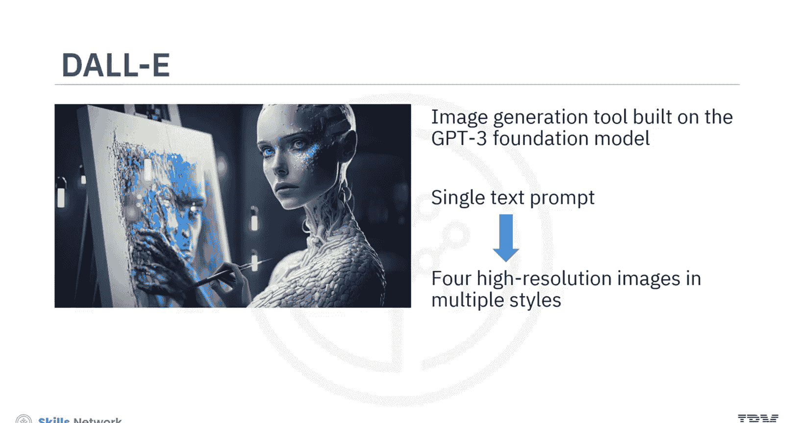

并非所有基础模型都是LLM。一些基础模型使用**扩散架构**来提升其图像生成的规模和范围。

以下是具体例子：
*   **DALL-E**：使用Transformer架构，但其最新版本使用声音扩散从文本生成图像。
*   **Stable Diffusion**：使用扩散架构，根据用户描述生成高分辨率图像（写实、卡通、抽象风格）。
*   **Imagen**：使用基于LLM构建的级联扩散模型，从文本提示生成图像。

---

## 局限性与注意事项

随着基础模型在其优势和应用中不断发展，我们也看到了一些局限性。

以下是需要注意的两点：
1.  **偏见问题**：如果训练基础模型的数据存在偏见，其期望输出也可能带有偏见。
2.  **幻觉问题**：LLMs可能会产生“幻觉”响应，即生成虚假信息，因为它们误解了数据集中参数的上下文。

因此，**你必须谨慎地验证生成式AI聊天机器人输出的准确性**。只要稍加注意，你就可以享受基础模型带来的诸多好处。

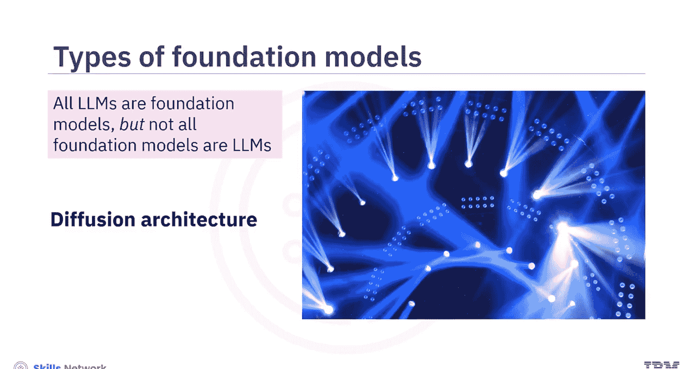

---

## 总结

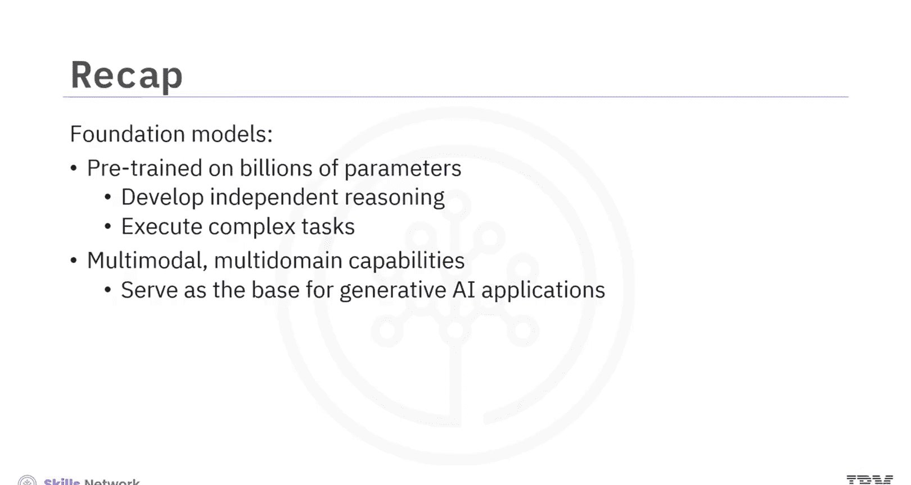

本节课中，我们一起探索了基础模型的概念。这些模型在数十亿参数上进行预训练，这使它们能够发展出独立的推理能力，并执行大量复杂的任务。鉴于其多模态、多领域的能力，它们可以作为生成式AI应用的**基础**或**基石**。理解基础模型是理解现代生成式AI生态系统如何构建和运作的关键第一步。