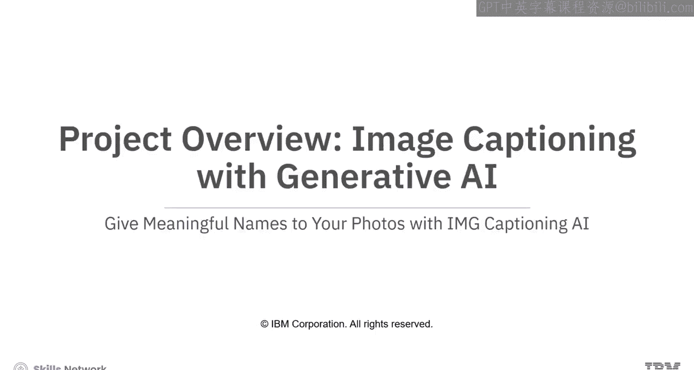
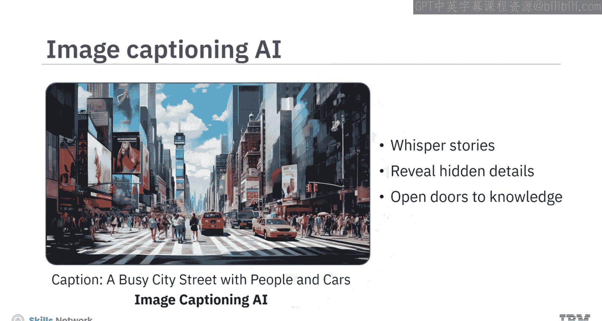
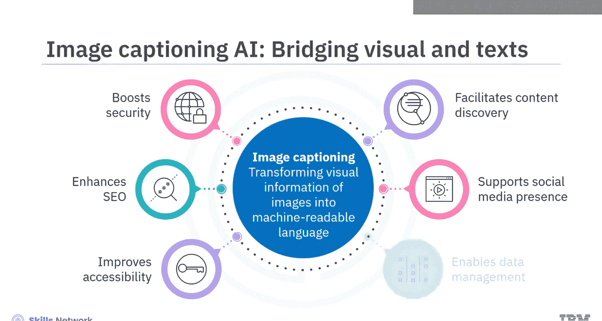
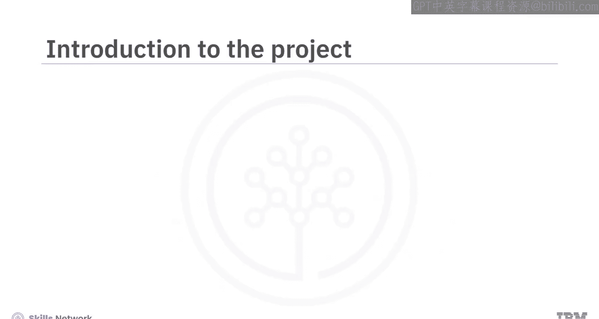
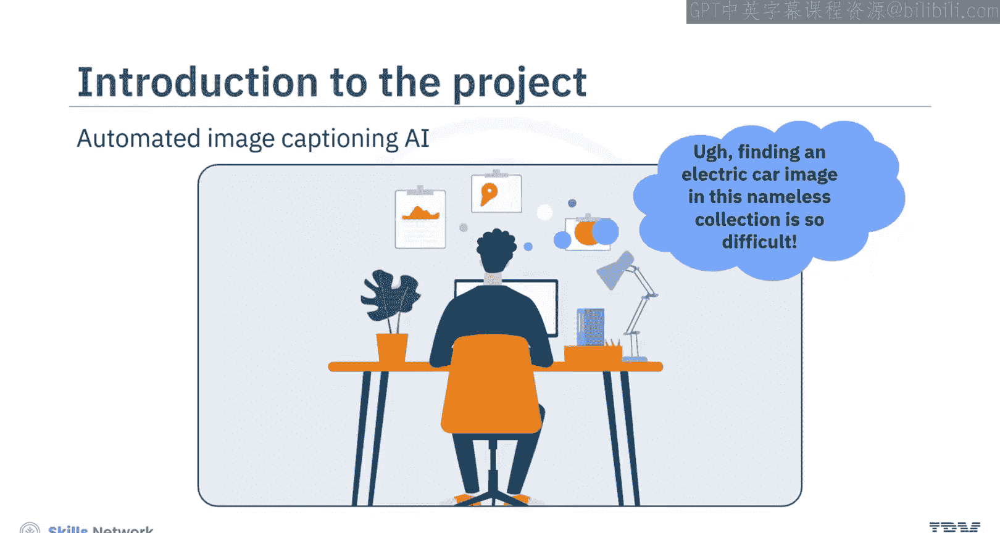
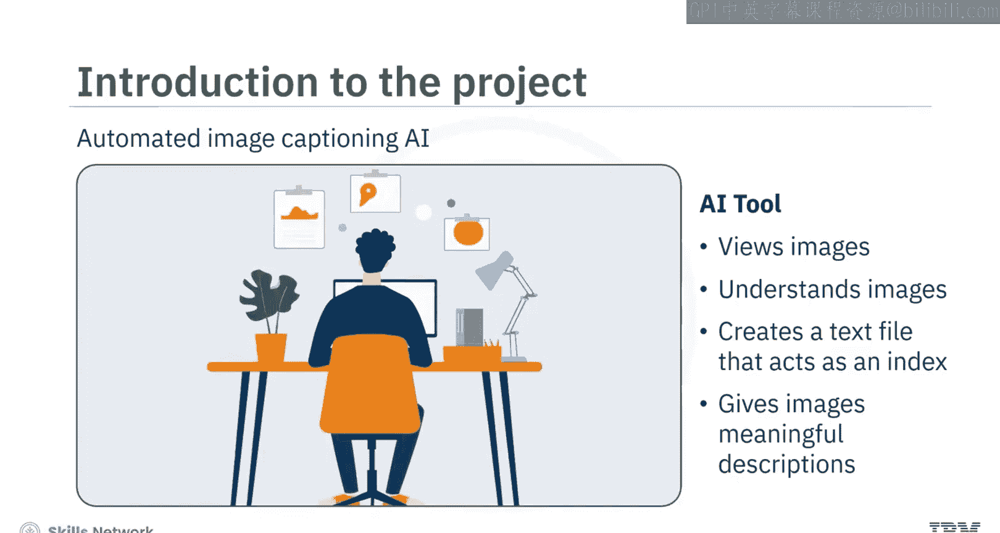
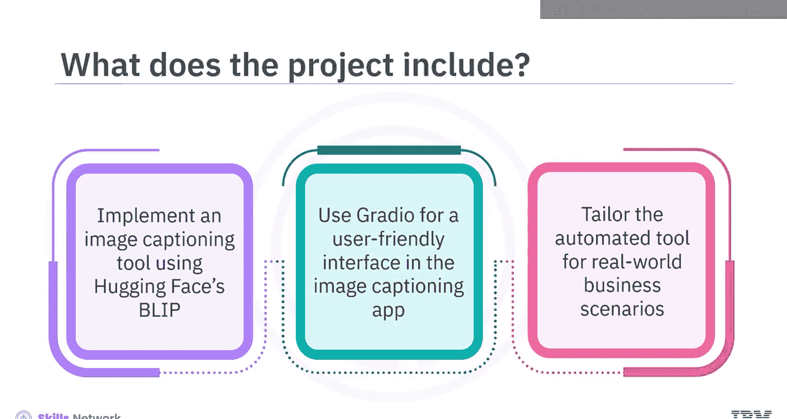
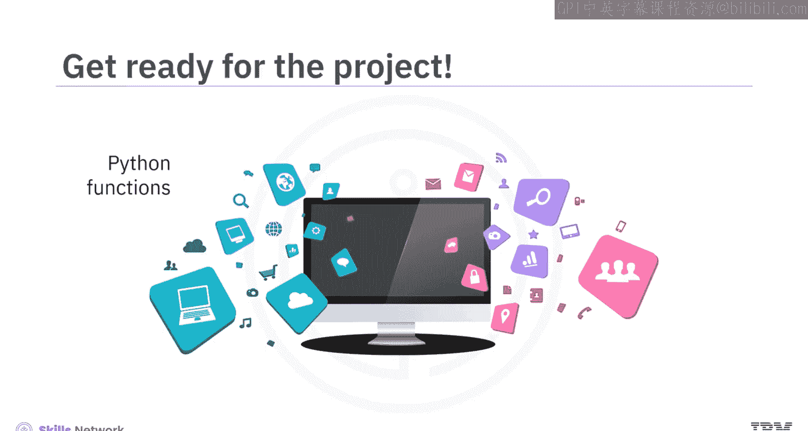

# 生成式AI图像描述项目：018：项目概述 🖼️

在本节课中，我们将要学习一个名为“使用生成式AI为照片赋予有意义的名称”的项目。该项目旨在利用图像描述AI技术，将视觉信息转化为文本，从而提升图像的可访问性和管理效率。

---

想象一个世界，图像不再是沉默的。它们能够低语故事、揭示隐藏的细节，并开启知识的大门。这一切都得益于图像描述AI技术。

图像描述AI能够将图像的视觉信息转化为机器可读的语言。这项技术对多个方面产生重大影响，从改善视障人士的无障碍访问，到增强搜索结果和提升安全性。通过将视觉数据转化为文本，图像描述AI为更深层次的内容发现、更具吸引力的社交媒体呈现以及跨领域的高效数据管理铺平了道路。

---

## 项目目标与内容

在本项目中，你将学习构建一个自动化的图像描述AI工具。想象你是一位被成千上万未命名图片包围的平面设计师。找到正确的图片感觉就像大海捞针。因此，本项目致力于解决这个问题。

你将构建一个AI工具，它不仅“看”图像，更能“理解”图像。然后，它会创建一个文本文件作为索引，为图像提供关于其内容的、有意义的描述。这使得查找正确的图片变得简单，从而提升效率并减轻你的工作量。

本项目包含分步指导，教你如何实现并定制这个图像描述工具，以应用于现实场景。

---

## 你将完成的主要活动

以下是你在项目中需要完成的三个主要活动：

1.  **实现图像描述工具**：利用Hugging Face Transformers库中的Blip模型来实现图像描述功能。
    *   **公式/代码**：`BlipModel` 或 `BlipForConditionalGeneration`。
    *   Blip（Bootstrapping Language-Image Pre-training）模型能够执行多种多模态任务，包括图像-文本检索和图像描述生成。

2.  **创建用户友好界面**：使用Gradio为你的图像描述应用提供一个用户友好的界面。
    *   **代码**：`gradio.Interface()`。
    *   Gradio是一个开源Python包，允许你为机器学习模型或Python函数快速构建演示或Web应用程序。

3.  **定制化以适应业务场景**：通过从URL提取图像并生成描述，展示该自动化工具在实际业务场景中的应用，证明其实用价值。

---

## 预备知识与学习目标

要完成本项目，你需要具备Python的实用知识，并熟悉集成开发环境（IDE）的使用。你不需要事先具备Hugging Face Transformers或Gradio的经验，因为在项目过程中你将熟悉它们。

在本项目结束时，你将能够达成以下目标：

*   描述生成式AI模型的基础知识。
*   使用Python和Blip模型实现一个图像描述工具。
*   利用Gradio为图像描述应用创建一个用户友好的界面。

本项目提供了一个宝贵的机会，让你掌握运用Python函数和探索生成式AI模型多模态能力的技能。

---

## 总结

本节课中，我们一起学习了“使用生成式AI为照片赋予有意义的名称”项目的概述。我们了解了图像描述AI的价值、项目的核心目标，以及你将通过实现Blip模型、集成Gradio界面和进行场景定制来完成的三个主要活动。

现在，请准备好构建并实现这个AI工具，通过用有意义的描述替换那些无用的图像文件名，来改造你的照片库吧。