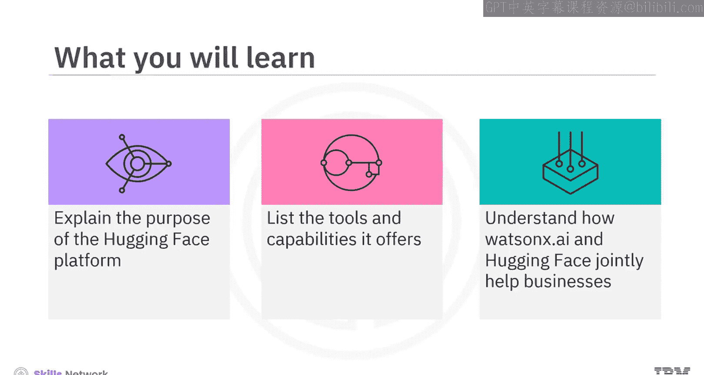
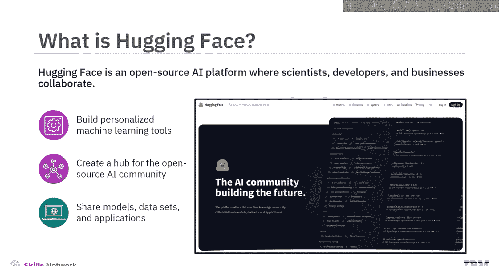
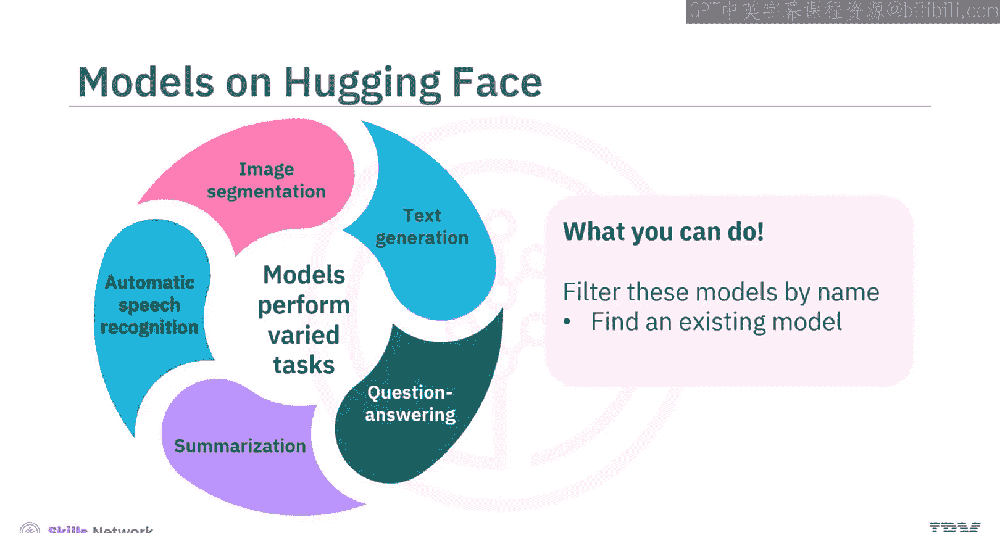
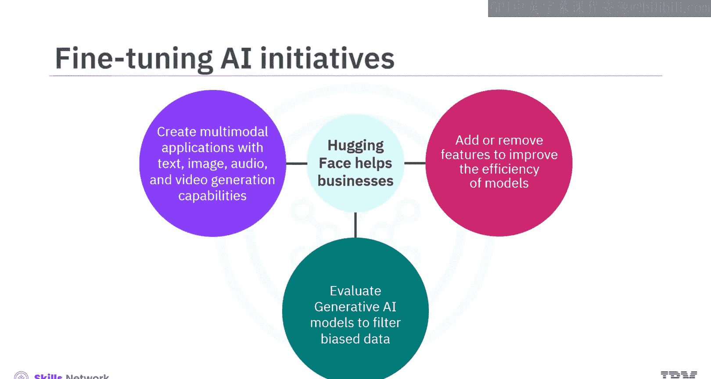
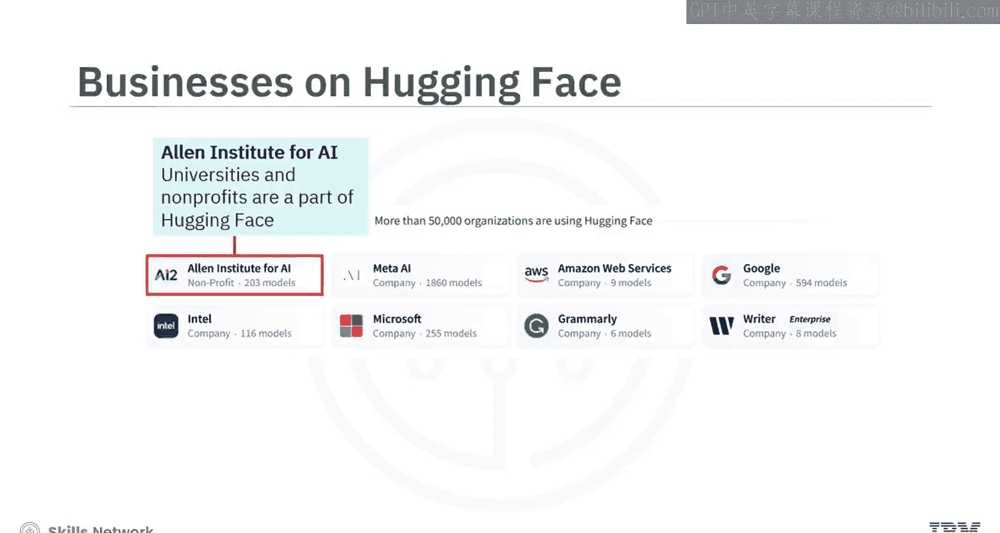
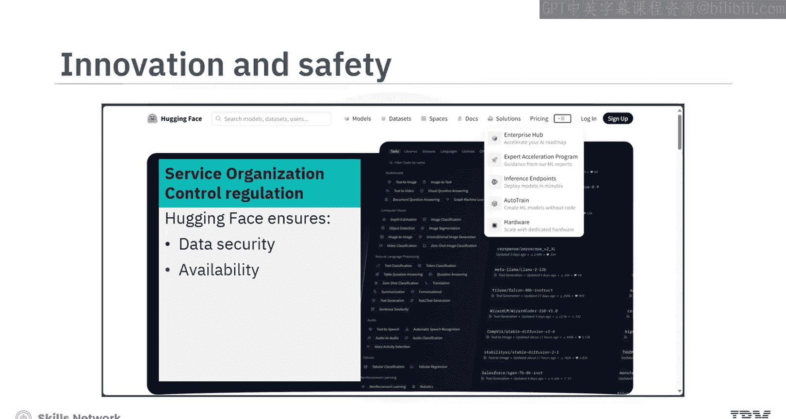
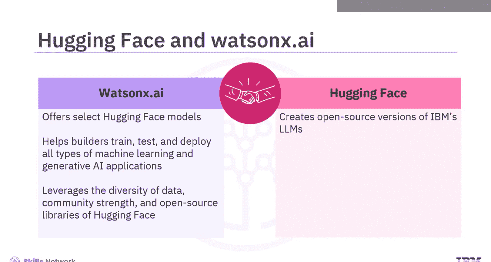
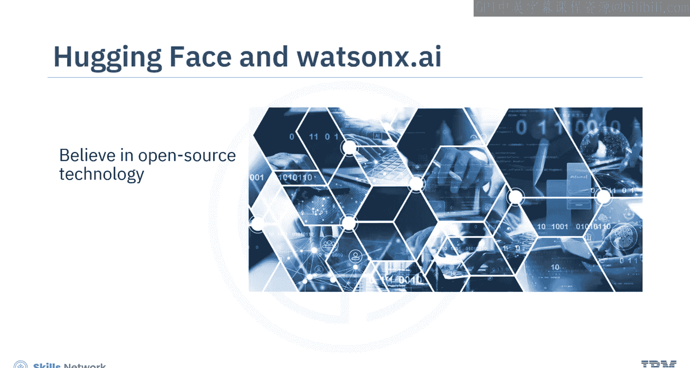
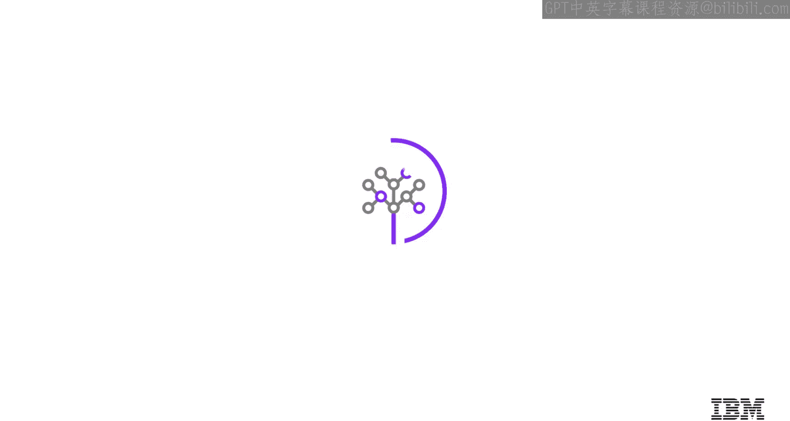

生成式人工智能工程：019：Hugging Face 平台介绍 🚀

在本节课中，我们将学习 Hugging Face 平台。我们将了解该平台的目的、其提供的工具与能力，以及它如何与 Watson X AI 协作，共同助力企业发展。

Hugging Face 是一个开源人工智能平台，科学家、开发者和企业在此协作，共同构建个性化的机器学习工具。该平台的建立旨在为开源 AI 社区创建一个中心，用于共享模型、数据集和应用程序。这使得各类用户，包括那些没有独立构建机器学习应用预算或资源的用户，都能接触到 AI 技术。因此，Hugging Face 被誉为推动了 AI 的民主化，因为它汇集众人之力，从众多精炼的小模型中获益，挑战了“一个通用模型统治一切”的假设。

最初，Hugging Face 社区专注于创建基于 Transformer 的模型，以利用自然语言处理的能力。然而，如今该平台提供了多种机器学习工具，用于生成文本、图像、音频和视频。

目前，Hugging Face 平台托管了超过 **250,000** 个开源模型、**50,000** 个数据集和 **100 万** 个开源演示应用，并且这个列表还在持续增长。

科学家和开发者使用 Hugging Face 来构建、训练和部署他们的 AI 模型。他们可以访问平台的开源 Transformer 库，该库拥有超过 **25,000** 个预训练模型，支持 PyTorch、TensorFlow 和 Google JAX 框架。以下是这些框架的简要说明：
*   **PyTorch**：一个深度学习库。
*   **TensorFlow**：一个机器学习平台。
*   **Google JAX**：一个机器学习框架。

该库中的模型执行多种任务，例如文本生成、问答、摘要、自动语音识别和图像分割等。用户可以通过名称筛选这些模型以找到现有模型，也可以将自己的模型分享到库中。开发者还可以在“Spaces”选项卡上托管生成式 AI 应用的演示，允许用户进行交互和验证。

那么，企业如何从该平台受益呢？

Hugging Face 为企业提供“企业中心”，企业可以从中访问预训练模型和数据集。这使得企业能够利用现有基础设施，而不是从头开始构建模型。这不仅减少了企业的碳足迹、扩展所需的时间和成本，还允许企业使用专有数据和相关用例来训练模型。

此外，Hugging Face 帮助企业：
*   **A.** 添加或移除功能以提高模型效率。
*   **B.** 评估其生成式 AI 模型以过滤有偏见的数据。
*   **C.** 创建具有文本、图像、音频和视频生成能力的多模态应用。

超过 **50,000** 家大中小企业积极使用 Hugging Face。例如：
*   生成式 AI 解决方案提供商 Writer 在 Hugging Face 上托管其 PaLM 大语言模型。
*   Intel 已正式加入 Hugging Face 的硬件合作伙伴计划，并与之合作构建先进的机器学习硬件和端到端机器学习工作流。
*   甚至大学和非营利组织也是 Hugging Face 的一部分。

Hugging Face 还提供其他服务：
*   **专家加速计划**：指导非开发人员使用机器学习模型。
*   **Hugging Chat**：首个开源的 ChatGPT 替代品。
*   为保护用户，Hugging Face 遵守服务组织控制第 2 类法规，这意味着确保用户数据的安全性、可用性、处理完整性、机密性和隐私性。

为进一步推动协作，Hugging Face 与 Watson X.ai（IBM 面向 AI 构建者的下一代企业工作室）建立了独特的合作伙伴关系。Watson X.ai 在其工作室中提供精选的 Hugging Face 模型，以帮助其构建者社区训练、测试和部署各类机器学习和生成式 AI 应用。这样，该工作室利用了 Hugging Face 提供的数据多样性、社区力量和开源库。

另一方面，Hugging Face 创建了 IBM 大语言模型的开源版本，并将其提供在自己的平台上。双方都相信开源技术，并押注于社区在 AI 领域创造价值，因为专有 AI 模型可能很快过时。Hugging Face 可能在 AI 领域的“五大”（即 Google、OpenAI、Meta、IBM 和 Microsoft）中占据优势，因为它支持并得到持续创新的开源 AI 社区的支持。

在本节课中，我们一起学习了关于 Hugging Face 的所有内容。这个 AI 平台展示了开源 AI 社区的协作力量。它为企业创造了空间，使其能够以更低的成本、更快的速度、更少的碳足迹构建定制的专有模型。各类组织、大学和非营利机构利用该平台的工具和服务，从自然语言处理中受益。简而言之，您不必是大公司也能从生成式 AI 中获益。