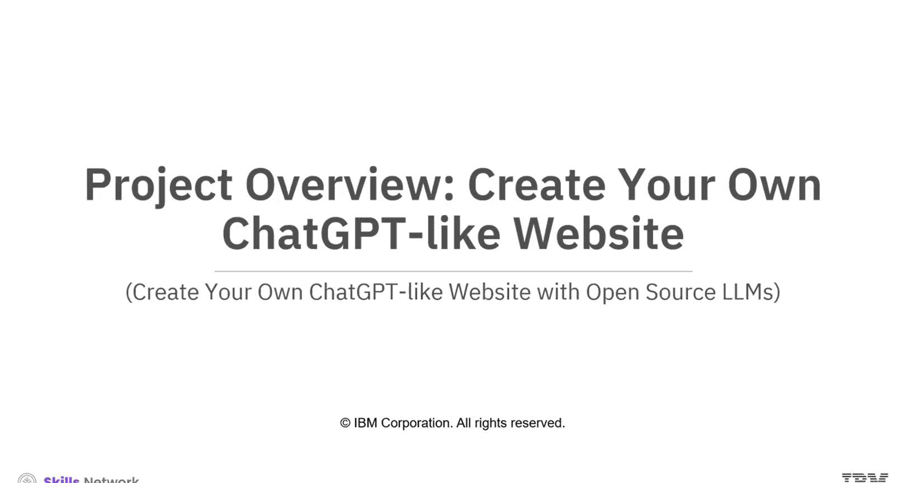
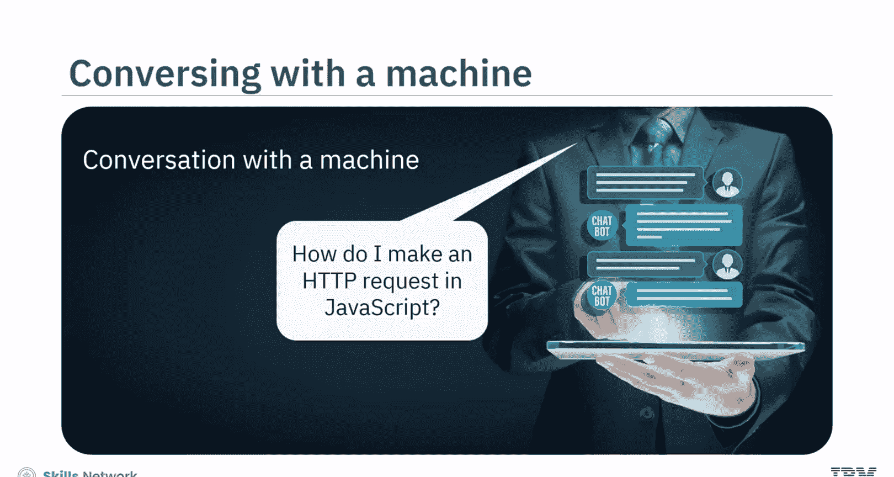
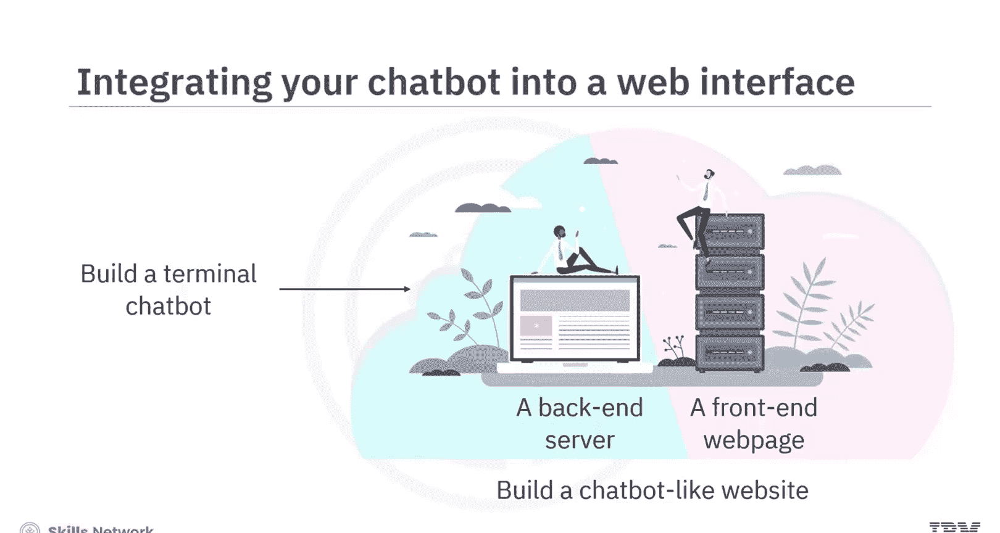
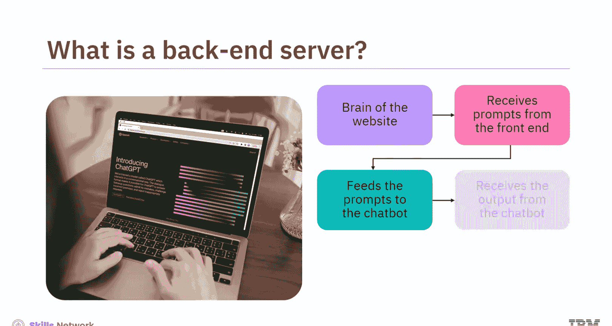
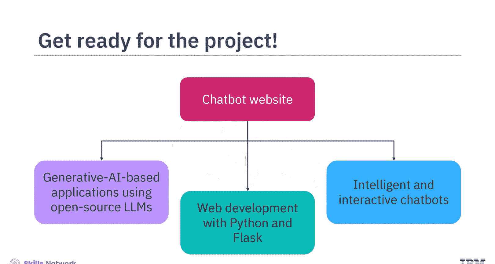

# 创建你自己的类ChatGPT网站：020：项目概述 🚀

在本节课中，我们将要学习如何利用开源的大型语言模型，创建一个类似ChatGPT的智能对话网站。我们将从理解其核心概念开始，逐步构建一个具备前后端的完整应用。

## 项目简介

随着人工智能的发展，现在我们已经可以与机器进行智能对话。你可以从计算机中获取任何主题的信息，从而节省研究和查询的时间与精力。例如，你可以询问“如何在JavaScript中发起HTTP请求？”。

这种智能助手的功能是通过一种计算机程序或聊天机器人实现的。聊天机器人是一种模拟人类书面或口头对话的计算机程序。通过集成生成式AI技术，如自然语言处理，聊天机器人能够理解问题并根据其收集的数据进行回应。

## 聊天机器人的工作原理

聊天机器人程序接收文本作为输入，并输出相应的文本。一个名为**Transformer**的特殊程序充当了聊天机器人的“大脑”。Transformer包含一个**大型语言模型**，它帮助聊天机器人理解输入的问题，并生成类人的回应作为输出。

LLM程序会遍历其收集的数据，并基于机器学习生成回应。Transformer负责处理输入和输出数据的技术流程，而LLM则专注于语言的理解与生成。

在本项目中，你将学习使用开源的LLM创建一个简单的聊天机器人，并将其集成到一个网页界面中。

## 如何选择大型语言模型

要构建聊天机器人，你必须根据机器人的用途选择合适的LLM。例如：
*   对于通用文本生成，可以考虑使用GPT-2或GPT-3模型。
*   对于情感分析，可以考虑使用BERT模型。
*   对于语言翻译，可以考虑使用T5模型。

选择LLM时还需考虑其他重要参数，包括**许可协议、模型大小、训练数据、性能与准确性**。在本项目中，我们将使用Facebook的**SplendorBod模型**，该模型可通过Hugging Face网站获得开源许可。

## 项目所需工具与技能

在项目中，你还将使用Hugging Face的Python库——**Transformers**。这个库将为你构建聊天机器人提供有用的功能，例如与LLM交互，以及将输入优化为LLM能够理解的格式——即称为**Token**的小型构建块。

进行本项目时，你需要熟悉**Python**和**Flask**框架。同时，具备**HTML、CSS和JavaScript**的基础知识会更有帮助，但并非必需。本项目将提供分步指导，说明如何使用AI工具构建聊天机器人所需的代码和活动。

## 项目目标与架构

在本项目结束时，你将完成以下目标：
1.  识别聊天机器人的主要组件。
2.  确定为你的应用选择LLM时的考虑因素。
3.  描述Transformer的工作原理。
4.  获取开源模型并初始化分词器。
5.  用Python编写你的聊天机器人程序。

在构建了一个终端聊天机器人之后，你还需要将其集成到一个网页界面中。

要构建一个类聊天机器人的网站，你需要创建一个托管聊天机器人的**后端服务器**，以及一个与后端服务器通信的**前端网页**。

在一个网站中，后端服务器就像是应用的大脑。在聊天机器人应用中，后端服务器将从前端界面接收用户提示，并将其输入给聊天机器人。然后，服务器接收聊天机器人的输出，并将其显示在前端界面上。

你将使用**Flask**来托管后端服务器。Flask是一个用于构建Web应用的Python框架。它提供了处理传入请求、处理数据和生成响应的工具与功能，使得为你的网站或应用提供动力变得简单。

## 总结

本节课中，我们一起学习了创建AI驱动的聊天机器人网站的整体蓝图。通过本项目，你将掌握使用开源LLM构建生成式AI应用的基础，并运用Python和Flask的Web开发技能，创建一个智能且交互性强的聊天机器人。

你已经为这个激动人心的项目做好了准备。