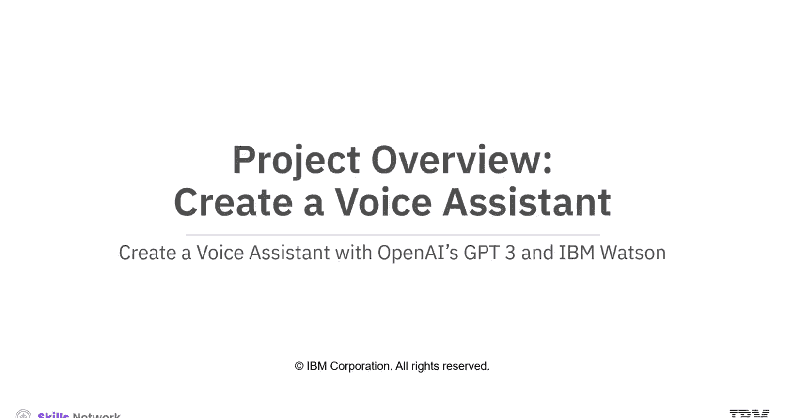
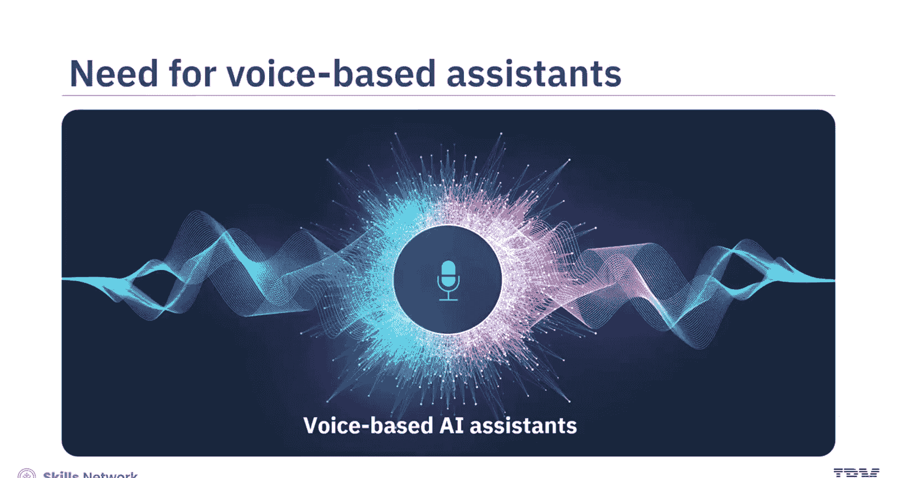
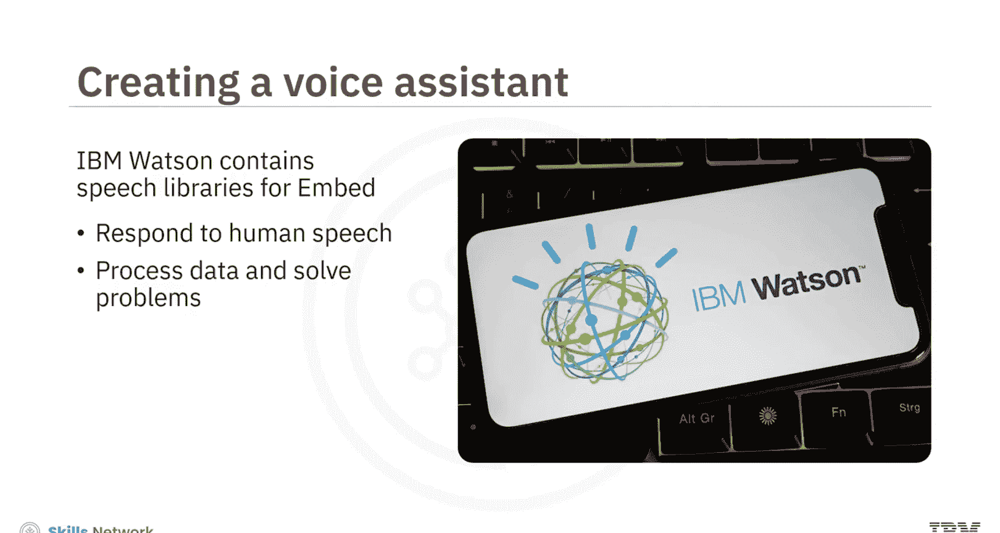
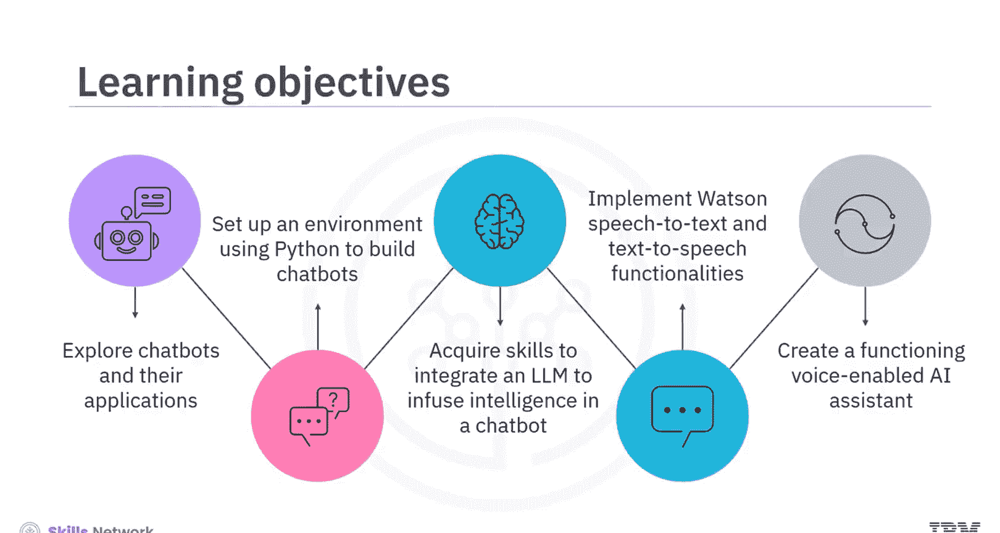
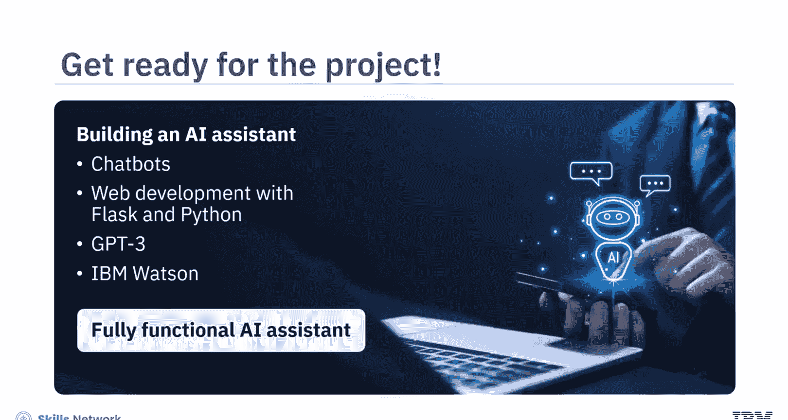
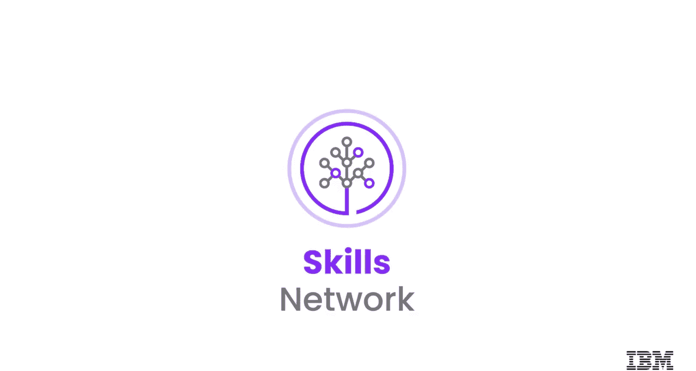

# 语音助手开发：021：项目概述 🎤

在本节课中，我们将学习如何结合 OpenAI 的 GPT-3 模型与 IBM Watson 的可嵌入 AI 服务，创建一个功能完整的智能语音助手。我们将探索语音 AI 的应用，并逐步构建一个能理解语音、智能回复并能“开口说话”的助手。

基于语音的人工智能领域正在迅速改变我们与技术交互的方式。其中，智能语音助手是一个前景广阔的应用方向。

设想一位忙碌的专业人士，他正忙于设计演示文稿，双手无暇操作电脑。此时，他无法通过电脑快速搜索信息。然而，他只需向 AI 助手提出一个语音查询，例如“总结一下人工智能在电动汽车领域应用的主要趋势”，就能保持信息灵通并高效工作。基于语音 AI 的助手使你能够通过自然对话无缝互动、获取信息并找到答案，这一切都只需借助你的声音。

在本项目中，我们将使用 OpenAI 的 GPT-3 模型和 IBM Watson 可嵌入 AI 来创建一个语音助手。GPT-3 模型将使助手能够理解和响应用户输入。Watson 的语音转文本（STT）功能赋予助手“听觉”，使其能理解用户的语音。Watson 的文本转语音（TTS）功能则使助手能够将答案“读”给用户听。IBM Watson 包含一套可嵌入的、容器化的文本转语音和语音转文本库，有助于响应人类语音、处理数据并回答问题，从而帮助个人和公司应对各种问题。本项目将探索聊天机器人及其应用。你将创建一个具有高智能水平的功能性助手，它可以接收语音输入并提供语音回复。

在本项目中，你将首先使用 Python 搭建一个用于构建助手的环境，然后使用 GPT-3 构建你自己的助手，最后，集成 IBM Watson 以实现语音检测功能。你还将学习如何将助手部署到公共服务器。

让我们先预览一下你将在本项目中开发的语音助手演示。

该助手的界面显示标题“语音助手”。它提供了在亮色和暗色模式之间切换的功能。此助手支持文本和语音两种交互方式，你可以在消息字段中输入问题，或点击录音图标进行语音提问。例如，提问“莎士比亚的悲剧有哪些？”，助手会提供详细的回复，显示文本并播放音频响应，展示了文本转语音的集成。你可以通过输入或使用录音选项来继续对话。通过输入“不，谢谢”等提示来结束与助手的互动。

为了构建这个语音助手，你将使用 HTML、CSS 和 JavaScript 来构建与助手通信的前端界面。对于后端开发，你将使用 Python 和 Flask 框架。Flask 是一个用于构建 Web 应用程序的 Web 框架。在本项目中，Flask 由 Docker 支持，以创建管理依赖项的容器。接着，你将集成 IBM Watson 的语音转文本功能，使聊天机器人能够理解用户的语音输入。然后，你将集成 GPT-3，为聊天机器人注入智能。此外，你还会集成 Watson 的文本转语音功能，赋予聊天机器人语音回复的能力。

一旦所有组件组合完成，你将开发出一个功能完整的语音助手，它可以接收文本和语音输入，并提供文本和语音两种形式的响应。要完成这个项目，你应该熟悉 Python 和 Flask。同时，建议（但非必需）对 HTML、CSS 和 JavaScript 有基本了解。本项目将提供分步说明，指导你如何使用代码以及完成构建聊天机器人所需的不同活动，并利用各种 AI 工具。

到本课程结束时，你将能够达成以下目标：
*   探索聊天机器人及其应用。
*   使用 Python 搭建构建聊天机器人的环境。
*   掌握集成大型语言模型（LLM）为聊天机器人注入智能的技能。
*   实现 Watson 的语音转文本和文本转语音功能。
*   创建一个功能完整的、支持语音的 AI 助手。

本项目将深入探讨如何构建一个强大的助手。你将学习关于聊天机器人的知识，以及使用 Flask 和 Python 进行 Web 开发。你还将集成 GPT-3 和 IBM Watson 的能力。

最终，你将构建出一个具备语音识别功能的助手。课程结束时，你将拥有一个功能齐全的 AI 助手，它展示了你在使用 API 与大型语言模型（LLM）协作方面的新技能。

本节课中，我们一起学习了本项目的整体目标、应用场景和技术架构。我们了解到，语音助手结合了**前端界面（HTML/CSS/JS）**、**后端逻辑（Python/Flask）**、**智能核心（GPT-3）** 和**语音交互能力（IBM Watson STT/TTS）**。在接下来的章节中，我们将逐步实现这些组件，最终完成我们的智能语音助手。