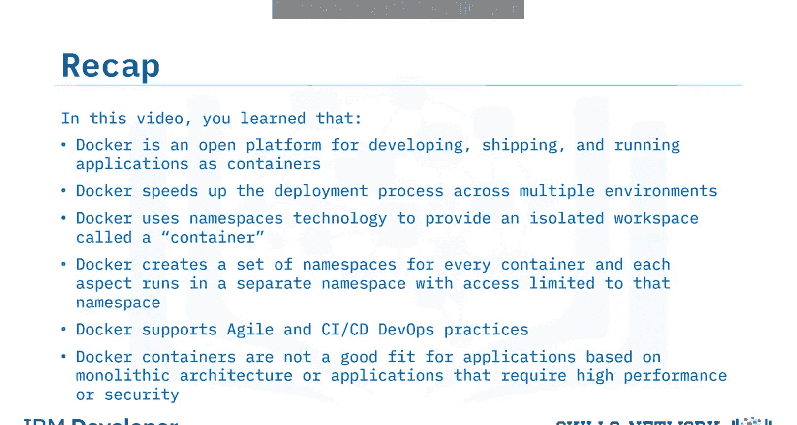

# 生成式人工智能工程：022：Docker简介 🐳

在本节课中，我们将要学习Docker的基础知识。Docker是一个用于开发、交付和运行应用程序的开源平台，它通过容器技术实现。我们将了解Docker的定义、工作原理、核心技术、优势以及其适用场景。

## 什么是Docker？

Docker自2013年问世，其官方定义可以概括为：Docker是一个用于将应用程序作为容器进行开发、运输和运行的开源平台。Docker因其简单的架构、强大的可扩展性以及在多种平台、环境和位置上的可移植性而受到开发者的欢迎。

Docker将应用程序与底层基础设施（包括硬件、操作系统和容器运行时）隔离开来。

## Docker的工作原理与技术

上一节我们介绍了Docker的基本概念，本节中我们来看看Docker是如何工作的。

Docker使用Go编程语言编写。它利用Linux内核的特性来提供其功能。Docker使用**命名空间**技术来提供一个称为“容器”的隔离工作空间。Docker为每个容器创建一组命名空间，每个方面（如进程、网络）都在一个独立的命名空间中运行，且访问权限仅限于该命名空间。

Docker的方法论还启发了许多额外的创新，包括互补工具和开发方法。

以下是Docker生态中的一些关键组件：
*   **互补工具**：如Docker CLI、Docker Compose和Prometheus。
*   **各类插件**：包括存储插件。
*   **编排技术**：如使用Docker Swarm或Kubernetes。
*   **开发方法论**：如微服务和无服务器架构。

## Docker的优势

了解了Docker的技术基础后，我们来看看使用Docker能带来哪些具体的好处。

Docker提供以下优势：
*   **环境一致与隔离**：带来稳定的应用部署。
*   **快速部署**：由于Docker镜像小巧且可复用，部署可在数秒内完成，这显著加快了开发流程。
*   **自动化能力**：有助于消除错误，简化维护周期。
*   **支持敏捷与CI/CD DevOps实践**：Docker易于版本控制，加快了测试、回滚和重新部署的速度。
*   **应用模块化**：帮助分割应用，便于刷新、清理和修复。开发者可以更快速地协作解决问题，并在需要时扩展容器。
*   **高度可移植**：Docker镜像与平台无关，因此具有高度的可移植性。

## Docker的适用场景与挑战

尽管Docker有很多优势，但它并非适用于所有类型的应用。本节中我们来看看哪些情况下Docker可能不是最佳选择。

Docker不适合具有以下特性的应用程序：
*   需要**高性能**或**高安全性**的应用。
*   基于**单体架构**的应用。
*   使用**丰富GUI功能**的应用。
*   执行**标准桌面功能**或**功能有限**的应用。

## 总结 🎯

本节课中我们一起学习了Docker的核心知识。我们了解到Docker是一个用于开发、运输和运行容器化应用的开源平台，它能加速跨多环境的部署流程。Docker使用命名空间技术来提供隔离的容器工作空间，每个容器都运行在独立的命名空间中。它支持敏捷和CI/CD DevOps实践。最后，我们也认识到Docker容器并不适合基于单体架构或对性能、安全性有极高要求的应用程序。

