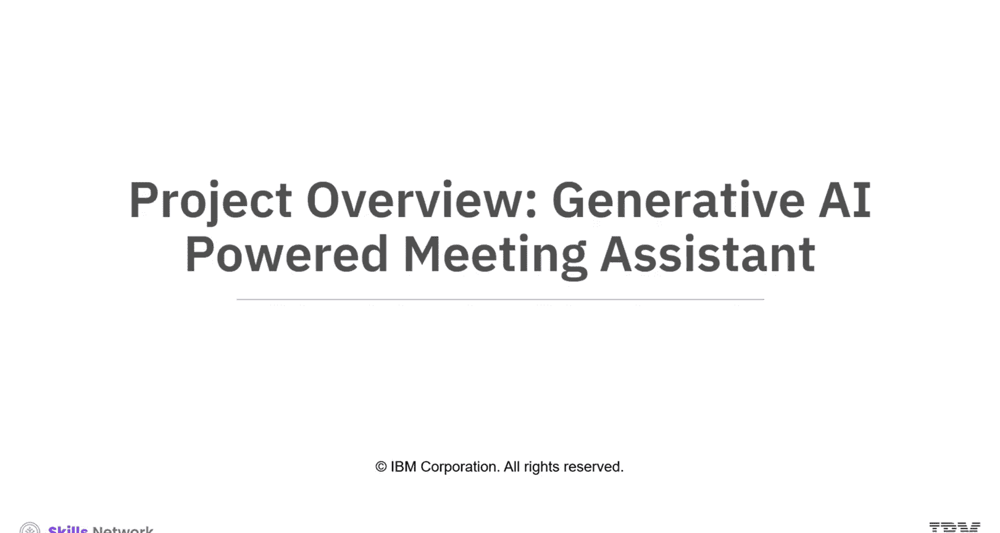
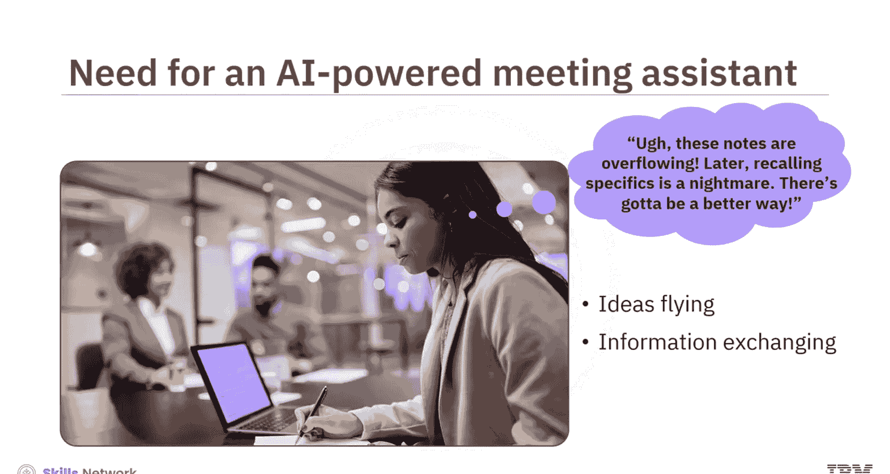
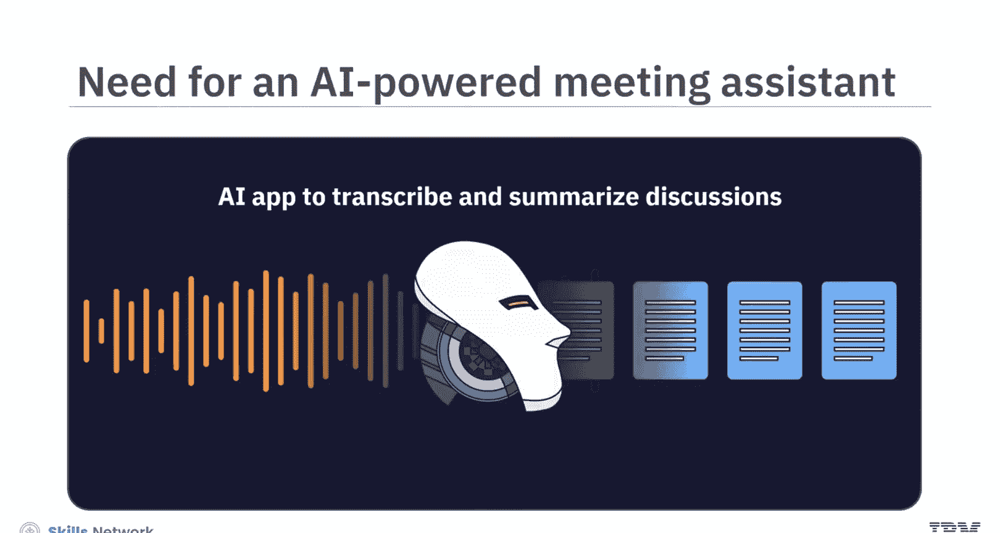
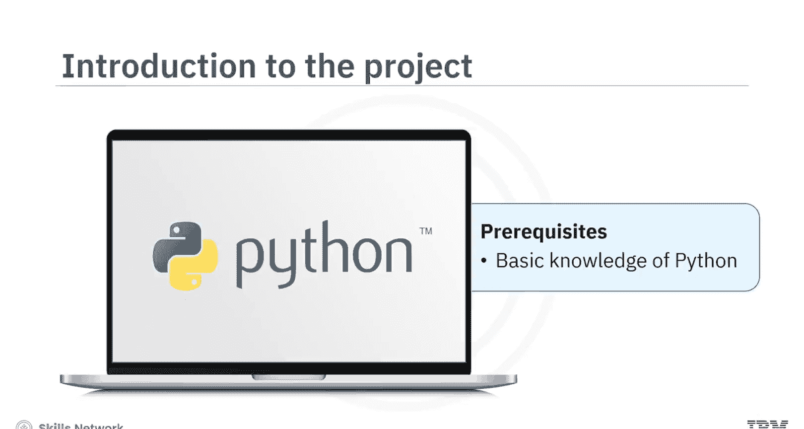
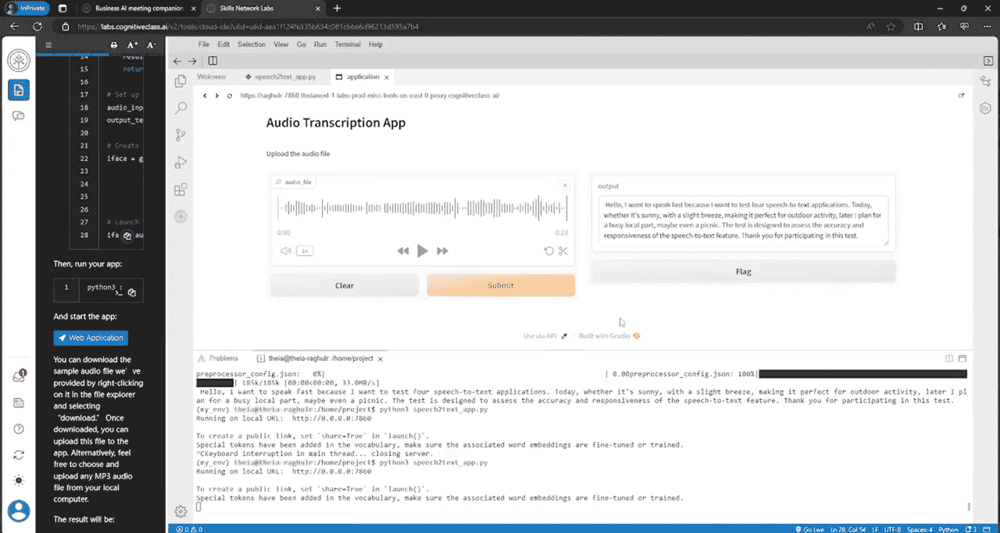
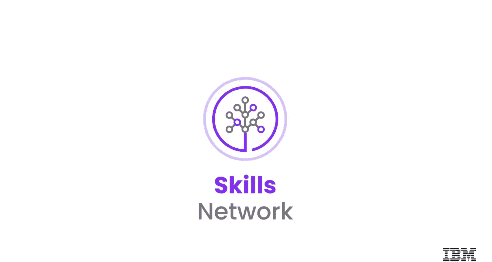

生成式AI驱动的会议助手：023：项目概述 🎯

在本节课中，我们将学习如何构建一个由生成式AI驱动的智能会议助手。这个应用能够自动转录会议录音，并利用大语言模型生成简洁的摘要和关键点，帮助您高效回顾会议内容。

想象一下，您正在参加一场头脑风暴会议，各种想法和信息快速交换。您虽然做了笔记，但事后很难回忆起所有关键决策或具体的行动项。这时，一个创新的、基于生成式AI的应用就显得非常有帮助。它能准确转录会议讨论，并提供简明扼要的摘要，突出显示关键点和已做出的决策。

这背后的核心是自动语音识别技术和生成式大语言模型的结合。

您可以使用ASR技术将口语转换为可读的文本，然后利用LLM来高效地理解和总结这些文本。LLM还能通过纠正细微错误来优化语音转文本的输出，确保结果的连贯性和准确性。

本项目将指导您构建这样一个应用。您将使用名为OpenAI Whisper的ASR工具进行语音转文本，并利用Meta开发的强大开源语言模型Llama 2的能力来总结和提取关键点。

项目包含在无服务器环境中构建和部署应用的逐步指导。

首先，您将使用示例音频文件实现OpenAI Whisper，将音频转录为文本。

接下来，您将使用Hugging Face的Gradio库为应用构建一个直观且用户友好的界面。

进一步，您将集成由IBM Watson X托管的Llama 2 LLM，以有效地总结转录的音频。IBM Watson X提供了多种生成式AI模型，包括Llama 2。您将学习创建一个Python脚本来使用该模型生成文本，并了解影响模型输出的一些关键参数。

最后，您将学习使用IBM Code Engine在线部署应用。这是一个用于在云中运行应用程序的无服务器平台。

对于本项目，您将使用Python来编写不同功能的代码，因此您应具备该编程语言的基础知识。

让我们预览一下您将在本项目中开发的应用演示。

应用的输出将显示在Gradio的应用输出文本框中。应用界面显示标题“Audio Transcription App”。

您可以使用“点击上传”图标上传录制的音频文件，然后点击“提交”。音频文件内容的摘要和关键点将作为输出显示。

在本项目结束时，您将完成以下目标：
*   解释LLM如何帮助生成、优化和总结文本。
*   实现自动语音识别技术以进行语音到文本的转换。
*   为应用程序设计用户友好的界面。
*   使用云平台在线部署应用程序以托管应用。

通过完成这个项目，您将为使用LLM进行文本生成和摘要任务打下坚实的基础。项目提供了一个展示您Python编程技能以构建和部署应用程序的机会。

利用AI语音转文本转换和生成式AI LLM的强大功能，准备好应用并提升您的技能吧。

本节课中，我们一起学习了生成式AI会议助手项目的整体构想、技术栈构成以及最终将实现的目标。在接下来的章节中，我们将逐步深入，开始动手构建应用的各个部分。