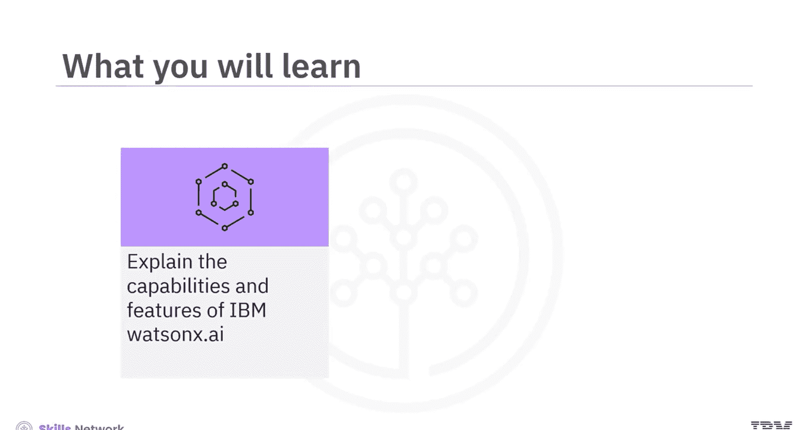
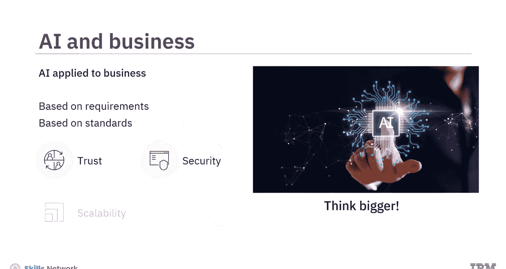
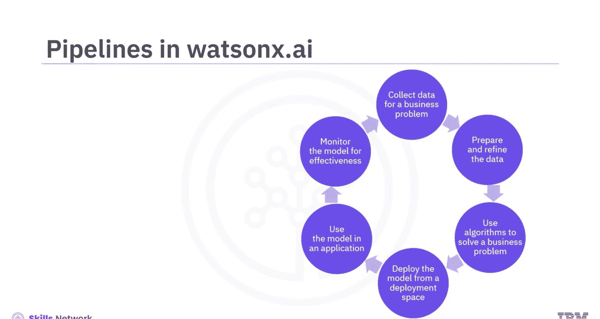
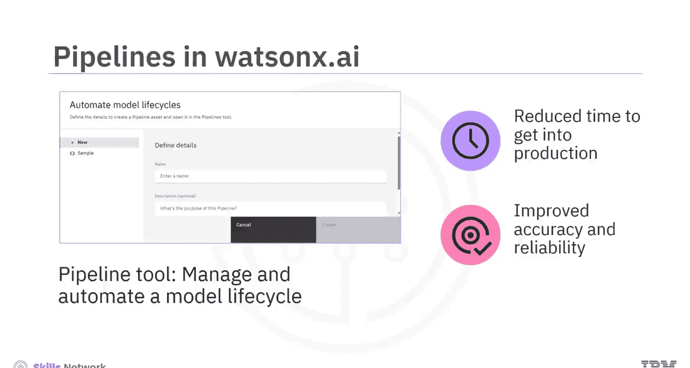
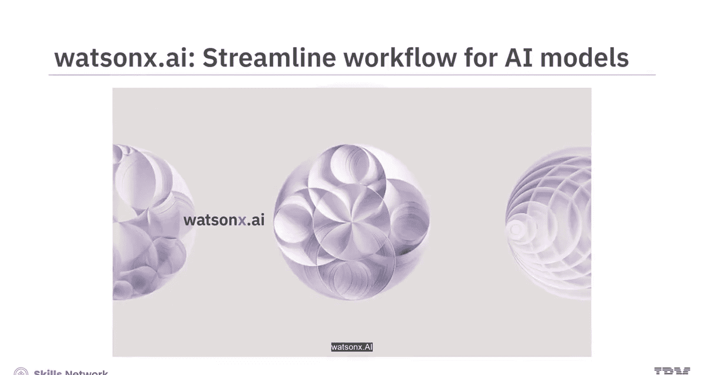

**生成式人工智能工程：024：IBM Watsonx.ai 平台概览**

在本节课中，我们将学习 IBM Watsonx.ai 平台的核心能力、主要功能以及常用工具。通过本节内容，你将能够解释 IBM Watsonx.ai 的功能特性，并识别其提供的常见工具。

---

### **概述：企业级AI的需求**

通过AI创作诗歌或歌曲很有趣，但当AI应用于商业时，需要考虑更宏大的层面。企业级AI需要基于更高的标准和要求来构建。当你在业务核心中构建AI时，它必须是**可信的、安全的、可扩展的且适应性强的**。IBM Watsonx 正是这样一个帮助企业利用AI的平台。

IBM Watsonx 是一个面向AI构建者的集成式AI与数据平台。该平台包含三个核心产品：
1.  **Watsonx.ai**：一个用于新型基础模型、生成式AI和机器学习的工作室。
2.  **Watsonx.data**：一个数据存储库。
3.  **Watsonx.governance**：一个用于AI监控与治理的工具包。

本节视频将重点介绍 **Watsonx.ai**。

---

### **Watsonx.ai 简介**

Watsonx.ai 是一个由基础模型驱动的集成工具工作室，用于处理生成式AI和构建机器学习模型。借助 Watsonx.ai，你可以轻松地**训练、调优、部署和管理**基础模型。这能帮助你在**更短的时间和更少的数据量**下构建AI应用。

以下是使用 Watsonx.ai 可以实现的一些主要目标：
*   构建机器学习模型。
*   试验基础模型。
*   管理AI生命周期。

根据你的目标，你可以选择 Watsonx.ai 提供的相应任务。这些任务可以通过平台上的工具来完成。

---

### **平台工具与AI生命周期**

Watsonx.ai 中的任务和工具与模型的AI生命周期紧密对齐。通常，你需要准备数据、构建实验、训练模型和解决方案，然后部署模型并开始构建应用，最后管理这些模型和重复性流程。

Watsonx.ai 提供了对来自 Hugging Face 的IBM精选开源模型，以及一系列不同规模和架构的IBM自训练模型的访问。作为AI价值创造者，你也可以将自己的模型和数据带入 Watsonx.ai。

以下是 Watsonx.ai 中几个核心工具的简要介绍：

**1. Prompt Lab（提示实验室）**
AI构建者可以使用 Prompt Lab 试验基础模型，并构建满足其需求的提示词。该工具支持用户通过实验性提示词来完成一系列自然语言处理任务，包括：
*   问答
*   内容生成
*   摘要
*   文本分类
*   信息提取

**2. Tuning Studio（调优工作室）**
作为AI创造者，你可能希望基于自己的数据为特定业务用例定制模型。Watsonx.ai 的 Tuning Studio 工具使之成为可能。后续版本的 Watsonx.ai 将包含针对提示词调优和模型微调的调优方法与示例，以提升模型性能和准确性。

**3. Pipeline（流水线）**
将模型投入生产是一个包含多个步骤的过程，用于管理和自动化模型生命周期。Watsonx.ai 提供了 Pipeline 工具。该工具可用于自动化涉及数据加载、训练、部署模型和评估模型的步骤。这可以**缩短模型投入生产的时间，并提高模型的准确性和可靠性**。

---

### **工具协同与工作流**

让我们通过IBM的视频了解 Watsonx.ai 中的不同工具如何协同工作，创建一个协作环境以简化AI模型的工作流。

直到最近，AI模型仍需针对非常具体的任务进行训练。但现在，借助基础模型的力量，你可以用**更少的时间和数据**构建强大的AI应用。

在我们的 Prompt Lab 中，你可以引导模型以满足你的需求。我们提供了易于使用的工具来构建和完善性能提示词，以达到预期结果。

如果你希望进一步定制，可以在 Tuning Studio 中调整模型，使其对你的业务用例更加精确。你可以导入数据集，并使用少至100个示例来调优你的模型。我们提供最先进的调优方法，只需点击几下即可完成设置。

现在，是时候让你的模型投入工作了。创建一个企业级部署，并开始构建你的应用。

就是这样，借助 Watsonx.ai，你的团队将获得一个协作环境的赋能，该环境能**简化整个AI生命周期的工作流**，为你企业**倍增AI的力量**。它实用、高效且易于使用。

---

### **安全与隐私保障**

IBM Watsonx.ai 确保你正在处理的数据和模型的安全性。你的数据和你创建的模型仅对你自己可见。你的数据以加密格式存储。你创建的模型也仅对你的账户私有。**IBM无法访问你的数据或模型，未经你的许可，它们永远不会被IBM或任何其他个人或组织使用。**

---

### **总结**

本节课中，我们一起学习了 IBM Watsonx，这是一个帮助企业在负责任和透明的前提下创建AI的AI与数据平台。Watsonx 的产品之一 Watsonx.ai，是一个用于训练、调优和部署生成式AI模型的集成工具工作室。Watsonx.ai 提供的主要工具包括 **Prompt Lab**、**Tuning Studio** 和 **Pipeline** 工具。