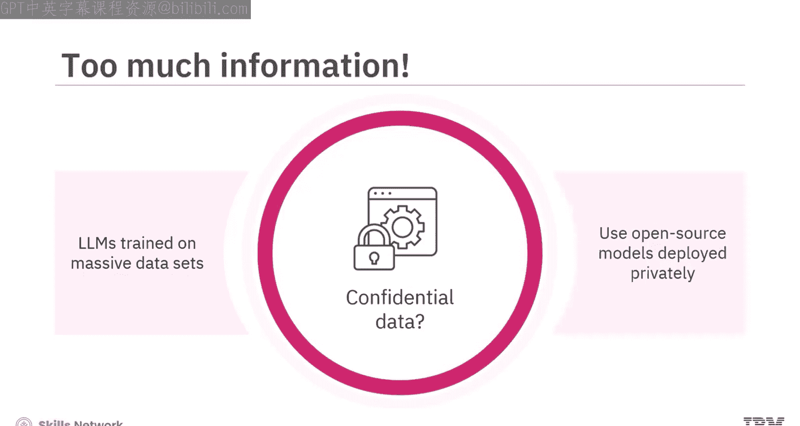
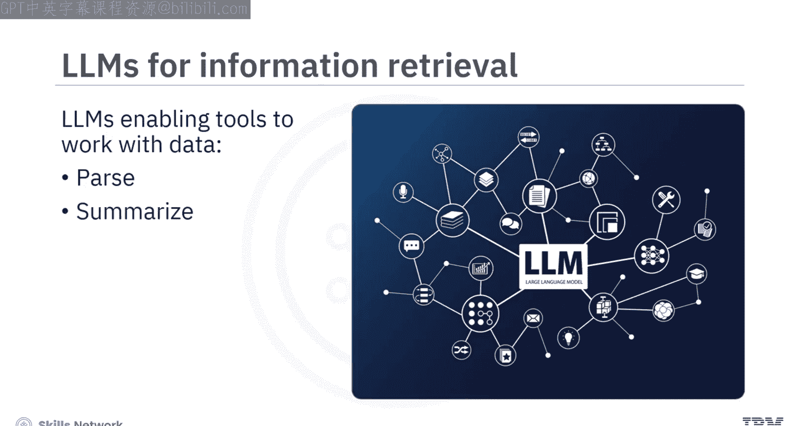
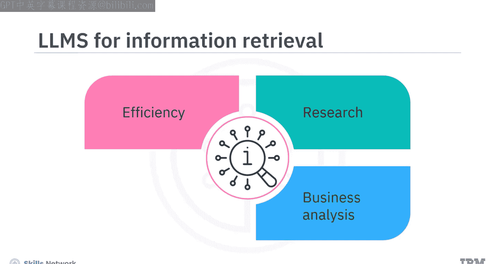
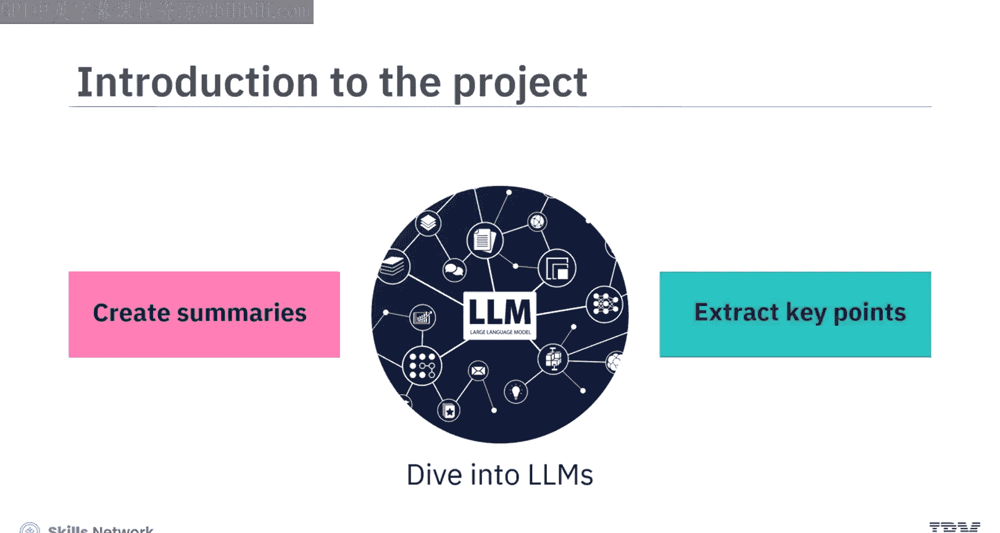
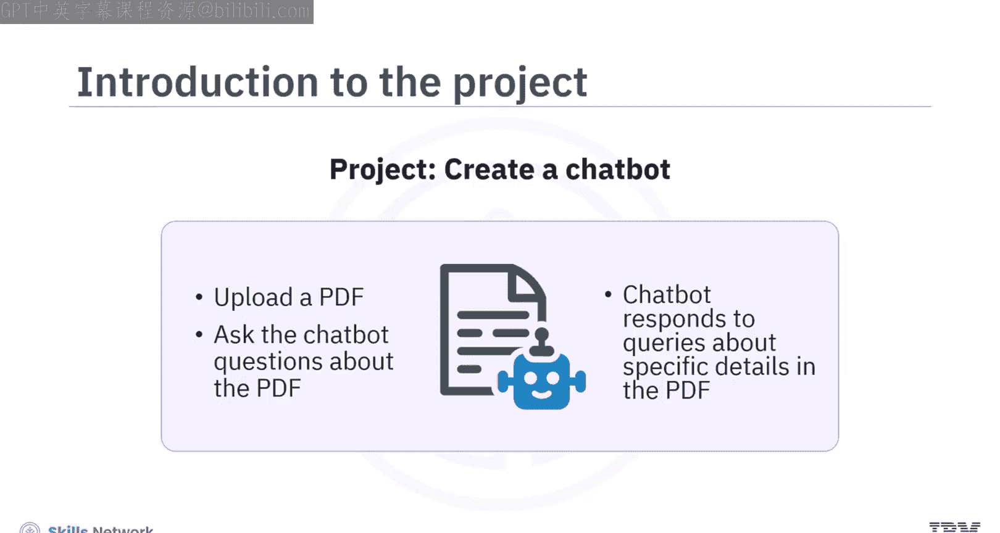
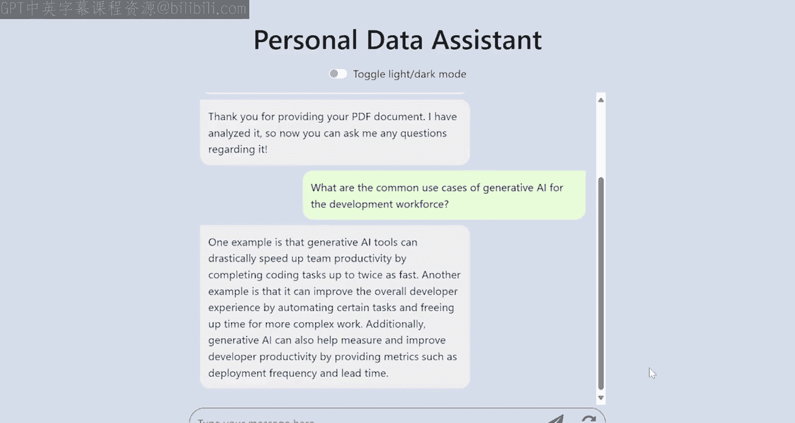
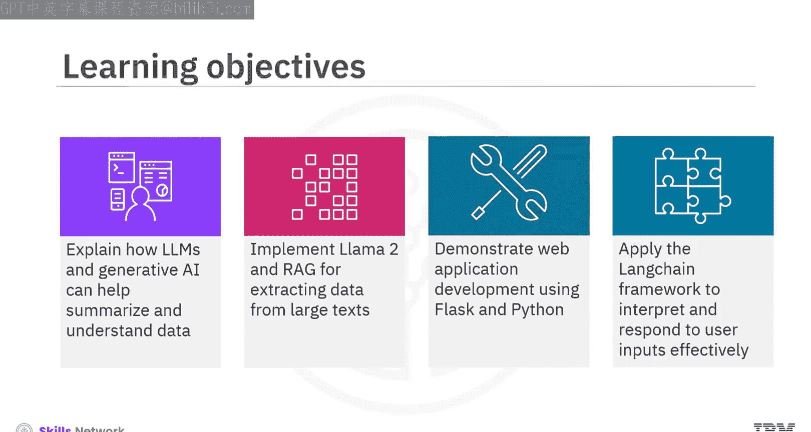
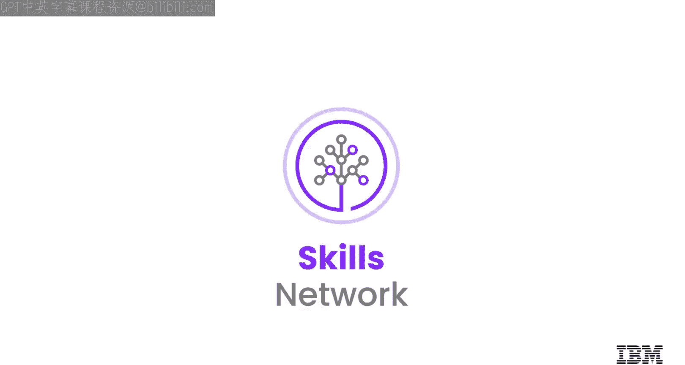

# 生成式AI与RAG：025：使用LLM总结私人数据

## 概述

在本节课中，我们将学习如何利用大型语言模型和生成式人工智能技术，来总结和分析您的私人数据。面对海量信息时，提取关键内容往往如同大海捞针。本项目将引导您构建一个智能聊天机器人，它能够理解您上传的PDF文档内容，并回答相关问题，从而帮助您高效地获取所需信息。

## 信息过载的挑战

在当今数字时代，我们不断被数据轰炸，这使得寻找特定细节变得异常困难。

从海量数据中提取见解，就像在干草堆中寻找一根针。

## 生成式AI与大型语言模型的引入

这正是生成式人工智能和大型语言模型发挥作用的地方。

LLM在庞大数据集上进行训练。然而，当您拥有敏感或机密数据，不希望与公共模型共享时，您可以使用私有部署的开源模型。

随着LLM等生成式AI模型的进步，我们可以创建并利用工具来高效地解析、总结和理解海量数据。

## 项目的核心价值

通过理解和利用LLM的能力，您可以改变信息检索的格局。这不仅仅是效率的提升，更为研究、商业分析乃至日常决策过程开辟了新前沿。

本项目深入探讨LLM，为您提供使用LLM从冗长文档中创建简明摘要和提取关键点的技能。

## 项目成果预览：智能聊天机器人

在项目中，您将创建一个聊天机器人，允许您上传PDF文件，随后您可以就该PDF的内容向聊天机器人提问。

这个聊天机器人不仅能通过文本与用户互动，还能理解并回应用户关于PDF中具体细节的查询。

让我们预览一下您将在本项目中开发的聊天机器人演示。

聊天机器人将作为一个个人数据助手界面进行访问。您将看到聊天机器人的初始消息和一个文件上传选项。

让我们上传一个PDF文档进行分析。在本演示中，我们将上传一份包含IBM博客文章的PDF，标题为《生成式AI提升开发人员生产力的9种方式》。

上传后，可以向聊天机器人询问关于PDF内容的任何问题。例如：“生成式AI对开发人员有哪些常见用例？”

聊天机器人将分析PDF的内容，并根据其理解提供答案。

## 项目技术栈详解

为了构建项目中的聊天机器人，您将使用 **Llama 2 LLM**。Llama 2是由Meta发布的一个开源LLM系列。

它处理自然语言，理解用户输入，并生成基于文本的响应。

在项目中，Llama 2的使用得到了**检索增强生成**技术的支持。

RAG使Llama 2能够访问并利用来自外部源或互联网的信息。这种结合将使聊天机器人在提供更准确、更相关的答案方面变得更智能。

在项目中，您将实现 **Flask** 和 **LangChain** 框架。Flask是Python中一个轻量级的Web应用框架，用于开发聊天机器人的后端，处理HTTP请求并提供响应。

LangChain框架可以将LLM集成到应用程序中，在这里可用于促进Flask后端和Llama 2之间的交互，以处理用户查询。

## 学习前提与项目目标

要完成本项目，您应该熟悉Python。同时，具备HTML、CSS和JavaScript的基础知识会有所帮助，但并非必需。

本项目提供了关于如何处理代码以及构建聊天机器人所需不同活动的分步说明。

在本项目结束时，您将能够实现以下目标：
*   解释LLM和生成式AI如何帮助总结和理解数据。
*   实现Llama 2和RAG以从大型文本中提取数据。
*   使用Flask和Python进行Web应用程序开发。
*   应用LangChain框架来有效解释和响应用户输入。

## 总结

本节课我们一起学习了构建一个强大的聊天机器人应用程序。您将了解聊天机器人、使用Flask和Python进行Web开发，并掌握利用LangChain来理解和响应多样化用户输入的能力。最终，您将拥有一个功能齐全的聊天机器人，展示您新获得的专业知识。