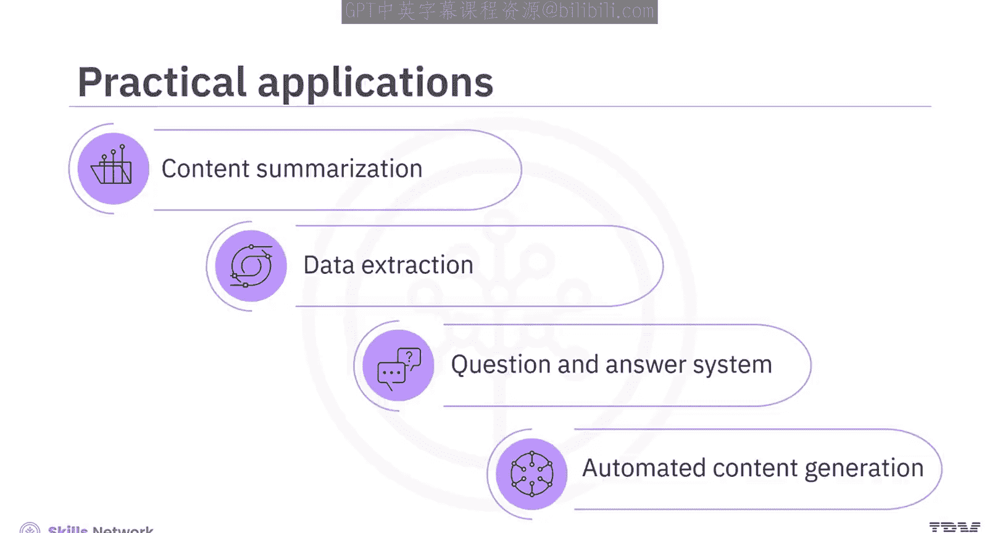
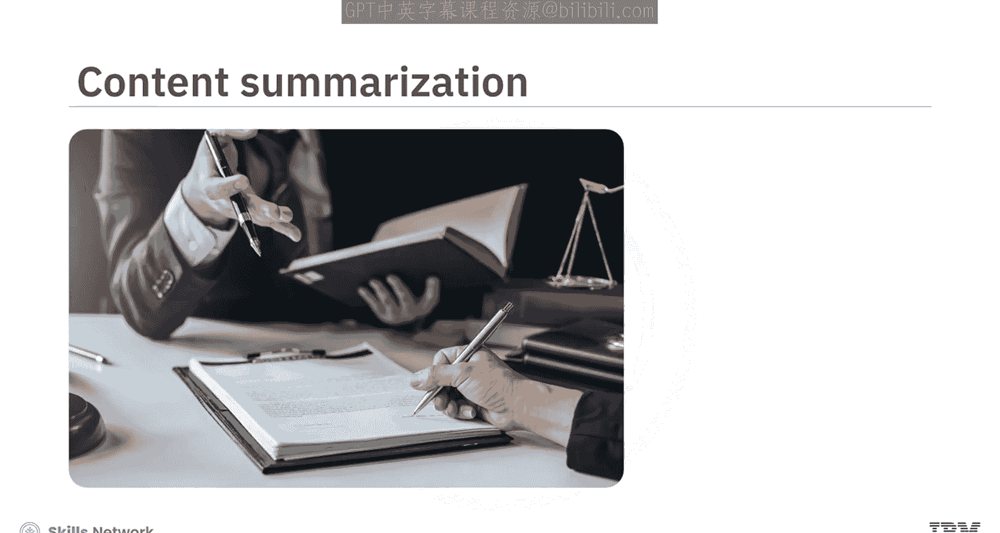
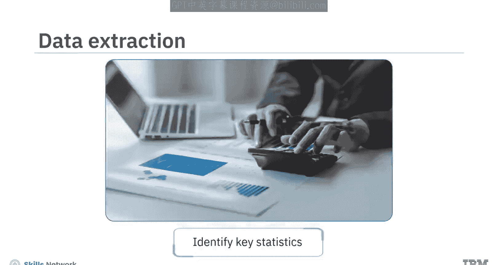
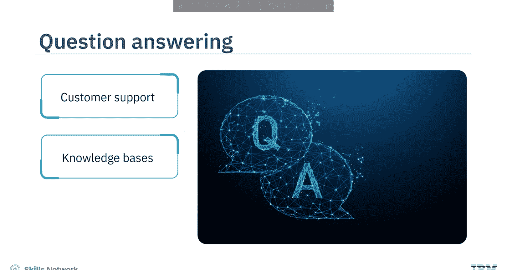
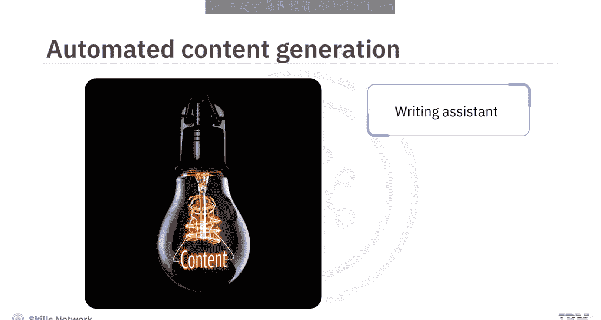
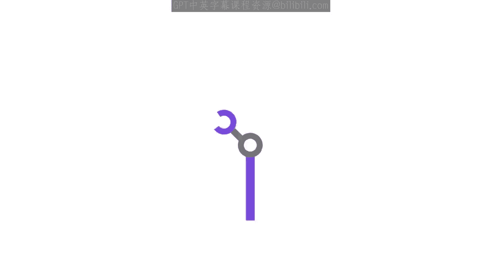

# 生成式人工智能工程：026：LangChain简介 🧠

在本节课中，我们将学习LangChain这一开源Python框架。我们将了解它的核心目的、主要优势、实际应用场景，以及它如何与其他数据类型协同工作。

## 概述

LangChain是一个用于简化大型语言模型（LLM）应用开发的开源Python框架。它为开发者提供了组件和接口，帮助将LLM集成到AI应用中。该框架的核心功能是从大量文本（如研究论文或法律文件）中定位相关信息，并通过检索数据和生成连贯摘要来响应复杂的提示。其名称中的“Chain”源于它将检索、提取、处理和生成等操作串联起来的能力。

## LangChain的核心优势

AI开发者青睐LangChain，主要基于以下几个关键优势：模块化、可扩展性、分解能力以及与向量数据库的轻松集成。以下是每个优势的详细说明。

**模块化**
LangChain的设计允许应用开发者像搭积木一样组合不同的组件。这种模块化设计鼓励组件复用，从而节省开发时间和精力。

**可扩展性**
LangChain的可扩展设计使开发者能够轻松添加新功能、适配现有组件、与外部系统集成，并且只需对代码库进行最小程度的修改。

**分解能力**
LangChain模仿人类解决问题的过程，将复杂的查询或任务分解为更小、更易管理的步骤。这种分解能力使其能够从上下文中做出准确推断，从而产生相关且精确的响应。

**与向量数据库集成**
LangChain与向量数据库集成，可实现高效的语义搜索和信息检索。当与向量数据库结合使用时，它能为应用程序提供在庞大数据集中快速访问相关信息的能力。

## LangChain的实践应用

AI应用可以利用LangChain框架实现多种实际用途，例如内容摘要、数据提取、复杂的问答系统以及自动化内容生成。让我们探讨几个具体例子。

**内容摘要与数据提取**
凭借其总结文章、报告和文档的能力，用户可以通过解读复杂的法律文件来更好地获取信息。它可以从报告中提取关键统计数据，简化将文本转化为可操作见解的过程。

**复杂的问答系统**
基于LangChain的问答系统可以变革客户支持和知识库服务。这些系统能够根据整个对话的上下文，提供一系列清晰、相关的答案。

**自动化内容生成**
LangChain可以协助生成书面材料。该框架为自动化常规写作任务（如起草电子邮件、头脑风暴或编写技术文档）开辟了可能性。

## 处理其他数据类型

虽然主要为基于文本的应用程序设计，但LangChain可以通过利用外部库和模型（如语音转文本）来处理其他数据类型，如图像、音频和视频。它与向量数据库的集成使得可以利用从这些数据类型生成的嵌入向量来捕获语义含义并执行相似性搜索，这使其成为处理各种AI任务的宝贵工具。

## 总结

本节课中，我们一起学习了LangChain。我们了解到，LangChain是一个用于精确定位文本中相关信息并提供响应复杂提示方法的Python框架。其优势包括模块化、可扩展性、分解能力以及与向量数据库的轻松集成。其实践应用包括解读复杂法律文件、从报告中提取关键统计数据、改进客户支持以及自动化常规写作任务。此外，通过使用外部库和模型，LangChain也能用于处理其他数据类型。