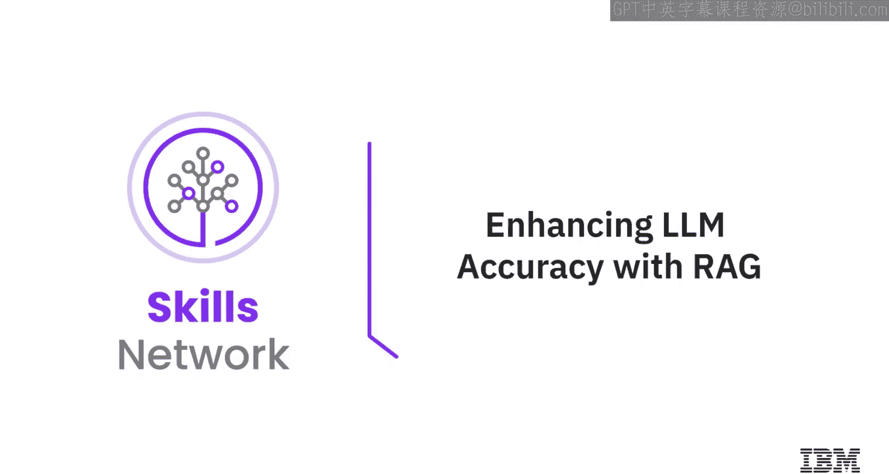
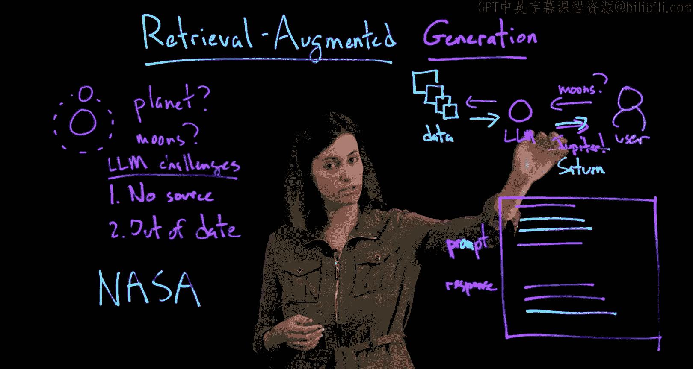

# 生成式人工智能工程：027：通过RAG增强LLM准确性 🎯



在本节课中，我们将学习一个名为“检索增强生成”的框架，它旨在帮助大型语言模型提供更准确、更及时的信息。

大型语言模型无处不在，它们在某些方面表现出色，但在其他方面也会出现有趣的错误。本节将探讨这些模型的常见挑战，并介绍RAG如何通过结合外部知识源来解决这些问题。

---

## 大语言模型的挑战

上一节我们提到了大语言模型的广泛应用，本节中我们来看看它们面临的两个核心问题。

大语言模型在响应用户查询（称为提示）时，可能会表现出两种不受欢迎的行为：

1.  **缺乏来源**：模型给出的答案没有可追溯的来源支持，类似于“拍脑袋”给出的回答。
2.  **信息过时**：模型的知识局限于训练数据，无法获取训练后出现的新信息。

为了说明这些问题，可以看一个例子：当被问及“太阳系中哪颗行星的卫星最多”时，一个仅依赖训练知识的模型可能会自信地回答“木星”。然而，根据最新的科学发现（例如来自NASA的数据），正确答案是“土星”。这个例子凸显了模型可能给出错误或过时信息的问题。

---

## 什么是检索增强生成（RAG）？

既然我们了解了LLM的局限性，那么如何改进呢？本节将介绍RAG的基本概念。

检索增强生成是一个框架，它在生成答案之前，先让模型从一个外部内容库中检索相关信息。这个内容库可以是开放的（如互联网），也可以是封闭的（如特定文档集）。

其核心流程可以概括为以下步骤：

1.  用户向LLM提出问题（提示）。
2.  LLM不再直接生成答案，而是首先根据指令，从外部内容库中检索与问题相关的信息。
3.  LLM将检索到的内容与用户的原始问题结合起来。
4.  最后，LLM基于这些信息生成最终答案，并可以附上证据。

用伪代码表示这个过程：
```python
# 传统LLM响应
response = llm.generate(user_query)

# RAG框架下的响应
retrieved_content = retriever.search(user_query)
augmented_prompt = f"基于以下信息：{retrieved_content}， 请回答：{user_query}"
response = llm.generate(augmented_prompt)
```

---

## RAG如何解决LLM的挑战

了解了RAG的流程后，我们来看看它具体如何应对之前提到的挑战。

以下是RAG带来的主要优势：

*   **解决信息过时**：无需重新训练整个模型。当有新信息出现时，只需更新外部内容库。下次用户提问时，模型就能检索到最新的信息来生成答案。
*   **提供来源并减少幻觉**：模型被指令要求关注检索到的原始数据，这使得它更少地依赖训练时学到的、可能不准确或过时的内部知识。模型能够为答案提供证据，从而降低了“捏造”事实（即幻觉）或泄露训练数据中个人信息的可能性。
*   **学会说“我不知道”**：如果根据内容库无法可靠地回答用户的问题，模型可以被训练或指令要求回答“我不知道”，而不是编造一个看似合理但会误导用户的答案。

---

## RAG的潜在挑战与未来方向

任何技术方案都有其两面性。在认识到RAG的优势后，我们也需要了解它面临的挑战。

RAG框架的有效性高度依赖于其组成部分的质量：

*   **检索器的质量至关重要**：如果检索器无法为LLM提供最相关、最高质量的背景信息，那么即使用户的问题是可回答的，也可能无法得到正确答案。
*   **生成器的优化**：需要持续改进生成部分，以便LLM在获得优质检索结果后，能综合生成最丰富、最准确的最终答案。

因此，当前许多研究（包括IBM的工作）都致力于同时改进检索器和生成器，以构建更强大、更可靠的RAG系统。

---




本节课中，我们一起学习了检索增强生成框架。我们了解到，RAG通过让大语言模型在生成答案前先检索外部知识，有效解决了信息缺乏来源和内容过时的问题，同时降低了模型幻觉的风险。尽管其效果依赖于检索和生成组件的质量，但RAG无疑是提升LLM准确性和可靠性的一个强大工具。