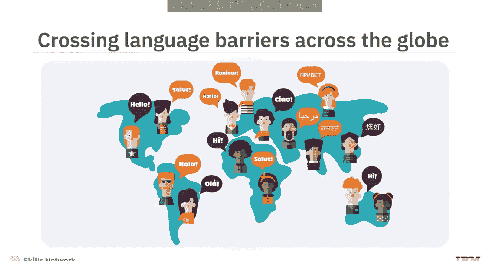
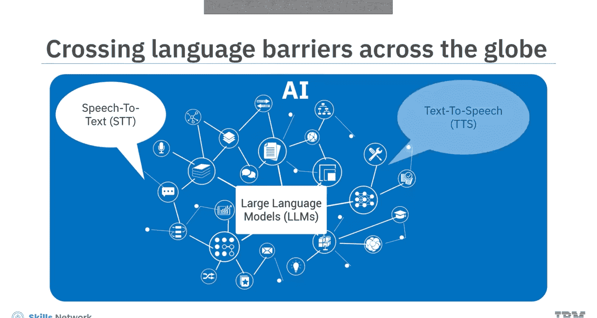
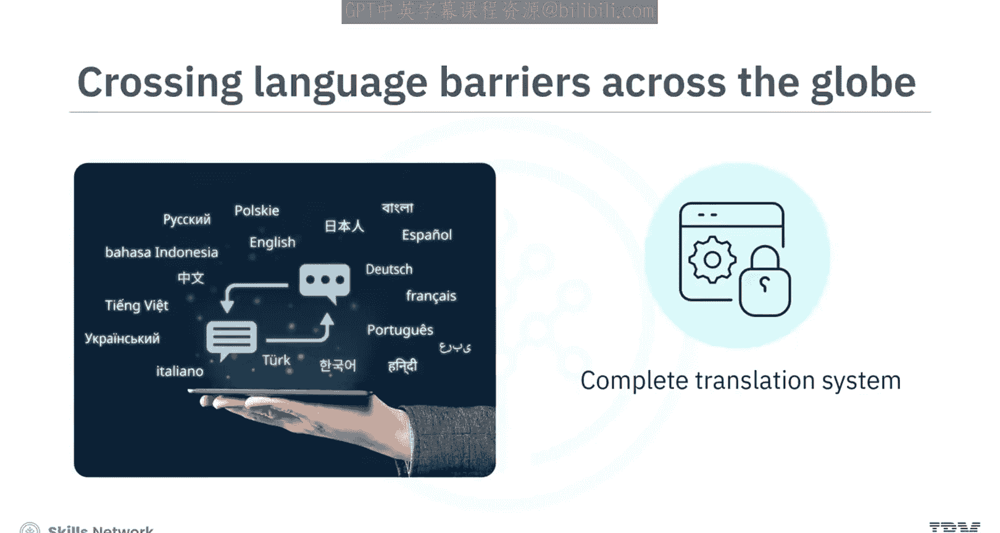
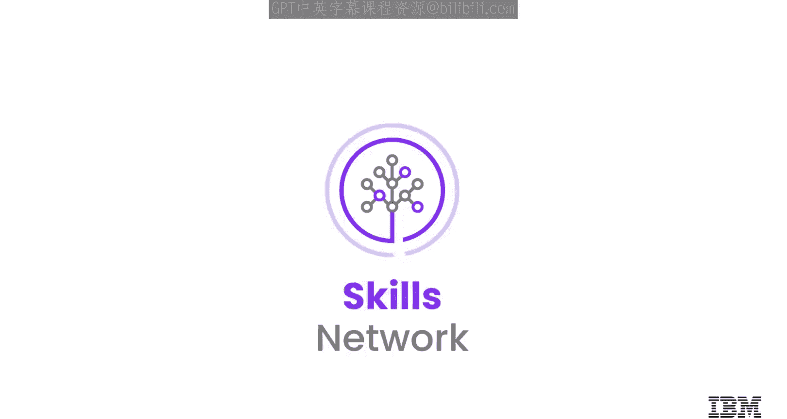

# 使用LLM和STT-TTS构建AI翻译助手：028：项目概述 🐟

在本节课中，我们将要学习如何构建一个名为“Babble Fish”的语音驱动AI翻译助手。该项目将结合语音转文本、大语言模型和文本转语音技术，实现实时的多语言语音翻译。

全球化的劳动力和商业环境要求我们与遍布世界各地的同事、商业伙伴和客户进行多语言交流。人工智能的发展使得利用语音转文本、大语言模型和文本转语音技术来实现这一点变得容易。

借助这些技术，你可以构建一个完整的翻译系统，将你的语音翻译成多种语言。

## 项目简介

在这个项目中，你将创建一个支持语音的AI翻译助手。该助手将利用托管在IBM Watsonx.ai上的Falcon LLM模型以及可嵌入的Watson Speech库。翻译器会将录制的语音输入转换为文本，并将文本发送给Falcon LLM进行翻译。接着，它从LLM接收文本形式的翻译结果，并使用文本转语音技术将其转换为语音，然后播放给用户。

让我们先来看看你将在本项目中开发的语音助手演示。

## 功能演示

语音助手界面包含一个在亮色和暗色模式间切换的功能、一个用于输入消息的文本框以及一个麦克风图标。

首先，在输入框中输入一条消息，例如“用法语说你好”。系统将演示其响应。

接下来，尝试使用麦克风说出一条需要翻译成西班牙语的消息，例如“用西班牙语说早上好”。助手将以文本和语音消息的形式进行回应。

## 技术架构

用户将通过一个使用HTML、CSS和JavaScript构建的Web界面与语音助手进行交互。

为了构建语音助手的后端，你将使用Python和Flask。为了在应用程序中集成Falcon LLM模型，你将使用IBM Watson X，这是一个AI和数据平台。

IBM Watson Speech Lib for Embed Technologies 使助手能够通过语音输入和输出与他人交流。

通过组合所有这些组件，你将创建一个可以接收语音输入并提供语音响应的AI助手。

## 预备知识

要完成这个项目，你应该熟悉Python和Flask。同时，具备HTML、CSS和JavaScript的基础知识是推荐的，但不是必需的。

本项目提供了分步说明，指导你如何使用代码以及完成构建语音助手所需的不同活动。

## 学习目标

在本模块结束时，你将能够实现以下目标：

探索语音助手的基础知识及其各种应用。

探索并实现生成式AI模型在多语言翻译方面的能力。

实现语音转文本和文本转语音功能，使AI助手能够通过语音与用户交流。

为使用Python、Flask、HTML、CSS和JavaScript构建AI助手设置相关环境。

创建一个功能正常的、支持语音的AI助手。

## 项目成果

通过完成这个项目，你将掌握创建自己的AI驱动翻译助手的技能，该助手能够接收语音输入并提供多种语言的翻译。

你还将打下使用Python、Flask、HTML、CSS和JavaScript进行Web开发的坚实基础，并拥有一个对任何与之交互的人都非常有用的、功能齐全的全栈应用程序。

---

本节课中，我们一起学习了“Babble Fish”AI翻译助手项目的整体概览、技术架构和预期成果。我们了解到，该项目将整合前沿的AI技术，构建一个实用的多语言语音翻译工具。在接下来的章节中，我们将深入每个技术环节，逐步实现这个功能强大的助手。