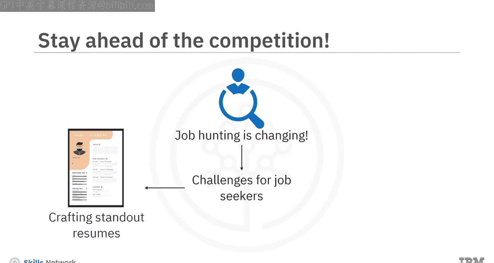
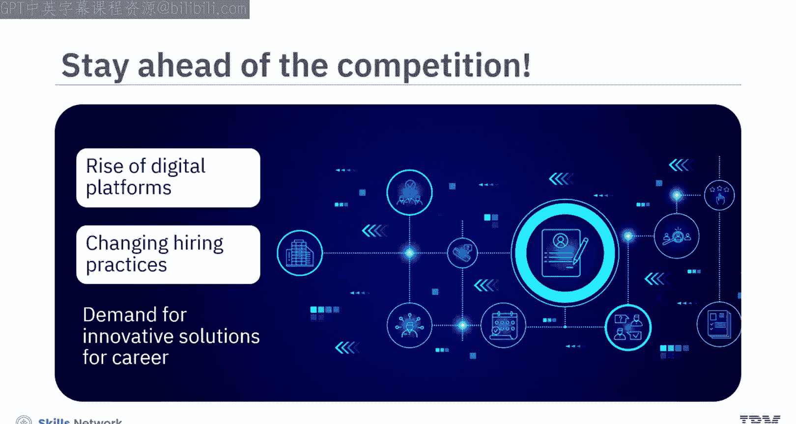
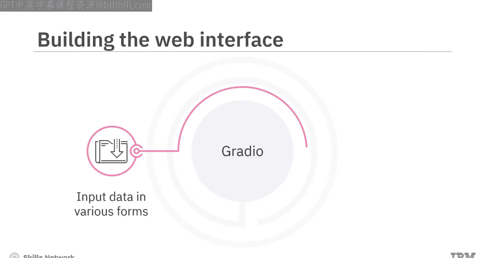
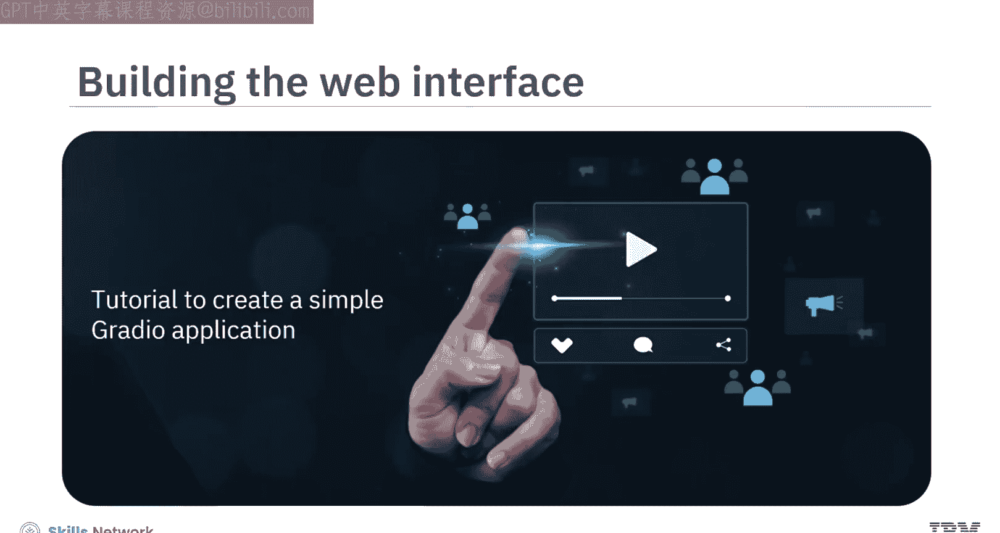
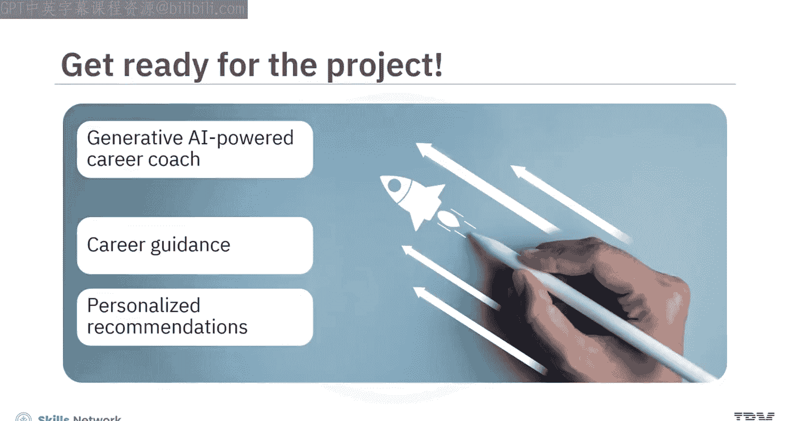

# 生成式人工智能工程：029：项目构建AI职业教练简介 🚀

在本节课中，我们将学习如何构建一个基于大语言模型的个性化求职应用教练项目。该项目旨在利用生成式AI技术，帮助求职者优化简历、生成求职信并获得职业发展建议。

## 项目概述

在当今竞争激烈的就业市场中，求职方式正在发生变化。传统的求职方法已显不足。求职者常常面临诸多挑战，从制作出色的简历到向潜在雇主有效传达自身价值。

随着数字平台的兴起和招聘实践的演变，市场对创新解决方案的需求日益增长，这些方案旨在帮助制作有效简历并指导职业发展。

## 项目核心应用

在本项目中，你将构建一个AI职业教练，它提供三个核心应用。

以下是三个核心应用的具体介绍：

1.  **简历优化器**：利用AI分析简历，并根据职位描述进行改进。
2.  **个性化求职信生成器**：起草定制的求职信，以优化求职申请流程。
3.  **个性化职业顾问**：提供职业改进建议，助力职业成长。

## 应用功能演示

上一节我们介绍了项目的三个核心应用，本节中我们来看看它们的具体功能演示。

### 简历优化器

简历优化器工具旨在根据你的指令优化简历内容，以达到最佳效果。我们建议按部分优化你的简历。

该优化器的界面使用Gradio构建。在“职位名称”字段中，输入你想要的职位，例如“数据分析师”。在“简历内容”字段中，输入你希望修改的内容。在“优化指令”字段中，输入任何你想建议的指令或改进方向。点击“提交”按钮。几秒钟后，修订后的内容便会显示出来。

### 求职信生成器

接下来，让我们查看求职信生成器。它将协助你撰写能展示技能和经验的求职信，并根据你申请的职位和公司进行定制。

在生成界面中，输入公司名称和职位。接着，输入职位描述。最后，输入你的简历内容。点击“提交”，几秒钟内即可生成求职信。

### 职业顾问工具

最后，查看职业顾问工具。该工具会根据职位和你的简历提供职业建议。

工具界面包含几个字段：首先，输入你希望申请的职位。然后，输入该职位的职位描述。接着，输入你的简历内容。点击“提交”。几秒钟后，职业教练将提供需要提升的领域或其他建议。

## 技术实现基础

前面我们了解了应用的功能，本节中我们来看看构建这些应用的技术基础。

本项目中的应用通过利用Meta开发的**Llama 2 7B Chat**大语言模型构建。该模型已集成到IBM的Watsonx.ai平台中。

本项目将使你掌握如何通过Watsonx.ai提供的API，将LLM集成到你的应用程序中。你将使用**Gradio**构建项目中应用的Web界面。

利用Gradio，你可以快速设计Web界面，使用户能够以文本、图像或音频等多种形式输入数据，并即时查看模型生成的输出。本项目提供了一个教程，帮助你熟悉Gradio以及如何创建一个简单的Gradio应用。

## 学习前提与目标

要完成本项目，你应该熟悉Python的基础知识。但是，无需担心编写复杂的脚本来构建这些应用。项目包含了分步说明和所需的Python脚本。

在本模块结束时，你将能够实现以下目标：
*   使用Python编程构建AI驱动的应用程序。
*   利用集成在AI平台（如IBM Watsonx.ai）中的开源LLM。
*   使用Gradio为应用程序构建Web界面。

## 总结

本节课中，我们一起学习了“AI职业教练”项目的整体介绍。该项目深入探讨了如何构建一个由生成式AI驱动的职业教练，旨在利用AI提供根据个人抱负和目标定制的个性化建议，从而支持职业指导。让我们开始构建吧。