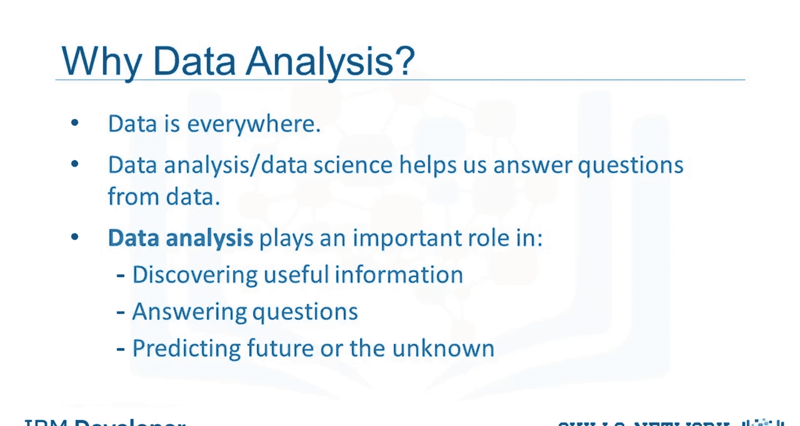
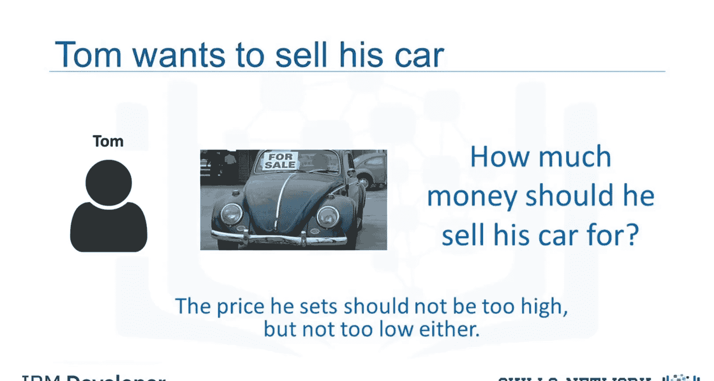
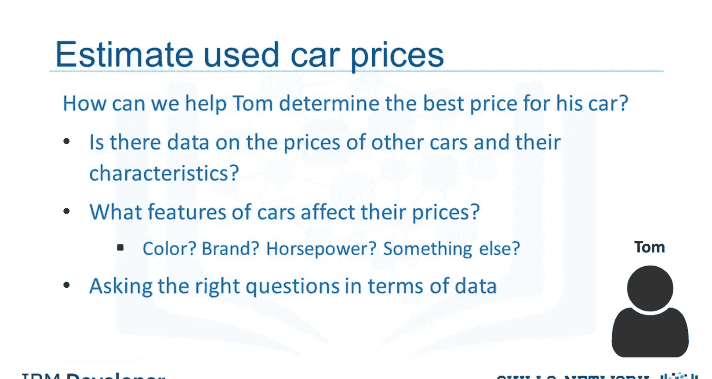

# 生成式人工智能工程：030：问题描述 🚗

在本节课中，我们将要学习数据分析，并扮演数据分析师或数据科学家的角色，探讨一个具体的应用场景。

## 概述

数据分析的核心在于从原始数据中提取有价值的信息和洞察。我们周围无时无刻不在产生数据，无论是科学家手动收集的，还是我们在网站或移动设备上点击时自动生成的。然而，数据本身并不等同于信息。**数据分析**和**数据科学**的本质，就是帮助我们解锁原始数据中的信息和洞察，从而解答我们的疑问。

因此，数据分析扮演着至关重要的角色，它能帮助我们：
*   从数据中发现有用信息。
*   解答具体问题。
*   甚至预测未来或未知的情况。

上一节我们介绍了数据分析的重要性，本节中我们来看看一个具体的应用场景。

## 场景引入：汤姆的难题

让我们从一个场景开始。假设我们有一个朋友叫汤姆，他想卖掉他的车。但他面临一个问题：他不知道该为他的车定价多少。

汤姆希望他的车能卖到尽可能高的价钱。但同时，他也希望定价合理，这样才会有人愿意购买。因此，他设定的价格应该能准确反映这辆车的价值。

那么，我们如何帮助汤姆确定他车子的最佳售价呢？让我们像数据科学家一样思考，并清晰地定义一些问题。

以下是我们可以开始思考的一些关键问题：
*   是否有其他汽车的价格及其特征的数据？
*   汽车的哪些特征会影响其价格？是颜色、品牌吗？
*   马力是否也会影响售价？或者还有其他因素？

作为一名数据分析师或数据科学家，这些都是我们可以着手探究的起点。

## 后续步骤

要回答这些问题，我们需要数据。在接下来的视频中，我们将深入探讨如何理解数据、如何将数据导入Python，以及如何开始从数据中获取一些基本的洞察。

## 总结

本节课中我们一起学习了数据分析的基本目的，并引入了一个实际案例——帮助汤姆为他的二手车定价。我们明确了数据分析是从数据到信息的关键桥梁，并提出了几个可以通过数据来解答的核心问题。这为我们后续的数据处理和分析工作奠定了明确的目标。