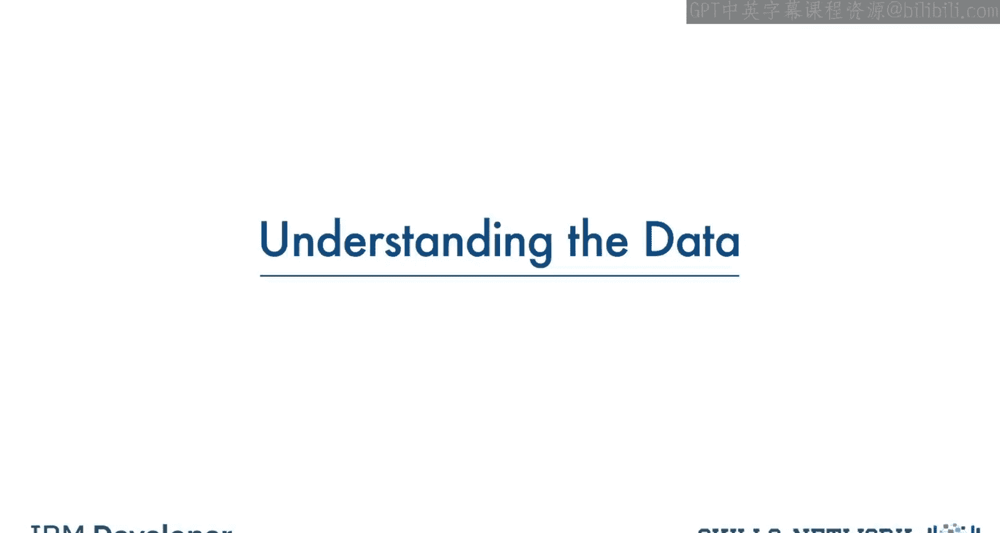
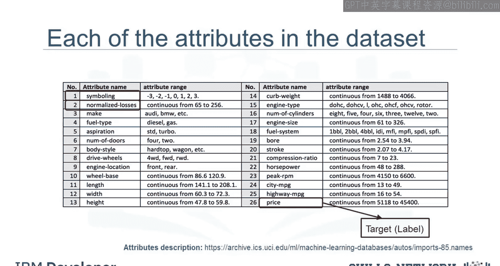

# 生成式人工智能工程：031：理解数据

在本节课中，我们将学习如何理解一个用于机器学习项目的数据集。我们将以“二手车价格”数据集为例，介绍其格式、结构、各列的含义，并明确项目的预测目标。

## 数据集概览

本节我们将介绍本课程所使用的数据集的基本情况。

本课程使用的数据集是Jeffrey C. Schlimer提供的一个开放数据集。该数据集采用CSV格式，即用逗号分隔每个值，这使得它能够非常方便地被大多数工具或应用程序导入。数据集的每一行代表一条数据记录。

在本模块的实践练习中，你将能够下载并使用这个CSV文件。

## 数据格式与结构

上一节我们了解了数据集的来源和基本格式，本节中我们来看看数据的具体结构。

你是否注意到第一行数据有什么不同？有时，CSV文件的第一行是表头，包含每一列的名称。但在这个例子中，第一行只是另一行普通数据。

以下是关于26个列分别代表什么的文档说明。列的数量很多，我将只介绍其中几个列名的含义，你也可以查看幻灯片底部的链接，自行阅读所有列的详细描述。

以下是几个关键属性的说明：

*   **symboling（保险风险评级）**：对应车辆的保险风险等级。汽车最初会根据其价格被赋予一个风险系数符号。如果一辆车的风险更高，这个符号会向上调整。**公式：`+3` 表示高风险，`-3` 表示非常安全。**
*   **normalized-losses（归一化损失）**：指每辆受保车辆每年的相对平均赔付损失。该值在特定尺寸分类（如双门小型旅行车、运动型专用车等）的所有汽车中进行归一化处理，代表每辆车每年的平均损失。其值范围在65到256之间。
*   其他属性相对容易理解。如果你想查看更多详细信息，请参考幻灯片底部的链接。

## 定义预测目标

在理解了每个特征的含义之后，我们接下来需要明确机器学习模型的目标。

我们会注意到第26个属性是 **price（价格）**。这就是我们的目标值或标签。换句话说，价格是我们希望从数据集中预测的值，而预测因子应该是列出的所有其他变量，如symboling、normalized-losses、make（品牌）等等。

因此，本项目的目标是根据其他汽车特征来预测价格。

最后请注意，这个数据集实际上来自1985年，因此其中车型的价格可能看起来偏低。但请记住，本练习的目的是学习如何分析数据。

## 课程总结

本节课中，我们一起学习了“二手车价格”数据集。我们了解了它的CSV格式、数据结构，解读了几个关键列的含义，并最终明确了本项目的机器学习目标：使用其他特征来预测汽车的价格。理解数据是构建有效模型的第一步。